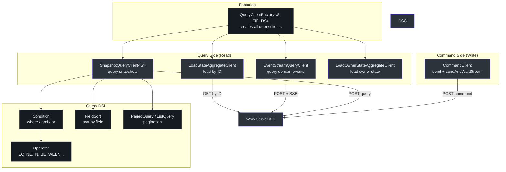
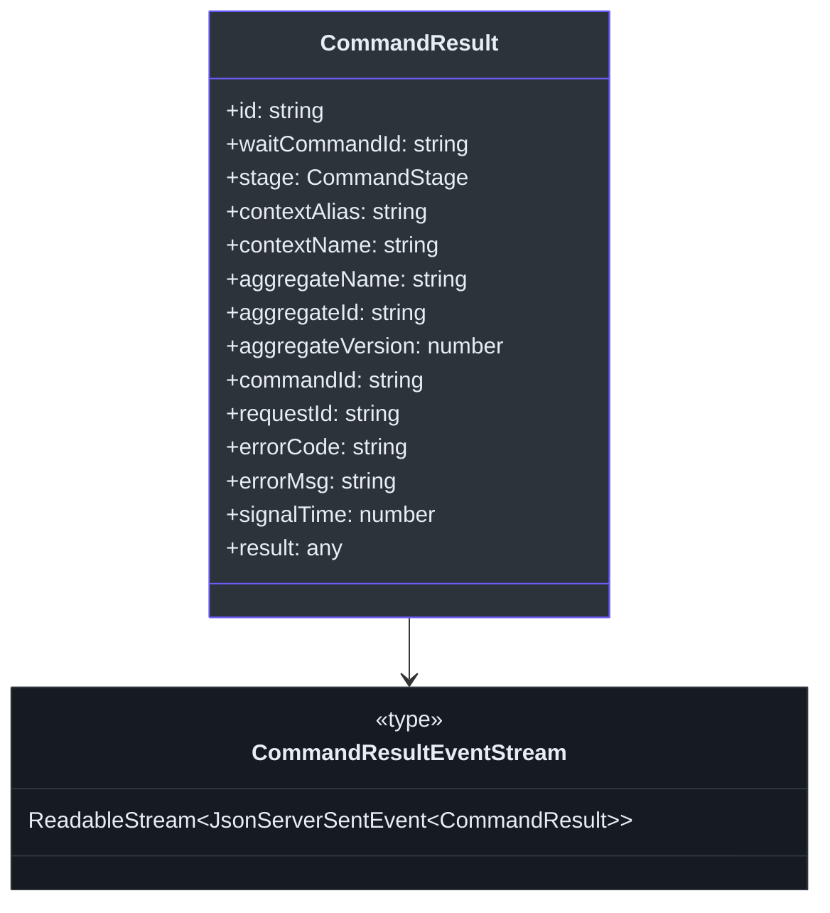
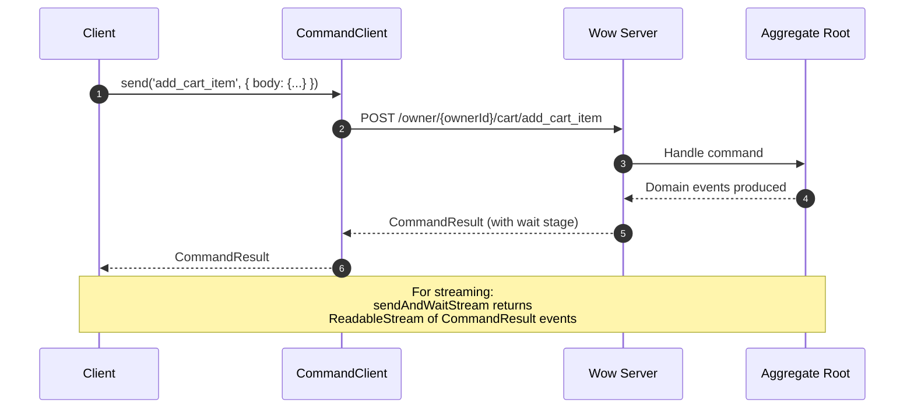
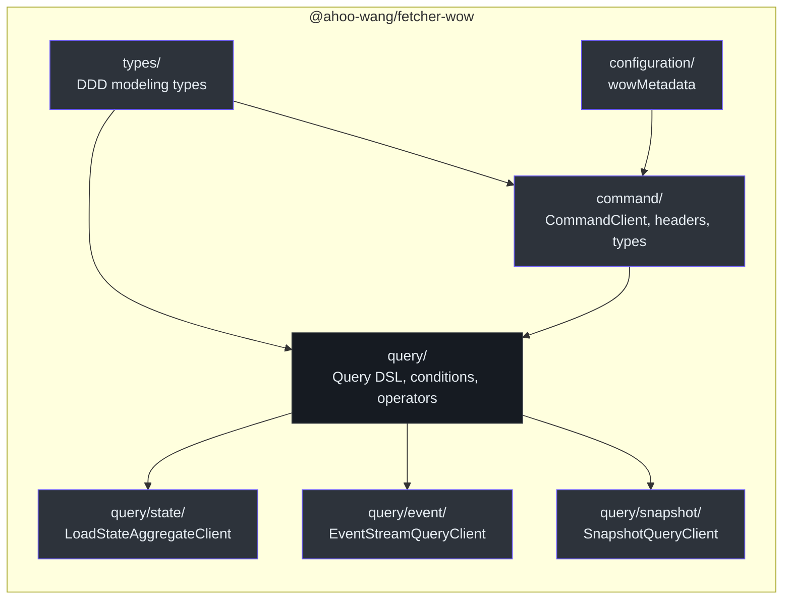

# @ahoo-wang/fetcher-wow

The `@ahoo-wang/fetcher-wow` package provides the client-side integration layer for the [Wow](https://github.com/Ahoo-Wang/wow) DDD + Event Sourcing + CQRS framework. It delivers typed command clients for sending domain commands, snapshot query clients for reading aggregate state, event stream query clients for replaying domain events, and a rich query DSL with conditions, sorting, and pagination.

## Installation

```bash
pnpm add @ahoo-wang/fetcher-wow
```

## Architecture Overview



## Command Side (Write Model)

### CommandClient

The `CommandClient` uses [decorator](./decorator.md)-based API methods to send commands to Wow aggregate roots. It supports both standard command execution and SSE streaming for long-running commands.

```typescript
import { CommandClient } from '@ahoo-wang/fetcher-wow';
import { ApiMetadata } from '@ahoo-wang/fetcher-decorator';
import { Fetcher } from '@ahoo-wang/fetcher';

const commandClient = new CommandClient({
  fetcher: new Fetcher({ baseURL: 'http://localhost:8080/' }),
  basePath: 'owner/{ownerId}/cart',
});

// Send a command and wait for result
const result = await commandClient.send({
  body: {
    productId: 'product-1',
    quantity: 2,
  },
  headers: {
    'Command-Wait-Stage': 'SNAPSHOT',
  },
});

console.log('Aggregate ID:', result.aggregateId);
console.log('Command ID:', result.commandId);
```

Source: [packages/wow/src/command/commandClient.ts:77-148](https://github.com/Ahoo-Wang/fetcher/blob/main/packages/wow/src/command/commandClient.ts#L77-L148)

### CommandRequest

Commands are wrapped in a `CommandRequest` that supports:

- `body` -- the command payload wrapped with `CommandBody<C>`
- `headers` -- typed command headers for wait strategies, tenant/owner/aggregate identification
- `urlParams` -- path parameters for aggregate routing

### Command Headers

| Header | Constant | Description |
|--------|----------|-------------|
| `Command-Tenant-Id` | `CommandHeaders.TENANT_ID` | Tenant identifier |
| `Command-Owner-Id` | `CommandHeaders.OWNER_ID` | Owner identifier |
| `Command-Space-Id` | `CommandHeaders.SPACE_ID` | Space identifier |
| `Command-Aggregate-Id` | `CommandHeaders.AGGREGATE_ID` | Aggregate instance ID |
| `Command-Aggregate-Version` | `CommandHeaders.AGGREGATE_VERSION` | Expected aggregate version |
| `Command-Wait-Stage` | `CommandHeaders.WAIT_STAGE` | Wait processing stage |
| `Command-Wait-Timeout` | `CommandHeaders.WAIT_TIME_OUT` | Wait timeout duration |
| `Command-Wait-Context` | `CommandHeaders.WAIT_CONTEXT` | Wait processing context |
| `Command-Request-Id` | `CommandHeaders.REQUEST_ID` | Request correlation ID |
| `Command-Local-First` | `CommandHeaders.LOCAL_FIRST` | Execute locally first |

Source: [packages/wow/src/command/commandHeaders.ts](https://github.com/Ahoo-Wang/fetcher/blob/main/packages/wow/src/command/commandHeaders.ts)

### CommandResult

The result returned after command execution:



Source: [packages/wow/src/command/commandResult.ts:74-110](https://github.com/Ahoo-Wang/fetcher/blob/main/packages/wow/src/command/commandResult.ts#L74-L110)

### CommandStage

The `CommandStage` enum defines the processing stages at which a command's wait-strategy can signal completion. It is used as the value of the `Command-Wait-Stage` header and the `CommandResult.stage` field:

| Stage | Value | Completion Signal |
|-------|-------|-------------------|
| `SENT` | `'SENT'` | Command published to the command bus/queue |
| `PROCESSED` | `'PROCESSED'` | Command processed by the aggregate root |
| `SNAPSHOT` | `'SNAPSHOT'` | Snapshot generated (aggregate state materialized) |
| `PROJECTED` | `'PROJECTED'` | Events projected to read models |
| `EVENT_HANDLED` | `'EVENT_HANDLED'` | Events processed by event handlers |
| `SAGA_HANDLED` | `'SAGA_HANDLED'` | Events processed by Saga processes |

Source: [packages/wow/src/command/types.ts:54-84](https://github.com/Ahoo-Wang/fetcher/blob/main/packages/wow/src/command/types.ts#L54-L84)

### Command Flow



## Query Side (Read Model)

### SnapshotQueryClient

The primary client for reading aggregate state. Supports counting, listing, paging, and streaming snapshot queries.

```typescript
import { SnapshotQueryClient, all, listQuery, pagedQuery, singleQuery } from '@ahoo-wang/fetcher-wow';

const client = new SnapshotQueryClient<CartState>(apiMetadata);

// Count
const count = await client.count(all());

// List
const items = await client.list(listQuery({
  condition: all(),
  limit: 100,
}));

// Paged
const page = await client.paged(pagedQuery({
  condition: all(),
  pagination: { index: 1, size: 10 },
}));

// Single by ID
const cart = await client.getStateById('cart-123');

// Multiple by IDs
const carts = await client.getStateByIds(['cart-1', 'cart-2']);
```

#### SnapshotQueryClient Methods

| Method | Endpoint | Returns | Description |
|--------|----------|---------|-------------|
| `count(condition)` | `/snapshot/count` | `Promise<number>` | Count matching aggregates |
| `list(listQuery)` | `/snapshot/list` | `Promise<MaterializedSnapshot<S>[]>` | List snapshots |
| `listStream(listQuery)` | `/snapshot/list` | `Promise<ReadableStream<SSE>>` | List as SSE stream |
| `listState(listQuery)` | `/snapshot/list_state` | `Promise<S[]>` | List state only |
| `listStateStream(listQuery)` | `/snapshot/list_state` | `Promise<ReadableStream<SSE>>` | State as SSE stream |
| `paged(pagedQuery)` | `/snapshot/paged` | `Promise<PagedList<S>>` | Paginated snapshots |
| `pagedState(pagedQuery)` | `/snapshot/paged_state` | `Promise<PagedList<S>>` | Paginated state |
| `single(singleQuery)` | `/snapshot/single` | `Promise<MaterializedSnapshot<S>>` | Single snapshot |
| `singleState(singleQuery)` | `/snapshot/single_state` | `Promise<S>` | Single state |
| `getById(id)` | -- | `Promise<MaterializedSnapshot<S>>` | Get by aggregate ID |
| `getStateById(id)` | -- | `Promise<S>` | Get state by ID |
| `getByIds(ids)` | -- | `Promise<MaterializedSnapshot<S>[]>` | Get multiple by IDs |
| `getStateByIds(ids)` | -- | `Promise<S[]>` | Get multiple states |

Source: [packages/wow/src/query/snapshot/snapshotQueryClient.ts:119-516](https://github.com/Ahoo-Wang/fetcher/blob/main/packages/wow/src/query/snapshot/snapshotQueryClient.ts#L119-L516)

### QueryClientFactory

A factory that creates all query clients for a given aggregate, pre-configured with the correct base path:

```typescript
import { QueryClientFactory, ResourceAttributionPathSpec } from '@ahoo-wang/fetcher-wow';

const factory = new QueryClientFactory<CartState, CartFields, CartDomainEvent>({
  contextAlias: 'example',
  aggregateName: 'cart',
  resourceAttribution: ResourceAttributionPathSpec.OWNER,
});

// Create individual clients
const snapshotClient = factory.createSnapshotQueryClient();
const stateClient = factory.createLoadStateAggregateClient();
const ownerStateClient = factory.createOwnerLoadStateAggregateClient();
const eventClient = factory.createEventStreamQueryClient();
```

| Factory Method | Creates | Description |
|----------------|---------|-------------|
| `createSnapshotQueryClient()` | `SnapshotQueryClient<S, FIELDS>` | Snapshot queries with conditions |
| `createLoadStateAggregateClient()` | `LoadStateAggregateClient<S>` | Load by ID, version, or time |
| `createOwnerLoadStateAggregateClient()` | `LoadOwnerStateAggregateClient<S>` | Load owner's aggregate state |
| `createEventStreamQueryClient()` | `EventStreamQueryClient` | Domain event stream queries |

Source: [packages/wow/src/query/queryClients.ts:62-214](https://github.com/Ahoo-Wang/fetcher/blob/main/packages/wow/src/query/queryClients.ts#L62-L214)

## Query DSL

### Conditions

The condition system supports building complex query predicates:

```typescript
import { all, condition, aggregateId, aggregateIds } from '@ahoo-wang/fetcher-wow';

// All records
const allCondition = all();

// By aggregate ID
const byId = aggregateId('cart-123');

// By multiple IDs
const byIds = aggregateIds(['cart-1', 'cart-2', 'cart-3']);

// Complex conditions with operators
const complex = condition({
  field: 'status',
  operator: 'IN',
  value: ['ACTIVE', 'PENDING'],
}).and({
  field: 'createdAt',
  operator: 'BETWEEN',
  value: ['2024-01-01', '2024-12-31'],
});
```

### Operators

| Operator | Description | Example |
|----------|-------------|---------|
| `EQ` | Equals | `{ field: 'name', operator: 'EQ', value: 'Alice' }` |
| `NE` | Not equals | `{ field: 'status', operator: 'NE', value: 'DELETED' }` |
| `IN` | In set | `{ field: 'type', operator: 'IN', value: ['A', 'B'] }` |
| `NOT_IN` | Not in set | `{ field: 'type', operator: 'NOT_IN', value: ['C'] }` |
| `BETWEEN` | Range | `{ field: 'age', operator: 'BETWEEN', value: [18, 65] }` |
| `LIKE` | Pattern match | `{ field: 'name', operator: 'LIKE', value: '%john%' }` |
| `GT` | Greater than | `{ field: 'price', operator: 'GT', value: 100 }` |
| `LT` | Less than | `{ field: 'price', operator: 'LT', value: 50 }` |
| `ALL` | Match all | No field/value needed |

Source: [packages/wow/src/query/operator.ts](https://github.com/Ahoo-Wang/fetcher/blob/main/packages/wow/src/query/operator.ts)

### Sorting and Pagination

```typescript
import { pagedQuery, listQuery } from '@ahoo-wang/fetcher-wow';

// Paged query with sorting
const query = pagedQuery({
  condition: all(),
  pagination: { index: 1, size: 20 },
  sort: [{ field: 'createdAt', order: 'DESC' }],
});
```

### Cursor Pagination

For large datasets, cursor-based pagination is more efficient than offset-based pagination. It avoids the performance degradation of deep offset queries by using a cursor ID to track position:

```typescript
import { cursorQuery, CURSOR_ID_START } from '@ahoo-wang/fetcher-wow';

// First page — start from the beginning
const firstPage = cursorQuery({
  query: { condition: all(), limit: 50, projection: { include: ['id', 'name'] } },
  cursorId: CURSOR_ID_START,  // '~' — start from the beginning
  field: 'id',
  direction: 'ASC',
});

// Subsequent pages — use the last item's cursor ID from the previous result
const nextPage = cursorQuery({
  query: { condition: all(), limit: 50 },
  cursorId: lastItemId,  // cursor ID from the previous page
  field: 'id',
  direction: 'ASC',
});
```

### Projection

Control which fields are returned by the query using `projection` — include only the fields you need to reduce payload size:

```typescript
import { projection, pagedQuery } from '@ahoo-wang/fetcher-wow';

// Include only specific fields
const query = pagedQuery({
  condition: all(),
  pagination: { index: 1, size: 20 },
  projection: projection({ include: ['id', 'name', 'status'] }),
});

// Exclude fields
const query2 = pagedQuery({
  condition: all(),
  pagination: { index: 1, size: 20 },
  projection: projection({ exclude: ['internalNotes', 'metadata'] }),
});
```

Source: [packages/wow/src/query/cursorQuery.ts](https://github.com/Ahoo-Wang/fetcher/blob/main/packages/wow/src/query/cursorQuery.ts), [packages/wow/src/query/projection.ts](https://github.com/Ahoo-Wang/fetcher/blob/main/packages/wow/src/query/projection.ts)

## Module Structure



Source: [packages/wow/src/index.ts](https://github.com/Ahoo-Wang/fetcher/blob/main/packages/wow/src/index.ts)

## Key Exports

| Export | Module | Description |
|--------|--------|-------------|
| `CommandClient` | `command/` | Decorator-based command sending client |
| `CommandRequest` | `command/` | Typed command request with headers |
| `CommandResult` | `command/` | Command execution result |
| `CommandResultEventStream` | `command/` | SSE stream of command results |
| `CommandBody<C>` | `command/` | Command body wrapper type |
| `CommandHeaders` | `command/` | Header name constants |
| `QueryClientFactory` | `query/` | Factory for creating all query clients |
| `QueryClientOptions` | `query/` | Configuration for query clients |
| `SnapshotQueryClient` | `query/snapshot/` | Snapshot query operations |
| `EventStreamQueryClient` | `query/event/` | Domain event stream queries |
| `LoadStateAggregateClient` | `query/state/` | Load aggregate state by ID/version/time |
| `LoadOwnerStateAggregateClient` | `query/state/` | Load owner's aggregate state |
| `Condition` | `query/` | Query condition builder |
| `all()` | `query/` | Match all records condition |
| `aggregateId(id)` | `query/` | Condition matching a single aggregate ID |
| `aggregateIds(ids)` | `query/` | Condition matching multiple aggregate IDs |
| `condition(field, operator, value)` | `query/` | Condition builder |
| `listQuery()` | `query/` | Create a list query |
| `pagedQuery()` | `query/` | Create a paged query |
| `singleQuery()` | `query/` | Create a single query |
| `FieldSort` | `query/` | Sort specification |
| `Operator` | `query/` | Query operator enum |
| `ResourceAttributionPathSpec` | `types/` | Path spec for tenant/owner scoping |

## Generated Clients

The [Generator](./generator.md) package automatically generates typed command and query clients for each aggregate found in the OpenAPI spec. For example, for a `Cart` aggregate in bounded context `example`:

```typescript
// Generated command client
const commandClient = new CartCommandClient();
const result = await commandClient.addCartItem({
  body: { productId: 'p1', quantity: 1 },
});

// Generated query client factory
const factory = cartQueryClientFactory;
const snapshotClient = factory.createSnapshotQueryClient();
const cartState = await snapshotClient.singleState(singleQuery({
  condition: aggregateId('cart-1'),
}));
```

## Cross-References

- **[Fetcher](./fetcher.md)** -- Core HTTP client; all Wow clients use Fetcher for HTTP transport
- **[Decorator](./decorator.md)** -- `CommandClient` and `SnapshotQueryClient` use `@api`, `@post`, `@body` decorators
- **[EventStream](./eventstream.md)** -- Streaming queries (`listStream`, `sendAndWaitStream`) use `JsonEventStreamResultExtractor`
- **[Generator](./generator.md)** -- The generator reads OpenAPI specs and produces typed Wow clients
- **[React](./react.md)** -- `useSingleQuery`, `useListQuery`, `usePagedQuery` hooks target Wow query clients
- **[Viewer](./viewer.md)** -- The FetcherViewer component uses Wow query clients for data display
