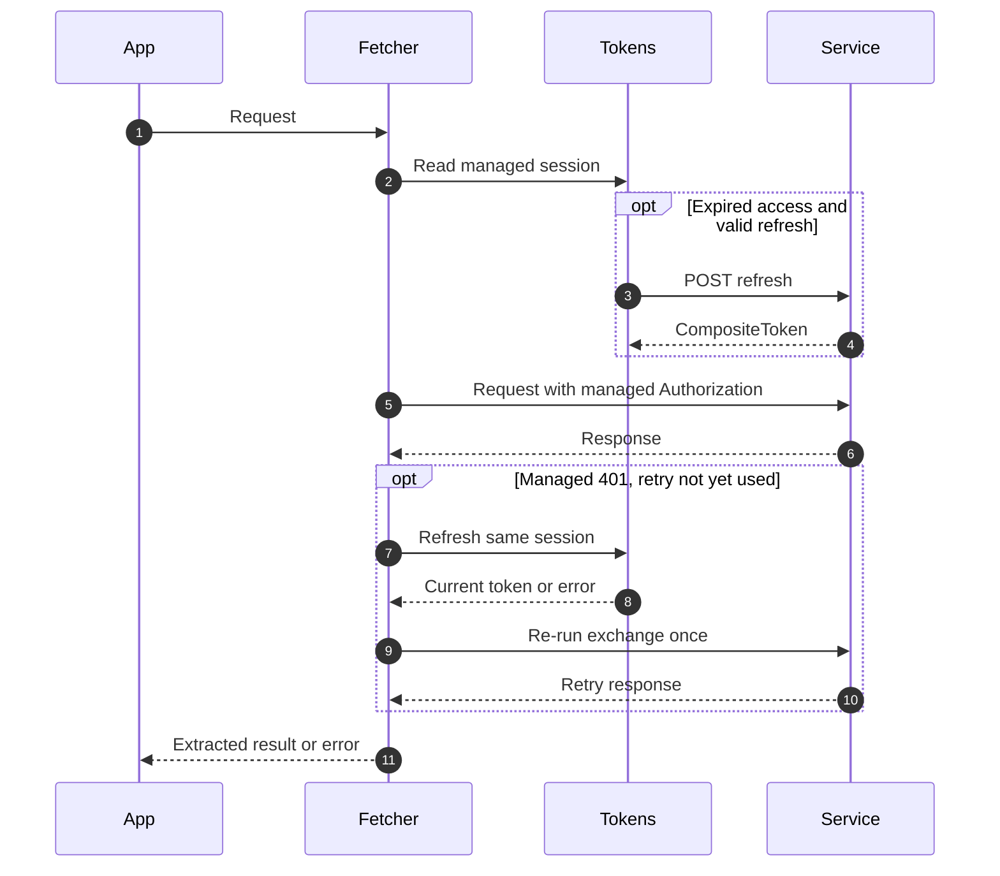

# Interceptors and attribution

These interceptors enrich or retry a FetchExchange. Register each with the matching request, response or error manager using `.use(instance)`. The [configurer](./configuration) installs the common combination.

## Actual execution flow

1. CoSecRequestInterceptor skips a request that [`isTrusted`](#request-trust) rejects; otherwise it sets application/device/request headers and a truthy resolved space ID.
2. AuthorizationRequestInterceptor skips an untrusted request (no Authorization, no refresh) and preserves an existing Authorization header; otherwise it checks session ownership, refreshes when access is expired and refresh is valid, then injects the managed Bearer token.
3. ResourceAttributionRequestInterceptor fills tenant/owner URL path parameters before URL resolution. The core transport sends the request.
4. AuthorizationResponseInterceptor handles a managed-credential 401 before normal status validation. It refreshes, deletes only its injected stale credential, and re-executes the full exchange pipeline at most once.
5. Remaining failures reach error interceptors. Unauthorized handles 401/RefreshTokenError with notification ownership guards; Forbidden handles 403. Neither callback automatically recovers the failed request.

The request/response managers sort order values; registration order alone is not the execution contract. Re-executing the pipeline can create a new CoSec request ID. Caller-provided Authorization values are not replaced or automatically refreshed. A token may still be attached when access is expired and refresh is unavailable; the server decides the resulting status.



## Interceptor parameters and results

| Export                                                                 | Constructor options                                                                               | intercept(exchange)                                                                                                                                                            |
| ---------------------------------------------------------------------- | ------------------------------------------------------------------------------------------------- | ------------------------------------------------------------------------------------------------------------------------------------------------------------------------------ |
| `CoSecRequestInterceptor` / `CoSecRequestOptions`                      | appId, deviceIdStorage required; spaceIdProvider defaults NoneSpaceIdProvider; optional isTrusted | Promise&lt;void&gt;; nothing for an untrusted request; otherwise overwrites app/device/request headers; writes space only for a truthy ID; storage/provider failures propagate |
| `AuthorizationRequestInterceptor` / `AuthorizationInterceptorOptions`  | tokenManager required (JwtTokenManagerCapable); optional isTrusted                                | Promise&lt;void&gt;; nothing for an untrusted request; preserves explicit Authorization, refreshes managed token when needed                                                   |
| `AuthorizationResponseInterceptor`                                     | Same AuthorizationInterceptorOptions                                                              | Promise&lt;void&gt;; only 401, only matching managed credential, at most AUTHORIZATION_RESPONSE_MAX_RETRY=1                                                                    |
| `ResourceAttributionRequestInterceptor` / `ResourceAttributionOptions` | tokenStorage required; tenantId='tenantId', ownerId='ownerId' are **placeholder names**           | void; takes tenantId/sub from decoded access payload; fills matching template fields only when current path value is falsy                                                     |
| `UnauthorizedErrorInterceptor` / options                               | onUnauthorized required, returns void or Promise&lt;void&gt;                                      | Promise&lt;void&gt;; skips RefreshSessionChangedError and duplicate/obsolete notifications; callback error propagates                                                          |
| `ForbiddenErrorInterceptor` / options                                  | onForbidden required, returns Promise&lt;void&gt;                                                 | Promise&lt;void&gt;; callback runs only for response.status=403; callback error propagates                                                                                     |

`IGNORE_REFRESH_TOKEN_ATTRIBUTE_KEY` is `Ignore-Refresh-Token`. **Presence**, even with false, disables automatic proactive/401 refresh. It does not suppress Authorization injection or disable ordinary HTTP status errors.

## Request trust {#request-trust}

`RequestTrust` is `(url: string, exchange: FetchExchange) => boolean`; `RequestTrustCapable` adds the optional `isTrusted` to `CoSecConfig`, `CoSecRequestOptions` and `AuthorizationInterceptorOptions`. `isTrustedRequest(exchange, isTrusted?)` decides for both request interceptors: without `isTrusted` every request is trusted; with it a relative request URL is always trusted (it resolves against the `baseURL`) and an absolute one only when `isTrusted(url, exchange)` returns true. `sameOriginTrust` trusts an absolute URL on the origin of the fetcher's `baseURL` or on the page's own origin; every other origin, and a URL that does not parse, is untrusted.

::: warning Default trusts every origin
By default an absolute request URL on any origin receives the access token and the CoSec headers, device ID included. Configure `isTrusted: sameOriginTrust` (or your own predicate) when the client requests URLs it does not control, such as pagination links, download URLs or callbacks.
:::

## Device and space selection

`DeviceIdStorage(options={})` and `SpaceIdStorage(options={})` extend KeyStorage&lt;string&gt;. Options are partial KeyStorageOptions; each forces its identity serializer. Their default keys are `cosec-device-id` and `cosec-space-id`; default buses broadcast with a serial delegate named for the actual key, and `destroy()` closes such a default bus; a bus passed in `eventBus` stays open. Storage selection is inherited from KeyStorage. Custom event buses/storage can be injected; cleanup follows [KeyStorage](../storage/key-storage).

`DeviceIdStorage.generateDeviceId(): string` calls the exported `idGenerator`, but does not store the result. `getOrCreate(): string` returns a truthy stored ID or generates/stores a new one. `IdGenerator.generateId(): string` is implemented by `NanoIdGenerator` with nanoid; `idGenerator` is its shared instance.

`SpaceIdProvider.resolveSpaceId(exchange): string | null` is synchronous. `NoneSpaceIdProvider` always returns null. `DefaultSpaceIdProvider({ spacedResourcePredicate, spaceIdStorage })` requires both; calls `SpacedResourcePredicate.test(exchange): boolean`, returning stored space only for a match. It does not infer space from URLs or tokens without your predicate/storage.

## Constants and authorization data

| Export family                                               | Value                                                                                                                             |
| ----------------------------------------------------------- | --------------------------------------------------------------------------------------------------------------------------------- |
| `COSEC_REQUEST_INTERCEPTOR_NAME/ORDER`                      | CoSecRequestInterceptor / Number.MIN_SAFE_INTEGER + DEFAULT_INTERCEPTOR_ORDER_STEP                                                |
| `AUTHORIZATION_REQUEST_INTERCEPTOR_NAME/ORDER`              | AuthorizationRequestInterceptor / COSEC_REQUEST_INTERCEPTOR_ORDER + DEFAULT_INTERCEPTOR_ORDER_STEP                                |
| `AUTHORIZATION_RESPONSE_INTERCEPTOR_NAME/ORDER`             | AuthorizationResponseInterceptor / Number.MIN_SAFE_INTEGER + 1000                                                                 |
| `RESOURCE_ATTRIBUTION_REQUEST_INTERCEPTOR_NAME/ORDER`       | ResourceAttributionRequestInterceptor / URL_RESOLVE_INTERCEPTOR_ORDER - DEFAULT_INTERCEPTOR_ORDER_STEP                            |
| `UNAUTHORIZED_ERROR_INTERCEPTOR_NAME/ORDER`                 | UnauthorizedErrorInterceptor / 0                                                                                                  |
| `FORBIDDEN_ERROR_INTERCEPTOR_NAME/ORDER`                    | ForbiddenErrorInterceptor / 0                                                                                                     |
| `DEFAULT_COSEC_DEVICE_ID_KEY`, `DEFAULT_COSEC_SPACE_ID_KEY` | cosec-device-id, cosec-space-id                                                                                                   |
| `CoSecHeaders` static fields                                | DEVICE_ID=CoSec-Device-Id, APP_ID=CoSec-App-Id, SPACE_ID=CoSec-Space-Id, AUTHORIZATION=Authorization, REQUEST_ID=CoSec-Request-Id |
| `ResponseCodes`                                             | UNAUTHORIZED=401, FORBIDDEN=403                                                                                                   |

`AuthorizeResult` is `{ authorized:boolean, reason:string }`. `AuthorizeResults` contains ALLOW (true, 'Allow'), EXPLICIT_DENY ('Explicit Deny'), IMPLICIT_DENY ('Implicit Deny'), TOKEN_EXPIRED ('Token Expired'), TOO_MANY_REQUESTS ('Too Many Requests'); all except ALLOW have authorized=false. These are result objects, not a local policy engine or server status-code mapper.

## Complete space configuration

```ts
import { Fetcher } from '@ahoo-wang/fetcher';
import {
  CoSecConfigurer,
  DefaultSpaceIdProvider,
  SpaceIdStorage,
  TokenStorage,
  DeviceIdStorage,
} from '@ahoo-wang/fetcher-cosec';
import { InMemoryStorage } from '@ahoo-wang/fetcher-storage';
import { SerialTypedEventBus } from '@ahoo-wang/fetcher-eventbus';

const spaces = new SpaceIdStorage({
  storage: new InMemoryStorage(),
  eventBus: new SerialTypedEventBus('example-space'),
});
spaces.set('workspace-1');
const provider = new DefaultSpaceIdProvider({
  spaceIdStorage: spaces,
  spacedResourcePredicate: {
    test: exchange => exchange.request.url.startsWith('/projects'),
  },
});
const fetcher = new Fetcher({ baseURL: 'https://api.example.com' });
const cosec = new CoSecConfigurer({
  appId: 'example-app',
  spaceIdProvider: provider,
  tokenStorage: new TokenStorage({
    storage: new InMemoryStorage(),
    eventBus: new SerialTypedEventBus('example-token'),
  }),
  deviceIdStorage: new DeviceIdStorage({
    storage: new InMemoryStorage(),
    eventBus: new SerialTypedEventBus('example-device'),
  }),
});
cosec.applyTo(fetcher);
// No request is made by constructing this configuration.
spaces.destroy();
cosec.tokenStorage.destroy();
cosec.deviceIdStorage.destroy();
```

<span id="authorizationinterceptoroptions"></span>

**`AuthorizationInterceptorOptions`** — [packages/cosec/src/authorizationRequestInterceptor.ts:33](https://github.com/Ahoo-Wang/fetcher/blob/main/packages/cosec/src/authorizationRequestInterceptor.ts#L33)

<span id="authorization_request_interceptor_name"></span>

**`AUTHORIZATION_REQUEST_INTERCEPTOR_NAME`** — [packages/cosec/src/authorizationRequestInterceptor.ts:36](https://github.com/Ahoo-Wang/fetcher/blob/main/packages/cosec/src/authorizationRequestInterceptor.ts#L36)

<span id="authorization_request_interceptor_order"></span>

**`AUTHORIZATION_REQUEST_INTERCEPTOR_ORDER`** — [packages/cosec/src/authorizationRequestInterceptor.ts:38](https://github.com/Ahoo-Wang/fetcher/blob/main/packages/cosec/src/authorizationRequestInterceptor.ts#L38)

<span id="authorizationrequestinterceptor"></span>

**`AuthorizationRequestInterceptor`** — [packages/cosec/src/authorizationRequestInterceptor.ts:51](https://github.com/Ahoo-Wang/fetcher/blob/main/packages/cosec/src/authorizationRequestInterceptor.ts#L51)

<span id="authorization_response_interceptor_name"></span>

**`AUTHORIZATION_RESPONSE_INTERCEPTOR_NAME`** — [packages/cosec/src/authorizationResponseInterceptor.ts:31](https://github.com/Ahoo-Wang/fetcher/blob/main/packages/cosec/src/authorizationResponseInterceptor.ts#L31)

<span id="authorization_response_interceptor_order"></span>

**`AUTHORIZATION_RESPONSE_INTERCEPTOR_ORDER`** — [packages/cosec/src/authorizationResponseInterceptor.ts:38](https://github.com/Ahoo-Wang/fetcher/blob/main/packages/cosec/src/authorizationResponseInterceptor.ts#L38)

<span id="authorization_response_max_retry"></span>

**`AUTHORIZATION_RESPONSE_MAX_RETRY`** — [packages/cosec/src/authorizationResponseInterceptor.ts:47](https://github.com/Ahoo-Wang/fetcher/blob/main/packages/cosec/src/authorizationResponseInterceptor.ts#L47)

<span id="authorizationresponseinterceptor"></span>

**`AuthorizationResponseInterceptor`** — [packages/cosec/src/authorizationResponseInterceptor.ts:66](https://github.com/Ahoo-Wang/fetcher/blob/main/packages/cosec/src/authorizationResponseInterceptor.ts#L66)

<span id="cosecrequestoptions"></span>

**`CoSecRequestOptions`** — [packages/cosec/src/cosecRequestInterceptor.ts:62](https://github.com/Ahoo-Wang/fetcher/blob/main/packages/cosec/src/cosecRequestInterceptor.ts#L62)

<span id="cosec_request_interceptor_name"></span>

**`COSEC_REQUEST_INTERCEPTOR_NAME`** — [packages/cosec/src/cosecRequestInterceptor.ts:88](https://github.com/Ahoo-Wang/fetcher/blob/main/packages/cosec/src/cosecRequestInterceptor.ts#L88)

<span id="cosec_request_interceptor_order"></span>

**`COSEC_REQUEST_INTERCEPTOR_ORDER`** — [packages/cosec/src/cosecRequestInterceptor.ts:110](https://github.com/Ahoo-Wang/fetcher/blob/main/packages/cosec/src/cosecRequestInterceptor.ts#L110)

<span id="ignore_refresh_token_attribute_key"></span>

**`IGNORE_REFRESH_TOKEN_ATTRIBUTE_KEY`** — [packages/cosec/src/cosecRequestInterceptor.ts:137](https://github.com/Ahoo-Wang/fetcher/blob/main/packages/cosec/src/cosecRequestInterceptor.ts#L137)

<span id="cosecrequestinterceptor"></span>

**`CoSecRequestInterceptor`** — [packages/cosec/src/cosecRequestInterceptor.ts:221](https://github.com/Ahoo-Wang/fetcher/blob/main/packages/cosec/src/cosecRequestInterceptor.ts#L221)

<span id="requesttrust"></span>

**`RequestTrust`** — [packages/cosec/src/requestTrust.ts:23](https://github.com/Ahoo-Wang/fetcher/blob/main/packages/cosec/src/requestTrust.ts#L23)

<span id="requesttrustcapable"></span>

**`RequestTrustCapable`** — [packages/cosec/src/requestTrust.ts:25](https://github.com/Ahoo-Wang/fetcher/blob/main/packages/cosec/src/requestTrust.ts#L25)

<span id="sameorigintrust"></span>

**`sameOriginTrust`** — [packages/cosec/src/requestTrust.ts:54](https://github.com/Ahoo-Wang/fetcher/blob/main/packages/cosec/src/requestTrust.ts#L54)

<span id="istrustedrequest"></span>

**`isTrustedRequest`** — [packages/cosec/src/requestTrust.ts:70](https://github.com/Ahoo-Wang/fetcher/blob/main/packages/cosec/src/requestTrust.ts#L70)

<span id="default_cosec_device_id_key"></span>

**`DEFAULT_COSEC_DEVICE_ID_KEY`** — [packages/cosec/src/deviceIdStorage.ts:25](https://github.com/Ahoo-Wang/fetcher/blob/main/packages/cosec/src/deviceIdStorage.ts#L25)

<span id="deviceidstorageoptions"></span>

**`DeviceIdStorageOptions`** — [packages/cosec/src/deviceIdStorage.ts:28](https://github.com/Ahoo-Wang/fetcher/blob/main/packages/cosec/src/deviceIdStorage.ts#L28)

<span id="deviceidstorage"></span>

**`DeviceIdStorage`** — [packages/cosec/src/deviceIdStorage.ts:35](https://github.com/Ahoo-Wang/fetcher/blob/main/packages/cosec/src/deviceIdStorage.ts#L35)

<span id="idgenerator"></span>

**`IdGenerator`** — [packages/cosec/src/idGenerator.ts:16](https://github.com/Ahoo-Wang/fetcher/blob/main/packages/cosec/src/idGenerator.ts#L16)

<span id="nanoidgenerator"></span>

**`NanoIdGenerator`** — [packages/cosec/src/idGenerator.ts:24](https://github.com/Ahoo-Wang/fetcher/blob/main/packages/cosec/src/idGenerator.ts#L24)

<span id="idgenerator-instance"></span>

**`idGenerator`** — [packages/cosec/src/idGenerator.ts:35](https://github.com/Ahoo-Wang/fetcher/blob/main/packages/cosec/src/idGenerator.ts#L35)

<span id="resourceattributionoptions"></span>

**`ResourceAttributionOptions`** — [packages/cosec/src/resourceAttributionRequestInterceptor.ts:27](https://github.com/Ahoo-Wang/fetcher/blob/main/packages/cosec/src/resourceAttributionRequestInterceptor.ts#L27)

<span id="resource_attribution_request_interceptor_name"></span>

**`RESOURCE_ATTRIBUTION_REQUEST_INTERCEPTOR_NAME`** — [packages/cosec/src/resourceAttributionRequestInterceptor.ts:45](https://github.com/Ahoo-Wang/fetcher/blob/main/packages/cosec/src/resourceAttributionRequestInterceptor.ts#L45)

<span id="resource_attribution_request_interceptor_order"></span>

**`RESOURCE_ATTRIBUTION_REQUEST_INTERCEPTOR_ORDER`** — [packages/cosec/src/resourceAttributionRequestInterceptor.ts:53](https://github.com/Ahoo-Wang/fetcher/blob/main/packages/cosec/src/resourceAttributionRequestInterceptor.ts#L53)

<span id="resourceattributionrequestinterceptor"></span>

**`ResourceAttributionRequestInterceptor`** — [packages/cosec/src/resourceAttributionRequestInterceptor.ts:61](https://github.com/Ahoo-Wang/fetcher/blob/main/packages/cosec/src/resourceAttributionRequestInterceptor.ts#L61)

<span id="spaceidprovider"></span>

**`SpaceIdProvider`** — [packages/cosec/src/spaceIdProvider.ts:70](https://github.com/Ahoo-Wang/fetcher/blob/main/packages/cosec/src/spaceIdProvider.ts#L70)

<span id="nonespaceidprovider"></span>

**`NoneSpaceIdProvider`** — [packages/cosec/src/spaceIdProvider.ts:126](https://github.com/Ahoo-Wang/fetcher/blob/main/packages/cosec/src/spaceIdProvider.ts#L126)

<span id="default_cosec_space_id_key"></span>

**`DEFAULT_COSEC_SPACE_ID_KEY`** — [packages/cosec/src/spaceIdProvider.ts:137](https://github.com/Ahoo-Wang/fetcher/blob/main/packages/cosec/src/spaceIdProvider.ts#L137)

<span id="spaceidstorageoptions"></span>

**`SpaceIdStorageOptions`** — [packages/cosec/src/spaceIdProvider.ts:172](https://github.com/Ahoo-Wang/fetcher/blob/main/packages/cosec/src/spaceIdProvider.ts#L172)

<span id="spaceidstorage"></span>

**`SpaceIdStorage`** — [packages/cosec/src/spaceIdProvider.ts:213](https://github.com/Ahoo-Wang/fetcher/blob/main/packages/cosec/src/spaceIdProvider.ts#L213)

<span id="spacedresourcepredicate"></span>

**`SpacedResourcePredicate`** — [packages/cosec/src/spaceIdProvider.ts:298](https://github.com/Ahoo-Wang/fetcher/blob/main/packages/cosec/src/spaceIdProvider.ts#L298)

<span id="spaceidprovideroptions"></span>

**`SpaceIdProviderOptions`** — [packages/cosec/src/spaceIdProvider.ts:327](https://github.com/Ahoo-Wang/fetcher/blob/main/packages/cosec/src/spaceIdProvider.ts#L327)

<span id="defaultspaceidprovider"></span>

**`DefaultSpaceIdProvider`** — [packages/cosec/src/spaceIdProvider.ts:384](https://github.com/Ahoo-Wang/fetcher/blob/main/packages/cosec/src/spaceIdProvider.ts#L384)

<span id="cosecheaders"></span>

**`CoSecHeaders`** — [packages/cosec/src/types.ts:20](https://github.com/Ahoo-Wang/fetcher/blob/main/packages/cosec/src/types.ts#L20)

<span id="responsecodes"></span>

**`ResponseCodes`** — [packages/cosec/src/types.ts:28](https://github.com/Ahoo-Wang/fetcher/blob/main/packages/cosec/src/types.ts#L28)

<span id="authorizeresult"></span>

**`AuthorizeResult`** — [packages/cosec/src/types.ts:57](https://github.com/Ahoo-Wang/fetcher/blob/main/packages/cosec/src/types.ts#L57)

<span id="authorizeresults"></span>

**`AuthorizeResults`** — [packages/cosec/src/types.ts:65](https://github.com/Ahoo-Wang/fetcher/blob/main/packages/cosec/src/types.ts#L65)

<span id="unauthorized_error_interceptor_name"></span>

**`UNAUTHORIZED_ERROR_INTERCEPTOR_NAME`** — [packages/cosec/src/unauthorizedErrorInterceptor.ts:24](https://github.com/Ahoo-Wang/fetcher/blob/main/packages/cosec/src/unauthorizedErrorInterceptor.ts#L24)

<span id="unauthorized_error_interceptor_order"></span>

**`UNAUTHORIZED_ERROR_INTERCEPTOR_ORDER`** — [packages/cosec/src/unauthorizedErrorInterceptor.ts:31](https://github.com/Ahoo-Wang/fetcher/blob/main/packages/cosec/src/unauthorizedErrorInterceptor.ts#L31)

<span id="unauthorizederrorinterceptoroptions"></span>

**`UnauthorizedErrorInterceptorOptions`** — [packages/cosec/src/unauthorizedErrorInterceptor.ts:36](https://github.com/Ahoo-Wang/fetcher/blob/main/packages/cosec/src/unauthorizedErrorInterceptor.ts#L36)

<span id="unauthorizederrorinterceptor"></span>

**`UnauthorizedErrorInterceptor`** — [packages/cosec/src/unauthorizedErrorInterceptor.ts:76](https://github.com/Ahoo-Wang/fetcher/blob/main/packages/cosec/src/unauthorizedErrorInterceptor.ts#L76)

<span id="forbidden_error_interceptor_name"></span>

**`FORBIDDEN_ERROR_INTERCEPTOR_NAME`** — [packages/cosec/src/forbiddenErrorInterceptor.ts:21](https://github.com/Ahoo-Wang/fetcher/blob/main/packages/cosec/src/forbiddenErrorInterceptor.ts#L21)

<span id="forbidden_error_interceptor_order"></span>

**`FORBIDDEN_ERROR_INTERCEPTOR_ORDER`** — [packages/cosec/src/forbiddenErrorInterceptor.ts:27](https://github.com/Ahoo-Wang/fetcher/blob/main/packages/cosec/src/forbiddenErrorInterceptor.ts#L27)

<span id="forbiddenerrorinterceptoroptions"></span>

**`ForbiddenErrorInterceptorOptions`** — [packages/cosec/src/forbiddenErrorInterceptor.ts:32](https://github.com/Ahoo-Wang/fetcher/blob/main/packages/cosec/src/forbiddenErrorInterceptor.ts#L32)

<span id="forbiddenerrorinterceptor"></span>

**`ForbiddenErrorInterceptor`** — [packages/cosec/src/forbiddenErrorInterceptor.ts:113](https://github.com/Ahoo-Wang/fetcher/blob/main/packages/cosec/src/forbiddenErrorInterceptor.ts#L113)
