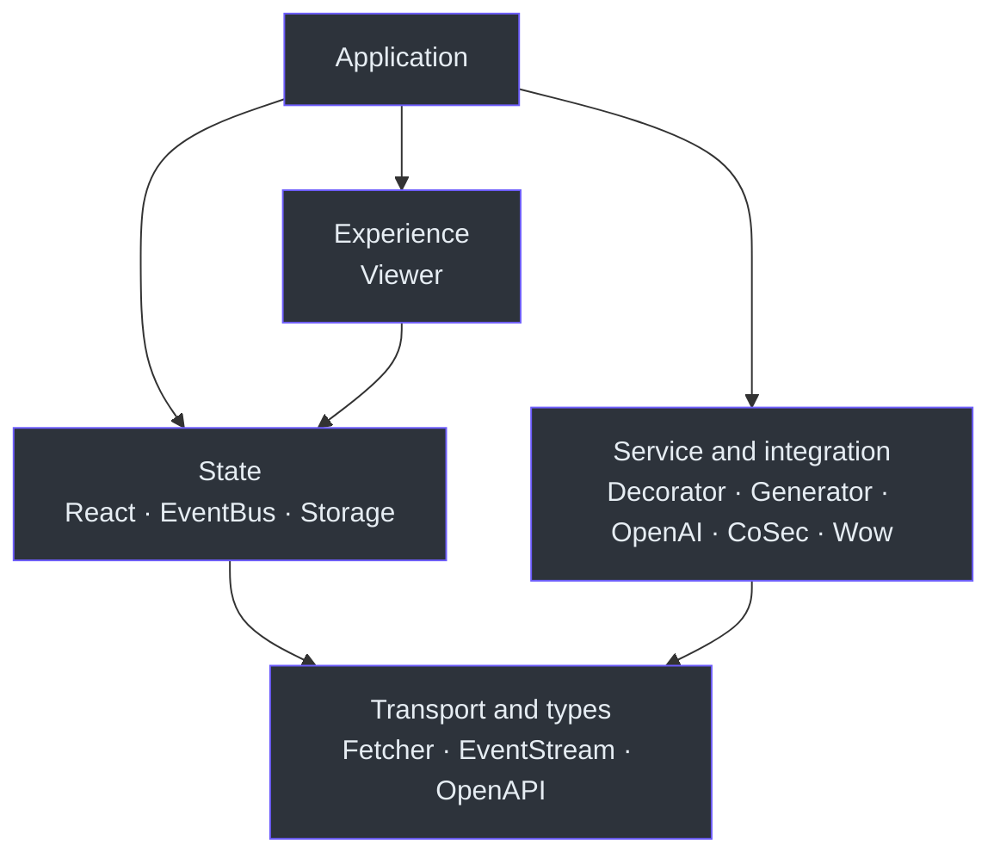

# Package reference

Fetcher is a layered ecosystem. Start with the package that owns the behavior,
then add only the integrations your application needs.

## Choose by responsibility

| Need | Start with | Add when |
| --- | --- | --- |
| Send typed HTTP requests | [`@ahoo-wang/fetcher`](./fetcher.md) | Every runtime request needs a client. |
| Define class-based API services | [`fetcher-decorator`](./decorator.md) | A stable decorated service interface is useful. |
| Deliver typed or named events | [`fetcher-eventbus`](./eventbus.md) | Multiple owners react to one event. |
| Consume SSE or token streams | [`fetcher-eventstream`](./eventstream.md) | A response uses `text/event-stream`. |
| Persist a typed value | [`fetcher-storage`](./storage.md) | State must outlive a component. |
| Describe an OpenAPI document | [`fetcher-openapi`](./openapi.md) | Tooling needs compile-time OpenAPI types. |
| Generate typed clients | [`fetcher-generator`](./generator.md) | OpenAPI is the API contract. |
| Call OpenAI-compatible APIs | [`fetcher-openai`](./openai.md) | Chat and streaming protocol types are needed. |
| Add CoSec authentication | [`fetcher-cosec`](./cosec.md) | The server uses the CoSec protocol. |
| Manage request state in React | [`fetcher-react`](./react.md) | The UI owns loading, result, error, and cancellation. |
| Build a data-exploration UI | [`fetcher-viewer`](./viewer.md) | Filters, tables, saved views, and remote data belong together. |
| Call Wow commands and queries | [`fetcher-wow`](./wow.md) | The server exposes Wow endpoints. |

## Layer map

Dependencies point toward the lower layers. If a transport helper needs Viewer
or React, move that behavior to the owning higher-level package instead.

## Package coverage

| Package | This Reference covers |
| --- | --- |
| [Fetcher](./fetcher.md) | Client configuration, typed requests, interceptors, timeouts, and errors. |
| [Decorator](./decorator.md) | API, endpoint, and parameter decorators; metadata and execution. |
| [EventBus](./eventbus.md) | Typed and named delivery, messengers, failure behavior, and cleanup. |
| [EventStream](./eventstream.md) | SSE conversion, JSON streams, response helpers, cancellation, and parsing errors. |
| [Storage](./storage.md) | `KeyStorage`, serializers, listeners, runtimes, and destruction. |
| [OpenAPI](./openapi.md) | OpenAPI type families, references, extensions, and 3.0/3.1 boundaries. |
| [Generator](./generator.md) | CLI, configuration, output, programmatic entry points, and Wow discovery. |
| [OpenAI](./openai.md) | Chat requests, streamed chunks, Fetcher composition, cancellation, and protocol failures. |
| [CoSec](./cosec.md) | Token lifecycle, refresh, interceptor order, attribution, and security boundaries. |
| [React](./react.md) | Providers, request-state hooks, UI helpers, ownership, and cancellation. |
| [Viewer](./viewer.md) | Viewer models, registries, components, persistence, and remote data flow. |
| [Wow](./wow.md) | Commands, snapshot and event queries, filters, aggregations, defaults, and result shapes. |

## Pick the right documentation depth

| Resource | Use it for | It does not replace |
| --- | --- | --- |
| **Reference** | Selecting public APIs, defaults, lifecycle rules, failures, and source evidence. | Package-specific recipes or interactive component exploration. |
| **Recipe** | A task-shaped, end-to-end integration workflow. | The complete API contract. |
| **Skill** | Having Codex perform work within a package boundary; use its `references/api.md` for exhaustive agent-facing details. | Human-facing behavior and lifecycle guidance in Reference. |
| **Storybook** | Rendering, interaction states, and component variants for Viewer. | API ownership, persistence, and remote-data contracts. |

Use the Recipes navigation, the [Skills catalog](../skills/index.md), or the
[Viewer Storybook](https://fetcher.ahoo.me/storybook/) when that depth better matches the task.
