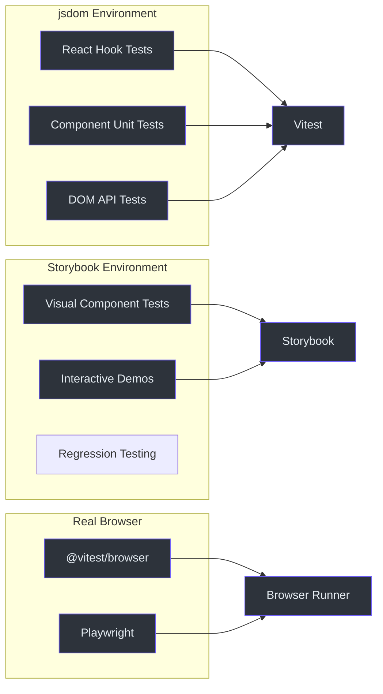
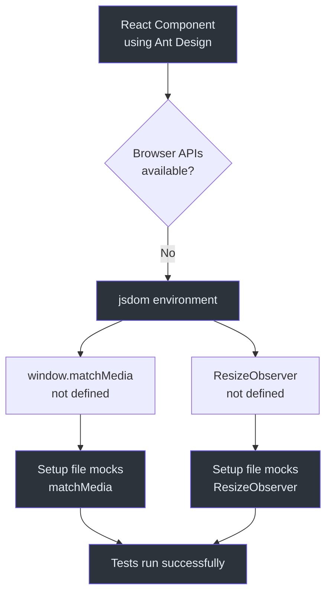
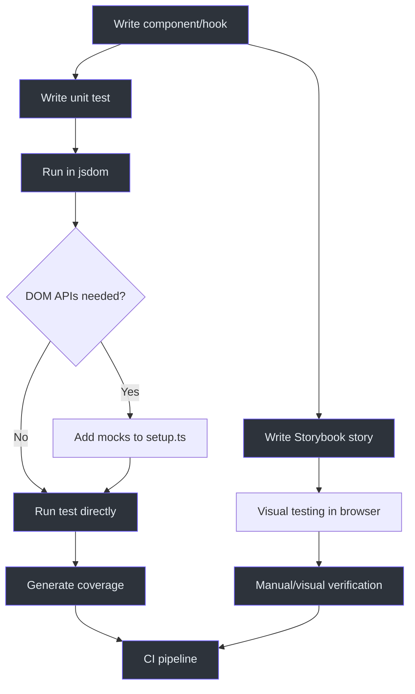

# Browser Testing

Browser tests validate that Fetcher components work correctly in real browser-like environments. The primary consumers of browser testing are the `viewer` package (React + Ant Design components) and the `react` package (hooks).

## Testing Environments



## Vitest Configuration for Browser Testing

### Viewer Package Configuration

The viewer package uses a dedicated Vitest config that merges with its Vite build config:

```typescript
// packages/viewer/vitest.config.ts
import { configDefaults, defineConfig, mergeConfig } from 'vitest/config';
import viteConfig from './vite.config';

export default mergeConfig(
  viteConfig,
  defineConfig({
    test: {
      environment: 'jsdom',
      globals: true,
      setupFiles: ['./test/setup.ts'],
      coverage: {
        exclude: [
          ...configDefaults.exclude,
          '**/**.stories.tsx',
          'src/filter/panel/**',
          'src/viewer/**',
          'src/fetcherviewer/**',
          'src/view/**',
        ],
      },
    },
  }),
);
```

**Source:** [`packages/viewer/vitest.config.ts`](https://github.com/Ahoo-Wang/fetcher/blob/main/packages/viewer/vitest.config.ts)

### Key Configuration Points

| Setting | Value | Purpose |
|---------|-------|---------|
| `environment` | `'jsdom'` | Simulates browser DOM in Node.js |
| `globals` | `true` | Provides `describe`, `it`, `expect`, `vi` globally |
| `setupFiles` | `['./test/setup.ts']` | Runs setup code before tests |
| `coverage.exclude` | Story files, panels, views | Excludes non-testable code |

## Test Setup File

The viewer package has a setup file that configures the jsdom environment for Ant Design compatibility:

```typescript
// packages/viewer/test/setup.ts
import '@testing-library/jest-dom';

// Mock window.matchMedia for Ant Design components
Object.defineProperty(window, 'matchMedia', {
  writable: true,
  value: (query: string) => ({
    matches: false,
    media: query,
    onchange: null,
    addListener: () => {},
    removeListener: () => {},
    addEventListener: () => {},
    removeEventListener: () => {},
    dispatchEvent: () => {},
  }),
});

// Mock ResizeObserver for jsdom environment
(globalThis as any).ResizeObserver = class ResizeObserver {
  constructor(cb: ResizeObserverCallback) {
    this.cb = cb;
  }
  cb: ResizeObserverCallback;
  observe() {}
  unobserve() {}
  disconnect() {}
};
```

**Source:** [`packages/viewer/test/setup.ts`](https://github.com/Ahoo-Wang/fetcher/blob/main/packages/viewer/test/setup.ts)

### Why These Mocks Are Needed



## Component Testing with React

### Testing Utility Functions

The viewer package tests utility functions that are used by React components:

```typescript
import { describe, expect, it } from 'vitest';
import { deepEqual, mapToTableRecord } from '../src/utils';

describe('deepEqual', () => {
  it('should return true for identical objects', () => {
    expect(deepEqual({ a: 1, b: 2 }, { a: 1, b: 2 })).toBe(true);
  });

  it('should handle nested structures', () => {
    const obj1 = {
      users: [{ id: 1, name: 'John', roles: ['admin'] }],
      settings: { theme: 'dark' },
    };
    const obj2 = { ...obj1 };
    expect(deepEqual(obj1, obj2)).toBe(true);
  });

  it('should return false for different types', () => {
    expect(deepEqual({}, [])).toBe(false);
    expect(deepEqual(42, [42])).toBe(false);
  });
});

describe('mapToTableRecord', () => {
  it('should add index-based keys', () => {
    const dataSource = [{ id: 1, name: 'John' }, { id: 2, name: 'Jane' }];
    const result = mapToTableRecord(dataSource);
    expect(result[0]).toEqual({ id: 1, name: 'John', key: 0 });
    expect(result[1]).toEqual({ id: 2, name: 'Jane', key: 1 });
  });

  it('should handle empty arrays', () => {
    expect(mapToTableRecord([])).toEqual([]);
    expect(mapToTableRecord(undefined)).toEqual([]);
  });
});
```

**Source:** [`packages/viewer/test/utils.test.ts`](https://github.com/Ahoo-Wang/fetcher/blob/main/packages/viewer/test/utils.test.ts)

### Running Viewer Tests

```bash
# Run all viewer tests
pnpm --filter @ahoo-wang/fetcher-viewer test

# Run with coverage
pnpm --filter @ahoo-wang/fetcher-viewer vitest run --coverage

# Run a specific test file
pnpm --filter @ahoo-wang/fetcher-viewer vitest run test/utils.test.ts
```

## Storybook Integration

The viewer and react packages include Storybook stories for visual component development and testing.

### Story Files Location

```
packages/react/src/
  core/stories/
    useDebouncedCallback.stories.tsx
    useExecutePromise.stories.tsx
    usePromiseState.stories.tsx
    useForceUpdate.stories.tsx
    useLatest.stories.tsx
    useMounted.stories.tsx
    useRequestId.stories.tsx
  fetcher/stories/
    useFetcher.stories.tsx
    useDebouncedFetcher.stories.tsx
  wow/stories/
    useCountQuery.stories.tsx
    useListQuery.stories.tsx
    useSingleQuery.stories.tsx
    usePagedQuery.stories.tsx
  storage/stories/
    useKeyStorage.stories.tsx
    useImmerKeyStorage.stories.tsx
```

### Running Storybook

```bash
# Start Storybook dev server (from root)
pnpm storybook
```

### Story Exclusion from Coverage

Story files are excluded from Vitest coverage reports:

```typescript
coverage: {
  exclude: ['**/**.stories.tsx'],
},
```

## Build Configuration for Browser Packages

The viewer and react packages use special build configurations with React-specific plugins:

```typescript
// packages/viewer/vite.config.ts
export default defineConfig({
  plugins: [
    dts({ outDirs: 'dist', tsconfigPath: './tsconfig.json' }),
    react(),
    babel({
      plugins: [
        'babel-plugin-transform-typescript-metadata',
        ['@babel/plugin-proposal-decorators', { version: 'legacy' }],
      ],
      presets: [reactCompilerPreset()],
    }),
  ],
});
```

**Source:** [`packages/viewer/vite.config.ts`](https://github.com/Ahoo-Wang/fetcher/blob/main/packages/viewer/vite.config.ts)

## Testing Flow for Browser Packages



## Tips for Browser Testing

### Adding New Browser API Mocks

When a component uses a browser API not available in jsdom, add the mock to the setup file:

```typescript
// packages/viewer/test/setup.ts
Object.defineProperty(window, 'matchMedia', {
  writable: true,
  value: (query: string) => ({
    matches: false,
    media: query,
    onchange: null,
    addListener: () => {},
    removeListener: () => {},
    addEventListener: () => {},
    removeEventListener: () => {},
    dispatchEvent: () => {},
  }),
});
```

### Testing Components with Ant Design

Ant Design components require `matchMedia` and `ResizeObserver` mocks. Both are provided in the viewer setup file. If you add new Ant Design components, verify they work with the existing mocks.

### Testing Async Components

For components that use `useFetcher` or `useQuery`, use Vitest's async testing utilities:

```typescript
import { renderHook, waitFor } from '@testing-library/react';

it('should fetch data', async () => {
  const { result } = renderHook(() => useFetcher({ resultExtractor: ResultExtractors.Json }));
  
  act(() => {
    result.current.execute({ url: '/api/data', method: 'GET' });
  });

  await waitFor(() => {
    expect(result.current.loading).toBe(false);
  });
});
```

## Related Pages

- [Testing Overview](./index.md) -- Testing strategy overview
- [Unit Testing](./unit-testing.md) -- Unit testing guide
- [Integration Testing](./integration-testing.md) -- Real API testing
- [React Hooks API](../api/react-hooks.md) -- Hooks being tested
