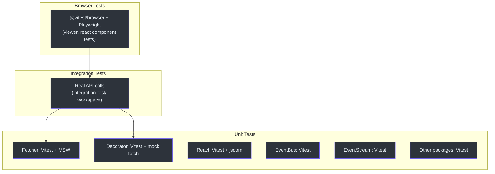
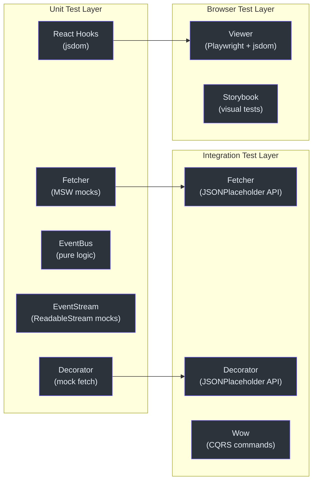

# Testing Overview

The Fetcher monorepo employs a comprehensive testing strategy organized around a test pyramid with three distinct layers: unit tests, integration tests, and browser tests. Every package has thorough test coverage using modern testing tools.

## Test Pyramid



## Testing Tools

| Tool | Version | Purpose |
|------|---------|---------|
| [Vitest](https://vitest.dev/) | Catalog-managed | Unit test runner with coverage |
| [MSW (Mock Service Worker)](https://mswjs.io/) | Catalog-managed | HTTP request mocking for fetcher tests |
| [@vitest/browser](https://vitest.dev/guide/browser.html) | Catalog-managed | Browser-mode testing for viewer |
| [Playwright](https://playwright.dev/) | Catalog-managed | Browser automation for browser tests |
| [@vitest/coverage-v8](https://vitest.dev/guide/coverage.html) | Catalog-managed | Code coverage with V8 engine |
| [jsdom](https://github.com/jsdom/jsdom) | Catalog-managed | DOM environment for React tests |
| [@testing-library/jest-dom](https://testing-library.com/docs/ecosystem-jest-dom/) | Catalog-managed | Custom DOM matchers |
| [Storybook](https://storybook.js.org/) | Catalog-managed | Component development and visual testing |

## Running Tests

### All Packages (Unit Tests)

```bash
# Run unit tests across all packages
pnpm test:unit
```

### Single Package

```bash
# Run all tests in a package
pnpm --filter @ahoo-wang/fetcher test
pnpm --filter @ahoo-wang/fetcher-decorator test
pnpm --filter @ahoo-wang/fetcher-react test
pnpm --filter @ahoo-wang/fetcher-viewer test
```

### Single Test File

```bash
# Run a specific test file
pnpm --filter @ahoo-wang/fetcher vitest run test/fetcher.test.ts
```

### Integration Tests

```bash
# Run integration tests (requires running API server for some tests)
pnpm --filter @ahoo-wang/fetcher-integration-test test
```

### Browser Tests

```bash
# Run browser tests (viewer package)
pnpm --filter @ahoo-wang/fetcher-viewer test
```

### Storybook

```bash
# Start Storybook for visual component development
pnpm storybook
```

## Vitest Configuration

All packages use Vitest with consistent configuration:

```typescript
// Root vitest config (per package)
export default defineConfig({
  test: {
    globals: true,       // describe, it, expect, vi available without imports
    coverage: {
      provider: 'v8',    // V8 coverage provider
    },
  },
});
```

**Key configuration points:**

- **Globals mode**: `globals: true` means `describe`, `it`, `expect`, `vi` are available without imports
- **Coverage**: Uses `@vitest/coverage-v8` with V8 engine for fast, accurate coverage
- **Test files**: Follow `*.test.ts` / `*.test.tsx` naming convention
- **Test location**: Tests are in `test/` directories (parallel to `src/`)
- **ESLint**: Test files (`**/**.test.ts`) are excluded from linting

## Coverage Reports

Each package generates coverage reports when tests run with the `--coverage` flag:

```bash
# Generate coverage for a single package
pnpm --filter @ahoo-wang/fetcher vitest run --coverage
```

Coverage reports are generated in each package's `coverage/` directory and include:

- Line coverage
- Branch coverage
- Function coverage
- Statement coverage

## Test File Conventions

### Naming

```
packages/fetcher/
  src/
    fetcher.ts
    fetcherError.ts
  test/
    fetcher.test.ts
    fetcherError.test.ts
```

Tests are in a `test/` directory at the package root, mirroring the `src/` structure. Some packages (like `viewer`) place tests alongside source files.

### Structure

Tests follow the Given-When-Expect pattern (also known as Arrange-Act-Assert):

```typescript
import { describe, it, expect, vi } from 'vitest';

describe('Feature', () => {
  describe('specific behavior', () => {
    it('should do something when condition', () => {
      // Arrange
      const input = setupTestData();

      // Act
      const result = performAction(input);

      // Assert
      expect(result).toBe(expected);
    });
  });
});
```

## Testing Architecture



## CI/CD Test Pipeline

```mermaid
flowchart LR
    A["git push"] --> B["Install deps<br>pnpm install"]
    B --> C["Build all<br>pnpm build"]
    C --> D["Lint<br>pnpm lint"]
    D --> E["Unit Tests<br>pnpm test:unit"]
    E --> F["Integration Tests<br>pnpm test:it"]
    F --> G["Coverage Report"]
    G --> H["Merge / Deploy"]

    style A fill:#2d333b,stroke:#6d5dfc,color:#e6edf3
    style B fill:#2d333b,stroke:#6d5dfc,color:#e6edf3
    style E fill:#2d333b,stroke:#6d5dfc,color:#e6edf3
    style F fill:#2d333b,stroke:#6d5dfc,color:#e6edf3
    style G fill:#2d333b,stroke:#6d5dfc,color:#e6edf3
    style H fill:#2d333b,stroke:#6d5dfc,color:#e6edf3
```



## Related Pages

- [Unit Testing](./unit-testing.md) -- Detailed unit testing guide
- [Integration Testing](./integration-testing.md) -- Real API testing guide
- [Browser Testing](./browser-testing.md) -- Browser and component testing
