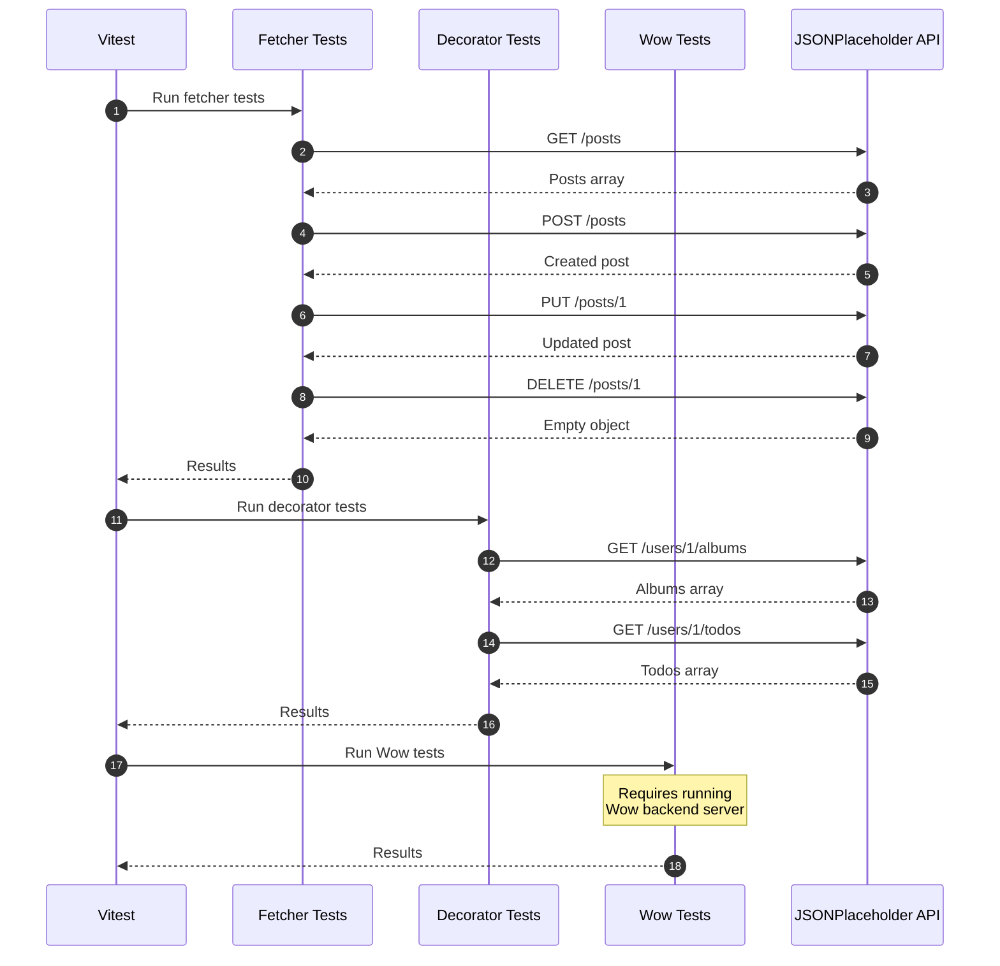
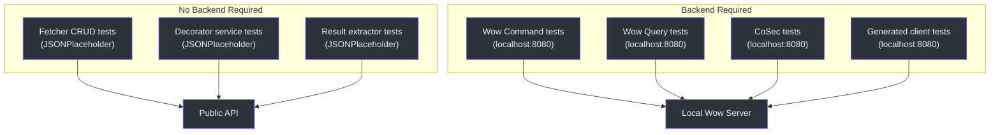
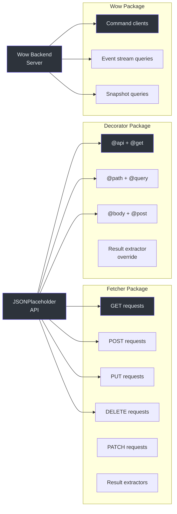

# Integration Testing

Integration tests validate that the Fetcher ecosystem works correctly against real HTTP APIs. The `integration-test` workspace contains tests that make actual network calls to public APIs and running backend services.

## Workspace Structure

```
integration-test/
  src/
    fetcher/
      typicodeFetcher.ts          # NamedFetcher for JSONPlaceholder
    decorator/
      typicodeUserService.ts      # Decorator-based API client
      typicodePostService.ts
      resultExtractorService.ts
    wow/
      cart/
        cartCommandClient.ts      # CQRS command client
        cartClientOptions.ts
      exampleFetcher.ts
    generated/
      example/                    # Auto-generated from OpenAPI spec
  test/
    fetcher/
      typicodeFetcher.test.ts     # Fetcher integration tests
    decorator/
      typicodeUserService.test.ts # Decorator integration tests
      typicodePostService.test.ts
      resultExtractorService.test.ts
    wow/
      cart/
        cartCommandClient.test.ts
    openai/
      openai.test.ts
```

**Source:** [`integration-test/`](https://github.com/Ahoo-Wang/fetcher/blob/main/integration-test)

## Test API: JSONPlaceholder

The primary test API used for integration tests is [JSONPlaceholder](https://jsonplaceholder.typicode.com), a free public REST API. It provides realistic CRUD endpoints without requiring authentication.

### Fetcher Setup

```typescript
import { NamedFetcher } from '@ahoo-wang/fetcher';

export const typicodeFetcher = new NamedFetcher('typicode', {
  baseURL: 'https://jsonplaceholder.typicode.com',
});

// Optional: add interceptors
typicodeFetcher.interceptors.request.use(cosecRequestInterceptor);
typicodeFetcher.interceptors.response.use(authorizationResponseInterceptor);
```

**Source:** [`integration-test/src/fetcher/typicodeFetcher.ts`](https://github.com/Ahoo-Wang/fetcher/blob/main/integration-test/src/fetcher/typicodeFetcher.ts)

## Integration Test Examples

### Fetcher-Level Tests

Tests using the Fetcher class directly against JSONPlaceholder:

```typescript
import { describe, it, expect } from 'vitest';
import { typicodeFetcher } from '../../src';
import { HttpMethod, ResultExtractors } from '@ahoo-wang/fetcher';

describe('typicodeFetcher Integration Test', () => {
  it('should fetch posts from typicode API', async () => {
    const response = await typicodeFetcher.get('/posts');
    expect(response).toBeDefined();
    const posts = await response.json();
    expect(Array.isArray(posts)).toBe(true);
    expect(posts.length).toBeGreaterThan(0);

    const post = posts[0];
    expect(post).toHaveProperty('id');
    expect(post).toHaveProperty('userId');
    expect(post).toHaveProperty('title');
    expect(post).toHaveProperty('body');
  });

  it('should create a new post', async () => {
    const newPost = { userId: 1, title: 'Test Post', body: 'Content' };
    const response = await typicodeFetcher.post('/posts', {
      body: JSON.stringify(newPost),
    });
    const post = await response.json();
    expect(post).toHaveProperty('id');
    expect(post.title).toBe(newPost.title);
  });

  it('should update a post', async () => {
    const response = await typicodeFetcher.put('/posts/1', {
      body: { userId: 1, title: 'Updated', body: 'Updated content' },
    });
    const post = await response.json();
    expect(post.title).toBe('Updated');
  });

  it('should delete a post', async () => {
    const response = await typicodeFetcher.delete('/posts/1');
    const result = await response.json();
    expect(result).toEqual({});
  });
});
```

**Source:** [`integration-test/test/fetcher/typicodeFetcher.test.ts`](https://github.com/Ahoo-Wang/fetcher/blob/main/integration-test/test/fetcher/typicodeFetcher.test.ts)

### Decorator-Level Tests

Tests using decorator-based API services:

```typescript
import { describe, it, expect } from 'vitest';
import { typicodeUserService } from '../../src';

describe('TypicodeUserService Integration Test', () => {
  it('should get user albums', async () => {
    const albums = await typicodeUserService.getAlbums('1');
    expect(albums).toBeDefined();
    expect(Array.isArray(albums)).toBe(true);
    if (albums.length > 0) {
      expect(albums[0]).toHaveProperty('id');
      expect(albums[0]).toHaveProperty('userId');
      expect(albums[0]).toHaveProperty('title');
    }
  });

  it('should get user todos', async () => {
    const todos = await typicodeUserService.getTodos('1');
    expect(todos).toBeDefined();
    expect(Array.isArray(todos)).toBe(true);
  });

  it('should get user posts', async () => {
    const posts = await typicodeUserService.getPosts('1');
    expect(posts).toBeDefined();
    expect(Array.isArray(posts)).toBe(true);
  });
});
```

**Source:** [`integration-test/test/decorator/typicodeUserService.test.ts`](https://github.com/Ahoo-Wang/fetcher/blob/main/integration-test/test/decorator/typicodeUserService.test.ts)

## Test Execution Flow



## Environment Configuration

### Package Configuration

```json
{
  "scripts": {
    "test": "vitest run --coverage",
    "generate": "pnpm exec fetcher-generator generate -i http://localhost:8080/v3/api-docs"
  }
}
```

**Source:** [`integration-test/package.json`](https://github.com/Ahoo-Wang/fetcher/blob/main/integration-test/package.json)

### Vite Configuration

```typescript
// integration-test/vite.config.ts
export default defineConfig({
  build: {
    lib: {
      entry: 'src/index.ts',
      name: 'FetcherIt',
      fileName: format => `index.${format}.js`,
    },
    rollupOptions: {
      external: [
        '@ahoo-wang/fetcher',
        '@ahoo-wang/fetcher-decorator',
        '@ahoo-wang/fetcher-eventstream',
        '@ahoo-wang/fetcher-cosec',
        '@ahoo-wang/fetcher-wow',
      ],
    },
  },
});
```

**Source:** [`integration-test/vite.config.ts`](https://github.com/Ahoo-Wang/fetcher/blob/main/integration-test/vite.config.ts)

## Running Integration Tests

```bash
# From root
pnpm test:it

# From integration-test directory
cd integration-test && pnpm test

# Specific test file
pnpm --filter @ahoo-wang/fetcher-integration-test vitest run test/fetcher/typicodeFetcher.test.ts
```

## Integration Test Categories



## Wow CQRS Integration Tests

The Wow integration tests validate command/event-sourcing patterns against a running Wow backend:

- **CartCommandClient**: Sends commands (AddCartItem, RemoveCartItem, ChangeQuantity)
- **EventStreamQueryClient**: Queries event streams via SSE
- **SnapshotQueryClient**: Queries aggregate snapshots
- **Generated clients**: Tests auto-generated code from OpenAPI spec

These tests require a running backend server at `localhost:8080` and are typically skipped in CI unless the server is available.

## Integration Test Coverage Map



## Related Pages

- [Testing Overview](./index.md) -- Testing strategy overview
- [Unit Testing](./unit-testing.md) -- Unit testing guide
- [Browser Testing](./browser-testing.md) -- Browser and component testing
- [Fetcher Client API](../api/fetcher-client.md) -- API being tested
