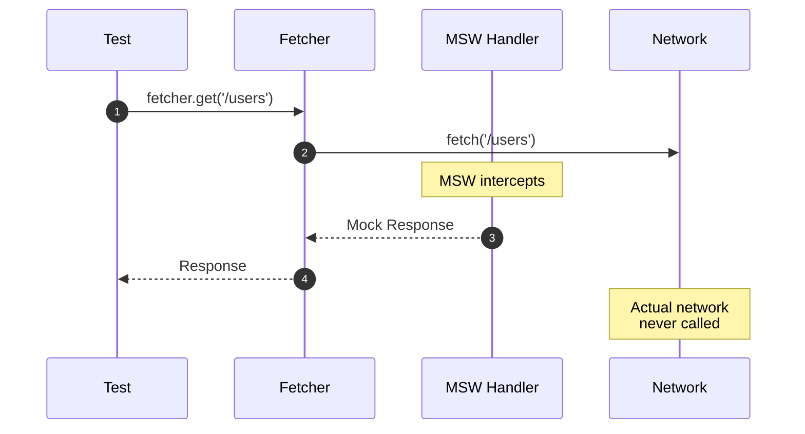
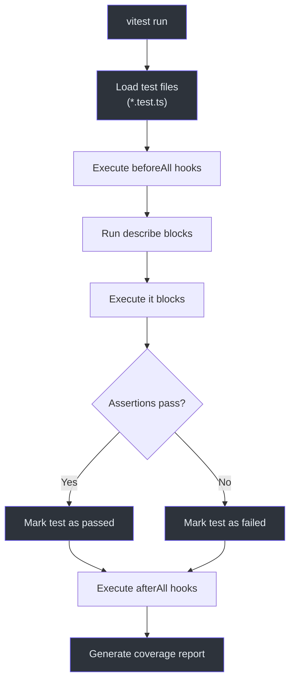
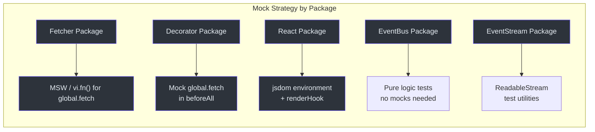

# Unit Testing

Unit tests form the foundation of the Fetcher testing strategy. Every package has a comprehensive test suite using Vitest. This page covers the tools, patterns, and examples used across the monorepo.

## Vitest Configuration

All packages use Vitest with globals mode enabled. This means `describe`, `it`, `expect`, and `vi` are available without explicit imports (though imports are still used in practice for clarity).

```typescript
// Example: packages/viewer/vitest.config.ts
import { configDefaults, defineConfig, mergeConfig } from 'vitest/config';
import viteConfig from './vite.config';

export default mergeConfig(
  viteConfig,
  defineConfig({
    test: {
      environment: 'jsdom',
      globals: true,
      setupFiles: ['./test/setup.ts'],
      coverage: {
        exclude: [...configDefaults.exclude, '**/**.stories.tsx'],
      },
    },
  }),
);
```

**Source:** [`packages/viewer/vitest.config.ts`](https://github.com/Ahoo-Wang/fetcher/blob/main/packages/viewer/vitest.config.ts)

## Test File Location

Tests live in `test/` directories at the package root:

```
packages/fetcher/
  test/
    fetcher.test.ts
    fetcherError.test.ts
    interceptor.test.ts
    interceptorManager.test.ts
    urlBuilder.test.ts
    ...
packages/decorator/
  test/
    apiDecorator.test.ts
    endpointDecorator.test.ts
    parameterDecorator.test.ts
    ...
```

## MSW for HTTP Mocking (Fetcher Package)

The fetcher package uses MSW (Mock Service Worker) to intercept and mock HTTP requests at the network level.

### How MSW Works



### Mock Service Worker Pattern

For packages not using MSW, the standard pattern is to mock `global.fetch` directly:

```typescript
import { describe, it, expect, vi, beforeAll, afterAll } from 'vitest';

const originalFetch = global.fetch;
beforeAll(() => {
  global.fetch = vi.fn(() =>
    Promise.resolve({
      ok: true,
      status: 200,
      json: () => Promise.resolve({ mocked: 'response' }),
      text: () => Promise.resolve('mocked response'),
    } as Response),
  );
});

afterAll(() => {
  global.fetch = originalFetch;
});
```

**Source:** [`packages/decorator/test/apiDecorator.test.ts:18`](https://github.com/Ahoo-Wang/fetcher/blob/main/packages/decorator/test/apiDecorator.test.ts#L18)

## Testing the Fetcher Class

The Fetcher class can be tested by mocking the interceptor pipeline:

```typescript
import { describe, it, expect, vi } from 'vitest';
import { Fetcher, HttpMethod } from '@ahoo-wang/fetcher';

describe('Fetcher', () => {
  it('should create with default options', () => {
    const fetcher = new Fetcher();
    expect(fetcher.urlBuilder.baseURL).toBe('');
    expect(fetcher.headers).toEqual({ 'Content-Type': 'application/json' });
    expect(fetcher.timeout).toBeUndefined();
  });

  it('should make GET request', async () => {
    const fetcher = new Fetcher();
    const mockResponse = new Response('test');

    // Mock the interceptors.exchange method
    const exchangeSpy = vi
      .spyOn(fetcher.interceptors, 'exchange')
      .mockImplementation(async exchange => {
        exchange.response = mockResponse;
        return exchange;
      });

    const response = await fetcher.get('/users');
    expect(response).toBe(mockResponse);
    expect(exchangeSpy).toHaveBeenCalled();
  });

  it('should make POST request with body', async () => {
    const fetcher = new Fetcher();
    const exchangeSpy = vi
      .spyOn(fetcher.interceptors, 'exchange')
      .mockImplementation(async exchange => {
        exchange.response = new Response('{}');
        return exchange;
      });

    await fetcher.post('/users', {
      body: { name: 'John' },
    });

    expect(exchangeSpy).toHaveBeenCalled();
  });
});
```

**Source:** [`packages/fetcher/test/fetcher.test.ts`](https://github.com/Ahoo-Wang/fetcher/blob/main/packages/fetcher/test/fetcher.test.ts)

## Testing Interceptors

Interceptors are tested by creating them independently and verifying they modify the exchange correctly:

```typescript
import { describe, it, expect } from 'vitest';
import { ValidateStatusInterceptor } from '@ahoo-wang/fetcher';

describe('ValidateStatusInterceptor', () => {
  it('should pass for 2xx status', () => {
    const interceptor = new ValidateStatusInterceptor();
    const exchange = createMockExchange({ status: 200 });
    expect(() => interceptor.intercept(exchange)).not.toThrow();
  });

  it('should throw for non-2xx status', () => {
    const interceptor = new ValidateStatusInterceptor();
    const exchange = createMockExchange({ status: 404 });
    expect(() => interceptor.intercept(exchange)).toThrow();
  });

  it('should use custom validateStatus', () => {
    const interceptor = new ValidateStatusInterceptor(
      (status) => status === 200
    );
    const exchange = createMockExchange({ status: 201 });
    expect(() => interceptor.intercept(exchange)).toThrow();
  });
});
```

**Source:** [`packages/fetcher/test/validateStatusInterceptor.test.ts`](https://github.com/Ahoo-Wang/fetcher/blob/main/packages/fetcher/test/validateStatusInterceptor.test.ts)

## Testing Decorators

Decorator tests verify metadata storage, method replacement, and parameter binding:

```typescript
import { describe, it, expect, vi, beforeAll, afterAll } from 'vitest';
import 'reflect-metadata';
import { api, API_METADATA_KEY, endpoint, parameter, ParameterType } from '@ahoo-wang/fetcher-decorator';
import { autoGeneratedError, HttpMethod, JsonResultExtractor } from '@ahoo-wang/fetcher-decorator';

// Mock fetch
const originalFetch = global.fetch;
beforeAll(() => {
  global.fetch = vi.fn(() =>
    Promise.resolve({
      ok: true,
      status: 200,
      json: () => Promise.resolve({ mocked: true }),
    } as Response),
  );
});
afterAll(() => { global.fetch = originalFetch; });

@api('/api/v1', {
  headers: { 'X-Default': 'value' },
  timeout: 3000,
  resultExtractor: JsonResultExtractor,
})
class TestApi {
  @endpoint(HttpMethod.GET, '/users')
  getUsers() { throw autoGeneratedError(); }

  @endpoint(HttpMethod.GET, '/users/{id}')
  getUser(@parameter(ParameterType.PATH, 'id') id: string) { throw autoGeneratedError(); }

  notDecoratedMethod() { return 'not decorated'; }
}

describe('apiDecorator', () => {
  it('should store API metadata', () => {
    const metadata = Reflect.getMetadata(API_METADATA_KEY, TestApi);
    expect(metadata.basePath).toBe('/api/v1');
    expect(metadata.headers).toEqual({ 'X-Default': 'value' });
    expect(metadata.timeout).toBe(3000);
  });

  it('should replace decorated methods with functions', () => {
    const api = new TestApi();
    expect(typeof api.getUsers).toBe('function');
    expect(api.getUsers()).toBeInstanceOf(Promise);
  });

  it('should preserve non-decorated methods', () => {
    const api = new TestApi();
    expect(api.notDecoratedMethod()).toBe('not decorated');
  });

  it('should support inheritance', () => {
    @api('/child')
    class ChildApi extends TestApi {
      @endpoint(HttpMethod.POST, '/child-endpoint')
      childMethod() { throw autoGeneratedError(); }
    }
    const childApi = new ChildApi();
    expect(typeof childApi.getUsers).toBe('function');
    expect(typeof childApi.childMethod).toBe('function');
  });
});
```

**Source:** [`packages/decorator/test/apiDecorator.test.ts`](https://github.com/Ahoo-Wang/fetcher/blob/main/packages/decorator/test/apiDecorator.test.ts)

## Testing Error Classes

```typescript
import { describe, it, expect } from 'vitest';
import { FetcherError, ExchangeError } from '@ahoo-wang/fetcher';

describe('FetcherError', () => {
  it('should create with message', () => {
    const error = new FetcherError('test error');
    expect(error.message).toBe('test error');
    expect(error.name).toBe('FetcherError');
  });

  it('should support cause chaining', () => {
    const cause = new Error('root cause');
    const error = new FetcherError(undefined, cause);
    expect(error.message).toBe('root cause');
    expect(error.cause).toBe(cause);
  });

  it('should work with instanceof', () => {
    const error = new FetcherError();
    expect(error).toBeInstanceOf(Error);
    expect(error).toBeInstanceOf(FetcherError);
  });
});
```

**Source:** [`packages/fetcher/test/fetcherError.test.ts`](https://github.com/Ahoo-Wang/fetcher/blob/main/packages/fetcher/test/fetcherError.test.ts)

## Test Execution Flow



## Test Categories by Package

| Package | Test Count | Key Test Areas |
|---------|-----------|----------------|
| fetcher | 21 test files | Fetcher, interceptors, URL builder, errors, registrar, timeout |
| decorator | 7 test files | API decorator, endpoint decorator, parameter decorator, metadata, executor |
| eventbus | 5 test files | EventBus, parallel/serial/broadcast buses, name generator |
| eventstream | 11 test files | Stream converters, SSE transforms, async iteration |
| viewer | 1 test file | Utility functions (deepEqual, mapToTableRecord) |
| wow | 2 test files | Index exports, property value extraction |
| generator | 3 test files | CLI, E2E generation, index exports |
| openai | 1 test file | OpenAI client |

## Mocking Patterns

### Mocking the Fetcher Instance

```typescript
const mockFetcher = {
  fetch: vi.fn(),
  get: vi.fn(),
  post: vi.fn(),
  interceptors: new InterceptorManager(),
};
```

### Mocking the Interceptor Pipeline

```typescript
vi.spyOn(fetcher.interceptors, 'exchange').mockImplementation(async exchange => {
  exchange.response = new Response(JSON.stringify({ data: 'test' }));
  return exchange;
});
```

### Mocking FetchExchange

```typescript
function createMockExchange(overrides: Partial<FetchExchangeInit> = {}): FetchExchange {
  return new FetchExchange({
    fetcher: new Fetcher(),
    request: { url: '/test', method: HttpMethod.GET },
    ...overrides,
  });
}
```

## Test Mock Strategy



## Related Pages

- [Testing Overview](./index.md) -- Testing strategy overview
- [Integration Testing](./integration-testing.md) -- Real API testing
- [Browser Testing](./browser-testing.md) -- Browser and component testing
- [Fetcher Client API](../api/fetcher-client.md) -- API being tested
