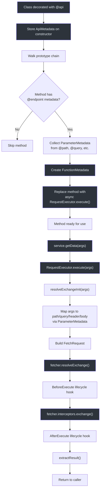
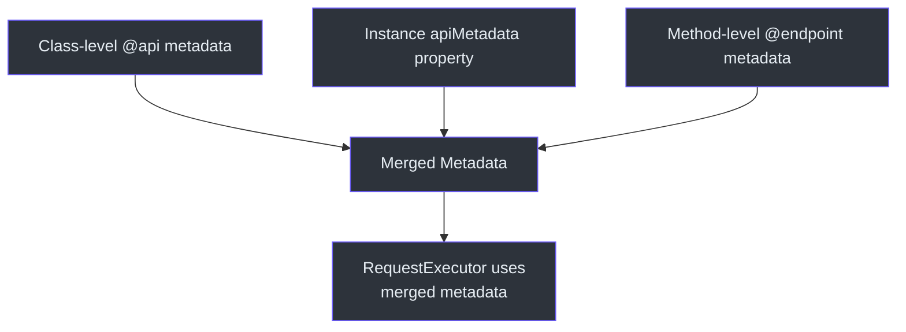
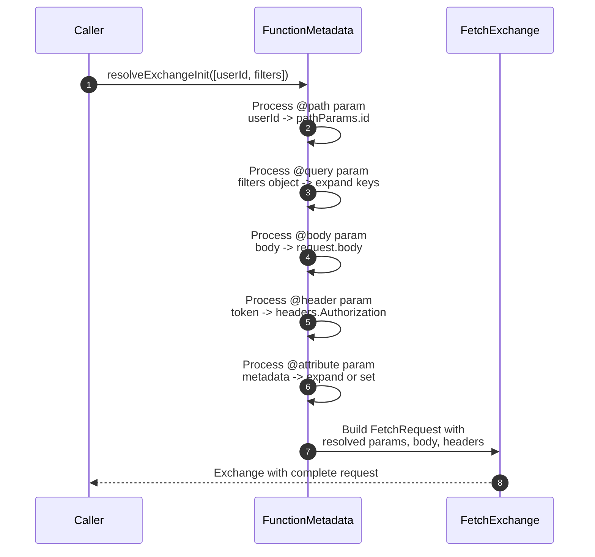

# 装饰器 API

`@ahoo-wang/fetcher-decorator` 包提供了一种使用 TypeScript 装饰器声明式定义 API 服务类的方式。使用 HTTP 动词装饰器标记的方法会被自动替换为构建和执行 HTTP 请求的实现。

::: warning 需要 reflect-metadata
在使用任何装饰器之前，必须先导入 `reflect-metadata`：

```typescript
import 'reflect-metadata';
```
:::

**源码:** [`packages/decorator/src/index.ts`](https://github.com/Ahoo-Wang/fetcher/blob/main/packages/decorator/src/index.ts)

## 类装饰器

### @api

将类定义为带有共享配置的 API 服务。

```typescript
@api(basePath?: string, metadata?: ApiMetadata)
```

| 参数 | 类型 | 默认值 | 描述 |
|-----------|------|---------|-------------|
| `basePath` | `string` | `''` | 类中所有端点的 URL 前缀 |
| `metadata` | `Omit<ApiMetadata, 'basePath'>` | `{}` | 所有方法的共享配置 |

#### ApiMetadata 属性

| 属性 | 类型 | 描述 |
|----------|------|-------------|
| `basePath` | `string` | 添加到所有端点路径前的 URL 前缀 |
| `headers` | `RequestHeaders` | 所有请求的默认头部 |
| `timeout` | `number` | 默认超时时间（毫秒） |
| `fetcher` | `string \| Fetcher` | Fetcher 实例或名称（默认：`'default'`） |
| `resultExtractor` | `ResultExtractor<any>` | 默认结果提取器 |
| `attributes` | `Record<string, any> \| Map<string, any>` | 共享请求属性 |
| `returnType` | `EndpointReturnType` | 返回类型策略（`'Result'` 或 `'Exchange'`） |
| `urlParams` | `UrlParams` | 默认 URL 参数 |

**源码:** [`packages/decorator/src/apiDecorator.ts:40`](https://github.com/Ahoo-Wang/fetcher/blob/main/packages/decorator/src/apiDecorator.ts#L40)

#### 示例

```typescript
import 'reflect-metadata';
import { api, get, post, body, autoGeneratedError } from '@ahoo-wang/fetcher-decorator';

@api('/api/v1', {
  headers: { 'Authorization': 'Bearer token' },
  timeout: 5000,
  fetcher: 'myFetcher',
})
class UserService {
  @get('/users')
  getUsers(): Promise<User[]> {
    throw autoGeneratedError();
  }

  @post('/users')
  createUser(@body() user: User): Promise<User> {
    throw autoGeneratedError();
  }
}
```

**源码:** [`packages/decorator/src/apiDecorator.ts:232`](https://github.com/Ahoo-Wang/fetcher/blob/main/packages/decorator/src/apiDecorator.ts#L232)

## HTTP 方法装饰器

所有方法装饰器共享相同的签名：

```typescript
@<method>(path?: string, metadata?: MethodEndpointMetadata)
```

| 装饰器 | HTTP 方法 | 描述 |
|-----------|-------------|-------------|
| `@get` | GET | 从服务器获取数据 |
| `@post` | POST | 创建新资源 |
| `@put` | PUT | 替换现有资源 |
| `@del` | DELETE | 删除资源 |
| `@patch` | PATCH | 部分更新资源 |
| `@head` | HEAD | 仅获取头部信息 |
| `@options` | OPTIONS | 描述通信选项 |

### MethodEndpointMetadata

继承 `ApiMetadata`，不包含 `method` 和 `basePath`：

| 属性 | 类型 | 描述 |
|----------|------|-------------|
| `headers` | `RequestHeaders` | 端点级别的头部（与类头部合并） |
| `timeout` | `number` | 端点级别的超时时间 |
| `fetcher` | `string \| Fetcher` | 端点级别的 fetcher |
| `resultExtractor` | `ResultExtractor<any>` | 端点级别的结果提取器 |
| `attributes` | `Record<string, any> \| Map<string, any>` | 端点级别的属性 |
| `returnType` | `EndpointReturnType` | 返回类型覆盖 |
| `urlParams` | `UrlParams` | 端点级别的 URL 参数 |

**源码:** [`packages/decorator/src/endpointDecorator.ts:33`](https://github.com/Ahoo-Wang/fetcher/blob/main/packages/decorator/src/endpointDecorator.ts#L33)

### 通用 @endpoint 装饰器

用于便捷装饰器未覆盖的 HTTP 方法：

```typescript
import { endpoint, HttpMethod } from '@ahoo-wang/fetcher-decorator';

@get('/users')
@endpoint(HttpMethod.TRACE, '/trace-endpoint')
traceEndpoint(): Promise<Response> {
  throw autoGeneratedError();
}
```

**源码:** [`packages/decorator/src/endpointDecorator.ts:59`](https://github.com/Ahoo-Wang/fetcher/blob/main/packages/decorator/src/endpointDecorator.ts#L59)

## 参数装饰器

参数装饰器指定方法参数如何映射到 HTTP 请求的各个组成部分。

| 装饰器 | ParameterType | 描述 |
|-----------|---------------|-------------|
| `@path(name?)` | `PATH` | 将值插入 URL 路径占位符 |
| `@query(name?)` | `QUERY` | 将值作为查询字符串参数附加 |
| `@header(name?)` | `HEADER` | 将值添加到请求头部 |
| `@body()` | `BODY` | 设置请求体 |
| `@request()` | `REQUEST` | 传递完整的 `ParameterRequest` 对象 |
| `@attribute(name?)` | `ATTRIBUTE` | 将值添加到 exchange 属性 |

**源码:** [`packages/decorator/src/parameterDecorator.ts:199`](https://github.com/Ahoo-Wang/fetcher/blob/main/packages/decorator/src/parameterDecorator.ts#L199)

### 参数绑定规则

1. **名称是可选的。** 如果省略，参数名称会通过 `reflect-metadata` 从 TypeScript 函数签名中提取：
   ```typescript
   @get('/users/{userId}')
   getUser(@path() userId: string) { throw autoGeneratedError(); }
   ```

2. **对象展开。** `@path`、`@query`、`@header` 和 `@attribute` 支持普通对象。每个键值对会展开为独立的参数：
   ```typescript
   @get('/users/{id}/posts/{postId}')
   getUserPost(@path() params: { id: string, postId: string }) { throw autoGeneratedError(); }
   ```

3. **AbortSignal / AbortController。** 如果参数是 `AbortSignal` 或 `AbortController` 实例，它会自动用于请求取消 -- 无需装饰器。

**源码:** [`packages/decorator/src/functionMetadata.ts:224`](https://github.com/Ahoo-Wang/fetcher/blob/main/packages/decorator/src/functionMetadata.ts#L224)

### @path

```typescript
@get('/users/{id}/posts/{postId}')
getUserPost(
  @path('id') userId: string,
  @path('postId') postId: string,
): Promise<Post[]> {
  throw autoGeneratedError();
}
```

### @query

```typescript
@get('/users')
searchUsers(
  @query('limit') limit: number,
  @query('offset') offset: number,
): Promise<User[]> {
  throw autoGeneratedError();
}
```

### @header

```typescript
@get('/users')
getUsers(@header('Authorization') token: string): Promise<User[]> {
  throw autoGeneratedError();
}
```

### @body

```typescript
@post('/users')
createUser(@body() user: CreateUserRequest): Promise<User> {
  throw autoGeneratedError();
}
```

### @request

传递完整的请求配置对象：

```typescript
interface ParameterRequest<BODY> extends FetchRequestInit<BODY>, PathCapable {}

@post('/users')
createUsers(@request() req: ParameterRequest): Promise<User[]> {
  throw autoGeneratedError();
}

// 用法：
await service.createUsers({
  path: '/custom-path',
  headers: { 'X-Custom': 'value' },
  body: [{ name: 'John' }],
  timeout: 10000,
});
```

### @attribute

传递可被拦截器访问的属性：

```typescript
@get('/users/{id}')
getUser(
  @path('id') id: string,
  @attribute('requestId') requestId: string,
): Promise<User> {
  throw autoGeneratedError();
}
```

**源码:** [`packages/decorator/src/parameterDecorator.ts:408`](https://github.com/Ahoo-Wang/fetcher/blob/main/packages/decorator/src/parameterDecorator.ts#L408)

## autoGeneratedError

装饰器方法体内的占位错误。装饰器在类装饰阶段替换了方法实现，因此方法体永远不会执行。`autoGeneratedError` 函数的存在是为了满足 ESLint 和 TypeScript 的要求。

```typescript
import { autoGeneratedError } from '@ahoo-wang/fetcher-decorator';

@get('/users')
getUsers(): Promise<User[]> {
  throw autoGeneratedError();
}
```

**源码:** [`packages/decorator/src/generated.ts:41`](https://github.com/Ahoo-Wang/fetcher/blob/main/packages/decorator/src/generated.ts#L41)

## EndpointReturnType

控制装饰器方法的返回内容。

| 值 | 描述 |
|-------|-------------|
| `EndpointReturnType.RESULT`（默认） | 返回提取后的结果（如解析后的 JSON） |
| `EndpointReturnType.EXCHANGE` | 返回完整的 `FetchExchange` 对象 |

```typescript
@api('/api', { returnType: EndpointReturnType.EXCHANGE })
class ExchangeApi {
  @get('/data')
  getData(): Promise<FetchExchange> {
    throw autoGeneratedError();
  }
}
```

**源码:** [`packages/decorator/src/endpointReturnTypeCapable.ts:14`](https://github.com/Ahoo-Wang/fetcher/blob/main/packages/decorator/src/endpointReturnTypeCapable.ts#L14)

## ExecuteLifeCycle

用于在请求执行生命周期中注入逻辑的接口。

```typescript
interface ExecuteLifeCycle {
  beforeExecute?(exchange: FetchExchange): void | Promise<void>;
  afterExecute?(exchange: FetchExchange): void | Promise<void>;
}
```

在你的 API 类上实现此接口，以在拦截器处理前后添加自定义逻辑：

```typescript
@api('/api/v1')
class LoggingApi implements ExecuteLifeCycle {
  beforeExecute(exchange: FetchExchange) {
    console.log('Request:', exchange.request.url);
  }
  afterExecute(exchange: FetchExchange) {
    console.log('Response:', exchange.response?.status);
  }

  @get('/data')
  getData(): Promise<Data> {
    throw autoGeneratedError();
  }
}
```

**源码:** [`packages/decorator/src/executeLifeCycle.ts:23`](https://github.com/Ahoo-Wang/fetcher/blob/main/packages/decorator/src/executeLifeCycle.ts#L23)

## 装饰器解析顺序



## 元数据优先级

当同一属性在多个层级定义时，解析遵循以下优先级（后者优先）：



## 完整示例

```typescript
import 'reflect-metadata';
import {
  api, get, post, put, del,
  path, query, header, body,
  autoGeneratedError, ExecuteLifeCycle
} from '@ahoo-wang/fetcher-decorator';
import type { FetchExchange } from '@ahoo-wang/fetcher';

interface User {
  id: string;
  name: string;
  email: string;
}

interface UserListQuery {
  page: number;
  limit: number;
  keyword?: string;
}

@api('/api/v1/users', {
  headers: { 'Content-Type': 'application/json' },
  timeout: 10000,
})
class UserApi implements ExecuteLifeCycle {
  beforeExecute(exchange: FetchExchange) {
    console.log(`[UserApi] ${exchange.request.method} ${exchange.request.url}`);
  }

  @get('')
  listUsers(@query() query: UserListQuery): Promise<User[]> {
    throw autoGeneratedError();
  }

  @get('/{id}')
  getUser(@path('id') id: string): Promise<User> {
    throw autoGeneratedError();
  }

  @post('')
  createUser(@body() user: Omit<User, 'id'>): Promise<User> {
    throw autoGeneratedError();
  }

  @put('/{id}')
  updateUser(
    @path('id') id: string,
    @body() user: Partial<User>,
  ): Promise<User> {
    throw autoGeneratedError();
  }

  @del('/{id}')
  deleteUser(@path('id') id: string): Promise<void> {
    throw autoGeneratedError();
  }
}

// 用法：
const userApi = new UserApi();
const users = await userApi.listUsers({ page: 1, limit: 10, keyword: 'john' });
const user = await userApi.getUser('123');
```

## 参数类型展开



## 相关页面

- [Fetcher 客户端 API](./fetcher-client.md) -- 核心 Fetcher 类文档
- [React Hooks API](./react-hooks.md) -- 基于装饰器 API 的 `createQueryApiHooks`
- [类型定义](./type-definitions.md) -- 所有 TypeScript 接口
- [测试：单元测试](../testing/unit-testing.md) -- 测试基于装饰器的服务
