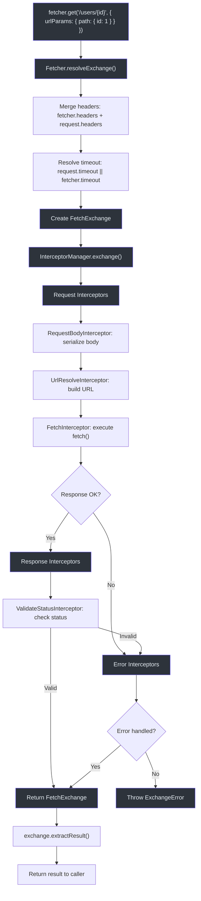
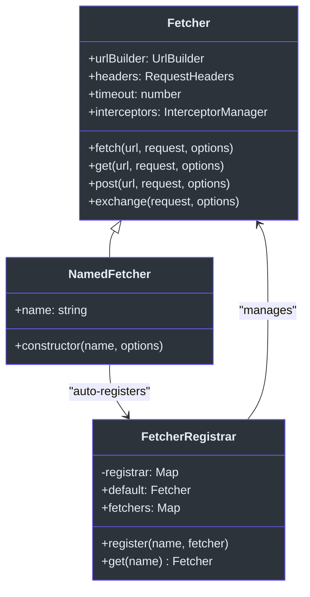
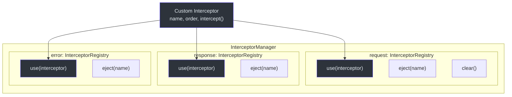

# Fetcher 客户端 API

`@ahoo-wang/fetcher` 包是 Fetcher 生态系统的基础。它在原生 Fetch API 之上封装了拦截器驱动的中间件管道、URL 模板解析、超时处理和类型安全的结果提取。

源码: [`packages/fetcher/src/fetcher.ts`](https://github.com/Ahoo-Wang/fetcher/blob/main/packages/fetcher/src/fetcher.ts)

## Fetcher 类

主要的 HTTP 客户端类。支持所有标准 HTTP 方法，具备自动头部合并、超时解析和拦截器链处理功能。

### 构造函数

```typescript
new Fetcher(options?: FetcherOptions)
```

**源码:** [`packages/fetcher/src/fetcher.ts:144`](https://github.com/Ahoo-Wang/fetcher/blob/main/packages/fetcher/src/fetcher.ts#L144)

### FetcherOptions

创建 Fetcher 实例的配置接口。

| 属性 | 类型 | 默认值 | 描述 |
|----------|------|---------|-------------|
| `baseURL` | `string` | `''` | 添加到所有请求 URL 前的基础 URL |
| `headers` | `RequestHeaders` | `{ 'Content-Type': 'application/json' }` | 所有请求的默认头部 |
| `timeout` | `number` | `undefined` | 默认超时时间（毫秒） |
| `urlTemplateStyle` | `UrlTemplateStyle` | `UrlTemplateStyle.UriTemplate` | URL 模板参数插值的风格 |
| `interceptors` | `InterceptorManager` | `new InterceptorManager()` | 自定义拦截器管理器 |
| `validateStatus` | `ValidateStatus` | `status >= 200 && status < 300` | 响应状态验证函数 |

**源码:** [`packages/fetcher/src/fetcher.ts:51`](https://github.com/Ahoo-Wang/fetcher/blob/main/packages/fetcher/src/fetcher.ts#L51)

### 实例方法

| 方法 | 签名 | 描述 |
|--------|-----------|-------------|
| `fetch` | `fetch<R>(url, request?, options?): Promise<R>` | 主要请求方法；默认返回 `Response` |
| `get` | `get<R>(url, request?, options?): Promise<R>` | GET 请求（无请求体） |
| `post` | `post<R>(url, request?, options?): Promise<R>` | POST 请求 |
| `put` | `put<R>(url, request?, options?): Promise<R>` | PUT 请求 |
| `delete` | `delete<R>(url, request?, options?): Promise<R>` | DELETE 请求（无请求体） |
| `patch` | `patch<R>(url, request?, options?): Promise<R>` | PATCH 请求 |
| `head` | `head<R>(url, request?, options?): Promise<R>` | HEAD 请求（无请求体） |
| `options` | `options<R>(url, request?, options?): Promise<R>` | OPTIONS 请求（无请求体） |
| `trace` | `trace<R>(url, request?, options?): Promise<R>` | TRACE 请求（无请求体） |
| `exchange` | `exchange(request, options?): Promise<FetchExchange>` | 底层方法：返回完整的 exchange 对象 |
| `request` | `request<R>(request, options?): Promise<R>` | 底层方法：使用自定义提取器的请求 |

**源码:** [`packages/fetcher/src/fetcher.ts:206-500`](https://github.com/Ahoo-Wang/fetcher/blob/main/packages/fetcher/src/fetcher.ts#L206)

### RequestOptions

| 属性 | 类型 | 描述 |
|----------|------|-------------|
| `resultExtractor` | `ResultExtractor<any>` | 从 exchange 中提取结果的函数 |
| `attributes` | `Record<string, any> \| Map<string, any>` | 用于拦截器通信的共享属性 |

**源码:** [`packages/fetcher/src/fetcher.ts:94`](https://github.com/Ahoo-Wang/fetcher/blob/main/packages/fetcher/src/fetcher.ts#L94)

## FetchRequest 和 FetchRequestInit

### FetchRequestInit

单个 HTTP 请求的配置。继承原生 `RequestInit` 接口。

| 属性 | 类型 | 描述 |
|----------|------|-------------|
| `method` | `HttpMethod` | HTTP 方法（GET、POST 等） |
| `headers` | `RequestHeaders` | 请求级别的头部 |
| `body` | `BodyInit \| Record<string, any> \| string \| null` | 请求体（对象会自动序列化为 JSON） |
| `timeout` | `number` | 请求级别的超时时间（毫秒） |
| `urlParams` | `UrlParams` | 路径和查询参数 |
| `abortController` | `AbortController` | 用于取消请求的自定义 AbortController |
| `signal` | `AbortSignal` | 中止信号 |

**源码:** [`packages/fetcher/src/fetchRequest.ts:112`](https://github.com/Ahoo-Wang/fetcher/blob/main/packages/fetcher/src/fetchRequest.ts#L112)

### FetchRequest

在 `FetchRequestInit` 基础上增加了必需的 `url` 属性。

```typescript
interface FetchRequest<BODY extends RequestBodyType = RequestBodyType>
  extends FetchRequestInit<BODY> {
  url: string;
}
```

**源码:** [`packages/fetcher/src/fetchRequest.ts:176`](https://github.com/Ahoo-Wang/fetcher/blob/main/packages/fetcher/src/fetchRequest.ts#L176)

### UrlParams

| 属性 | 类型 | 描述 |
|----------|------|-------------|
| `path` | `Record<string, any>` | 用于 URL 模板替换的路径参数（`{id}` 或 `:id`） |
| `query` | `Record<string, any>` | 附加在 `?` 之后的查询字符串参数 |

**源码:** [`packages/fetcher/src/urlBuilder.ts:27`](https://github.com/Ahoo-Wang/fetcher/blob/main/packages/fetcher/src/urlBuilder.ts#L27)

## NamedFetcher

在 `Fetcher` 基础上扩展了自动注册到全局 `FetcherRegistrar` 的功能。

```typescript
const apiFetcher = new NamedFetcher('api', {
  baseURL: 'https://api.example.com',
  timeout: 5000,
});
// 之后可以通过名称获取：
const sameFetcher = fetcherRegistrar.get('api');
```

**源码:** [`packages/fetcher/src/namedFetcher.ts:38`](https://github.com/Ahoo-Wang/fetcher/blob/main/packages/fetcher/src/namedFetcher.ts#L38)

一个默认的 `fetcher` 实例会被预先创建并导出：

```typescript
import { fetcher } from '@ahoo-wang/fetcher';
fetcher.get('/users');
```

**源码:** [`packages/fetcher/src/namedFetcher.ts:89`](https://github.com/Ahoo-Wang/fetcher/blob/main/packages/fetcher/src/namedFetcher.ts#L89)

## FetcherRegistrar

用于管理多个命名 Fetcher 实例的注册表。

| 方法 | 签名 | 描述 |
|--------|-----------|-------------|
| `register` | `register(name, fetcher): void` | 按名称注册 fetcher |
| `unregister` | `unregister(name): boolean` | 移除已注册的 fetcher |
| `get` | `get(name): Fetcher \| undefined` | 按名称获取 fetcher |
| `requiredGet` | `requiredGet(name): Fetcher` | 获取 fetcher，若未找到则抛出异常 |
| `default`（getter） | `get default(): Fetcher` | 获取默认 fetcher |
| `default`（setter） | `set default(fetcher)` | 设置默认 fetcher |
| `fetchers` | `get fetchers(): Map<string, Fetcher>` | 所有已注册 fetcher 的副本 |

**源码:** [`packages/fetcher/src/fetcherRegistrar.ts:41`](https://github.com/Ahoo-Wang/fetcher/blob/main/packages/fetcher/src/fetcherRegistrar.ts#L41)

## InterceptorManager

管理三阶段拦截器管道：请求阶段、响应阶段和错误阶段。

| 属性 | 类型 | 描述 |
|----------|------|-------------|
| `request` | `InterceptorRegistry` | 请求阶段拦截器 |
| `response` | `InterceptorRegistry` | 响应阶段拦截器 |
| `error` | `InterceptorRegistry` | 错误阶段拦截器 |

### InterceptorRegistry 方法

| 方法 | 签名 | 描述 |
|--------|-----------|-------------|
| `use` | `use(interceptor): boolean` | 添加拦截器（通过唯一名称） |
| `eject` | `eject(name): boolean` | 按名称移除拦截器 |
| `clear` | `clear(): void` | 移除所有拦截器 |
| `intercept` | `intercept(exchange): Promise<void>` | 按顺序执行所有拦截器 |

**源码:** [`packages/fetcher/src/interceptorManager.ts:48`](https://github.com/Ahoo-Wang/fetcher/blob/main/packages/fetcher/src/interceptorManager.ts#L48)

## 结果提取器

将 `FetchExchange` 转换为所需返回类型的函数。

| 提取器 | 返回类型 | 描述 |
|-----------|-------------|-------------|
| `ResultExtractors.Exchange` | `FetchExchange` | 返回完整的 exchange 对象 |
| `ResultExtractors.Response` | `Response` | 返回原始 Response |
| `ResultExtractors.Json` | `Promise<any>` | 将响应解析为 JSON |
| `ResultExtractors.Text` | `Promise<string>` | 以文本形式返回响应 |
| `ResultExtractors.Blob` | `Promise<Blob>` | 以 Blob 形式返回响应 |
| `ResultExtractors.ArrayBuffer` | `Promise<ArrayBuffer>` | 以 ArrayBuffer 形式返回响应 |
| `ResultExtractors.Bytes` | `Promise<Uint8Array>` | 以 Uint8Array 形式返回响应 |

**源码:** [`packages/fetcher/src/resultExtractor.ts:131`](https://github.com/Ahoo-Wang/fetcher/blob/main/packages/fetcher/src/resultExtractor.ts#L131)

## 错误类

### FetcherError

所有 Fetcher 错误的基类。扩展了 `Error`，支持 `cause` 链和堆栈跟踪复制。

**源码:** [`packages/fetcher/src/fetcherError.ts:37`](https://github.com/Ahoo-Wang/fetcher/blob/main/packages/fetcher/src/fetcherError.ts#L37)

### ExchangeError

当 exchange 过程失败时抛出。包含完整的 `FetchExchange` 对象以便调试。

| 属性 | 类型 | 描述 |
|----------|------|-------------|
| `exchange` | `FetchExchange` | 导致错误的 exchange |

**源码:** [`packages/fetcher/src/fetcherError.ts:86`](https://github.com/Ahoo-Wang/fetcher/blob/main/packages/fetcher/src/fetcherError.ts#L86)

### HttpStatusValidationError

当响应状态验证失败时由 `ValidateStatusInterceptor` 抛出。

**源码:** [`packages/fetcher/src/validateStatusInterceptor.ts:27`](https://github.com/Ahoo-Wang/fetcher/blob/main/packages/fetcher/src/validateStatusInterceptor.ts#L27)

## FetchExchange

在拦截器链中流转的容器对象。

| 属性 / 方法 | 类型 | 描述 |
|-------------------|------|-------------|
| `fetcher` | `Fetcher` | 发起请求的 Fetcher 实例 |
| `request` | `FetchRequest` | 请求配置 |
| `response` | `Response \| undefined` | HTTP 响应（fetch 之后设置） |
| `error` | `Error \| undefined` | 发生的任何错误 |
| `attributes` | `Map<string, any>` | 拦截器之间的共享属性 |
| `resultExtractor` | `ResultExtractor<any>` | 结果提取器函数 |
| `ensureRequestHeaders()` | `RequestHeaders` | 懒初始化请求头部 |
| `ensureRequestUrlParams()` | `Required<UrlParams>` | 懒初始化 URL 参数 |
| `hasError()` | `boolean` | 是否存在错误 |
| `hasResponse()` | `boolean` | 是否存在响应 |
| `requiredResponse` | `Response` | 获取响应，若无则抛出 `ExchangeError` |
| `extractResult<R>()` | `Promise<R>` | 应用结果提取器（带缓存） |

**源码:** [`packages/fetcher/src/fetchExchange.ts:105`](https://github.com/Ahoo-Wang/fetcher/blob/main/packages/fetcher/src/fetchExchange.ts#L105)

## 请求流程图



## UrlBuilder

构建带有路径参数插值和查询字符串生成的完整 URL。

```typescript
const builder = new UrlBuilder('https://api.example.com', UrlTemplateStyle.UriTemplate);
const url = builder.build('/users/{id}', {
  path: { id: 123 },
  query: { filter: 'active' }
});
// https://api.example.com/users/123?filter=active
```

**源码:** [`packages/fetcher/src/urlBuilder.ts:72`](https://github.com/Ahoo-Wang/fetcher/blob/main/packages/fetcher/src/urlBuilder.ts#L72)

## 使用示例

### 基本 GET 请求

```typescript
import { fetcher, ResultExtractors } from '@ahoo-wang/fetcher';

const users = await fetcher.get('/api/users', {}, {
  resultExtractor: ResultExtractors.Json,
});
```

### 带请求体和路径参数的 POST

```typescript
const fetcher = new Fetcher({ baseURL: 'https://api.example.com' });

const response = await fetcher.post('/users', {
  body: { name: 'John', email: 'john@example.com' },
});
```

### 使用 URL 参数

```typescript
const response = await fetcher.get('/users/{id}/posts', {
  urlParams: {
    path: { id: 123 },
    query: { page: 1, limit: 10 },
  },
});
```

### 自定义拦截器

```typescript
const fetcher = new Fetcher({ baseURL: 'https://api.example.com' });

fetcher.interceptors.request.use({
  name: 'AuthInterceptor',
  order: 100,
  intercept(exchange) {
    exchange.request.headers = {
      ...exchange.request.headers,
      Authorization: `Bearer ${getToken()}`,
    };
  },
});
```

### 取消请求

```typescript
const controller = new AbortController();
const response = await fetcher.get('/long-request', {
  abortController: controller,
});
// 稍后取消：
controller.abort();
```

## NamedFetcher 注册



## 拦截器注册



## 相关页面

- [装饰器 API](./decorators.md) -- 通过装饰器实现声明式 API 客户端
- [React Hooks API](./react-hooks.md) -- React 数据获取 Hooks
- [类型定义](./type-definitions.md) -- 所有 TypeScript 接口
- [测试：单元测试](../testing/unit-testing.md) -- 如何测试 Fetcher 客户端
