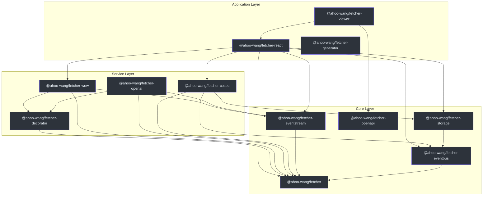
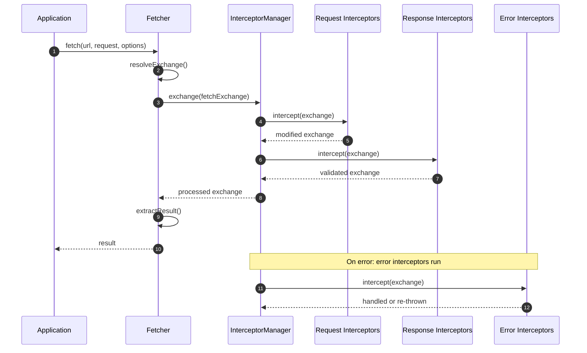
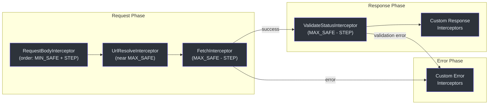

# API 概览

Fetcher 生态系统在多个包中暴露 API，每个包处理 HTTP 客户端生命周期中的特定关注点。本页提供所有公共 API 接口的摘要及快速导航链接。

## 包 API 摘要

| 包 | npm 名称 | 主要导出 | 描述 |
|---------|----------|-----------------|-------------|
| [Fetcher](./fetcher-client.md) | `@ahoo-wang/fetcher` | `Fetcher`、`NamedFetcher`、`FetcherRegistrar`、`InterceptorManager` | 带拦截器管道的核心 HTTP 客户端 |
| [Decorator](./decorators.md) | `@ahoo-wang/fetcher-decorator` | `@api`、`@get`、`@post`、`@put`、`@del`、`@patch`、`@path`、`@query`、`@header`、`@body` | 通过装饰器实现声明式 API 客户端 |
| [React Hooks](./react-hooks.md) | `@ahoo-wang/fetcher-react` | `useFetcher`、`useQuery`、`useExecutePromise`、`createQueryApiHooks` | 用于数据获取的 React Hooks |
| [EventStream](#eventstream) | `@ahoo-wang/fetcher-eventstream` | `toJsonServerSentEventStream`、`EventStreamResultExtractor` | SSE 和 LLM 流式支持 |
| [EventBus](#eventbus) | `@ahoo-wang/fetcher-eventbus` | `EventBus`、`TypedEventBus`、`ParallelTypedEventBus`、`SerialTypedEventBus` | 类型安全的事件总线 |
| [OpenAPI](#openapi) | `@ahoo-wang/fetcher-openapi` | OpenAPI 3.x 的 TypeScript 接口 | 规范类型定义 |
| [Storage](#storage) | `@ahoo-wang/fetcher-storage` | 存储抽象 | 浏览器存储封装 |
| [CoSec](#cosec) | `@ahoo-wang/fetcher-cosec` | 安全拦截器 | 认证与授权 |
| [Wow](#wow) | `@ahoo-wang/fetcher-wow` | CQRS 命令/查询客户端 | DDD + 事件溯源支持 |
| [Viewer](#viewer) | `@ahoo-wang/fetcher-viewer` | React + Ant Design 组件 | API 文档查看器 |
| [Generator](#generator) | `@ahoo-wang/fetcher-generator` | `fetcher-generator` CLI | OpenAPI 到 TypeScript 代码生成 |

## 导入模式

### 核心 Fetcher

```typescript
import { Fetcher, NamedFetcher, fetcherRegistrar } from '@ahoo-wang/fetcher';
import { HttpMethod, ResultExtractors } from '@ahoo-wang/fetcher';
import type { FetchRequest, FetchExchange, FetcherOptions } from '@ahoo-wang/fetcher';
```

### Decorator

```typescript
import 'reflect-metadata'; // Required before any decorator usage
import { api, get, post, put, del, patch } from '@ahoo-wang/fetcher-decorator';
import { path, query, header, body, request, attribute } from '@ahoo-wang/fetcher-decorator';
import { autoGeneratedError } from '@ahoo-wang/fetcher-decorator';
```

### React Hooks

```typescript
import { useFetcher, useFetcherQuery } from '@ahoo-wang/fetcher-react';
import { useQuery, useExecutePromise, usePromiseState } from '@ahoo-wang/fetcher-react';
import { createQueryApiHooks } from '@ahoo-wang/fetcher-react';
```

### EventStream（副作用导入）

```typescript
// Importing this module patches Response.prototype with eventStream() and jsonEventStream()
import '@ahoo-wang/fetcher-eventstream';
```

### EventBus

```typescript
import { EventBus, ParallelTypedEventBus, SerialTypedEventBus } from '@ahoo-wang/fetcher-eventbus';
import type { EventHandler } from '@ahoo-wang/fetcher-eventbus';
```

## 架构图



## 请求生命周期



## 拦截器管道详解



## 相关页面

- [Fetcher 客户端 API](./fetcher-client.md) -- 核心 HTTP 客户端类和选项
- [装饰器 API](./decorators.md) -- 声明式 API 服务定义
- [React Hooks API](./react-hooks.md) -- React 数据获取 Hooks
- [类型定义](./type-definitions.md) -- TypeScript 接口和类型
- [测试概览](../testing/index.md) -- 测试策略和工具
