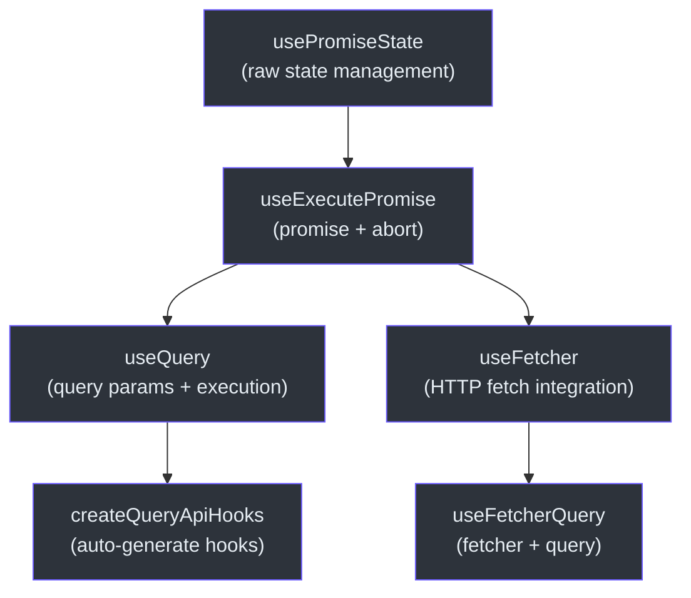
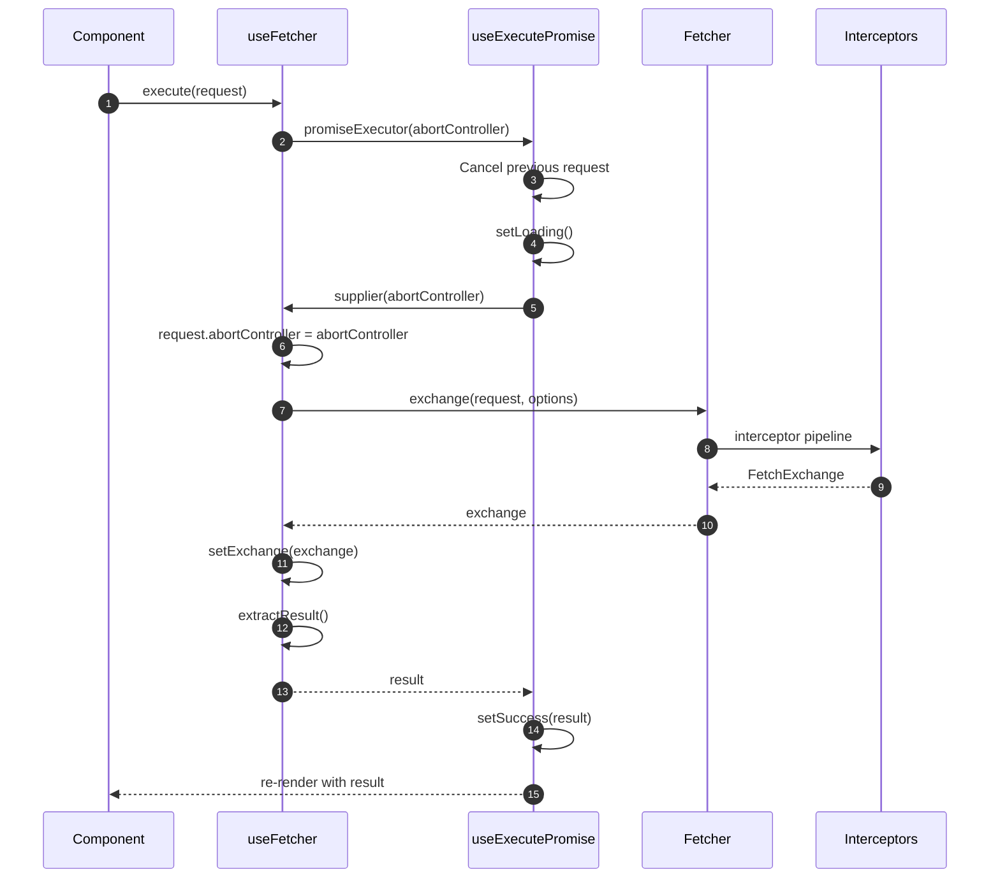
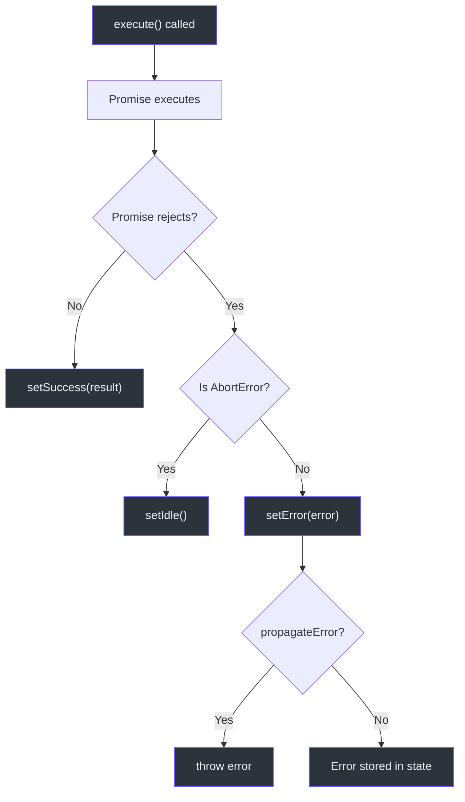

# React Hooks API

`@ahoo-wang/fetcher-react` 包提供了用于数据获取、查询管理和 Promise 状态处理的 React Hooks。所有 Hooks 都构建在核心 `@ahoo-wang/fetcher` 包之上，提供自动中止支持、竞态条件保护和全面的状态管理。

**源码:** [`packages/react/src/index.ts`](https://github.com/Ahoo-Wang/fetcher/blob/main/packages/react/src/index.ts)

## Hook 层级结构



## useFetcher

用于 HTTP 获取操作的主要 Hook。封装了 Fetcher 客户端，集成了 React 状态管理、自动中止和竞态条件保护。

**源码:** [`packages/react/src/fetcher/useFetcher.ts:162`](https://github.com/Ahoo-Wang/fetcher/blob/main/packages/react/src/fetcher/useFetcher.ts#L162)

### 签名

```typescript
function useFetcher<R, E = FetcherError>(
  options?: UseFetcherOptions<R, E>,
): UseFetcherReturn<R, E>
```

### UseFetcherOptions

扩展了 `UseExecutePromiseOptions` 和 `RequestOptions`：

| 属性 | 类型 | 默认值 | 描述 |
|----------|------|---------|-------------|
| `fetcher` | `string \| Fetcher` | `fetcherRegistrar.default` | Fetcher 实例或注册名称 |
| `resultExtractor` | `ResultExtractor<any>` | - | 从 exchange 中提取数据的方式 |
| `attributes` | `Record<string, any>` | - | 传递给拦截器的属性 |
| `propagateError` | `boolean` | `false` | 如果为 true，execute() 会抛出错误 |
| `onSuccess` | `(result: R) => void` | - | 获取成功时的回调 |
| `onError` | `(error: E) => void` | - | 获取失败时的回调 |
| `onAbort` | `() => void` | - | 请求被中止时的回调 |

### UseFetcherReturn

| 属性 | 类型 | 描述 |
|----------|------|-------------|
| `loading` | `boolean` | 是否正在进行获取操作 |
| `result` | `R \| undefined` | 获取到的数据 |
| `error` | `E \| undefined` | 获取失败时的错误 |
| `status` | `PromiseStatus` | 当前状态：`idle`、`loading`、`success`、`error` |
| `exchange` | `FetchExchange \| undefined` | 完整的 exchange 对象 |
| `execute` | `(request: FetchRequest) => Promise<void>` | 触发获取操作 |
| `reset` | `() => void` | 将状态重置为 idle |
| `abort` | `() => void` | 取消当前请求 |

### 示例

```tsx
import { useFetcher } from '@ahoo-wang/fetcher-react';
import { ResultExtractors } from '@ahoo-wang/fetcher';

function UserProfile({ userId }: { userId: string }) {
  const { loading, result, error, execute } = useFetcher<User>({
    resultExtractor: ResultExtractors.Json,
    onSuccess: (user) => console.log('Loaded:', user.name),
  });

  useEffect(() => {
    execute({ url: `/api/users/${userId}`, method: 'GET' });
  }, [userId]);

  if (loading) return <div>Loading...</div>;
  if (error) return <div>Error: {error.message}</div>;
  return <div>{result?.name}</div>;
}
```

## useFetcherQuery

将 `useFetcher` 与查询状态管理相结合，用于基于 POST 的查询。

**源码:** [`packages/react/src/fetcher/useFetcherQuery.ts:125`](https://github.com/Ahoo-Wang/fetcher/blob/main/packages/react/src/fetcher/useFetcherQuery.ts#L125)

### 签名

```typescript
function useFetcherQuery<Q, R, E = FetcherError>(
  options: UseFetcherQueryOptions<Q, R, E>,
): UseFetcherQueryReturn<Q, R, E>
```

### UseFetcherQueryOptions

扩展了 `UseFetcherOptions`、`QueryOptions` 和 `AutoExecuteCapable`：

| 属性 | 类型 | 默认值 | 描述 |
|----------|------|---------|-------------|
| `url` | `string` | *必填* | POST 请求的端点 URL |
| `initialQuery` | `Q` | - | 初始查询参数 |
| `query` | `Q` | - | 受控的查询参数 |
| `autoExecute` | `boolean` | `true` | 挂载时和查询变化时自动执行 |
| *（加上所有 UseFetcherOptions）* | | | |

### UseFetcherQueryReturn

扩展了 `UseFetcherReturn` 和 `UseQueryStateReturn`：

| 属性 | 类型 | 描述 |
|----------|------|-------------|
| `execute` | `() => Promise<void>` | 以当前查询作为 POST 请求体执行 |
| `getQuery` | `() => Q \| undefined` | 获取当前查询参数 |
| `setQuery` | `(query: Q) => void` | 更新查询（如果启用则触发自动执行） |
| *（加上除 execute 外的所有 UseFetcherReturn）* | | |

### 示例

```tsx
import { useFetcherQuery } from '@ahoo-wang/fetcher-react';

interface SearchQuery { keyword: string; limit: number }
interface SearchResult { items: Item[]; total: number }

function SearchComponent() {
  const { loading, result, error, setQuery } = useFetcherQuery<SearchQuery, SearchResult>({
    url: '/api/search',
    initialQuery: { keyword: '', limit: 10 },
  });

  return (
    <div>
      <input onChange={(e) => setQuery({ keyword: e.target.value, limit: 10 })} />
      {loading && <p>Searching...</p>}
      {result?.items.map(item => <div key={item.id}>{item.title}</div>)}
    </div>
  );
}
```

## useQuery

通用的基于查询的异步操作 Hook，与 HTTP 具体实现解耦。

**源码:** [`packages/react/src/core/useQuery.ts:105`](https://github.com/Ahoo-Wang/fetcher/blob/main/packages/react/src/core/useQuery.ts#L105)

### 签名

```typescript
function useQuery<Q, R, E = FetcherError>(
  options: UseQueryOptions<Q, R, E>,
): UseQueryReturn<Q, R, E>
```

### UseQueryOptions

| 属性 | 类型 | 默认值 | 描述 |
|----------|------|---------|-------------|
| `execute` | `(query, attributes?, abortController?) => Promise<R>` | *必填* | 查询执行函数 |
| `initialQuery` | `Q` | - | 初始查询参数 |
| `query` | `Q` | - | 受控的查询参数 |
| `autoExecute` | `boolean` | `true` | 挂载时和查询变化时自动执行 |
| `propagateError` | `boolean` | `false` | 如果为 true，execute() 会抛出错误 |
| `attributes` | `Record<string, any>` | - | 传递给 execute 的属性 |
| `onSuccess` | `(result: R) => void` | - | 成功回调 |
| `onError` | `(error: E) => void` | - | 错误回调 |
| `onAbort` | `() => void` | - | 中止回调 |

### UseQueryReturn

| 属性 | 类型 | 描述 |
|----------|------|-------------|
| `loading` | `boolean` | 是否正在进行查询 |
| `result` | `R \| undefined` | 查询结果 |
| `error` | `E \| undefined` | 查询失败时的错误 |
| `status` | `PromiseStatus` | 当前状态 |
| `execute` | `() => Promise<void>` | 使用当前查询执行 |
| `reset` | `() => void` | 将状态重置为 idle |
| `abort` | `() => void` | 取消当前查询 |
| `getQuery` | `() => Q \| undefined` | 获取当前查询 |
| `setQuery` | `(query: Q) => void` | 设置查询（触发自动执行） |

### 示例

```tsx
import { useQuery } from '@ahoo-wang/fetcher-react';

function UserComponent() {
  const { loading, result, error, setQuery } = useQuery<UserQuery, User>({
    initialQuery: { id: '1' },
    execute: async (query) => {
      const response = await fetch(`/api/users/${query.id}`);
      return response.json();
    },
  });

  return (
    <div>
      <button onClick={() => setQuery({ id: '2' })}>Load User 2</button>
      {result && <p>{result.name}</p>}
    </div>
  );
}
```

## useExecutePromise

用于管理任何带有中止支持的异步操作的底层 Hook。

**源码:** [`packages/react/src/core/useExecutePromise.ts:210`](https://github.com/Ahoo-Wang/fetcher/blob/main/packages/react/src/core/useExecutePromise.ts#L210)

### 签名

```typescript
function useExecutePromise<R, E = FetcherError>(
  options?: UseExecutePromiseOptions<R, E>,
): UseExecutePromiseReturn<R, E>
```

### PromiseSupplier

`execute` 接受的类型：

```typescript
type PromiseSupplier<R> = (abortController: AbortController) => Promise<R>;
```

### UseExecutePromiseReturn

| 属性 | 类型 | 描述 |
|----------|------|-------------|
| `loading` | `boolean` | 是否正在执行中 |
| `result` | `R \| undefined` | 解析后的值 |
| `error` | `E \| undefined` | 拒绝时的错误 |
| `status` | `PromiseStatus` | 当前状态 |
| `execute` | `(input: PromiseSupplier<R>) => Promise<void>` | 执行 Promise 供应器 |
| `reset` | `() => void` | 重置为 idle |
| `abort` | `() => void` | 取消当前执行 |

### 关键行为

- **自动取消**：再次调用 `execute` 会自动中止上一个请求
- **竞态条件保护**：使用请求 ID 防止过期更新
- **卸载安全**：防止在已卸载组件上更新状态
- **AbortError 处理**：AbortError 会将状态转换为 idle，而非 error

## usePromiseState

不包含执行逻辑的原始 Promise 状态管理。

**源码:** [`packages/react/src/core/usePromiseState.ts:119`](https://github.com/Ahoo-Wang/fetcher/blob/main/packages/react/src/core/usePromiseState.ts#L119)

### PromiseStatus 枚举

| 值 | 描述 |
|-------|-------------|
| `IDLE` | 没有操作在进行 |
| `LOADING` | 操作正在执行 |
| `SUCCESS` | 操作成功完成 |
| `ERROR` | 操作失败 |

### UsePromiseStateReturn

| 属性 | 类型 | 描述 |
|----------|------|-------------|
| `status` | `PromiseStatus` | 当前状态 |
| `loading` | `boolean` | 状态是否为 LOADING |
| `result` | `R \| undefined` | 结果值 |
| `error` | `E \| undefined` | 错误值 |
| `setLoading` | `() => void` | 转换为 LOADING |
| `setSuccess` | `(result: R) => Promise<void>` | 转换为 SUCCESS |
| `setError` | `(error: E) => Promise<void>` | 转换为 ERROR |
| `setIdle` | `() => void` | 转换为 IDLE |

## createQueryApiHooks

工厂函数，从基于装饰器的 API 类自动生成 React Hooks。API 类中的每个方法都会生成对应的 `use<MethodName>` Hook。

**源码:** [`packages/react/src/api/createQueryApiHooks.ts:174`](https://github.com/Ahoo-Wang/fetcher/blob/main/packages/react/src/api/createQueryApiHooks.ts#L174)

### 签名

```typescript
function createQueryApiHooks<API, E = FetcherError>(
  options: { api: API },
): QueryAPIHooks<API, E>
```

### 示例

```typescript
import { createQueryApiHooks } from '@ahoo-wang/fetcher-react';

// 使用装饰器定义 API
@api('/users')
class UserApi {
  @get('')
  getUsers(query: UserListQuery, attributes?: Record<string, any>): Promise<User[]> {
    throw autoGeneratedError(query, attributes);
  }

  @get('/{id}')
  getUser(query: { id: string }): Promise<User> {
    throw autoGeneratedError(query);
  }
}

const userHooks = createQueryApiHooks({ api: new UserApi() });

// 在组件中使用：
function UserList() {
  const { loading, result, setQuery } = userHooks.useGetUsers({
    initialQuery: { page: 1, limit: 10 },
    autoExecute: true,
  });
  // ...
}
```

## 请求生命周期



## 错误处理策略



## 相关页面

- [Fetcher 客户端 API](./fetcher-client.md) -- 核心 Fetcher 类和选项
- [装饰器 API](./decorators.md) -- 与 `createQueryApiHooks` 配合使用
- [类型定义](./type-definitions.md) -- 所有 TypeScript 接口
- [测试：浏览器测试](../testing/browser-testing.md) -- 测试 React Hooks
