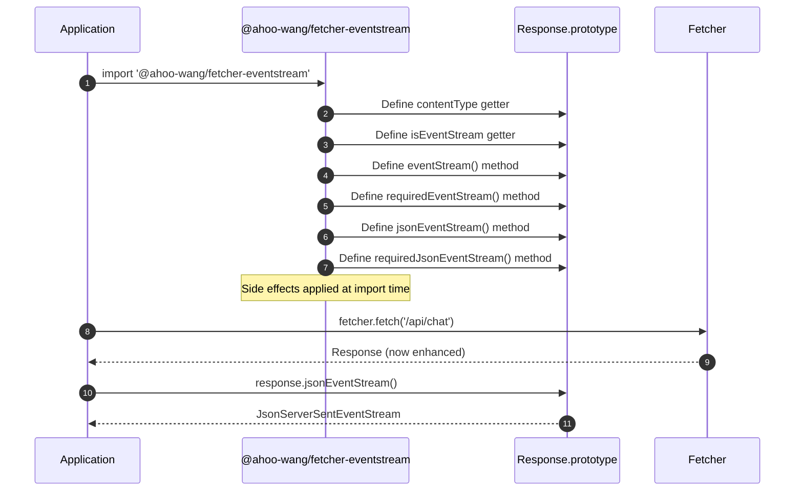
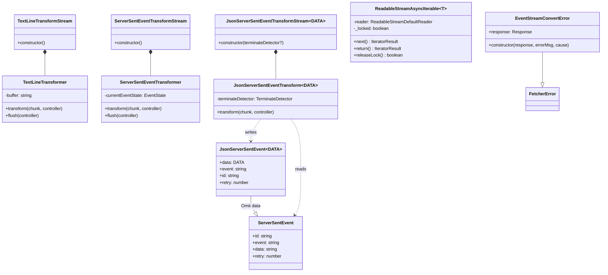
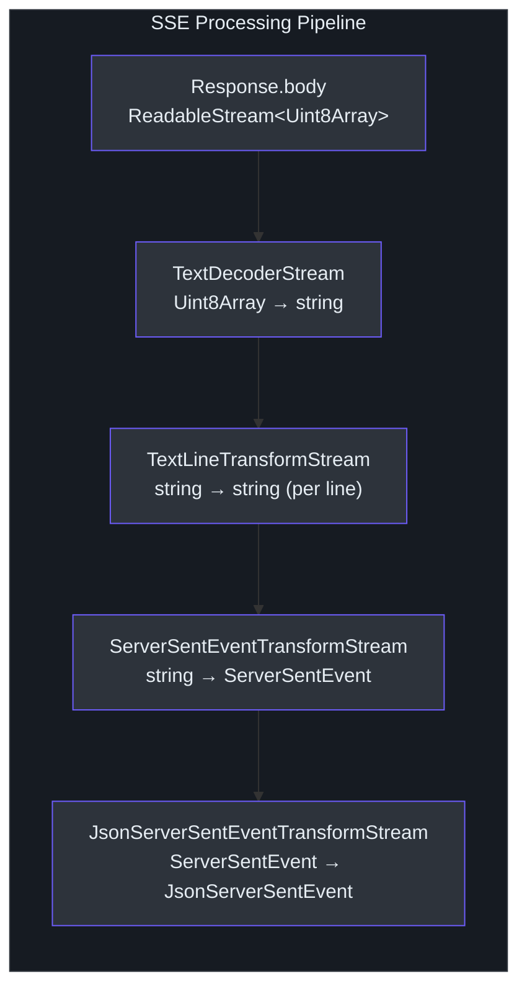
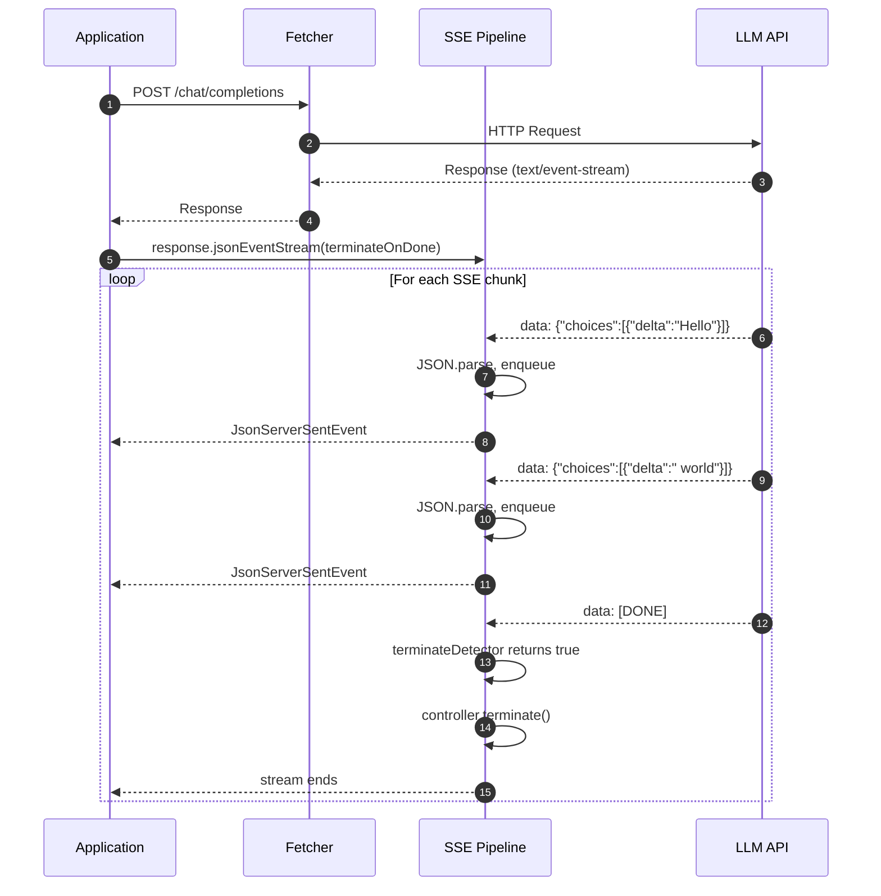

# EventStream 与 SSE

`@ahoo-wang/fetcher-eventstream` 包为 Fetcher 生态系统提供 Server-Sent Event（SSE）处理能力。它采用**副作用模块模式** -- 只需导入该包，即可为 `Response.prototype` 扩展流消费方法，无需显式注册。

Source: [packages/eventstream/src/responses.ts](https://github.com/Ahoo-Wang/fetcher/blob/main/packages/eventstream/src/responses.ts)

## 副作用模块模式

当导入 `@ahoo-wang/fetcher-eventstream` 时，它会执行代码有条件地扩展全局 `Response` 原型，添加新的属性和方法。每个扩展都通过 `hasOwnProperty` 进行守卫检查，以避免覆盖已有实现。



### 添加到 Response.prototype 的属性和方法

| 成员 | 类型 | 说明 |
|---|---|---|
| `contentType` | getter: `string \| null` | 返回 `Content-Type` 请求头的值 |
| `isEventStream` | getter: `boolean` | 当 Content-Type 包含 `text/event-stream` 时为 `true` |
| `eventStream()` | method: `ServerSentEventStream \| null` | 将响应体转换为 SSE 流，非事件流时返回 `null` |
| `requiredEventStream()` | method: `ServerSentEventStream` | 类似 `eventStream()` 但非事件流时抛出异常 |
| `jsonEventStream<DATA>()` | method: `JsonServerSentEventStream<DATA> \| null` | 带已解析 JSON 数据的 SSE 流 |
| `requiredJsonEventStream<DATA>()` | method: `JsonServerSentEventStream<DATA>` | 类似 `jsonEventStream()` 但不可用时抛出异常 |

Source: [packages/eventstream/src/responses.ts:26-99](https://github.com/Ahoo-Wang/fetcher/blob/main/packages/eventstream/src/responses.ts#L26-L99)

实现中使用属性守卫来避免冲突：

```typescript
// [packages/eventstream/src/responses.ts:102-120]
if (typeof Response !== 'undefined') {
  const CONTENT_TYPE_PROPERTY_NAME = 'contentType';
  if (
    !Object.prototype.hasOwnProperty.call(
      Response.prototype,
      CONTENT_TYPE_PROPERTY_NAME,
    )
  ) {
    Object.defineProperty(Response.prototype, CONTENT_TYPE_PROPERTY_NAME, {
      get() {
        return this.headers.get(CONTENT_TYPE_HEADER);
      },
      configurable: true,
    });
  }
  // ... similar guards for isEventStream, eventStream, etc.
}
```

Source: [packages/eventstream/src/responses.ts:102-120](https://github.com/Ahoo-Wang/fetcher/blob/main/packages/eventstream/src/responses.ts#L102-L120)

## 类结构



## 流处理管道

将原始 HTTP 响应转换为类型化 JSON 事件需要经过一个三阶段的 `pipeThrough` 链。



### 阶段 1：TextDecoderStream（原生）

将原始 `Uint8Array` 块转换为 UTF-8 字符串。这是浏览器/Node.js 的内置 API。

### 阶段 2：TextLineTransformStream

累积文本块并按 `\n` 分割，将每一行作为独立的块发出。在块边界处的不完整行会被缓冲，直到下一块到来补全。

```typescript
// [packages/eventstream/src/textLineTransformStream.ts:41-65]
export class TextLineTransformer implements Transformer<string, string> {
  private buffer = '';
  transform(chunk: string, controller: TransformStreamDefaultController<string>) {
    try {
      this.buffer += chunk;
      const lines = this.buffer.split('\n');
      this.buffer = lines.pop() || '';
      for (const line of lines) {
        controller.enqueue(line);
      }
    } catch (error) {
      controller.error(error);
    }
  }
  flush(controller: TransformStreamDefaultController<string>) {
    try {
      if (this.buffer) { controller.enqueue(this.buffer); }
    } catch (error) {
      controller.error(error);
    }
  }
}
```

Source: [packages/eventstream/src/textLineTransformStream.ts:41-65](https://github.com/Ahoo-Wang/fetcher/blob/main/packages/eventstream/src/textLineTransformStream.ts#L41-L65)

### 阶段 3：ServerSentEventTransformStream

根据 W3C SSE 规范将单行解析为结构化的 `ServerSentEvent` 对象。处理以下情况：

- 空行作为事件分隔符（触发出事件）
- 注释行（以 `:` 开头）-- 忽略
- 字段解析：`event`、`data`、`id`、`retry`
- 多行数据字段（以 `\n` 连接）
- 未指定事件类型时使用默认值 `"message"`

```typescript
// [packages/eventstream/src/serverSentEventTransformStream.ts:23-32]
export interface ServerSentEvent {
  id?: string;
  event: string;
  data: string;
  retry?: number;
}
```

Source: [packages/eventstream/src/serverSentEventTransformStream.ts:23-32](https://github.com/Ahoo-Wang/fetcher/blob/main/packages/eventstream/src/serverSentEventTransformStream.ts#L23-L32)

核心解析逻辑：

```typescript
// [packages/eventstream/src/serverSentEventTransformStream.ts:159-222]
transform(chunk: string, controller: TransformStreamDefaultController<ServerSentEvent>) {
  const currentEvent = this.currentEventState;
  try {
    if (chunk.trim() === '') {
      // Empty line -- emit accumulated event
      if (currentEvent.data.length > 0) {
        controller.enqueue({
          event: currentEvent.event || DEFAULT_EVENT_TYPE,
          data: currentEvent.data.join('\n'),
          id: currentEvent.id || '',
          retry: currentEvent.retry,
        } as ServerSentEvent);
        currentEvent.event = DEFAULT_EVENT_TYPE;
        currentEvent.data = [];
      }
      return;
    }
    if (chunk.startsWith(':')) { return; } // comment
    // Parse field: value
    const colonIndex = chunk.indexOf(':');
    let field: string;
    let value: string;
    if (colonIndex === -1) {
      field = chunk.toLowerCase();
      value = '';
    } else {
      field = chunk.substring(0, colonIndex).toLowerCase();
      value = chunk.substring(colonIndex + 1);
      if (value.startsWith(' ')) { value = value.substring(1); }
    }
    field = field.trim();
    value = value.trim();
    processFieldInternal(field, value, currentEvent);
  } catch (error) {
    controller.error(error);
    this.resetEventState();
  }
}
```

Source: [packages/eventstream/src/serverSentEventTransformStream.ts:159-222](https://github.com/Ahoo-Wang/fetcher/blob/main/packages/eventstream/src/serverSentEventTransformStream.ts#L159-L222)

### 阶段 4：JsonServerSentEventTransformStream

可选的第四阶段，将每个 `ServerSentEvent.data` 字符串解析为 JSON，并支持自动终止流。

```typescript
// [packages/eventstream/src/jsonServerSentEventTransformStream.ts:44-50]
export interface JsonServerSentEvent<DATA> extends Omit<ServerSentEvent, 'data'> {
  data: DATA;
}
```

Source: [packages/eventstream/src/jsonServerSentEventTransformStream.ts:44-50](https://github.com/Ahoo-Wang/fetcher/blob/main/packages/eventstream/src/jsonServerSentEventTransformStream.ts#L44-L50)

转换器在解析前会检查 `TerminateDetector` 函数：

```typescript
// [packages/eventstream/src/jsonServerSentEventTransformStream.ts:95-118]
transform(
  chunk: ServerSentEvent,
  controller: TransformStreamDefaultController<JsonServerSentEvent<DATA>>,
) {
  try {
    if (this.terminateDetector?.(chunk)) {
      controller.terminate();
      return;
    }
    const json = JSON.parse(chunk.data) as DATA;
    controller.enqueue({
      data: json,
      event: chunk.event,
      id: chunk.id,
      retry: chunk.retry,
    });
  } catch (error) {
    controller.error(error);
  }
}
```

Source: [packages/eventstream/src/jsonServerSentEventTransformStream.ts:95-118](https://github.com/Ahoo-Wang/fetcher/blob/main/packages/eventstream/src/jsonServerSentEventTransformStream.ts#L95-L118)

## toServerSentEventStream 函数

`toServerSentEventStream()` 函数将阶段 1-3 组合为一次调用：

```typescript
// [packages/eventstream/src/eventStreamConverter.ts:127-138]
export function toServerSentEventStream(response: Response): ServerSentEventStream {
  if (!response.body) {
    throw new EventStreamConvertError(response, 'Response body is null');
  }
  return response.body
    .pipeThrough(new TextDecoderStream('utf-8'))
    .pipeThrough(new TextLineTransformStream())
    .pipeThrough(new ServerSentEventTransformStream());
}
```

Source: [packages/eventstream/src/eventStreamConverter.ts:127-138](https://github.com/Ahoo-Wang/fetcher/blob/main/packages/eventstream/src/eventStreamConverter.ts#L127-L138)

`toJsonServerSentEventStream()` 函数添加阶段 4：

```typescript
// [packages/eventstream/src/jsonServerSentEventTransformStream.ts:200-207]
export function toJsonServerSentEventStream<DATA>(
  serverSentEventStream: ServerSentEventStream,
  terminateDetector?: TerminateDetector,
): JsonServerSentEventStream<DATA> {
  return serverSentEventStream.pipeThrough(
    new JsonServerSentEventTransformStream<DATA>(terminateDetector),
  );
}
```

Source: [packages/eventstream/src/jsonServerSentEventTransformStream.ts:200-207](https://github.com/Ahoo-Wang/fetcher/blob/main/packages/eventstream/src/jsonServerSentEventTransformStream.ts#L200-L207)

## 异步迭代支持

`ReadableStreamAsyncIterable` 将 `ReadableStream` 封装为 `AsyncIterable`，支持 `for await...of` 消费。它管理流锁定，并通过 `return()` 和 `throw()` 提供安全的清理机制。

```typescript
// [packages/eventstream/src/readableStreamAsyncIterable.ts:54-148]
export class ReadableStreamAsyncIterable<T> implements AsyncIterable<T> {
  private readonly reader: ReadableStreamDefaultReader<T>;
  private _locked: boolean = true;

  constructor(private readonly stream: ReadableStream<T>) {
    this.reader = stream.getReader();
  }

  [Symbol.asyncIterator]() { return this; }

  async next(): Promise<IteratorResult<T>> {
    try {
      const { done, value } = await this.reader.read();
      if (done) {
        this.releaseLock();
        return { done: true, value: undefined };
      }
      return { done: false, value };
    } catch (error) {
      this.releaseLock();
      throw error;
    }
  }
  // ... return() and throw() for cleanup
}
```

Source: [packages/eventstream/src/readableStreamAsyncIterable.ts:54-148](https://github.com/Ahoo-Wang/fetcher/blob/main/packages/eventstream/src/readableStreamAsyncIterable.ts#L54-L148)

## 与 Fetcher 的集成

### 结果提取器

eventstream 包提供了两个 `ResultExtractor` 实现，可直接与 Fetcher 配合使用：

| 提取器 | 返回类型 | 使用场景 |
|---|---|---|
| `EventStreamResultExtractor` | `ServerSentEventStream` | 原始 SSE 事件（字符串数据） |
| `JsonEventStreamResultExtractor` | `JsonServerSentEventStream<any>` | 已解析的 JSON 事件 |

```typescript
// [packages/eventstream/src/eventStreamResultExtractor.ts:38-42]
export const EventStreamResultExtractor: ResultExtractor<ServerSentEventStream> =
  (exchange: FetchExchange) => {
    return exchange.requiredResponse.requiredEventStream();
  };

// [packages/eventstream/src/eventStreamResultExtractor.ts:65-69]
export const JsonEventStreamResultExtractor: ResultExtractor<JsonServerSentEventStream<any>> =
  (exchange: FetchExchange) => {
    return exchange.requiredResponse.requiredJsonEventStream();
  };
```

Source: [packages/eventstream/src/eventStreamResultExtractor.ts:38-69](https://github.com/Ahoo-Wang/fetcher/blob/main/packages/eventstream/src/eventStreamResultExtractor.ts#L38-L69)

### 与 Fetcher 配合使用

```typescript
import { fetcher, ResultExtractors } from '@ahoo-wang/fetcher';
import '@ahoo-wang/fetcher-eventstream'; // side-effect import
import { JsonEventStreamResultExtractor } from '@ahoo-wang/fetcher-eventstream';

// Using result extractor
const stream = await fetcher.fetch('/api/chat/completions', {
  method: 'POST',
  body: { prompt: 'Hello' },
}, {
  resultExtractor: JsonEventStreamResultExtractor,
});

for await (const event of stream) {
  console.log(event.data); // typed JSON
}

// Or manually from Response
const response = await fetcher.get('/api/events');
const eventStream = response.requiredJsonEventStream<MyData>(
  (event) => event.data === '[DONE]',
);
```

## LLM 流式集成

`TerminateDetector` 模式专为 LLM 流式 API（OpenAI 等）设计，这些 API 通过发送 `[DONE]` 哨兵事件来标识流的结束。



### 与 OpenAI 包的关联

`@ahoo-wang/fetcher-openai` 包依赖 `@ahoo-wang/fetcher-eventstream`，使用 SSE 流式基础设施来消费 OpenAI 兼容的聊天补全流。它导入 eventstream 副作用模块以扩展 `Response.prototype`，并通过 `JsonEventStreamResultExtractor` 或手动 `jsonEventStream()` 调用来消费类型化的流式响应。

## 错误处理

### EventStreamConvertError

当响应无法转换为事件流时抛出（通常是因为响应体为 null）。

```typescript
// [packages/eventstream/src/eventStreamConverter.ts:54-73]
export class EventStreamConvertError extends FetcherError {
  constructor(
    public readonly response: Response,
    errorMsg?: string,
    cause?: Error | any,
  ) {
    super(errorMsg, cause);
    this.name = 'EventStreamConvertError';
    Object.setPrototypeOf(this, EventStreamConvertError.prototype);
  }
}
```

Source: [packages/eventstream/src/eventStreamConverter.ts:54-73](https://github.com/Ahoo-Wang/fetcher/blob/main/packages/eventstream/src/eventStreamConverter.ts#L54-L73)

`requiredEventStream()` 和 `requiredJsonEventStream()` 方法在响应 Content-Type 不是 `text/event-stream` 时抛出 `EventStreamConvertError`：

```typescript
// [packages/eventstream/src/responses.ts:176-186]
Response.prototype.requiredEventStream = function () {
  const eventStream = this.eventStream();
  if (!eventStream) {
    throw new EventStreamConvertError(
      this,
      `Event stream is not available. Response content-type: [${this.contentType}]`,
    );
  }
  return eventStream;
};
```

Source: [packages/eventstream/src/responses.ts:176-186](https://github.com/Ahoo-Wang/fetcher/blob/main/packages/eventstream/src/responses.ts#L176-L186)

## 交叉引用

- [架构总览](/architecture/) -- eventstream 包的系统级视图
- [Fetcher 核心](/architecture/fetcher-core) -- `Fetcher`、`FetchExchange`、`ResultExtractor` 模式
- [拦截器系统](/architecture/interceptors) -- 结果提取器如何与拦截器管道交互
