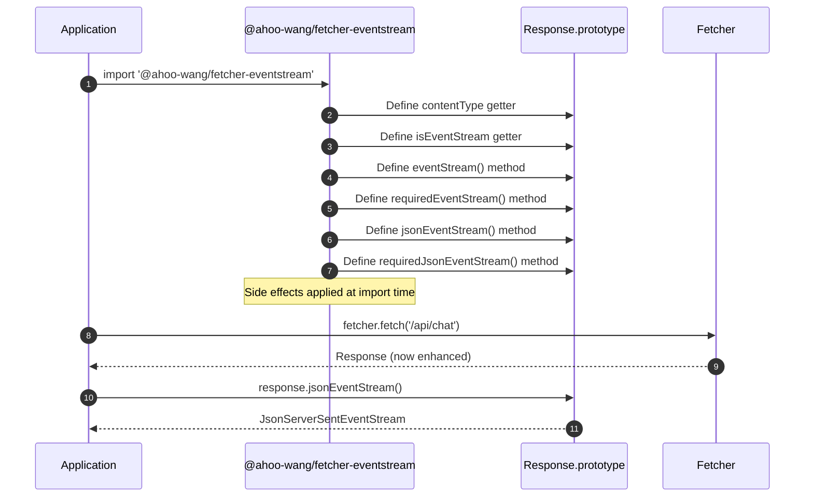
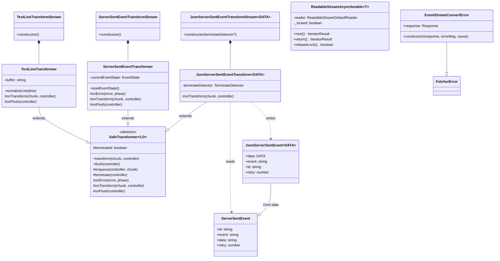
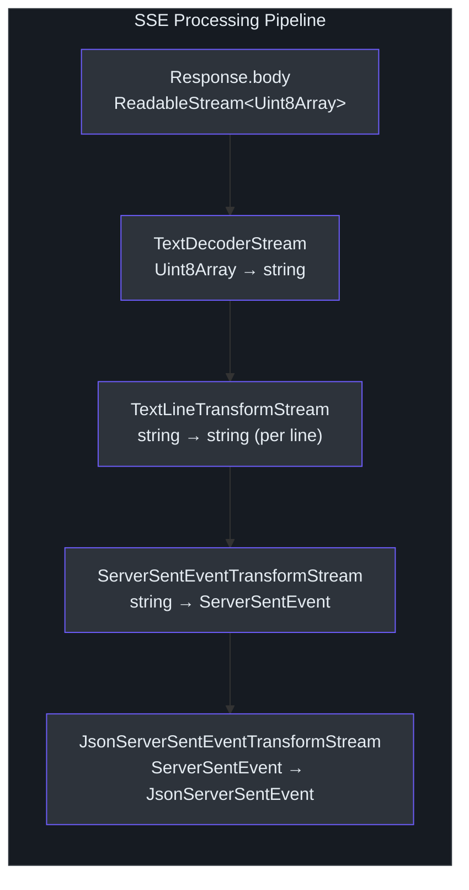
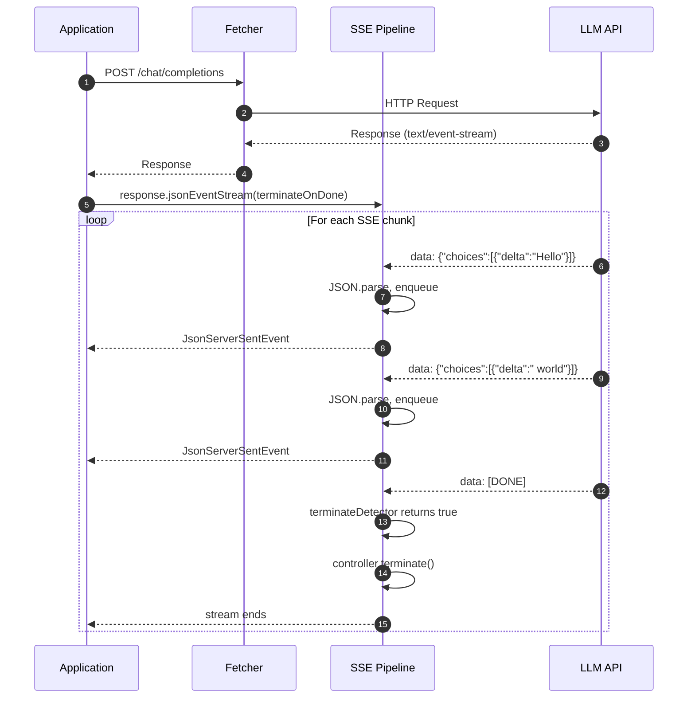

# EventStream 与 SSE

`@ahoo-wang/fetcher-eventstream` 包为 Fetcher 生态系统提供 Server-Sent Event（SSE）处理能力。它采用**副作用模块模式** -- 只需导入该包，即可为 `Response.prototype` 扩展流消费方法，无需显式注册。

Source: [packages/eventstream/src/responses.ts](https://github.com/Ahoo-Wang/fetcher/blob/main/packages/eventstream/src/responses.ts)

## 副作用模块模式

当导入 `@ahoo-wang/fetcher-eventstream` 时，它会执行代码有条件地扩展全局 `Response` 原型，添加新的属性和方法。每个扩展都通过 `hasOwnProperty` 进行守卫检查，以避免覆盖已有实现。


```mermaid
sequenceDiagram
autonumber

  participant App as Application
  participant ES as @ahoo-wang/fetcher-eventstream
  participant RP as Response.prototype
  participant Fetcher as Fetcher

  App->>ES: import '@ahoo-wang/fetcher-eventstream'
  ES->>RP: Define contentType getter
  ES->>RP: Define isEventStream getter
  ES->>RP: Define eventStream() method
  ES->>RP: Define requiredEventStream() method
  ES->>RP: Define jsonEventStream() method
  ES->>RP: Define requiredJsonEventStream() method
  Note over ES: Side effects applied at import time
  App->>Fetcher: fetcher.fetch('/api/chat')
  Fetcher-->>App: Response (now enhanced)
  App->>RP: response.jsonEventStream()
  RP-->>App: JsonServerSentEventStream
```

### 添加到 Response.prototype 的属性和方法

| 成员 | 类型 | 说明 |
|---|---|---|
| `contentType` | getter: `string \| null` | 返回 `Content-Type` 请求头的值 |
| `isEventStream` | getter: `boolean` | 当 Content-Type 包含 `text/event-stream` 时为 `true` |
| `eventStream()` | method: `ServerSentEventStream \| null` | 将响应体转换为 SSE 流，非事件流时返回 `null` |
| `requiredEventStream()` | method: `ServerSentEventStream` | 类似 `eventStream()` 但非事件流时抛出异常 |
| `jsonEventStream<DATA>()` | method: `JsonServerSentEventStream<DATA> \| null` | 带已解析 JSON 数据的 SSE 流 |
| `requiredJsonEventStream<DATA>()` | method: `JsonServerSentEventStream<DATA>` | 类似 `jsonEventStream()` 但不可用时抛出异常 |

Source: [packages/eventstream/src/responses.ts:26-99](https://github.com/Ahoo-Wang/fetcher/blob/main/packages/eventstream/src/responses.ts#L26-L99)

实现中使用属性守卫来避免冲突：

```typescript
// [packages/eventstream/src/responses.ts:102-120]
if (typeof Response !== 'undefined') {
  const CONTENT_TYPE_PROPERTY_NAME = 'contentType';
  if (
    !Object.prototype.hasOwnProperty.call(
      Response.prototype,
      CONTENT_TYPE_PROPERTY_NAME,
    )
  ) {
    Object.defineProperty(Response.prototype, CONTENT_TYPE_PROPERTY_NAME, {
      get() {
        return this.headers.get(CONTENT_TYPE_HEADER);
      },
      configurable: true,
    });
  }
  // ... similar guards for isEventStream, eventStream, etc.
}
```

Source: [packages/eventstream/src/responses.ts:102-120](https://github.com/Ahoo-Wang/fetcher/blob/main/packages/eventstream/src/responses.ts#L102-L120)

## 类结构


```mermaid
classDiagram
  class ServerSentEvent {
    +id: string
    +event: string
    +data: string
    +retry: number
  }

  class JsonServerSentEvent~DATA~ {
    +data: DATA
    +event: string
    +id: string
    +retry: number
  }

  class TextLineTransformStream {
    +constructor()
  }

  class SafeTransformer~I,O~ {
    <<abstract>>
    #terminated: boolean
    +transform(chunk, controller)
    +flush(controller)
    #enqueue(controller, chunk)
    #terminate(controller)
    #onError(error, phase)
    #onTransform(chunk, controller)*
    #onFlush(controller)
  }

  class TextLineTransformer {
    -buffer: string
    -normalizeLine(line)
    #onTransform(chunk, controller)
    #onFlush(controller)
  }

  class ServerSentEventTransformStream {
    +constructor()
  }

  class ServerSentEventTransformer {
    -currentEventState: EventState
    -resetEventState()
    #onError(error, phase)
    #onTransform(chunk, controller)
    #onFlush(controller)
  }

  class JsonServerSentEventTransformStream~DATA~ {
    +constructor(terminateDetector?)
  }

  class JsonServerSentEventTransform~DATA~ {
    -terminateDetector: TerminateDetector
    #onTransform(chunk, controller)
  }

  class ReadableStreamAsyncIterable~T~ {
    -reader: ReadableStreamDefaultReader
    -_locked: boolean
    +next() IteratorResult
    +return() IteratorResult
    +releaseLock() boolean
  }

  class EventStreamConvertError {
    +response: Response
    +constructor(response, errorMsg, cause)
  }

  JsonServerSentEvent --|> ServerSentEvent : Omit data
  TextLineTransformer --|> SafeTransformer : extends
  ServerSentEventTransformer --|> SafeTransformer : extends
  JsonServerSentEventTransform --|> SafeTransformer : extends
  TextLineTransformStream *-- TextLineTransformer
  ServerSentEventTransformStream *-- ServerSentEventTransformer
  JsonServerSentEventTransformStream *-- JsonServerSentEventTransform
  EventStreamConvertError --|> FetcherError
  JsonServerSentEventTransform ..> ServerSentEvent : reads
  JsonServerSentEventTransform ..> JsonServerSentEvent : writes
```

## 流处理管道

将原始 HTTP 响应转换为类型化 JSON 事件需要经过一条 `pipeThrough` 链：三个阶段将原始字节解析为 `ServerSentEvent`，外加一个可选的第四阶段将事件数据解析为 JSON。


```mermaid
graph LR
  subgraph Pipeline["SSE Processing Pipeline"]
    style Pipeline fill:#161b22,stroke:#30363d,color:#e6edf3
    Response["Response.body<br>ReadableStream&lt;Uint8Array&gt;"]
    TDS["TextDecoderStream<br>Uint8Array → string"]
    TLS["TextLineTransformStream<br>string → string (per line)"]
    SSE["ServerSentEventTransformStream<br>string → ServerSentEvent"]
    JSON["JsonServerSentEventTransformStream<br>ServerSentEvent → JsonServerSentEvent"]
  end

  Response --> TDS --> TLS --> SSE --> JSON

  style Response fill:#2d333b,stroke:#6d5dfc,color:#e6edf3
  style TDS fill:#2d333b,stroke:#6d5dfc,color:#e6edf3
  style TLS fill:#2d333b,stroke:#6d5dfc,color:#e6edf3
  style SSE fill:#2d333b,stroke:#6d5dfc,color:#e6edf3
  style JSON fill:#2d333b,stroke:#6d5dfc,color:#e6edf3
```

### 阶段 1：TextDecoderStream（原生）

将原始 `Uint8Array` 块转换为 UTF-8 字符串。这是浏览器/Node.js 的内置 API。

### 阶段 2：TextLineTransformStream

累积文本块并按 `\n` 分割，将每一行作为独立的块发出。在块边界处的不完整行会被缓冲，直到下一块到来补全。

```typescript
// [packages/eventstream/src/textLineTransformStream.ts:23-52]
export class TextLineTransformer extends SafeTransformer<string, string> {
  private buffer = '';

  private normalizeLine(line: string): string {
    return line.endsWith('\r') ? line.slice(0, -1) : line;
  }

  protected onTransform(
    chunk: string,
    controller: TransformStreamDefaultController<string>,
  ): void {
    this.buffer += chunk;
    const lines = this.buffer.split('\n');
    this.buffer = lines.pop() || '';

    for (const line of lines) {
      this.enqueue(controller, this.normalizeLine(line));
    }
  }

  protected onFlush(
    controller: TransformStreamDefaultController<string>,
  ): void {
    const line = this.normalizeLine(this.buffer);
    // Only send when normalized buffer is not empty.
    if (line) {
      this.enqueue(controller, line);
    }
  }
}
```

Source: [packages/eventstream/src/textLineTransformStream.ts:23-52](https://github.com/Ahoo-Wang/fetcher/blob/main/packages/eventstream/src/textLineTransformStream.ts#L23-L52)

### 阶段 3：ServerSentEventTransformStream

根据 W3C SSE 规范将单行解析为结构化的 `ServerSentEvent` 对象。处理以下情况：

- 空行作为事件分隔符（触发出事件）
- 注释行（以 `:` 开头）-- 忽略
- 字段解析：`event`、`data`、`id`、`retry`
- 多行数据字段（以 `\n` 连接）
- 未指定事件类型时使用默认值 `"message"`

```typescript
// [packages/eventstream/src/serverSentEventTransformStream.ts:21-30]
export interface ServerSentEvent {
  id?: string;
  event: string;
  data: string;
  retry?: number;
}
```

Source: [packages/eventstream/src/serverSentEventTransformStream.ts:21-30](https://github.com/Ahoo-Wang/fetcher/blob/main/packages/eventstream/src/serverSentEventTransformStream.ts#L21-L30)

核心解析逻辑位于 `onTransform` 方法中，由继承自 `SafeTransformer` 的 `transform()` 方法调用。错误处理（try/catch、终止以及通过 `safeError` 转发）均继承自 `SafeTransformer`；发生错误时，下方的 `onError` 重写会重置事件状态：

```typescript
// [packages/eventstream/src/serverSentEventTransformStream.ts:99-108]
private resetEventState() {
  this.currentEventState.event = DEFAULT_EVENT_TYPE;
  this.currentEventState.id = undefined;
  this.currentEventState.retry = undefined;
  this.currentEventState.data = [];
}

protected override onError(_error: unknown, _phase: TransformerPhase): void {
  this.resetEventState();
}
```

```typescript
// [packages/eventstream/src/serverSentEventTransformStream.ts:110-155]
protected onTransform(
  chunk: string,
  controller: TransformStreamDefaultController<ServerSentEvent>,
): void {
  const currentEvent = this.currentEventState;

  // Skip empty lines (event separator)
  if (chunk.trim() === '') {
    if (currentEvent.data.length > 0) {
      this.enqueue(controller, {
        event: currentEvent.event || DEFAULT_EVENT_TYPE,
        data: currentEvent.data.join('\n'),
        id: currentEvent.id || '',
        retry: currentEvent.retry,
      } as ServerSentEvent);

      currentEvent.event = DEFAULT_EVENT_TYPE;
      currentEvent.data = [];
    }
    return;
  }

  // Ignore comment lines (starting with colon)
  if (chunk.startsWith(':')) {
    return;
  }

  // Parse fields
  const colonIndex = chunk.indexOf(':');
  let field: string;
  let value: string;

  if (colonIndex === -1) {
    field = chunk.toLowerCase();
    value = '';
  } else {
    field = chunk.substring(0, colonIndex).toLowerCase();
    value = chunk.substring(colonIndex + 1);
    if (value.startsWith(' ')) {
      value = value.substring(1);
    }
  }

  processFieldInternal(field, value, currentEvent);
}
```

Source: [packages/eventstream/src/serverSentEventTransformStream.ts:110-155](https://github.com/Ahoo-Wang/fetcher/blob/main/packages/eventstream/src/serverSentEventTransformStream.ts#L110-L155)

### 阶段 4：JsonServerSentEventTransformStream

可选的第四阶段，将每个 `ServerSentEvent.data` 字符串解析为 JSON，并支持自动终止流。

```typescript
// [packages/eventstream/src/jsonServerSentEventTransformStream.ts:31-37]
export interface JsonServerSentEvent<DATA> extends Omit<ServerSentEvent, 'data'> {
  data: DATA;
}
```

Source: [packages/eventstream/src/jsonServerSentEventTransformStream.ts:31-37](https://github.com/Ahoo-Wang/fetcher/blob/main/packages/eventstream/src/jsonServerSentEventTransformStream.ts#L31-L37)

`JsonServerSentEventTransform` 类 `extends SafeTransformer`，因此错误处理和终止守卫都是继承的。`onTransform` 方法在解析前会检查 `TerminateDetector` 函数，并使用 `this.terminate()` / `this.enqueue()` 而非原始 controller 方法：

```typescript
// [packages/eventstream/src/jsonServerSentEventTransformStream.ts:47-73]
export class JsonServerSentEventTransform<DATA> extends SafeTransformer<
  ServerSentEvent,
  JsonServerSentEvent<DATA>
> {
  constructor(private readonly terminateDetector?: TerminateDetector) {
    super();
  }

  protected onTransform(
    chunk: ServerSentEvent,
    controller: TransformStreamDefaultController<JsonServerSentEvent<DATA>>,
  ): void {
    // Check if this is a terminate event
    if (this.terminateDetector?.(chunk)) {
      this.terminate(controller);
      return;
    }

    const json = JSON.parse(chunk.data) as DATA;
    this.enqueue(controller, {
      data: json,
      event: chunk.event,
      id: chunk.id,
      retry: chunk.retry,
    });
  }
}
```

Source: [packages/eventstream/src/jsonServerSentEventTransformStream.ts:47-73](https://github.com/Ahoo-Wang/fetcher/blob/main/packages/eventstream/src/jsonServerSentEventTransformStream.ts#L47-L73)

## toServerSentEventStream 函数

`toServerSentEventStream()` 函数将阶段 1-3 组合为一次调用：

```typescript
// [packages/eventstream/src/eventStreamConverter.ts:127-138]
export function toServerSentEventStream(response: Response): ServerSentEventStream {
  if (!response.body) {
    throw new EventStreamConvertError(response, 'Response body is null');
  }
  return response.body
    .pipeThrough(new TextDecoderStream('utf-8'))
    .pipeThrough(new TextLineTransformStream())
    .pipeThrough(new ServerSentEventTransformStream());
}
```

Source: [packages/eventstream/src/eventStreamConverter.ts:127-138](https://github.com/Ahoo-Wang/fetcher/blob/main/packages/eventstream/src/eventStreamConverter.ts#L127-L138)

`toJsonServerSentEventStream()` 函数添加阶段 4：

```typescript
// [packages/eventstream/src/jsonServerSentEventTransformStream.ts:107-114]
export function toJsonServerSentEventStream<DATA>(
  serverSentEventStream: ServerSentEventStream,
  terminateDetector?: TerminateDetector,
): JsonServerSentEventStream<DATA> {
  return serverSentEventStream.pipeThrough(
    new JsonServerSentEventTransformStream<DATA>(terminateDetector),
  );
}
```

Source: [packages/eventstream/src/jsonServerSentEventTransformStream.ts:107-114](https://github.com/Ahoo-Wang/fetcher/blob/main/packages/eventstream/src/jsonServerSentEventTransformStream.ts#L107-L114)

## 异步迭代支持

`ReadableStreamAsyncIterable` 将 `ReadableStream` 封装为 `AsyncIterable`，支持 `for await...of` 消费。它管理流锁定，并通过 `return()` 和 `throw()` 提供安全的清理机制。

```typescript
// [packages/eventstream/src/readableStreamAsyncIterable.ts:54-148]
export class ReadableStreamAsyncIterable<T> implements AsyncIterable<T> {
  private readonly reader: ReadableStreamDefaultReader<T>;
  private _locked: boolean = true;

  constructor(private readonly stream: ReadableStream<T>) {
    this.reader = stream.getReader();
  }

  [Symbol.asyncIterator]() { return this; }

  async next(): Promise<IteratorResult<T>> {
    try {
      const { done, value } = await this.reader.read();
      if (done) {
        this.releaseLock();
        return { done: true, value: undefined };
      }
      return { done: false, value };
    } catch (error) {
      this.releaseLock();
      throw error;
    }
  }
  // ... return() and throw() for cleanup
}
```

Source: [packages/eventstream/src/readableStreamAsyncIterable.ts:54-148](https://github.com/Ahoo-Wang/fetcher/blob/main/packages/eventstream/src/readableStreamAsyncIterable.ts#L54-L148)

### 导入时 Polyfill 与环境检测

配套的 `readableStreams.ts` 模块在导入时将该封装器接入全局 `ReadableStream`，使 `for await...of` 可用于任意 `ReadableStream`（包括 `toServerSentEventStream()` 产出的流）。它导出特性检测常量 `isReadableStreamAsyncIterableSupported`，并仅在需要时安装 polyfill：

```typescript
// [packages/eventstream/src/readableStreams.ts:37-52]
export const isReadableStreamAsyncIterableSupported =
  typeof ReadableStream !== 'undefined' &&
  typeof ReadableStream.prototype[Symbol.asyncIterator] === 'function';

// Add [Symbol.asyncIterator] to ReadableStream if not already implemented.
// Guard on the global itself first: in runtimes without ReadableStream at all
// (legacy SSR / non-stream environments) there is nothing to polyfill, and
// referencing ReadableStream.prototype here would crash the module import.
if (
  typeof ReadableStream !== 'undefined' &&
  !isReadableStreamAsyncIterableSupported
) {
  ReadableStream.prototype[Symbol.asyncIterator] = function <R = any>() {
    return new ReadableStreamAsyncIterable<R>(this as ReadableStream<R>);
  };
}
```

Source: [packages/eventstream/src/readableStreams.ts:37-52](https://github.com/Ahoo-Wang/fetcher/blob/main/packages/eventstream/src/readableStreams.ts#L37-L52)

对全局对象本身的守卫至关重要：如果没有它，在完全没有 `ReadableStream` 的运行时（旧版 SSR / 无流环境）中——由于此时 `isReadableStreamAsyncIterableSupported` 为 `false`——会进入 polyfill 分支，引用 `ReadableStream.prototype` 将在模块导入时抛出 `ReferenceError`。有了该守卫，在此类环境中导入该包是安全的，polyfill 只是被跳过。

## 与 Fetcher 的集成

### 结果提取器

eventstream 包提供了两个 `ResultExtractor` 实现，可直接与 Fetcher 配合使用：

| 提取器 | 返回类型 | 使用场景 |
|---|---|---|
| `EventStreamResultExtractor` | `ServerSentEventStream` | 原始 SSE 事件（字符串数据） |
| `JsonEventStreamResultExtractor` | `JsonServerSentEventStream<any>` | 已解析的 JSON 事件 |

```typescript
// [packages/eventstream/src/eventStreamResultExtractor.ts:38-42]
export const EventStreamResultExtractor: ResultExtractor<ServerSentEventStream> =
  (exchange: FetchExchange) => {
    return exchange.requiredResponse.requiredEventStream();
  };

// [packages/eventstream/src/eventStreamResultExtractor.ts:65-69]
export const JsonEventStreamResultExtractor: ResultExtractor<JsonServerSentEventStream<any>> =
  (exchange: FetchExchange) => {
    return exchange.requiredResponse.requiredJsonEventStream();
  };
```

Source: [packages/eventstream/src/eventStreamResultExtractor.ts:38-69](https://github.com/Ahoo-Wang/fetcher/blob/main/packages/eventstream/src/eventStreamResultExtractor.ts#L38-L69)

### 与 Fetcher 配合使用

```typescript
import { fetcher, ResultExtractors } from '@ahoo-wang/fetcher';
import '@ahoo-wang/fetcher-eventstream'; // side-effect import
import { JsonEventStreamResultExtractor } from '@ahoo-wang/fetcher-eventstream';

// Using result extractor
const stream = await fetcher.fetch('/api/chat/completions', {
  method: 'POST',
  body: { prompt: 'Hello' },
}, {
  resultExtractor: JsonEventStreamResultExtractor,
});

for await (const event of stream) {
  console.log(event.data); // typed JSON
}

// Or manually from Response
const response = await fetcher.get('/api/events');
const eventStream = response.requiredJsonEventStream<MyData>(
  (event) => event.data === '[DONE]',
);
```

## LLM 流式集成

`TerminateDetector` 模式专为 LLM 流式 API（OpenAI 等）设计，这些 API 通过发送 `[DONE]` 哨兵事件来标识流的结束。


```mermaid
sequenceDiagram
autonumber

  participant Client as Application
  participant F as Fetcher
  participant SSE as SSE Pipeline
  participant LLM as LLM API

  Client->>F: POST /chat/completions
  F->>LLM: HTTP Request
  LLM-->>F: Response (text/event-stream)
  F-->>Client: Response

  Client->>SSE: response.jsonEventStream(terminateOnDone)
  loop For each SSE chunk
    LLM-->>SSE: data: {"choices":[{"delta":"Hello"}]}
    SSE->>SSE: JSON.parse, enqueue
    SSE-->>Client: JsonServerSentEvent
    LLM-->>SSE: data: {"choices":[{"delta":" world"}]}
    SSE->>SSE: JSON.parse, enqueue
    SSE-->>Client: JsonServerSentEvent
    LLM-->>SSE: data: [DONE]
    SSE->>SSE: terminateDetector returns true
    SSE->>SSE: controller.terminate()
    SSE-->>Client: stream ends
  end
```

### 与 OpenAI 包的关联

`@ahoo-wang/fetcher-openai` 包依赖 `@ahoo-wang/fetcher-eventstream`，使用 SSE 流式基础设施来消费 OpenAI 兼容的聊天补全流。它导入 eventstream 副作用模块以扩展 `Response.prototype`，并通过 `JsonEventStreamResultExtractor` 或手动 `jsonEventStream()` 调用来消费类型化的流式响应。

## 错误处理

### EventStreamConvertError

当响应无法转换为事件流时抛出（通常是因为响应体为 null）。

```typescript
// [packages/eventstream/src/eventStreamConverter.ts:54-73]
export class EventStreamConvertError extends FetcherError {
  constructor(
    public readonly response: Response,
    errorMsg?: string,
    cause?: Error | any,
  ) {
    super(errorMsg, cause);
    this.name = 'EventStreamConvertError';
    Object.setPrototypeOf(this, EventStreamConvertError.prototype);
  }
}
```

Source: [packages/eventstream/src/eventStreamConverter.ts:54-73](https://github.com/Ahoo-Wang/fetcher/blob/main/packages/eventstream/src/eventStreamConverter.ts#L54-L73)

`requiredEventStream()` 和 `requiredJsonEventStream()` 方法在响应 Content-Type 不是 `text/event-stream` 时抛出 `EventStreamConvertError`：

```typescript
// [packages/eventstream/src/responses.ts:176-186]
Response.prototype.requiredEventStream = function () {
  const eventStream = this.eventStream();
  if (!eventStream) {
    throw new EventStreamConvertError(
      this,
      `Event stream is not available. Response content-type: [${this.contentType}]`,
    );
  }
  return eventStream;
};
```

Source: [packages/eventstream/src/responses.ts:176-186](https://github.com/Ahoo-Wang/fetcher/blob/main/packages/eventstream/src/responses.ts#L176-L186)

## 交叉引用

- [架构总览](/architecture/) -- eventstream 包的系统级视图
- [Fetcher 核心](/architecture/fetcher-core) -- `Fetcher`、`FetchExchange`、`ResultExtractor` 模式
- [拦截器系统](/architecture/interceptors) -- 结果提取器如何与拦截器管道交互
