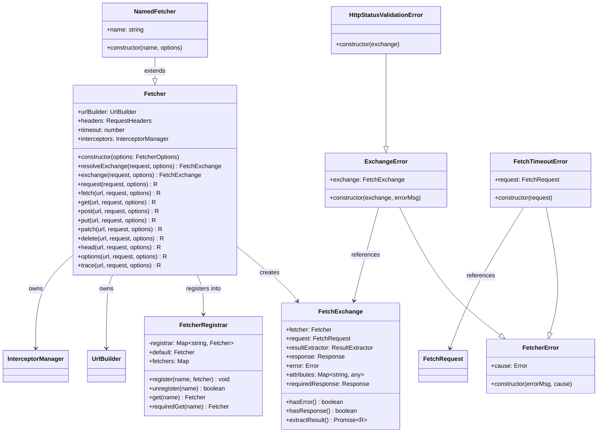
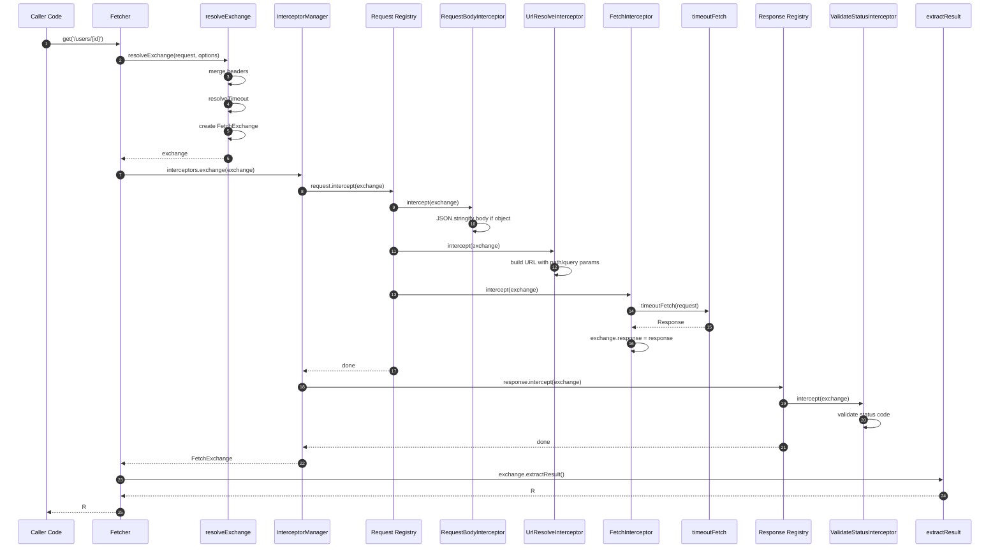
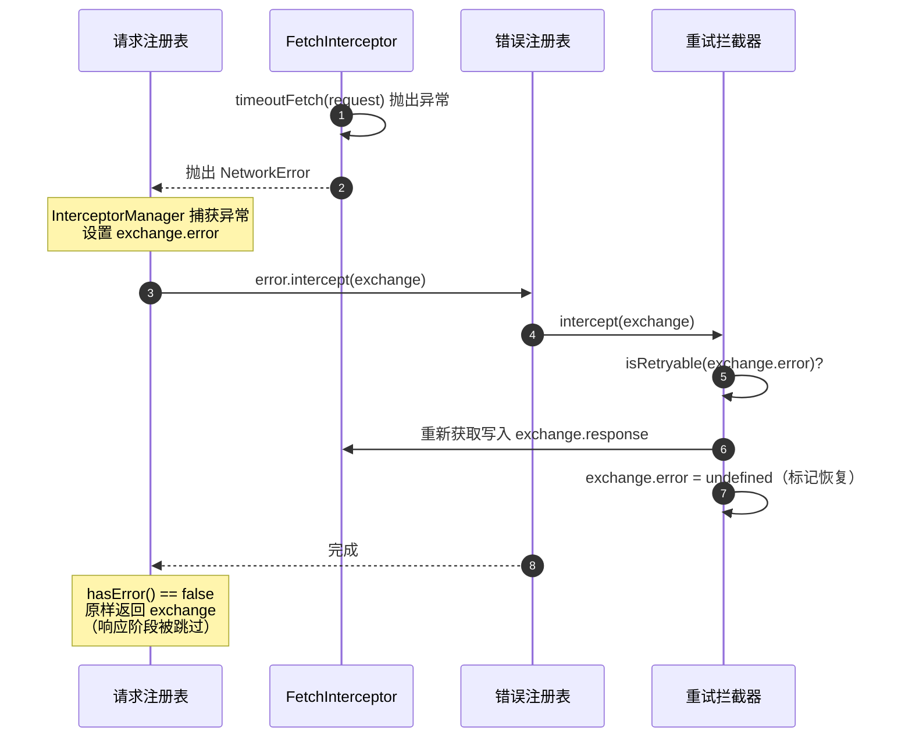
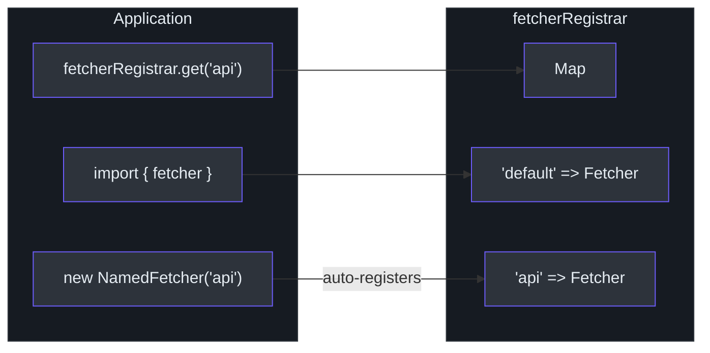
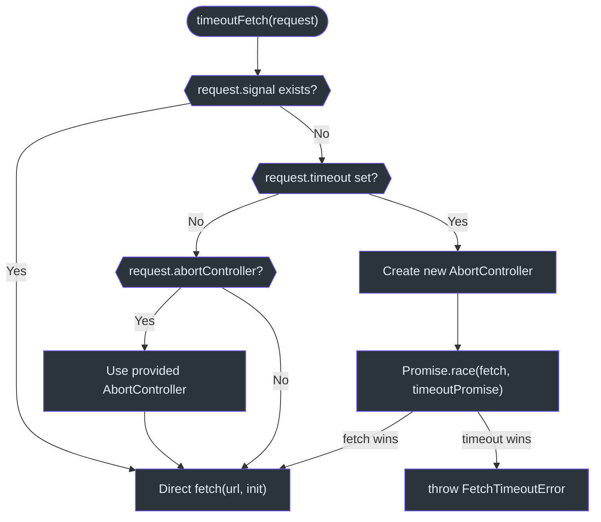
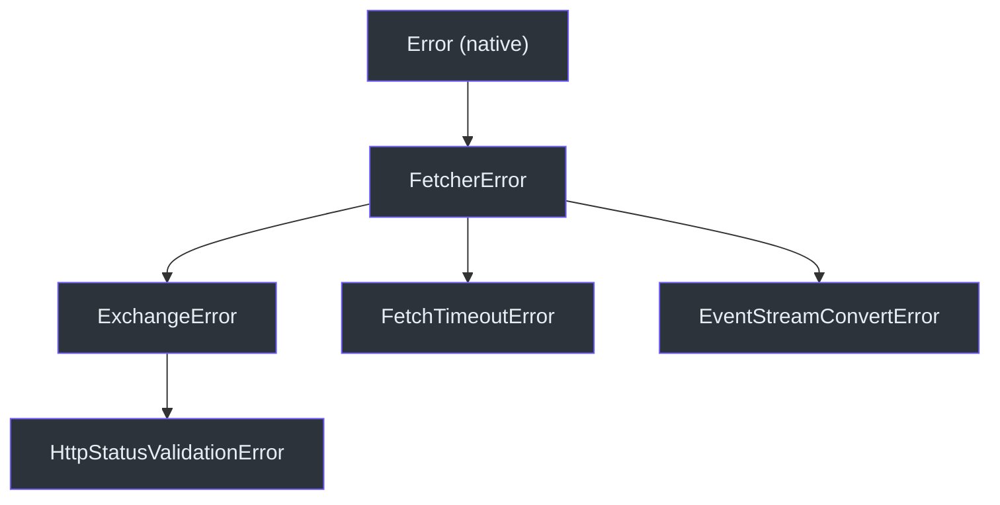

# Fetcher 核心

`fetcher` 包是整个 monorepo 的基础。它封装原生 Fetch API，提供拦截器管道、URL 构建、超时控制和命名实例注册表 -- 且零内部依赖。

Source: [packages/fetcher/src/fetcher.ts](https://github.com/Ahoo-Wang/fetcher/blob/main/packages/fetcher/src/fetcher.ts)

## 类层级结构



## Fetcher 类

`Fetcher` 类是主要的 HTTP 客户端。其构造函数接受一个 `FetcherOptions` 对象，并初始化 `UrlBuilder`、默认请求头、超时时间和 `InterceptorManager`。

```typescript
// [packages/fetcher/src/fetcher.ts:144-150]
constructor(options: FetcherOptions = DEFAULT_OPTIONS) {
  this.urlBuilder = new UrlBuilder(options.baseURL, options.urlTemplateStyle);
  this.headers = options.headers ?? DEFAULT_HEADERS;
  this.timeout = options.timeout;
  this.interceptors =
    options.interceptors ?? new InterceptorManager(options.validateStatus);
}
```

Source: [packages/fetcher/src/fetcher.ts:144-150](https://github.com/Ahoo-Wang/fetcher/blob/main/packages/fetcher/src/fetcher.ts#L144-L150)

### FetcherOptions

| 属性 | 类型 | 默认值 | 说明 |
|---|---|---|---|
| `baseURL` | `string` | `""` | 所有请求 URL 的前缀 |
| `headers` | `RequestHeaders` | `{ "Content-Type": "application/json" }` | 默认请求头 |
| `timeout` | `number` | `undefined`（无超时） | 全局超时时间（毫秒） |
| `urlTemplateStyle` | `UrlTemplateStyle` | `UriTemplate` | `{id}` 或 `:id` 语法 |
| `interceptors` | `InterceptorManager` | *自动创建* | 自定义拦截器管理器 |
| `validateStatus` | `ValidateStatus` | `status >= 200 && status < 300` | 状态码验证规则 |

Source: [packages/fetcher/src/fetcher.ts:51-80](https://github.com/Ahoo-Wang/fetcher/blob/main/packages/fetcher/src/fetcher.ts#L51-L80)

### HTTP 方法便捷方法

Fetcher 为所有标准 HTTP 方法提供了便捷方法。每个方法都委托给私有的 `methodFetch` 辅助函数。

| 方法 | 签名 | 是否省略请求体 |
|---|---|---|
| `get` | `get<R>(url, request?, options?)` | 是 |
| `post` | `post<R>(url, request?, options?)` | 否 |
| `put` | `put<R>(url, request?, options?)` | 否 |
| `patch` | `patch<R>(url, request?, options?)` | 否 |
| `delete` | `delete<R>(url, request?, options?)` | 是 |
| `head` | `head<R>(url, request?, options?)` | 是 |
| `options` | `options<R>(url, request?, options?)` | 是 |
| `trace` | `trace<R>(url, request?, options?)` | 是 |
| `fetch` | `fetch<R>(url, request?, options?)` | 否 |

Source: [packages/fetcher/src/fetcher.ts:258-500](https://github.com/Ahoo-Wang/fetcher/blob/main/packages/fetcher/src/fetcher.ts#L258-L500)

## 请求生命周期

### Exchange 解析

当请求发起时，`resolveExchange` 将默认请求头与请求级请求头合并，解析超时时间（请求级优先于 Fetcher 级），合并请求选项，并构造一个 `FetchExchange`。

```typescript
// [packages/fetcher/src/fetcher.ts:172-194]
resolveExchange(request: FetchRequest, options?: RequestOptions) {
  const mergedHeaders = {
    ...this.headers,
    ...request.headers,
  };
  const fetchRequest: FetchRequest = {
    ...request,
    headers: mergedHeaders,
    timeout: resolveTimeout(request.timeout, this.timeout),
  };
  const { resultExtractor, attributes } = mergeRequestOptions(
    DEFAULT_REQUEST_OPTIONS,
    options,
  );
  return new FetchExchange({
    fetcher: this,
    request: fetchRequest,
    resultExtractor,
    attributes,
  });
}
```

Source: [packages/fetcher/src/fetcher.ts:172-194](https://github.com/Ahoo-Wang/fetcher/blob/main/packages/fetcher/src/fetcher.ts#L172-L194)

### 完整生命周期序列图



### 错误恢复生命周期

当任何阶段抛出异常时，`InterceptorManager.exchange()` 方法会捕获错误、设置 `exchange.error` 并运行错误拦截器。如果错误拦截器清除了 `exchange.error`，则该交换被视为**已恢复**并原样返回。

::: warning 关键契约：恢复后响应阶段不会重新执行
当错误拦截器清除 `exchange.error` 后，**响应阶段被刻意跳过**。重放响应链会对较早的响应拦截器（如 `ValidateStatusInterceptor`）进行二次调用，这可能损坏或拒绝本已恢复的响应——例如，读取 body 的拦截器在已消费的 body 上会失败。

这意味着重试拦截器在重新获取写入 `exchange.response` 时会**绕过 `ValidateStatusInterceptor`**。重试后返回 5xx 状态码的响应会静默通过验证。如果你需要对重试响应进行状态验证，重试拦截器必须自行校验状态码。
:::



### FetchExchange

`FetchExchange` 是在整个拦截器链中流转的数据对象。它携带请求、响应、错误、Fetcher 引用、共享属性和结果提取器。

关键属性和方法：

| 成员 | 类型 | 说明 |
|---|---|---|
| `fetcher` | `Fetcher` | 发起本次交换的 Fetcher |
| `request` | `FetchRequest` | URL、方法、请求头、请求体、超时、urlParams |
| `response` | `Response \| undefined` | fetch 完成后设置 |
| `error` | `Error \| undefined` | 发生错误时设置 |
| `attributes` | `Map<string, any>` | 拦截器之间共享的数据 |
| `resultExtractor` | `ResultExtractor<any>` | 最终结果的提取方式 |
| `hasError()` | `boolean` | 检查是否存在错误 |
| `hasResponse()` | `boolean` | 检查是否存在响应 |
| `requiredResponse` | `Response` | 无响应时抛出 `ExchangeError` |
| `extractResult<R>()` | `Promise<R>` | 应用结果提取器（结果会被缓存） |

Source: [packages/fetcher/src/fetchExchange.ts:105-286](https://github.com/Ahoo-Wang/fetcher/blob/main/packages/fetcher/src/fetchExchange.ts#L105-L286)

首次调用 `extractResult()` 后结果会被缓存，以避免重复计算：

```typescript
// [packages/fetcher/src/fetchExchange.ts:278-285]
async extractResult<R>(): Promise<R> {
  if (this.hasCachedResult) {
    return await this.cachedExtractedResult;
  }
  this.hasCachedResult = true;
  this.cachedExtractedResult = this.resultExtractor(this);
  return await this.cachedExtractedResult;
}
```

Source: [packages/fetcher/src/fetchExchange.ts:278-285](https://github.com/Ahoo-Wang/fetcher/blob/main/packages/fetcher/src/fetchExchange.ts#L278-L285)

## NamedFetcher 与 FetcherRegistrar

### NamedFetcher

`NamedFetcher` 继承 `Fetcher`，在构造函数中自动向全局 `fetcherRegistrar` 注册自身。这允许在应用中通过名称获取 Fetcher 实例。

```typescript
// [packages/fetcher/src/namedFetcher.ts:38-66]
export class NamedFetcher extends Fetcher implements NamedCapable {
  name: string;
  constructor(name: string, options: FetcherOptions = DEFAULT_OPTIONS) {
    super(options);
    this.name = name;
    fetcherRegistrar.register(name, this);
  }
}
```

Source: [packages/fetcher/src/namedFetcher.ts:38-66](https://github.com/Ahoo-Wang/fetcher/blob/main/packages/fetcher/src/namedFetcher.ts#L38-L66)

### FetcherRegistrar

`FetcherRegistrar` 是一个带有类型化访问器的 `Map<string, Fetcher>` 封装。全局单例导出供应用级别使用。

```typescript
// [packages/fetcher/src/fetcherRegistrar.ts:41-150]
export class FetcherRegistrar {
  private registrar: Map<string, Fetcher> = new Map();
  register(name: string, fetcher: Fetcher): void { ... }
  unregister(name: string): boolean { ... }
  get(name: string): Fetcher | undefined { ... }
  requiredGet(name: string): Fetcher { ... }
  get default(): Fetcher { return this.requiredGet(DEFAULT_FETCHER_NAME); }
  set default(fetcher: Fetcher) { this.register(DEFAULT_FETCHER_NAME, fetcher); }
  get fetchers(): Map<string, Fetcher> { return new Map(this.registrar); }
}
export const fetcherRegistrar = new FetcherRegistrar();
```

Source: [packages/fetcher/src/fetcherRegistrar.ts:41-166](https://github.com/Ahoo-Wang/fetcher/blob/main/packages/fetcher/src/fetcherRegistrar.ts#L41-L166)

### 注册表模式示意图



模块加载时会自动创建一个便捷的默认实例：

```typescript
// [packages/fetcher/src/namedFetcher.ts:89]
export const fetcher = new NamedFetcher(DEFAULT_FETCHER_NAME);
```

Source: [packages/fetcher/src/namedFetcher.ts:89](https://github.com/Ahoo-Wang/fetcher/blob/main/packages/fetcher/src/namedFetcher.ts#L89)

## 超时处理

超时通过 `timeoutFetch` 函数实现，使用 `Promise.race` 在原生 `fetch()` 和基于 `AbortController` 的超时 Promise 之间进行竞争。

### 超时决策流程图



关键行为：

1. 如果 `request.signal` 已存在，则跳过超时处理以避免冲突。
2. 如果未设置超时但提供了 `abortController`，则直接附加其 signal。
3. 如果设置了超时，将创建一个新的 `AbortController`（或复用已提供的），并启动计时器与 fetch 请求竞争。

```typescript
// [packages/fetcher/src/timeout.ts:120-172]
export async function timeoutFetch(request: FetchRequest): Promise<Response> {
  const url = request.url;
  const timeout = request.timeout;
  const requestInit = request as RequestInit;

  if (request.signal) {
    return await fetch(url, requestInit);
  }

  if (!timeout) {
    if (request.abortController) {
      requestInit.signal = request.abortController.signal;
    }
    return await fetch(url, requestInit);
  }

  const controller = request.abortController ?? new AbortController();
  request.abortController = controller;
  requestInit.signal = controller.signal;

  let timerId: ReturnType<typeof setTimeout> | null = null;
  let aborted = false;
  const timeoutPromise = new Promise<Response>((_, reject) => {
    timerId = setTimeout(() => {
      if (aborted) return;
      aborted = true;
      if (timerId) { clearTimeout(timerId); }
      const error = new FetchTimeoutError(request);
      controller.abort(error);
      reject(error);
    }, timeout);
  });

  try {
    return await Promise.race([fetch(url, requestInit), timeoutPromise]);
  } finally {
    aborted = true;
    if (timerId) { clearTimeout(timerId); }
  }
}
```

Source: [packages/fetcher/src/timeout.ts:120-172](https://github.com/Ahoo-Wang/fetcher/blob/main/packages/fetcher/src/timeout.ts#L120-L172)

### 超时解析

当同时指定了请求级和 Fetcher 级的超时时间时，请求级的值优先：

```typescript
// [packages/fetcher/src/timeout.ts:81-89]
export function resolveTimeout(
  requestTimeout?: number,
  optionsTimeout?: number,
): number | undefined {
  if (typeof requestTimeout !== 'undefined') {
    return requestTimeout;
  }
  return optionsTimeout;
}
```

Source: [packages/fetcher/src/timeout.ts:81-89](https://github.com/Ahoo-Wang/fetcher/blob/main/packages/fetcher/src/timeout.ts#L81-L89)

## 错误层级体系

Fetcher 定义了一套结构化的错误层级体系，在每个失败点提供丰富的上下文信息。



### FetcherError

所有 Fetcher 错误的基类。支持通过 `cause` 属性进行错误链式传递，并在可用时复制原始错误的堆栈信息。

```typescript
// [packages/fetcher/src/fetcherError.ts:37-62]
export class FetcherError extends Error {
  constructor(
    errorMsg?: string,
    public readonly cause?: Error | unknown,
  ) {
    const causeMessage = cause instanceof Error ? cause.message : undefined;
    const errorMessage =
      errorMsg || causeMessage || 'An error occurred in the fetcher';
    super(errorMessage);
    this.name = 'FetcherError';
    if (cause instanceof Error && cause.stack) {
      this.stack = cause.stack;
    }
    Object.setPrototypeOf(this, FetcherError.prototype);
  }
}
```

Source: [packages/fetcher/src/fetcherError.ts:37-62](https://github.com/Ahoo-Wang/fetcher/blob/main/packages/fetcher/src/fetcherError.ts#L37-L62)

### ExchangeError

当拦截器管道执行失败且错误拦截器未清除错误时抛出。携带完整的 `FetchExchange` 以便调试。

```typescript
// [packages/fetcher/src/fetcherError.ts:86-106]
export class ExchangeError extends FetcherError {
  constructor(
    public readonly exchange: FetchExchange,
    errorMsg?: string,
  ) {
    const errorMessage =
      errorMsg ||
      exchange.error?.message ||
      exchange.response?.statusText ||
      `Request to ${exchange.request.url} failed during exchange`;
    super(errorMessage, exchange.error);
    this.name = 'ExchangeError';
    Object.setPrototypeOf(this, ExchangeError.prototype);
  }
}
```

Source: [packages/fetcher/src/fetcherError.ts:86-106](https://github.com/Ahoo-Wang/fetcher/blob/main/packages/fetcher/src/fetcherError.ts#L86-L106)

### FetchTimeoutError

当请求超时时由 `timeoutFetch` 抛出。包含超时请求的信息。

```typescript
// [packages/fetcher/src/timeout.ts:33-53]
export class FetchTimeoutError extends FetcherError {
  request: FetchRequest;
  constructor(request: FetchRequest) {
    const method = request.method || 'GET';
    const message = `Request timeout of ${request.timeout}ms exceeded for ${method} ${request.url}`;
    super(message);
    this.name = 'FetchTimeoutError';
    this.request = request;
    Object.setPrototypeOf(this, FetchTimeoutError.prototype);
  }
}
```

Source: [packages/fetcher/src/timeout.ts:33-53](https://github.com/Ahoo-Wang/fetcher/blob/main/packages/fetcher/src/timeout.ts#L33-L53)

### HttpStatusValidationError

当响应状态码未通过验证时由 `ValidateStatusInterceptor` 抛出。继承 `ExchangeError`，因此携带完整的交换上下文信息。

```typescript
// [packages/fetcher/src/validateStatusInterceptor.ts:27-36]
export class HttpStatusValidationError extends ExchangeError {
  constructor(exchange: FetchExchange) {
    super(
      exchange,
      `Request failed with status code ${exchange.response?.status} for ${exchange.request.url}`,
    );
    this.name = 'HttpStatusValidationError';
    Object.setPrototypeOf(this, HttpStatusValidationError.prototype);
  }
}
```

Source: [packages/fetcher/src/validateStatusInterceptor.ts:27-36](https://github.com/Ahoo-Wang/fetcher/blob/main/packages/fetcher/src/validateStatusInterceptor.ts#L27-L36)

## 结果提取器

`ResultExtractor` 模式将 Fetcher 与特定的响应格式解耦。调用方通过 `options.resultExtractor` 参数选择如何提取结果。

| 提取器 | 返回类型 | 使用场景 |
|---|---|---|
| `ResultExtractors.Exchange` | `FetchExchange` | 完整访问请求、响应和元数据 |
| `ResultExtractors.Response` | `Response` | 原始 Response 对象 |
| `ResultExtractors.Json` | `Promise<any>` | 已解析的 JSON 请求体 |
| `ResultExtractors.Text` | `Promise<string>` | 纯文本请求体 |
| `ResultExtractors.Blob` | `Promise<Blob>` | 二进制数据（图片、文件） |
| `ResultExtractors.ArrayBuffer` | `Promise<ArrayBuffer>` | 底层二进制数据 |
| `ResultExtractors.Bytes` | `Promise<Uint8Array>` | 字节数组 |

Source: [packages/fetcher/src/resultExtractor.ts:42-160](https://github.com/Ahoo-Wang/fetcher/blob/main/packages/fetcher/src/resultExtractor.ts#L42-L160)

`fetcher.fetch()` 的默认提取器是 `Response`；`fetcher.request()` 的默认提取器是 `Exchange`：

```typescript
// [packages/fetcher/src/fetcher.ts:97-102]
export const DEFAULT_REQUEST_OPTIONS: RequestOptions = {
  resultExtractor: ResultExtractors.Exchange,
};
export const DEFAULT_FETCH_OPTIONS: RequestOptions = {
  resultExtractor: ResultExtractors.Response,
};
```

Source: [packages/fetcher/src/fetcher.ts:97-102](https://github.com/Ahoo-Wang/fetcher/blob/main/packages/fetcher/src/fetcher.ts#L97-L102)

## 交叉引用

- [架构总览](/architecture/) -- 系统架构图、包依赖关系图
- [拦截器系统](/architecture/interceptors) -- 详细的拦截器管道
- [URL 构建器](/architecture/url-builder) -- 路径模板解析和查询参数
- [EventStream 与 SSE](/architecture/eventstream) -- SSE 流式支持和 `EventStreamResultExtractor`
