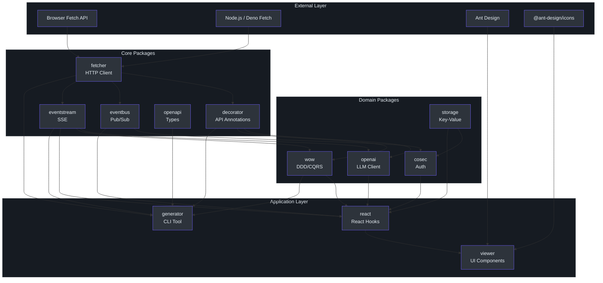
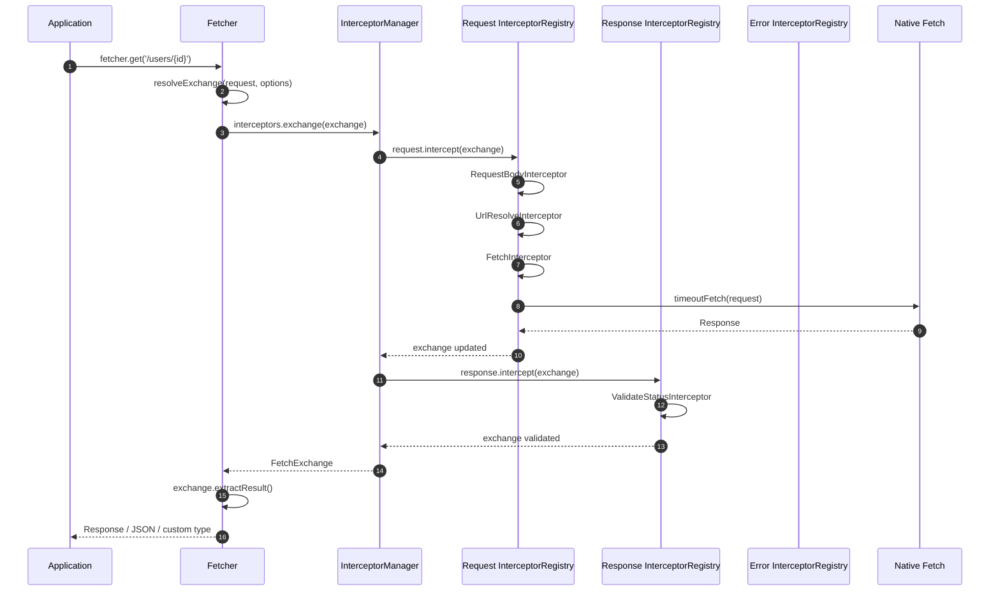
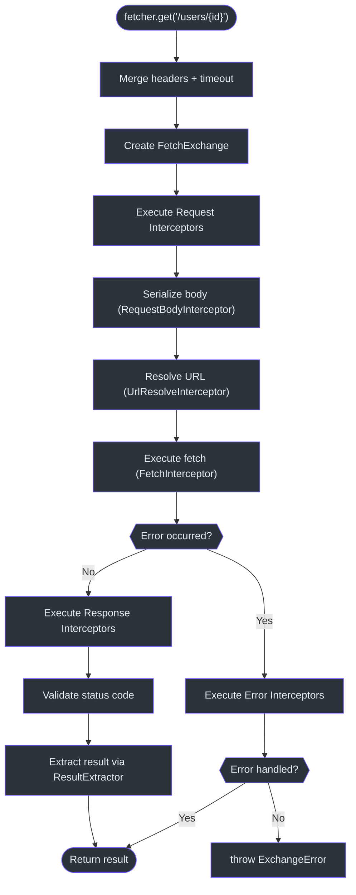

# 架构总览

Fetcher 是一个基于原生 Fetch API 构建的模块化 HTTP 客户端生态系统。
它通过拦截器驱动的中间件、TypeScript 优先的设计以及原生 Server-Sent Event / LLM 流式支持，提供类似 Axios 的使用体验。
代码库以 **pnpm workspaces monorepo** 形式组织，`packages/` 下包含 12 个包，另有 `integration-test/` 工作区。

## 系统架构图

## 包依赖关系图

下表汇总了每个包的名称、职责及其内部依赖关系。

| 包 | npm 名称 | 职责 | 依赖 |
|---|---|---|---|
| **openapi** | `@ahoo-wang/fetcher-openapi` | OpenAPI 3.x 类型定义 | *无（独立包）* |
| **fetcher** | `@ahoo-wang/fetcher` | 核心 HTTP 客户端 | *无（基础包）* |
| **decorator** | `@ahoo-wang/fetcher-decorator` | 声明式 API 装饰器 | fetcher |
| **eventbus** | `@ahoo-wang/fetcher-eventbus` | 发布/订阅消息 | fetcher |
| **eventstream** | `@ahoo-wang/fetcher-eventstream` | SSE / 流式支持 | fetcher |
| **openai** | `@ahoo-wang/fetcher-openai` | 兼容 OpenAI 的 LLM 客户端 | fetcher, eventstream, decorator |
| **wow** | `@ahoo-wang/fetcher-wow` | DDD / CQRS / 事件溯源 | fetcher, eventstream, decorator |
| **storage** | `@ahoo-wang/fetcher-storage` | 键值存储抽象 | eventbus |
| **cosec** | `@ahoo-wang/fetcher-cosec` | 认证与授权 | fetcher, eventbus, storage |
| **react** | `@ahoo-wang/fetcher-react` | React hooks 与 providers | fetcher, eventstream, eventbus, storage, wow, cosec |
| **viewer** | `@ahoo-wang/fetcher-viewer` | Ant Design UI 组件 | *以上所有* + antd, @ant-design/icons |
| **generator** | `@ahoo-wang/fetcher-generator` | CLI 代码生成器 | fetcher, eventstream, decorator, openapi, wow |

Source: [packages/fetcher/src/index.ts](https://github.com/Ahoo-Wang/fetcher/blob/main/packages/fetcher/src/index.ts)

## 分层依赖图

```mermaid
graph LR
  subgraph Layer0["Layer 0 - No Dependencies"]
    style Layer0 fill:#161b22,stroke:#30363d,color:#e6edf3
    OpenAPI2["openapi"]
    Fetcher2["fetcher"]
  end

  subgraph Layer1["Layer 1 - Core Extensions"]
    style Layer1 fill:#161b22,stroke:#30363d,color:#e6edf3
    Decorator2["decorator"]
    EventBus2["eventbus"]
    EventStream2["eventstream"]
  end

  subgraph Layer2["Layer 2 - Domain Packages"]
    style Layer2 fill:#161b22,stroke:#30363d,color:#e6edf3
    OpenAI2["openai"]
    Wow2["wow"]
    Storage2["storage"]
    Cosec2["cosec"]
  end

  subgraph Layer3["Layer 3 - Application"]
    style Layer3 fill:#161b22,stroke:#30363d,color:#e6edf3
    React2["react"]
    Viewer2["viewer"]
    Generator2["generator"]
  end

  OpenAPI2 --> Layer1
  Fetcher2 --> Layer1
  Layer1 --> Layer2
  Layer2 --> Layer3

  style OpenAPI2 fill:#2d333b,stroke:#6d5dfc,color:#e6edf3
  style Fetcher2 fill:#2d333b,stroke:#6d5dfc,color:#e6edf3
  style Decorator2 fill:#2d333b,stroke:#6d5dfc,color:#e6edf3
  style EventBus2 fill:#2d333b,stroke:#6d5dfc,color:#e6edf3
  style EventStream2 fill:#2d333b,stroke:#6d5dfc,color:#e6edf3
  style OpenAI2 fill:#2d333b,stroke:#6d5dfc,color:#e6edf3
  style Wow2 fill:#2d333b,stroke:#6d5dfc,color:#e6edf3
  style Storage2 fill:#2d333b,stroke:#6d5dfc,color:#e6edf3
  style Cosec2 fill:#2d333b,stroke:#6d5dfc,color:#e6edf3
  style React2 fill:#2d333b,stroke:#6d5dfc,color:#e6edf3
  style Viewer2 fill:#2d333b,stroke:#6d5dfc,color:#e6edf3
  style Generator2 fill:#2d333b,stroke:#6d5dfc,color:#e6edf3
```

## 请求生命周期

以下序列图展示了单个 HTTP 请求在系统中的完整流转过程，从应用层调用到底层原生 Fetch API，再经过响应拦截器返回。

详见 [Fetcher 核心](/architecture/fetcher-core) 和 [拦截器系统](/architecture/interceptors) 了解完整细节。

## 设计原则

### 1. 基础优先的分层策略

monorepo 中的每个包都专注于单一职责。`fetcher` 包**零内部依赖** -- 它仅封装原生 Fetch API，不依赖其他包。上层包（decorator、eventstream、eventbus）只依赖 `fetcher`。领域包基于这些基础包进行组合。

Source: [packages/fetcher/src/index.ts](https://github.com/Ahoo-Wang/fetcher/blob/main/packages/fetcher/src/index.ts)

### 2. 拦截器驱动的可扩展性

所有请求/响应处理都经过三阶段拦截器管道（请求、响应、错误）。内置行为 -- URL 解析、请求体序列化、超时控制、状态码校验 -- 本身都是拦截器，而非硬编码逻辑。用户可以通过 `order` 属性在任意位置注入自定义拦截器。

Source: [packages/fetcher/src/interceptorManager.ts:62-66](https://github.com/Ahoo-Wang/fetcher/blob/main/packages/fetcher/src/interceptorManager.ts#L62-L66)

### 3. 副作用模块模式

`eventstream` 包采用**副作用导入**模式 -- 只需导入 `@ahoo-wang/fetcher-eventstream`，即可为 `Response.prototype` 扩展 `eventStream()`、`jsonEventStream()` 及相关属性。无需显式注册。

Source: [packages/eventstream/src/responses.ts:102-239](https://github.com/Ahoo-Wang/fetcher/blob/main/packages/eventstream/src/responses.ts#L102-L239)

### 4. 命名注册表模式

多个 Fetcher 实例通过 `FetcherRegistrar` 和 `NamedFetcher` 进行管理。全局单例 `fetcherRegistrar` 存储命名实例，并预注册了一个名为 `"default"` 的便捷默认 `fetcher` 导出。

Source: [packages/fetcher/src/fetcherRegistrar.ts:166](https://github.com/Ahoo-Wang/fetcher/blob/main/packages/fetcher/src/fetcherRegistrar.ts#L166), [packages/fetcher/src/namedFetcher.ts:89](https://github.com/Ahoo-Wang/fetcher/blob/main/packages/fetcher/src/namedFetcher.ts#L89)

### 5. 结果提取策略

Fetcher 并非强制使用单一返回类型，而是通过 `ResultExtractor` 函数将 `FetchExchange` 转换为调用方所需的类型。内置提取器包括 `Exchange`、`Response`、`Json`、`Text`、`Blob`、`ArrayBuffer` 和 `Bytes`。

Source: [packages/fetcher/src/resultExtractor.ts:131-160](https://github.com/Ahoo-Wang/fetcher/blob/main/packages/fetcher/src/resultExtractor.ts#L131-L160)

## 请求处理流程图

## 技术栈

| 类别 | 技术 | 用途 |
|---|---|---|
| 语言 | TypeScript（严格模式） | 所有包的类型安全 |
| 运行时 | 浏览器 Fetch API、Node.js 原生 fetch | HTTP 传输 |
| 构建 | Vite + unplugin-dts | ESM/UMD 打包 + 类型声明 |
| 测试 | Vitest + @vitest/coverage-v8 | 单元测试和覆盖率 |
| 浏览器测试 | @vitest/browser + Playwright | 组件测试（viewer） |
| HTTP 模拟 | MSW（Mock Service Worker） | Fetcher 单元测试 |
| 代码生成 | ts-morph + commander | Generator CLI |
| UI 框架 | React 19 + Ant Design 5 | Viewer 组件 |
| 样式 | Less | Ant Design 主题集成 |
| 包管理器 | pnpm workspaces | Monorepo 管理 |
| 代码检查 | ESLint + Prettier | 代码风格规范 |
| React 编译器 | babel-plugin-react-compiler | 自动 React 优化 |

Source: [CLAUDE.md](https://github.com/Ahoo-Wang/fetcher/blob/main/CLAUDE.md)

## 交叉引用

- [Fetcher 核心](/architecture/fetcher-core) -- `Fetcher`、`NamedFetcher`、`FetcherRegistrar`、超时和错误处理
- [拦截器系统](/architecture/interceptors) -- `InterceptorManager`、`InterceptorRegistry`、内置拦截器
- [EventStream 与 SSE](/architecture/eventstream) -- 副作用模块、SSE 协议、LLM 流式处理
- [URL 构建器](/architecture/url-builder) -- `UrlBuilder`、路径模板、查询参数
