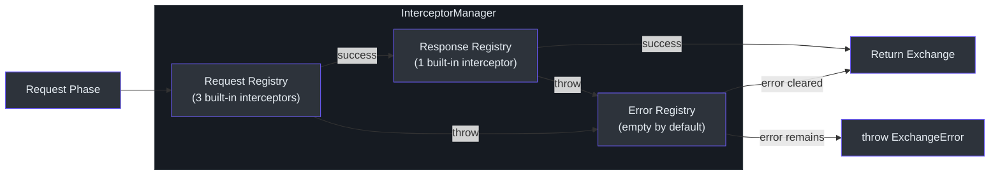
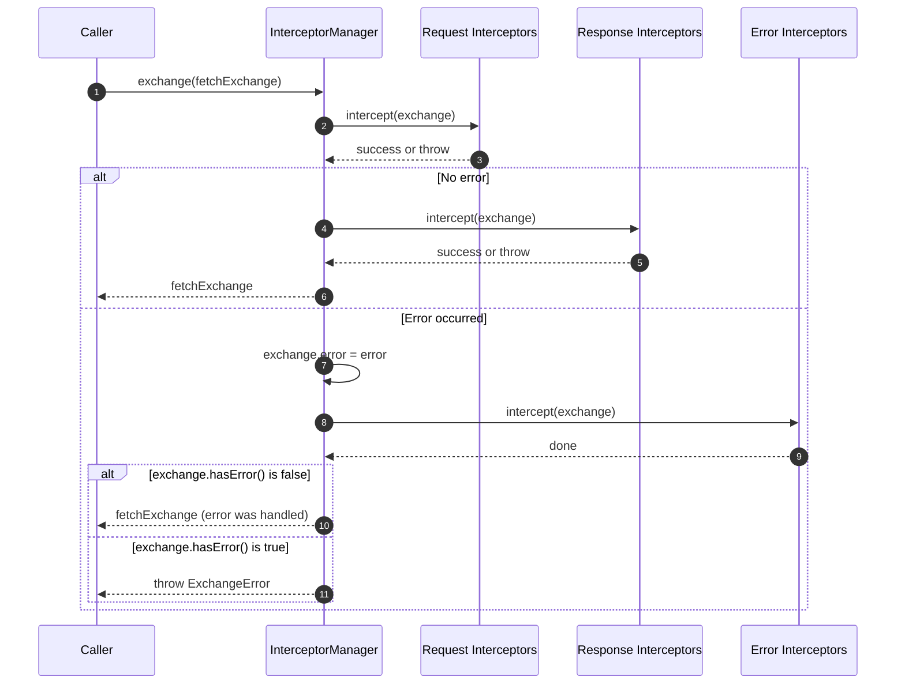
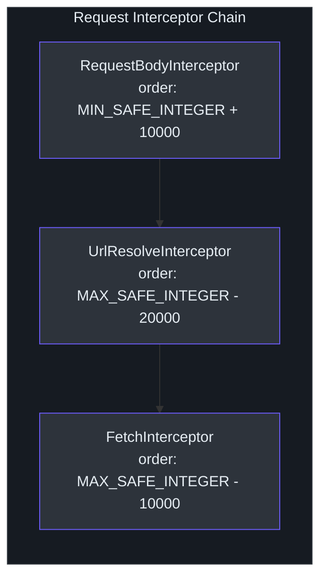
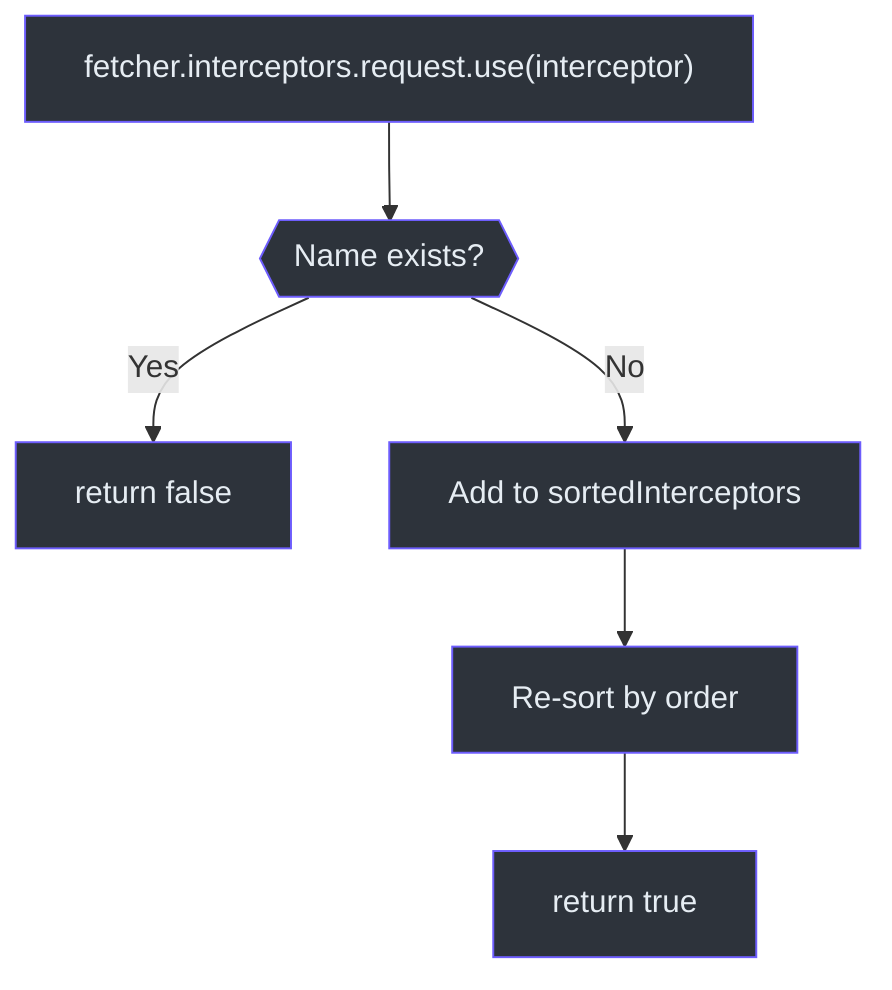

# 拦截器系统

拦截器系统是 Fetcher 的核心扩展机制。所有请求处理 -- URL 解析、请求体序列化、HTTP 执行、状态码校验 -- 都通过拦截器实现，而非硬编码逻辑。用户可以在链路中的任意位置插入、移除或替换拦截器。

Source: [packages/fetcher/src/interceptorManager.ts](https://github.com/Ahoo-Wang/fetcher/blob/main/packages/fetcher/src/interceptorManager.ts)

## 三阶段架构

`InterceptorManager` 协调三个独立的 `InterceptorRegistry` 实例，分别对应请求生命周期的三个阶段。



Source: [packages/fetcher/src/interceptorManager.ts:62-103](https://github.com/Ahoo-Wang/fetcher/blob/main/packages/fetcher/src/interceptorManager.ts#L62-L103)

## InterceptorManager.exchange()

`exchange()` 方法是管道的核心。它先执行请求拦截器，成功后执行响应拦截器，失败时执行错误拦截器。如果错误拦截器清除了错误，则交换成功返回；否则抛出 `ExchangeError`。

```typescript
// [packages/fetcher/src/interceptorManager.ts:191-212]
async exchange(fetchExchange: FetchExchange): Promise<FetchExchange> {
  try {
    await this.request.intercept(fetchExchange);
    await this.response.intercept(fetchExchange);
    return fetchExchange;
  } catch (error: any) {
    fetchExchange.error = error;
    await this.error.intercept(fetchExchange);
    if (!fetchExchange.hasError()) {
      return fetchExchange;
    }
    throw new ExchangeError(fetchExchange);
  }
}
```

Source: [packages/fetcher/src/interceptorManager.ts:191-212](https://github.com/Ahoo-Wang/fetcher/blob/main/packages/fetcher/src/interceptorManager.ts#L191-L212)

### 完整执行流程



## Interceptor 接口

每个拦截器都实现 `Interceptor` 接口：包含一个 `name`（唯一标识符）、一个 `order`（执行优先级）和一个 `intercept(exchange)` 方法。

```typescript
// [packages/fetcher/src/interceptor.ts:44-85]
export interface Interceptor extends NamedCapable, OrderedCapable {
  readonly name: string;
  readonly order: number;
  intercept(exchange: FetchExchange): void | Promise<void>;
}
```

Source: [packages/fetcher/src/interceptor.ts:44-85](https://github.com/Ahoo-Wang/fetcher/blob/main/packages/fetcher/src/interceptor.ts#L44-L85)

三个标记接口扩展了 `Interceptor`，用于语义区分，但不添加额外成员：

| 接口 | 用途 |
|---|---|
| `RequestInterceptor` | 在 HTTP 请求发送前执行 |
| `ResponseInterceptor` | 在 HTTP 响应接收后执行 |
| `ErrorInterceptor` | 发生错误时执行 |

Source: [packages/fetcher/src/interceptor.ts:111-164](https://github.com/Ahoo-Wang/fetcher/blob/main/packages/fetcher/src/interceptor.ts#L111-L164)

## InterceptorRegistry

`InterceptorRegistry` 管理单个阶段的已排序拦截器列表。拦截器通过 `name` 属性唯一标识。

```typescript
// [packages/fetcher/src/interceptor.ts:189-300]
export class InterceptorRegistry implements Interceptor {
  private sortedInterceptors: Interceptor[] = [];

  constructor(interceptors: Interceptor[] = []) {
    this.sortedInterceptors = toSorted(interceptors);
  }

  use(interceptor: Interceptor): boolean {
    if (this.sortedInterceptors.some(item => item.name === interceptor.name)) {
      return false; // duplicate name rejected
    }
    this.sortedInterceptors = toSorted([...this.sortedInterceptors, interceptor]);
    return true;
  }

  eject(name: string): boolean { ... }
  clear(): void { ... }

  async intercept(exchange: FetchExchange): Promise<void> {
    for (const interceptor of this.sortedInterceptors) {
      await interceptor.intercept(exchange);
    }
  }
}
```

Source: [packages/fetcher/src/interceptor.ts:189-300](https://github.com/Ahoo-Wang/fetcher/blob/main/packages/fetcher/src/interceptor.ts#L189-L300)

### 关键行为

- **防重复**：如果已存在同名拦截器，`use()` 返回 `false`。
- **自动排序**：每次 `use()` 调用或构造后，拦截器按 `order` 升序排列。
- **按名称弹出**：`eject(name)` 移除指定名称的拦截器。
- **顺序执行**：`intercept()` 按顺序遍历所有拦截器，逐一 await。

## 排序系统

拦截器通过 `OrderedCapable` 接口的 `order` 属性进行排序。数值越小，执行优先级越高。

```typescript
// [packages/fetcher/src/orderedCapable.ts:53-55]
export function sortOrder<T extends OrderedCapable>(a: T, b: T): number {
  return (a.order ?? DEFAULT_ORDER) - (b.order ?? DEFAULT_ORDER);
}
```

Source: [packages/fetcher/src/orderedCapable.ts:53-55](https://github.com/Ahoo-Wang/fetcher/blob/main/packages/fetcher/src/orderedCapable.ts#L53-L55)

### 排序常量

框架使用 `BUILT_IN_INTERCEPTOR_ORDER_STEP`（10,000）来间隔内置拦截器的顺序，为自定义拦截器在它们之间留出空间。

```typescript
// [packages/fetcher/src/interceptor.ts:18-21]
export const DEFAULT_INTERCEPTOR_ORDER_STEP = 1000;
export const BUILT_IN_INTERCEPTOR_ORDER_STEP = DEFAULT_INTERCEPTOR_ORDER_STEP * 10;
```

Source: [packages/fetcher/src/interceptor.ts:18-21](https://github.com/Ahoo-Wang/fetcher/blob/main/packages/fetcher/src/interceptor.ts#L18-L21)

## 内置拦截器

### 请求阶段拦截器

请求注册表初始化时包含三个拦截器，按以下顺序执行：



#### 1. RequestBodyInterceptor（order: `Number.MIN_SAFE_INTEGER + 10000`）

将普通对象请求体转换为 JSON 字符串，并设置 `Content-Type: application/json` 请求头。跳过 null/undefined 请求体、字符串、二进制类型（ArrayBuffer、TypedArray、ReadableStream）和自动内容类型（Blob、File、FormData、URLSearchParams）。

```typescript
// [packages/fetcher/src/requestBodyInterceptor.ts:135-166]
intercept(exchange: FetchExchange) {
  const request = exchange.request;
  if (request.body === undefined || request.body === null) { return; }
  if (typeof request.body !== 'object') { return; }
  const headers = exchange.ensureRequestHeaders();
  if (this.isAutoAppendContentType(request.body)) {
    if (headers[CONTENT_TYPE_HEADER]) { delete headers[CONTENT_TYPE_HEADER]; }
    return;
  }
  if (this.isSupportedComplexBodyType(request.body)) { return; }
  exchange.request.body = JSON.stringify(request.body);
  if (!headers[CONTENT_TYPE_HEADER]) {
    headers[CONTENT_TYPE_HEADER] = ContentTypeValues.APPLICATION_JSON;
  }
}
```

Source: [packages/fetcher/src/requestBodyInterceptor.ts:135-166](https://github.com/Ahoo-Wang/fetcher/blob/main/packages/fetcher/src/requestBodyInterceptor.ts#L135-L166)

#### 2. UrlResolveInterceptor（order: `Number.MAX_SAFE_INTEGER - 20000`）

通过调用 Fetcher 的 `UrlBuilder.resolveRequestUrl()` 解析最终 URL。该过程会合并基础 URL、插值路径参数并附加查询参数。

```typescript
// [packages/fetcher/src/urlResolveInterceptor.ts:74-78]
intercept(exchange: FetchExchange) {
  const request = exchange.request;
  request.url = exchange.fetcher.urlBuilder.resolveRequestUrl(request);
}
```

Source: [packages/fetcher/src/urlResolveInterceptor.ts:74-78](https://github.com/Ahoo-Wang/fetcher/blob/main/packages/fetcher/src/urlResolveInterceptor.ts#L74-L78)

#### 3. FetchInterceptor（order: `Number.MAX_SAFE_INTEGER - 10000`）

通过 `timeoutFetch()` 执行实际的 HTTP 请求，并将响应设置到 exchange 上。这始终是最后一个执行的请求拦截器。

```typescript
// [packages/fetcher/src/fetchInterceptor.ts:101-103]
async intercept(exchange: FetchExchange) {
  exchange.response = await timeoutFetch(exchange.request);
}
```

Source: [packages/fetcher/src/fetchInterceptor.ts:101-103](https://github.com/Ahoo-Wang/fetcher/blob/main/packages/fetcher/src/fetchInterceptor.ts#L101-L103)

### 响应阶段拦截器

#### ValidateStatusInterceptor（order: `Number.MAX_SAFE_INTEGER - 10000`）

验证响应状态码。默认接受 2xx 状态码。对无效状态抛出 `HttpStatusValidationError`。可通过设置 `IGNORE_VALIDATE_STATUS` 属性为 `true` 来跳过单次请求的状态验证。

```typescript
// [packages/fetcher/src/validateStatusInterceptor.ts:170-186]
intercept(exchange: FetchExchange) {
  if (exchange.attributes.get(IGNORE_VALIDATE_STATUS) === true) {
    return;
  }
  if (!exchange.response) { return; }
  const status = exchange.response.status;
  if (this.validateStatus(status)) { return; }
  throw new HttpStatusValidationError(exchange);
}
```

Source: [packages/fetcher/src/validateStatusInterceptor.ts:170-186](https://github.com/Ahoo-Wang/fetcher/blob/main/packages/fetcher/src/validateStatusInterceptor.ts#L170-L186)

### 错误阶段拦截器

错误拦截器注册表默认**为空**。用户根据需要添加自定义错误处理（重试、日志、令牌刷新等）。

Source: [packages/fetcher/src/interceptorManager.ts:103](https://github.com/Ahoo-Wang/fetcher/blob/main/packages/fetcher/src/interceptorManager.ts#L103)

## 完整拦截器排序表

| 阶段 | 拦截器 | 排序值 | 用途 |
|---|---|---|---|
| 请求 | `RequestBodyInterceptor` | `MIN_SAFE_INTEGER + 10000` | 将对象请求体序列化为 JSON |
| 请求 | *自定义拦截器* | 介于内置值之间 | 用户自定义逻辑 |
| 请求 | `UrlResolveInterceptor` | `MAX_SAFE_INTEGER - 20000` | 构建最终 URL |
| 请求 | `FetchInterceptor` | `MAX_SAFE_INTEGER - 10000` | 执行带超时的原生 fetch |
| 响应 | `ValidateStatusInterceptor` | `MAX_SAFE_INTEGER - 10000` | 验证 HTTP 状态码 |
| 错误 | *（默认为空）* | -- | 自定义错误处理器 |

## 编写自定义拦截器

### 自定义请求拦截器

```typescript
const authInterceptor: RequestInterceptor = {
  name: 'AuthInterceptor',
  order: 5000, // runs between RequestBodyInterceptor and UrlResolveInterceptor
  async intercept(exchange: FetchExchange): Promise<void> {
    const token = await getToken();
    exchange.ensureRequestHeaders()['Authorization'] = `Bearer ${token}`;
  },
};

fetcher.interceptors.request.use(authInterceptor);
```

### 自定义响应拦截器

```typescript
const loggingInterceptor: ResponseInterceptor = {
  name: 'ResponseLogger',
  order: 100, // runs before ValidateStatusInterceptor
  intercept(exchange: FetchExchange): void {
    console.log(`${exchange.request.method} ${exchange.request.url} => ${exchange.response?.status}`);
  },
};

fetcher.interceptors.response.use(loggingInterceptor);
```

### 自定义错误拦截器（重试）

```typescript
const retryInterceptor: ErrorInterceptor = {
  name: 'RetryInterceptor',
  order: 1000,
  async intercept(exchange: FetchExchange): Promise<void> {
    const retryCount = exchange.attributes.get('retryCount') ?? 0;
    if (retryCount < 3 && isRetryable(exchange.error)) {
      exchange.attributes.set('retryCount', retryCount + 1);
      exchange.error = undefined; // clear error to signal handling
      exchange.response = await timeoutFetch(exchange.request);
    }
  },
};

fetcher.interceptors.error.use(retryInterceptor);
```

### 拦截器注册流程



## 拦截器之间的属性共享

拦截器可以通过 `exchange.attributes`（`Map<string, any>`）共享数据。这使得请求、响应和错误拦截器之间能够协调配合，而无需直接耦合。

```typescript
// In a request interceptor
exchange.attributes.set('startTime', Date.now());

// In a response interceptor
const start = exchange.attributes.get('startTime');
console.log(`Request took ${Date.now() - start}ms`);
```

`IGNORE_VALIDATE_STATUS` 属性是此模式的一个内置示例 -- 将其设置为 `true` 可跳过该特定请求的状态验证。

Source: [packages/fetcher/src/validateStatusInterceptor.ts:97](https://github.com/Ahoo-Wang/fetcher/blob/main/packages/fetcher/src/validateStatusInterceptor.ts#L97)

## 交叉引用

- [Fetcher 核心](/architecture/fetcher-core) -- `Fetcher`、`FetchExchange`、错误层级体系
- [URL 构建器](/architecture/url-builder) -- `UrlResolveInterceptor` 如何构建 URL
- [EventStream 与 SSE](/architecture/eventstream) -- 与拦截器管道配合使用的 SSE 结果提取器
- [架构总览](/architecture/) -- 系统级拦截器流程图
