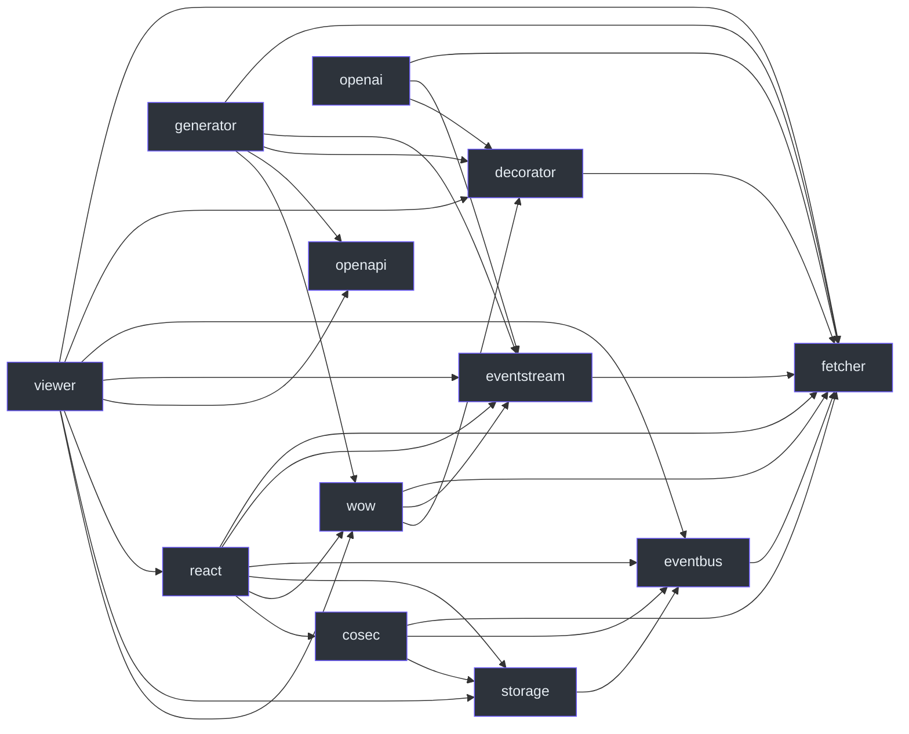

# 包边界

核心包没有内部运行依赖或 peer 依赖。按责任选择附加能力，再满足所选包的 peer 要求。“业务上可选”不意味着可以忽略已经声明的 peer。见 [packages/fetcher/package.json:31](https://github.com/Ahoo-Wang/fetcher/blob/main/packages/fetcher/package.json#L31)。

## 声明的内部 peer

下图每条箭头表示**起点包声明终点包为内部 peer 依赖**。这是安装图，不是请求调用图。名称省略 `@ahoo-wang/fetcher-*` 前缀；`fetcher` 表示 `@ahoo-wang/fetcher`。生成器虽在开发期运行，仍列出其安装依赖。OpenAPI 提供类型。

| 层                     | 责任与代价                                                                    | 清单证据                                                                                                                                                                                                                                             |
| ---------------------- | ----------------------------------------------------------------------------- | ---------------------------------------------------------------------------------------------------------------------------------------------------------------------------------------------------------------------------------------------------- |
| fetcher                | HTTP 默认配置、拦截、提取；无内部依赖                                         | [packages/fetcher/package.json:31](https://github.com/Ahoo-Wang/fetcher/blob/main/packages/fetcher/package.json#L31)                                                                                                                                 |
| decorator              | 声明式服务；需要 metadata 配置及运行依赖 `reflect-metadata`                   | [packages/decorator/package.json:53](https://github.com/Ahoo-Wang/fetcher/blob/main/packages/decorator/package.json#L53)                                                                                                                             |
| eventbus / eventstream | 事件投递 / SSE 处理；各自 peer 核心包                                         | [packages/eventbus/package.json:51](https://github.com/Ahoo-Wang/fetcher/blob/main/packages/eventbus/package.json#L51), [packages/eventstream/package.json:52](https://github.com/Ahoo-Wang/fetcher/blob/main/packages/eventstream/package.json#L52) |
| storage / cosec        | 存储事件 / 认证协议；需要管理额外状态的生命周期                               | [packages/storage/package.json:55](https://github.com/Ahoo-Wang/fetcher/blob/main/packages/storage/package.json#L55), [packages/cosec/package.json:53](https://github.com/Ahoo-Wang/fetcher/blob/main/packages/cosec/package.json#L53)               |
| wow / openai           | 服务专用运行客户端，使用核心、装饰器和流能力                                  | [packages/wow/package.json:63](https://github.com/Ahoo-Wang/fetcher/blob/main/packages/wow/package.json#L63), [packages/openai/package.json:58](https://github.com/Ahoo-Wang/fetcher/blob/main/packages/openai/package.json#L58)                     |
| react                  | 请求与集成 Hook；peer React/ReactDOM，直接依赖 `dequal` 和 `immer`            | [packages/react/package.json:54](https://github.com/Ahoo-Wang/fetcher/blob/main/packages/react/package.json#L54)                                                                                                                                     |
| viewer                 | 表格与保存视图 UI；内部 peer 之外还要求 React、Ant Design、icons 和 dayjs     | [packages/viewer/package.json:54](https://github.com/Ahoo-Wang/fetcher/blob/main/packages/viewer/package.json#L54)                                                                                                                                   |
| openapi / generator    | OpenAPI 类型词汇 / 生成源码的开发 CLI；生成器使用 ts-morph、commander 和 yaml | [packages/openapi/src/index.ts:21](https://github.com/Ahoo-Wang/fetcher/blob/main/packages/openapi/src/index.ts#L21), [packages/generator/package.json:61](https://github.com/Ahoo-Wang/fetcher/blob/main/packages/generator/package.json#L61)       |

## 安装关系不等于执行关系

React 到 CoSec 的 peer 箭头不表示每个 Hook 都通过 CoSec 认证。Viewer 到 OpenAPI 的 peer 箭头不表示表格加载前会验证规范。实际执行顺序见[请求生命周期](./request-lifecycle.md)。

生成器属于代码生成工作流：针对服务规范运行，再编译、审查输出。OpenAPI 类型本身既不发送请求，也不验证输入。生成代码仍需要它导入的运行包。React Compiler 工具列在开发依赖中，并不据此要求所有消费者采用仓库相同的编译管线。

实现步骤见[声明式服务](../guides/services/declarative-client.md)、[生成式服务](../guides/services/generated-client.md)及[生成产物参考](../reference/generator/generated-output.md)。选择消费者版本前阅读[运行环境](./runtime-support.md)。

## View Engine 入口

`@ahoo-wang/fetcher-view-engine` 直接依赖 Wow/React 及其 UI 实现包，与上图只描述 peer 的箭头不同。公开核心入口不导入 React/DOM/CSS，`/react` 提供 shadcn/Base UI 组件及浏览器 UI 接入。ViewHost 组合 definition、instance、preference 和 permission 服务，记录查询与候选数据源仍是应用的运行时适配器。参阅 [View Engine 契约](../reference/view-engine/index.md)及[包声明](https://github.com/Ahoo-Wang/fetcher/blob/main/packages/view-engine/package.json)。
