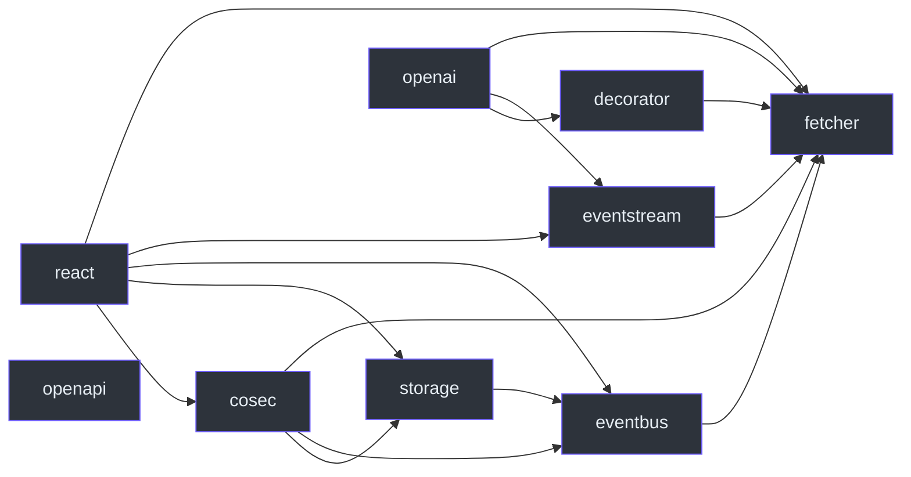

# 包边界

核心包没有内部运行依赖或 peer 依赖。按责任选择附加能力，再满足所选包的 peer 要求。“业务上可选”不意味着可以忽略已经声明的 peer。见 [packages/fetcher/package.json:31](https://github.com/Ahoo-Wang/fetcher/blob/main/packages/fetcher/package.json#L31)。

## 声明的内部 peer

下图每条箭头表示**起点包声明终点包为内部 peer 依赖**。这是安装图，不是请求调用图。名称省略 `@ahoo-wang/fetcher-*` 前缀；`fetcher` 表示 `@ahoo-wang/fetcher`。OpenAPI 只提供类型，没有内部 peer。

| 层                     | 责任与成本                                                                                          | 清单依据                                                                                                                                                                                                                                             |
| ---------------------- | --------------------------------------------------------------------------------------------------- | ---------------------------------------------------------------------------------------------------------------------------------------------------------------------------------------------------------------------------------------------------- |
| fetcher                | HTTP 默认配置、拦截、结果提取；无内部依赖                                                           | [packages/fetcher/package.json:31](https://github.com/Ahoo-Wang/fetcher/blob/main/packages/fetcher/package.json#L31)                                                                                                                                 |
| decorator              | 声明式服务；需要 metadata 配置及运行依赖 `reflect-metadata`                                         | [packages/decorator/package.json:54](https://github.com/Ahoo-Wang/fetcher/blob/main/packages/decorator/package.json#L54)                                                                                                                             |
| eventbus / eventstream | 事件分发 / SSE 处理；各自以核心包为 peer                                                            | [packages/eventbus/package.json:52](https://github.com/Ahoo-Wang/fetcher/blob/main/packages/eventbus/package.json#L52), [packages/eventstream/package.json:53](https://github.com/Ahoo-Wang/fetcher/blob/main/packages/eventstream/package.json#L53) |
| storage / cosec        | 存储事件 / 认证协议；需要额外管理状态生命周期                                                       | [packages/storage/package.json:56](https://github.com/Ahoo-Wang/fetcher/blob/main/packages/storage/package.json#L56), [packages/cosec/package.json:54](https://github.com/Ahoo-Wang/fetcher/blob/main/packages/cosec/package.json#L54)               |
| openai                 | 基于核心、装饰器与流的服务专用运行客户端                                                            | [packages/openai/package.json:59](https://github.com/Ahoo-Wang/fetcher/blob/main/packages/openai/package.json#L59)                                                                                                                                   |
| react                  | 请求与集成 Hook；React/ReactDOM peer，直接依赖 `dequal` 与 `immer`；提供 `/core`、`/fetcher` 子路径 | [packages/react/package.json:64](https://github.com/Ahoo-Wang/fetcher/blob/main/packages/react/package.json#L64)                                                                                                                                     |
| openapi                | OpenAPI 3 类型词汇；既不发送请求，也不验证输入                                                      | [packages/openapi/src/index.ts:19](https://github.com/Ahoo-Wang/fetcher/blob/main/packages/openapi/src/index.ts#L19)                                                                                                                                 |

## 安装不等于执行

React 对 CoSec 的 peer 边不表示每个 Hook 都通过 CoSec 认证。导入 `@ahoo-wang/fetcher-react/core` 只加载 React，导入 `@ahoo-wang/fetcher-react/fetcher` 只加载 `@ahoo-wang/fetcher`，但声明的 peer 仍是安装前提，见 [React 子路径入口](../reference/react/index.md#subpath-entries)。执行路径见[请求生命周期](./request-lifecycle.md)。

OpenAPI 类型本身既不发送请求，也不验证输入。作为开发依赖列出的 React Compiler 工具链，并不会把仓库的编译管线强加给每个消费者。服务声明见[声明式服务](../guides/services/declarative-client.md)；选择消费者版本前先阅读[运行环境](./runtime-support.md)。

## 迁往 Wow 仓库的包 {#packages-that-moved-to-the-wow-repository}

与 Wow 耦合的包在 6.0 之前已离开本仓库。它们在这里的最后版本是 5.x 线（npm 5.1.x，分支 [`5.x`](https://github.com/Ahoo-Wang/fetcher/tree/5.x)）；介绍它们的页面只适用于 5.x。

| 5.x 包                                        | 从 6.0 起                                                                       | 阅读                                                                                                                                                 |
| --------------------------------------------- | ------------------------------------------------------------------------------- | ---------------------------------------------------------------------------------------------------------------------------------------------------- |
| `@ahoo-wang/fetcher-wow`                      | Wow 仓库 [`typescript/`](https://github.com/Ahoo-Wang/Wow/tree/main/typescript) | 5.x：[Wow 指南](../guides/integrations/wow.md)、[Wow 参考](../reference/wow/index.md)；6.0 起：[wow.ahoo.me](https://wow.ahoo.me)                    |
| `@ahoo-wang/fetcher-react` 中的 Wow 查询 Hook | Wow 仓库，基于 `@ahoo-wang/fetcher-react/fetcher` 构建                          | [wow.ahoo.me](https://wow.ahoo.me)                                                                                                                   |
| `@ahoo-wang/fetcher-generator`                | Wow 仓库                                                                        | 5.x：[生成客户端](../guides/services/generated-client.md)、[生成器参考](../reference/generator/index.md)；6.0 起：[wow.ahoo.me](https://wow.ahoo.me) |
| `@ahoo-wang/fetcher-viewer`、数据监控 Hook    | 冻结在 5.x；由 Wow 仓库的 `@ahoo-wang/wow-view-engine` 接替（尚未发布）         | 5.x：[Viewer 指南](../guides/viewer/index.md)、[Viewer 参考](../reference/viewer/index.md)                                                           |

Wow 仓库的 TypeScript 包随 Wow 首个稳定版发布；视图引擎要等宣布稳定后才发布。在此之前，5.x 消费者继续使用上述 5.1.x 版本。
