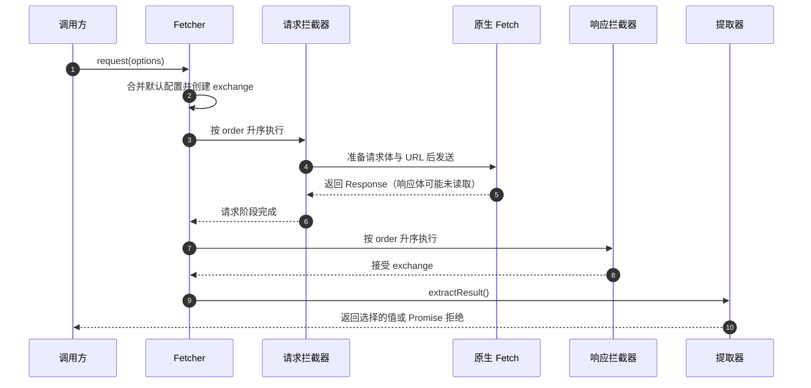

# 请求生命周期

请求有两个不同的完成边界：exchange 管线可以先接受响应，而调用方尚未读完响应体。将传输策略放入拦截器，并在调用方等待结果的位置处理解码失败。

## 成功路径

图中展示 `request()` 的成功路径，参与者依次为调用方、Fetcher、请求拦截器、原生 Fetch、响应拦截器和提取器。默认请求 registry 包含请求体准备、URL 解析和 Fetch 本身，原生传输位于请求阶段内部。每个 registry 按 `order` 升序串行执行。`exchange()` 执行请求、响应 registry 后返回 exchange；`request()` 随后调用 `extractResult()`。见 [packages/fetcher/src/interceptorManager.ts:63](https://github.com/Ahoo-Wang/fetcher/blob/main/packages/fetcher/src/interceptorManager.ts#L63)、[packages/fetcher/src/interceptor.ts:294](https://github.com/Ahoo-Wang/fetcher/blob/main/packages/fetcher/src/interceptor.ts#L294) 和 [packages/fetcher/src/fetcher.ts:173](https://github.com/Ahoo-Wang/fetcher/blob/main/packages/fetcher/src/fetcher.ts#L173)。

| 入口                                              | 默认返回值            | 适用需求                           |
| ------------------------------------------------- | --------------------- | ---------------------------------- |
| `exchange()`                                      | 拦截完成后的 exchange | 直接操作管线上下文                 |
| `request()`                                       | `FetchExchange`       | 请求/响应/错误上下文               |
| `fetch()`、`get()`、`post()` 及其他 HTTP 辅助方法 | `Response`            | 状态、响应头或原生响应体读取器     |
| 显式选择 JSON 提取器的请求                        | 解析值                | 返回数据的服务函数，由应用验证数据 |

默认值依据 [packages/fetcher/src/fetcher.ts:98](https://github.com/Ahoo-Wang/fetcher/blob/main/packages/fetcher/src/fetcher.ts#L98)、[packages/fetcher/src/fetcher.ts:230](https://github.com/Ahoo-Wang/fetcher/blob/main/packages/fetcher/src/fetcher.ts#L230) 和 [packages/fetcher/src/fetcher.ts:256](https://github.com/Ahoo-Wang/fetcher/blob/main/packages/fetcher/src/fetcher.ts#L256)。JSON 提取调用 `response.json()`，泛型参数不增加运行时验证。见 [packages/fetcher/src/resultExtractor.ts:69](https://github.com/Ahoo-Wang/fetcher/blob/main/packages/fetcher/src/resultExtractor.ts#L69) 与[选择结果](../guides/http/results.md)。

## 恢复不会重跑验证

请求或响应拦截器抛错时，管理器将错误存入 exchange 并执行错误拦截器。如果错误被清除，exchange 立即返回，不再执行响应拦截器。因此恢复拦截器应负责替代响应的有效性。剩余错误包装为 `ExchangeError`；错误拦截器自身抛出的错误则直接传播。见 [packages/fetcher/src/interceptorManager.ts:191](https://github.com/Ahoo-Wang/fetcher/blob/main/packages/fetcher/src/interceptorManager.ts#L191)。

结果提取在这之后发生。JSON 解码或自定义提取器可以失败，且不会重新进入错误 registry。应在消费结果的代码旁处理解码失败，详见[失败模型](./failure-model.md)。

## 提取缓存属于单个 exchange

exchange 缓存提取值或 Promise，替换响应会清除缓存。已拒绝的提取 Promise 保留在缓存中；同步抛错不会写入缓存。这避免同一个 exchange 重复提取，但不缓存跨请求 HTTP 响应，也不进行查询去重。数据新鲜度仍由应用决定。见 [packages/fetcher/src/fetchExchange.ts:224](https://github.com/Ahoo-Wang/fetcher/blob/main/packages/fetcher/src/fetchExchange.ts#L224) 和 [packages/fetcher/src/fetchExchange.ts:278](https://github.com/Ahoo-Wang/fetcher/blob/main/packages/fetcher/src/fetchExchange.ts#L278)。

实现步骤见[拦截器指南](../guides/http/interceptors.md)、[拦截器参考](../reference/fetcher/interceptors.md)及[结果参考](../reference/fetcher/results.md)。[失败模型](./failure-model.md)说明了传输超时为何不是完整响应体或流的截止时间。
