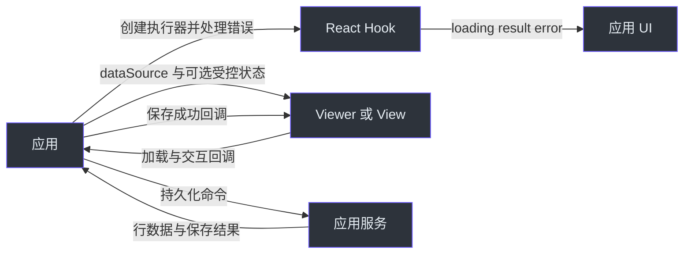

# 状态与资源所有权

连接表格与请求 Hook 前，先确定每个值归谁管理。组件能够防止旧结果覆盖自身状态，并不意味着它拥有你的数据源或能撤销服务端工作。

## 应用、Hook 与表格

下图箭头表示传入的数据或请求的动作，是所有权交互图，不是包依赖图。应用可以组合 Hook 与 View/Viewer，但不表示每个表格都创建 Hook。

图中 Application 创建执行器、处理错误并持有数据；React Hook 输出请求状态；Viewer/View 接收数据和可选受控状态，通过交互或加载回调通知应用；应用调用服务持久化，再通知表格保存成功。

| 状态或资源                         | 所有者与更新路径                                 | 清理或限制                                                                        |
| ---------------------------------- | ------------------------------------------------ | --------------------------------------------------------------------------------- |
| Hook `loading/result/error/status` | `useExecutePromise` 仅在挂载且请求最新时提交状态 | 新执行取消前一个 controller；卸载取消；执行器必须使用 controller 才能停止实际工作 |
| Hook exchange                      | `useFetcher` 保存 exchange，选择显式或注册客户端 | 共享客户端状态有独立生命周期                                                      |
| 行数据与总数                       | 应用通过 `dataSource` 传入 `PagedList`           | View 不会自动筛选、排序或分页传入的行                                             |
| 单视图交互状态                     | View 内部管理，外部值/更新回调可将其变为受控状态 | 应用处理对应查询并传入下一份数据                                                  |
| 视图集合与当前视图                 | Viewer 管理集合/选择，通过 `onLoadData` 请求数据 | 持久化仍由应用回调承担                                                            |

Hook 行为见 [packages/react/src/core/useExecutePromise.ts:210](https://github.com/Ahoo-Wang/fetcher/blob/main/packages/react/src/core/useExecutePromise.ts#L210)、[packages/react/src/core/useExecutePromise.ts:320](https://github.com/Ahoo-Wang/fetcher/blob/main/packages/react/src/core/useExecutePromise.ts#L320) 和 [packages/react/src/fetcher/useFetcher.ts:162](https://github.com/Ahoo-Wang/fetcher/blob/main/packages/react/src/fetcher/useFetcher.ts#L162)。`reset()` 仅设置空闲状态，不取消也不使当前执行失效（[packages/react/src/core/useExecutePromise.ts:309](https://github.com/Ahoo-Wang/fetcher/blob/main/packages/react/src/core/useExecutePromise.ts#L309)）。表格所有权见 [packages/viewer/src/view/View.tsx:106](https://github.com/Ahoo-Wang/fetcher/blob/main/packages/viewer/src/view/View.tsx#L106)、[packages/viewer/src/view/hooks/useViewState.ts:285](https://github.com/Ahoo-Wang/fetcher/blob/main/packages/viewer/src/view/hooks/useViewState.ts#L285) 和 [packages/viewer/src/viewer/Viewer.tsx:199](https://github.com/Ahoo-Wang/fetcher/blob/main/packages/viewer/src/viewer/Viewer.tsx#L199)。

## 保存视图有明确确认边界

使用 **Viewer** 时，应用实现 `onCreateView`、`onUpdateView` 和 `onDeleteView`。只有应用调用提供的成功回调，Viewer 才更新本地集合/选择。应在满足应用要求的持久化结果后调用，并自行展示失败。点击保存不代表组件默认持久化。见 [packages/viewer/src/viewer/Viewer.tsx:140](https://github.com/Ahoo-Wang/fetcher/blob/main/packages/viewer/src/viewer/Viewer.tsx#L140) 与[保存视图指南](../guides/viewer/saved-views.md)。

**FetcherViewer** 接入特定后端协议。创建和更新会等待 Wow 命令达到 `PROCESSED`，重读视图快照，检查聚合/租户/所有者身份、`definitionId` 匹配，以及有限的 `snapshot.version >= aggregateVersion`，之后才触发成功。缺失版本或版本落后会显示未确认/重试状态。删除流程重读并调用回调，没有相同的版本确认。见 [packages/viewer/src/fetcherviewer/FetcherViewer.tsx:202](https://github.com/Ahoo-Wang/fetcher/blob/main/packages/viewer/src/fetcherviewer/FetcherViewer.tsx#L202)、[packages/viewer/src/fetcherviewer/FetcherViewer.tsx:382](https://github.com/Ahoo-Wang/fetcher/blob/main/packages/viewer/src/fetcherviewer/FetcherViewer.tsx#L382)、[packages/viewer/src/fetcherviewer/FetcherViewer.tsx:461](https://github.com/Ahoo-Wang/fetcher/blob/main/packages/viewer/src/fetcherviewer/FetcherViewer.tsx#L461) 和 [packages/viewer/src/fetcherviewer/FetcherViewer.tsx:514](https://github.com/Ahoo-Wang/fetcher/blob/main/packages/viewer/src/fetcherviewer/FetcherViewer.tsx#L514)。

该确认只适用于这些视图变更，不适用于任意行查询，也不是通用读己之写保证；它没有限定投影延迟上界。

## 身份变化与资源释放

FetcherViewer 在 `definitionId/tenantId/ownerId` 变化时重新挂载内部状态；卸载后，变更标记会忽略旧创建/更新命令的完成；删除没有相同的标记检查。远端行加载 POST `PagedQuery`，将 `internalCondition` 与交互条件组合，只暴露当前请求对象对应的数据。这些行为保护 UI 状态，不负责授权，也不会撤销服务端命令。见 [packages/viewer/src/fetcherviewer/FetcherViewer.tsx:103](https://github.com/Ahoo-Wang/fetcher/blob/main/packages/viewer/src/fetcherviewer/FetcherViewer.tsx#L103)、[packages/viewer/src/fetcherviewer/FetcherViewer.tsx:188](https://github.com/Ahoo-Wang/fetcher/blob/main/packages/viewer/src/fetcherviewer/FetcherViewer.tsx#L188) 和 [packages/viewer/src/fetcherviewer/hooks/useFetchData.ts:53](https://github.com/Ahoo-Wang/fetcher/blob/main/packages/viewer/src/fetcherviewer/hooks/useFetchData.ts#L53)。

| 资源                   | 释放做什么                     | 创建者仍需管理什么                                           |
| ---------------------- | ------------------------------ | ------------------------------------------------------------ |
| React 事件订阅         | effect 清理移除该订阅          | 共享总线生命周期                                             |
| KeyStorage             | `destroy()` 移除自身事件处理器 | 持久化数据及共享总线；默认串行总线是本地事件，不是跨标签同步 |
| BroadcastTypedEventBus | `destroy()` 关闭其 messenger   | 关闭前确保共享使用者的生命周期合适                           |

见 [packages/react/src/eventbus/useEventSubscription.ts:94](https://github.com/Ahoo-Wang/fetcher/blob/main/packages/react/src/eventbus/useEventSubscription.ts#L94)、[packages/storage/src/keyStorage.ts:237](https://github.com/Ahoo-Wang/fetcher/blob/main/packages/storage/src/keyStorage.ts#L237)、[packages/storage/src/keyStorage.ts:466](https://github.com/Ahoo-Wang/fetcher/blob/main/packages/storage/src/keyStorage.ts#L466) 和 [packages/eventbus/src/broadcastTypedEventBus.ts:236](https://github.com/Ahoo-Wang/fetcher/blob/main/packages/eventbus/src/broadcastTypedEventBus.ts#L236)。继续阅读 [React 清理](../guides/react/cleanup.md)、[远端数据](../guides/viewer/remote-data.md)、[FetcherViewer 参考](../reference/viewer/fetcher-viewer.md)及 [SSR 作用域](./runtime-support.md)。
