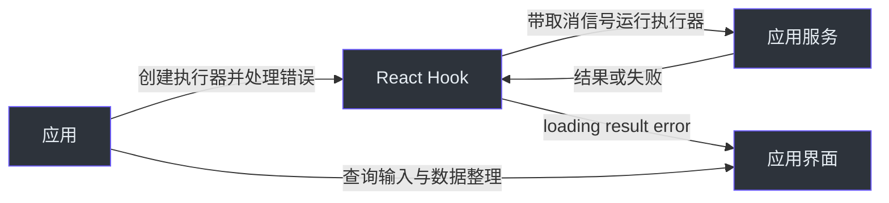

# 状态与资源所有权

把组件连到请求 Hook 前，先确定每个值归谁管理。Hook 能够防止旧结果覆盖自身状态，并不意味着它拥有你的数据源或能撤销服务端工作。

## 应用、Hook 与服务

下图箭头表示传入的数据或请求的动作，是所有权交互图，不是包依赖图。

| 状态或资源                         | 所有者与更新路径                                                   | 清理或限制                                                                      |
| ---------------------------------- | ------------------------------------------------------------------ | ------------------------------------------------------------------------------- |
| Hook `loading/result/error/status` | `useExecutePromise` 仅在挂载且请求最新时提交状态                   | 新执行取消前一个 controller；卸载时取消；执行器必须使用 controller 停止实际工作 |
| Hook exchange                      | `useFetcher` 保存 exchange（请求失败时清除），选择显式或注册客户端 | 共享客户端状态有独立生命周期                                                    |
| 查询输入                           | `useQuery` / `useFetcherQuery` 保存 query，变化时重新执行          | Hook 不在组件之间缓存响应；共享数据请通过自己的状态或服务                       |
| 防抖定时器                         | 防抖 Hook 管理自己的定时器                                         | 定时器 `cancel()` 与活动请求 `abort()` 相互独立                                 |
| 行数据、总数与视图偏好             | 应用及其服务                                                       | 筛选、排序、分页和持久化由应用决定                                              |

Hook 行为见 [packages/react/src/core/useExecutePromise.ts:210](https://github.com/Ahoo-Wang/fetcher/blob/main/packages/react/src/core/useExecutePromise.ts#L210)、[packages/react/src/core/useExecutePromise.ts:320](https://github.com/Ahoo-Wang/fetcher/blob/main/packages/react/src/core/useExecutePromise.ts#L320) 和 [packages/react/src/fetcher/useFetcher.ts:162](https://github.com/Ahoo-Wang/fetcher/blob/main/packages/react/src/fetcher/useFetcher.ts#L162)。`reset()` 仅设置空闲状态，不取消也不使当前执行失效（[packages/react/src/core/useExecutePromise.ts:309](https://github.com/Ahoo-Wang/fetcher/blob/main/packages/react/src/core/useExecutePromise.ts#L309)）。

旧结果保护只防止旧响应覆盖更新的 UI 状态；它不负责授权，不会撤销已发送的命令，也不保证随后的读取能看到之前的写入。这些应与服务一起决定。

## 身份变化与资源释放

租户或用户变化时，重新挂载持有请求状态的子树，避免 Hook 结果跨身份残留。存储键和事件总线也按同一身份划分。

| 资源                   | 释放做什么                                                      | 创建者仍需管理什么                                                             |
| ---------------------- | --------------------------------------------------------------- | ------------------------------------------------------------------------------ |
| React 事件订阅         | effect 清理移除它自己建立的订阅，不会移除同名的其他订阅者处理器 | 共享总线生命周期                                                               |
| KeyStorage             | `destroy()` 移除自身事件处理器并关闭自己创建的总线              | 持久化数据及通过 `eventBus` 传入的总线；默认串行总线是本地事件，不是跨标签同步 |
| BroadcastTypedEventBus | `destroy()` 关闭其 messenger                                    | 关闭前确保共享使用者的生命周期合适                                             |

见 [packages/react/src/eventbus/useEventSubscription.ts:94](https://github.com/Ahoo-Wang/fetcher/blob/main/packages/react/src/eventbus/useEventSubscription.ts#L94)、[packages/storage/src/keyStorage.ts:242](https://github.com/Ahoo-Wang/fetcher/blob/main/packages/storage/src/keyStorage.ts#L242)、[packages/storage/src/keyStorage.ts:527](https://github.com/Ahoo-Wang/fetcher/blob/main/packages/storage/src/keyStorage.ts#L527) 和 [packages/eventbus/src/broadcastTypedEventBus.ts:236](https://github.com/Ahoo-Wang/fetcher/blob/main/packages/eventbus/src/broadcastTypedEventBus.ts#L236)。继续阅读 [React 清理](../guides/react/cleanup.md)、[存储与事件](../guides/integrations/storage-and-events.md)及 [SSR 作用域](./runtime-support.md)。

5.x Viewer 与 FetcherViewer 的保存视图确认规则随 5.x 线记录在[保存视图指南](../guides/viewer/saved-views.md)与 [FetcherViewer 参考](../reference/viewer/fetcher-viewer.md)中。
