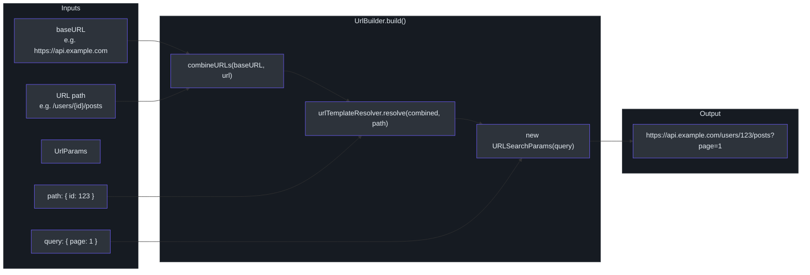
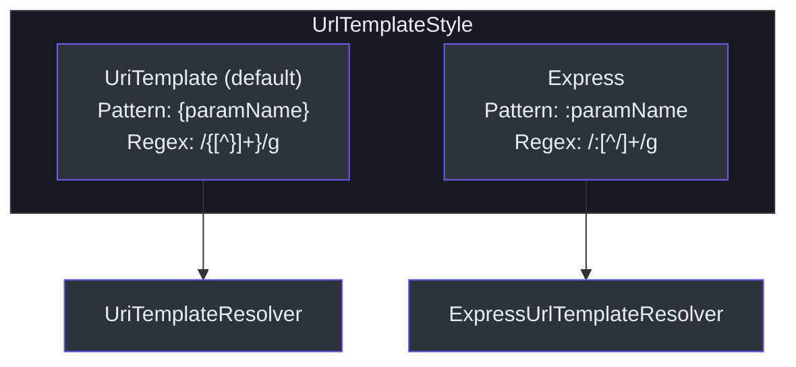
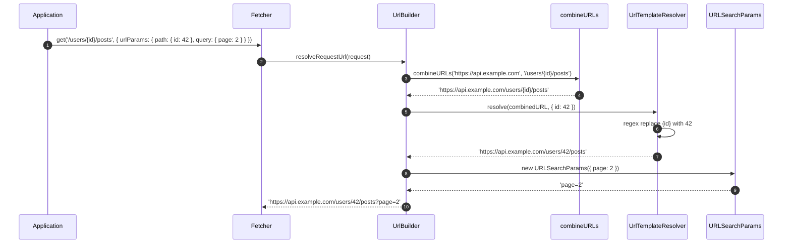
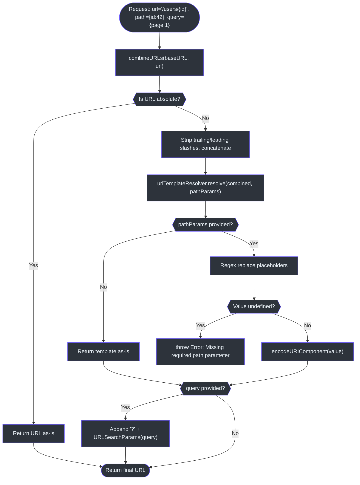

# URL 构建器

`UrlBuilder` 类负责根据基础 URL、路径参数模板和查询参数构建完整的请求 URL。它由每个 `Fetcher` 实例持有，在请求拦截器阶段由 `UrlResolveInterceptor` 调用。

Source: [packages/fetcher/src/urlBuilder.ts](https://github.com/Ahoo-Wang/fetcher/blob/main/packages/fetcher/src/urlBuilder.ts)

## URL 构建管道



## UrlBuilder 类

`UrlBuilder` 类封装了基础 URL、模板解析器和构建逻辑。

```typescript
// [packages/fetcher/src/urlBuilder.ts:72-147]
export class UrlBuilder implements BaseURLCapable {
  baseURL: string;
  urlTemplateResolver: UrlTemplateResolver;

  constructor(baseURL: string, urlTemplateStyle?: UrlTemplateStyle) {
    this.baseURL = baseURL;
    this.urlTemplateResolver = getUrlTemplateResolver(urlTemplateStyle);
  }

  build(url: string, params?: UrlParams): string {
    const path = params?.path;
    const query = params?.query;
    const combinedURL = combineURLs(this.baseURL, url);
    let finalUrl = this.urlTemplateResolver.resolve(combinedURL, path);
    if (query) {
      const queryString = new URLSearchParams(query).toString();
      if (queryString) {
        finalUrl += '?' + queryString;
      }
    }
    return finalUrl;
  }

  resolveRequestUrl(request: FetchRequest): string {
    return this.build(request.url, request.urlParams);
  }
}
```

Source: [packages/fetcher/src/urlBuilder.ts:72-147](https://github.com/Ahoo-Wang/fetcher/blob/main/packages/fetcher/src/urlBuilder.ts#L72-L147)

### 构建步骤

`build()` 方法按顺序执行三个步骤：

| 步骤 | 函数 | 输入 | 输出 |
|---|---|---|---|
| 1. 合并 | `combineURLs(baseURL, url)` | 基础 URL + 相对 URL | 合并后的 URL 字符串 |
| 2. 模板 | `urlTemplateResolver.resolve(combined, path)` | 包含 `{id}` 或 `:id` 的 URL | 参数替换后的 URL |
| 3. 查询 | `new URLSearchParams(query).toString()` | 查询对象 | 以 `?` 拼接的查询字符串 |

### resolveRequestUrl 桥接方法

`UrlResolveInterceptor` 调用 `resolveRequestUrl()` 来在实际 fetch 之前填充 `request.url`：

```typescript
// [packages/fetcher/src/urlResolveInterceptor.ts:74-78]
intercept(exchange: FetchExchange) {
  const request = exchange.request;
  request.url = exchange.fetcher.urlBuilder.resolveRequestUrl(request);
}
```

Source: [packages/fetcher/src/urlResolveInterceptor.ts:74-78](https://github.com/Ahoo-Wang/fetcher/blob/main/packages/fetcher/src/urlResolveInterceptor.ts#L74-L78)

## URL 合并

`combineURLs` 函数将基础 URL 与相对 URL 合并，处理绝对 URL、尾部斜杠和前导斜杠等边界情况。

```typescript
// [packages/fetcher/src/urls.ts:27-57]
export function isAbsoluteURL(url: string) {
  return /^([a-z][a-z\d+\-.]*:)?\/\//i.test(url);
}

export function combineURLs(baseURL: string, relativeURL: string) {
  if (isAbsoluteURL(relativeURL)) {
    return relativeURL;
  }
  return relativeURL
    ? baseURL.replace(/\/+$/, '') + '/' + relativeURL.replace(/^\/+/, '')
    : baseURL;
}
```

Source: [packages/fetcher/src/urls.ts:27-57](https://github.com/Ahoo-Wang/fetcher/blob/main/packages/fetcher/src/urls.ts#L27-L57)

### 合并示例

| 基础 URL | 相对 URL | 结果 |
|---|---|---|
| `https://api.example.com` | `/users` | `https://api.example.com/users` |
| `https://api.example.com/` | `users` | `https://api.example.com/users` |
| `https://api.example.com` | `https://other.com/users` | `https://other.com/users` |
| `https://api.example.com/v1/` | `/users` | `https://api.example.com/v1/users` |
| `https://api.example.com` | *（空）* | `https://api.example.com` |

## 路径参数模板

Fetcher 支持两种 URL 模板样式用于路径参数插值，通过 `UrlTemplateStyle` 枚举控制。



### UrlTemplateStyle 枚举

```typescript
// [packages/fetcher/src/urlTemplateResolver.ts:20-38]
export enum UrlTemplateStyle {
  UriTemplate, // {paramName} -- RFC 6570
  Express,     // :paramName -- Express.js style
}
```

Source: [packages/fetcher/src/urlTemplateResolver.ts:20-38](https://github.com/Ahoo-Wang/fetcher/blob/main/packages/fetcher/src/urlTemplateResolver.ts#L20-L38)

### UriTemplateResolver（默认）

遵循 [RFC 6570](https://www.rfc-editor.org/rfc/rfc6570.html) URI 模板语法，使用花括号。

| 模板 | 参数 | 解析结果 |
|---|---|---|
| `/users/{id}` | `{ id: 123 }` | `/users/123` |
| `/users/{id}/posts/{postId}` | `{ id: 1, postId: 42 }` | `/users/1/posts/42` |
| `/search/{query}` | `{ query: 'hello world' }` | `/search/hello%20world` |
| `/files/{name}` | `{ name: 'a/b' }` | `/files/a%2Fb` |

正则表达式模式 `/ \{ ([^}]+) \} /g` 匹配花括号内的所有内容：

```typescript
// [packages/fetcher/src/urlTemplateResolver.ts:217]
private static PATH_PARAM_REGEX = /{([^}]+)}/g;
```

Source: [packages/fetcher/src/urlTemplateResolver.ts:217](https://github.com/Ahoo-Wang/fetcher/blob/main/packages/fetcher/src/urlTemplateResolver.ts#L217)

### ExpressUrlTemplateResolver

模仿 Express.js 路由参数，使用冒号前缀。

| 模板 | 参数 | 解析结果 |
|---|---|---|
| `/users/:id` | `{ id: 123 }` | `/users/123` |
| `/users/:id/posts/:postId` | `{ id: 1, postId: 42 }` | `/users/1/posts/42` |

正则表达式模式 `/: ([^/]+)/g` 匹配冒号前缀的段落：

```typescript
// [packages/fetcher/src/urlTemplateResolver.ts:320]
private static PATH_PARAM_REGEX = /:([^/]+)/g;
```

Source: [packages/fetcher/src/urlTemplateResolver.ts:320](https://github.com/Ahoo-Wang/fetcher/blob/main/packages/fetcher/src/urlTemplateResolver.ts#L320)

### 模板解析算法

两种解析器共享同一个解析函数：

```typescript
// [packages/fetcher/src/urlTemplateResolver.ts:151-165]
export function urlTemplateRegexResolve(
  urlTemplate: string,
  pathParamRegex: RegExp,
  pathParams?: Record<string, any> | null,
) {
  if (!pathParams) return urlTemplate;
  return urlTemplate.replace(pathParamRegex, (_, key) => {
    const value = pathParams[key];
    if (value === undefined) {
      throw new Error(`Missing required path parameter: ${key}`);
    }
    return encodeURIComponent(value);
  });
}
```

Source: [packages/fetcher/src/urlTemplateResolver.ts:151-165](https://github.com/Ahoo-Wang/fetcher/blob/main/packages/fetcher/src/urlTemplateResolver.ts#L151-L165)

关键行为：
- **缺失参数抛出异常**：如果模板占位符在 `pathParams` 中没有对应的值，将抛出 `Error`，消息为 `Missing required path parameter: <name>`。
- **URL 编码**：参数值通过 `encodeURIComponent` 编码，确保 URL 字符安全。
- **无参数时**：如果 `pathParams` 为 null/undefined，则原样返回模板。

### 模板解析序列图



## 查询参数

查询参数由 `URLSearchParams` 原生处理。`UrlParams.query` 对象直接传递给构造函数。

```typescript
// [packages/fetcher/src/urlBuilder.ts:121-133]
build(url: string, params?: UrlParams): string {
  const path = params?.path;
  const query = params?.query;
  const combinedURL = combineURLs(this.baseURL, url);
  let finalUrl = this.urlTemplateResolver.resolve(combinedURL, path);
  if (query) {
    const queryString = new URLSearchParams(query).toString();
    if (queryString) {
      finalUrl += '?' + queryString;
    }
  }
  return finalUrl;
}
```

Source: [packages/fetcher/src/urlBuilder.ts:121-133](https://github.com/Ahoo-Wang/fetcher/blob/main/packages/fetcher/src/urlBuilder.ts#L121-L133)

### 查询参数示例

| 查询对象 | 生成的查询字符串 |
|---|---|
| `{ page: 1, limit: 10 }` | `?page=1&limit=10` |
| `{ filter: 'active', tags: ['a', 'b'] }` | `?filter=active&tags=a&tags=b` |
| `{ search: 'hello world' }` | `?search=hello+world` |
| `{}` 或 `undefined` | *（无查询字符串）* |

## UrlParams 接口

`UrlParams` 接口将路径参数和查询参数分组到一个对象中，通过 `FetchRequest.urlParams` 传递。

```typescript
// [packages/fetcher/src/urlBuilder.ts:27-53]
export interface UrlParams {
  path?: Record<string, any>;
  query?: Record<string, any>;
}
```

Source: [packages/fetcher/src/urlBuilder.ts:27-53](https://github.com/Ahoo-Wang/fetcher/blob/main/packages/fetcher/src/urlBuilder.ts#L27-L53)

`FetchExchange` 提供了一个辅助方法，确保 `urlParams` 已使用空的 `path` 和 `query` 对象初始化：

```typescript
// [packages/fetcher/src/fetchExchange.ts:192-206]
ensureRequestUrlParams(): Required<UrlParams> {
  if (!this.request.urlParams) {
    this.request.urlParams = { path: {}, query: {} };
  }
  if (!this.request.urlParams.path) {
    this.request.urlParams.path = {};
  }
  if (!this.request.urlParams.query) {
    this.request.urlParams.query = {};
  }
  return this.request.urlParams as Required<UrlParams>;
}
```

Source: [packages/fetcher/src/fetchExchange.ts:192-206](https://github.com/Ahoo-Wang/fetcher/blob/main/packages/fetcher/src/fetchExchange.ts#L192-L206)

## 工厂函数

`getUrlTemplateResolver` 工厂函数根据 `UrlTemplateStyle` 枚举返回相应的解析器：

```typescript
// [packages/fetcher/src/urlTemplateResolver.ts:63-70]
export function getUrlTemplateResolver(style?: UrlTemplateStyle): UrlTemplateResolver {
  if (style === UrlTemplateStyle.Express) {
    return expressUrlTemplateResolver;
  }
  return uriTemplateResolver;
}
```

Source: [packages/fetcher/src/urlTemplateResolver.ts:63-70](https://github.com/Ahoo-Wang/fetcher/blob/main/packages/fetcher/src/urlTemplateResolver.ts#L63-L70)

单例实例已导出供直接使用：

```typescript
// [packages/fetcher/src/urlTemplateResolver.ts:297]
export const uriTemplateResolver = new UriTemplateResolver();

// [packages/fetcher/src/urlTemplateResolver.ts:392]
export const expressUrlTemplateResolver = new ExpressUrlTemplateResolver();
```

Source: [packages/fetcher/src/urlTemplateResolver.ts:297](https://github.com/Ahoo-Wang/fetcher/blob/main/packages/fetcher/src/urlTemplateResolver.ts#L297), [packages/fetcher/src/urlTemplateResolver.ts:392](https://github.com/Ahoo-Wang/fetcher/blob/main/packages/fetcher/src/urlTemplateResolver.ts#L392)

## 在 Fetcher 中配置

`UrlTemplateStyle` 在 Fetcher 构造时设置，之后不可更改：

```typescript
// In Fetcher constructor
// [packages/fetcher/src/fetcher.ts:144-150]
constructor(options: FetcherOptions = DEFAULT_OPTIONS) {
  this.urlBuilder = new UrlBuilder(options.baseURL, options.urlTemplateStyle);
  // ...
}
```

Source: [packages/fetcher/src/fetcher.ts:144-150](https://github.com/Ahoo-Wang/fetcher/blob/main/packages/fetcher/src/fetcher.ts#L144-L150)

### 切换到 Express 样式

```typescript
import { Fetcher, UrlTemplateStyle } from '@ahoo-wang/fetcher';

const fetcher = new Fetcher({
  baseURL: 'https://api.example.com',
  urlTemplateStyle: UrlTemplateStyle.Express,
});

// Now uses :paramName syntax
const response = await fetcher.get('/users/:id/posts/:postId', {
  urlParams: {
    path: { id: 123, postId: 456 },
    query: { sort: 'newest' },
  },
});
// Final URL: https://api.example.com/users/123/posts/456?sort=newest
```

## 完整 URL 解析流程图



## 提取路径参数名称

两种解析器都提供 `extractPathParams()` 方法，返回模板中找到的参数名称列表。此方法供代码生成器用于构建类型化的参数接口。

```typescript
// [packages/fetcher/src/urlTemplateResolver.ts:174-184]
export function urlTemplateRegexExtract(
  urlTemplate: string,
  pathParamRegex: RegExp,
): string[] {
  const matches: string[] = [];
  let match;
  while ((match = pathParamRegex.exec(urlTemplate)) !== null) {
    matches.push(match[1]);
  }
  return matches;
}
```

Source: [packages/fetcher/src/urlTemplateResolver.ts:174-184](https://github.com/Ahoo-Wang/fetcher/blob/main/packages/fetcher/src/urlTemplateResolver.ts#L174-L184)

| 模板 | 样式 | 提取的参数 |
|---|---|---|
| `/users/{id}/posts/{postId}` | UriTemplate | `['id', 'postId']` |
| `/users/:id/posts/:postId` | Express | `['id', 'postId']` |
| `/users/profile` | *任意* | `[]` |

## 交叉引用

- [Fetcher 核心](/architecture/fetcher-core) -- `Fetcher` 如何持有 `UrlBuilder` 并通过选项传递
- [拦截器系统](/architecture/interceptors) -- `UrlResolveInterceptor` 在请求阶段如何调用 `resolveRequestUrl()`
- [架构总览](/architecture/) -- 包依赖关系图和设计原则
