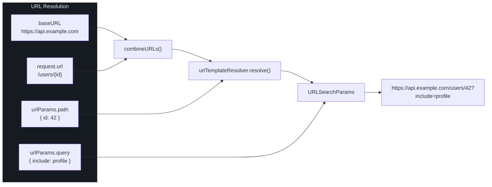
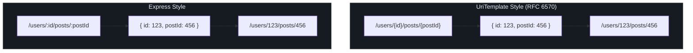
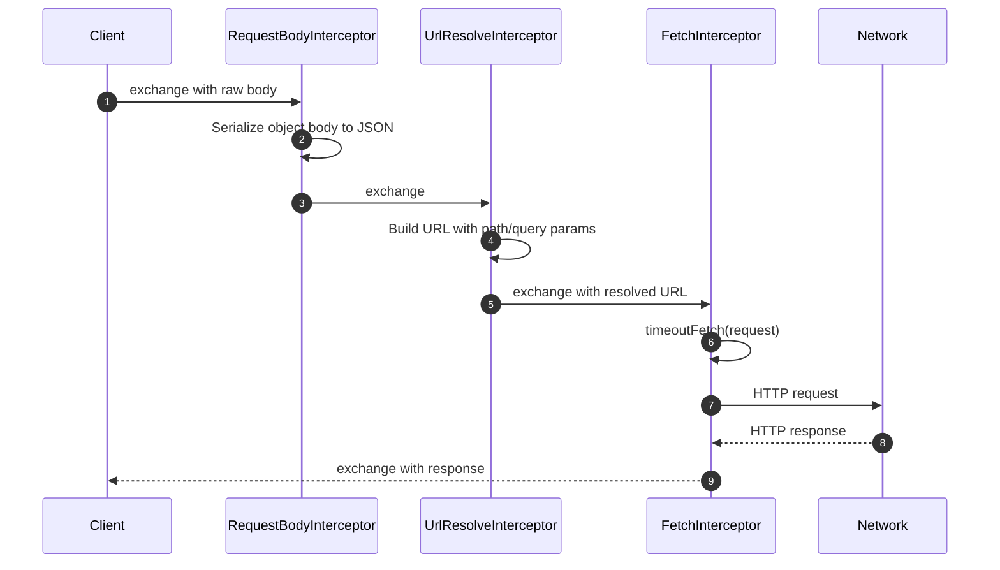
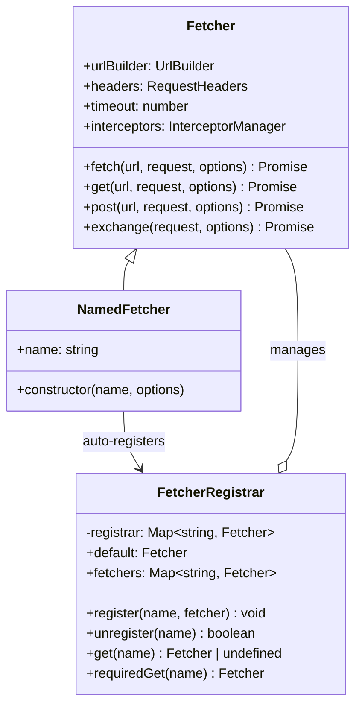
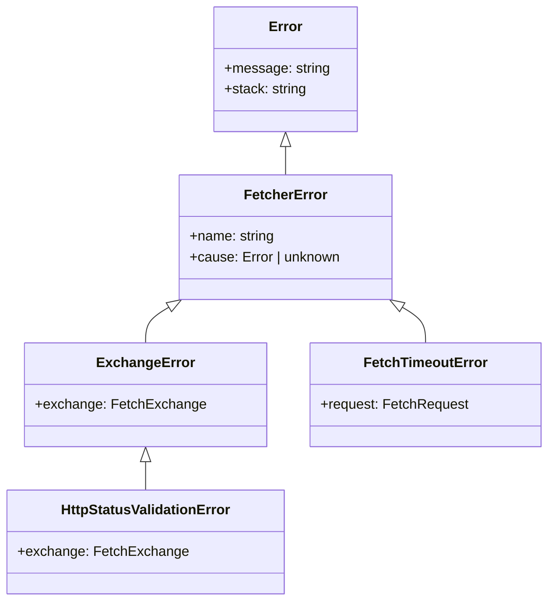

# 配置

本页面是 Fetcher 的完整配置参考。每个选项都记录了其源代码位置、默认值和使用示例。

## FetcherOptions

[`FetcherOptions`](https://github.com/Ahoo-Wang/fetcher/blob/main/packages/fetcher/src/fetcher.ts#L51-L80) 接口控制 `Fetcher` 实例的方方面面。

| 属性 | 类型 | 默认值 | 描述 |
|------|------|--------|------|
| `baseURL` | `string` | `''` | 添加到所有请求路径前的基础 URL |
| `headers` | `RequestHeaders` | `{ 'Content-Type': 'application/json' }` | 所有请求的默认头 |
| `timeout` | `number` | `undefined`（无超时） | 默认超时时间（毫秒） |
| `urlTemplateStyle` | `UrlTemplateStyle` | `UrlTemplateStyle.UriTemplate` | 路径参数语法（`{param}` 或 `:param`） |
| `interceptors` | `InterceptorManager` | `new InterceptorManager(validateStatus)` | 自定义拦截器管理器（覆盖默认值） |
| `validateStatus` | `(status: number) => boolean` | `status >= 200 && status < 300` | 响应状态验证函数 |

::: warning 使用自定义 InterceptorManager 时 validateStatus 会被忽略
如果你提供了自定义的 `interceptors` 管理器，`validateStatus` **不会生效**——默认的 `ValidateStatusInterceptor` 不会被添加。你必须自行添加状态验证：

```typescript
import { InterceptorManager, ValidateStatusInterceptor } from '@ahoo-wang/fetcher';

const interceptors = new InterceptorManager();
// 使用自定义 InterceptorManager 时必须手动添加验证
interceptors.response.use(new ValidateStatusInterceptor((status) => status < 500));

const fetcher = new Fetcher({
  interceptors,
  // 这里的 validateStatus 会被忽略
});
```
:::

```typescript
import { Fetcher, InterceptorManager } from '@ahoo-wang/fetcher';
import { UrlTemplateStyle } from '@ahoo-wang/fetcher';

const options: FetcherOptions = {
  baseURL: 'https://api.example.com/v2',
  headers: {
    'Content-Type': 'application/json',
    Accept: 'application/json',
  },
  timeout: 10000,
  urlTemplateStyle: UrlTemplateStyle.UriTemplate,
  validateStatus: (status) => status >= 200 && status < 300,
};

const fetcher = new Fetcher(options);
```

### 默认选项

默认配置定义在 [`DEFAULT_OPTIONS`](https://github.com/Ahoo-Wang/fetcher/blob/main/packages/fetcher/src/fetcher.ts#L86-L89) 中：

```typescript
export const DEFAULT_OPTIONS: FetcherOptions = {
  baseURL: '',
  headers: { 'Content-Type': 'application/json' },
};
```

## baseURL

`baseURL` 由 [`UrlBuilder`](https://github.com/Ahoo-Wang/fetcher/blob/main/packages/fetcher/src/urlBuilder.ts#L72-L160) 添加到每个请求 URL 前。组合逻辑位于 [`combineURLs()`](https://github.com/Ahoo-Wang/fetcher/blob/main/packages/fetcher/src/urls.ts)：

```typescript
// 绝对请求 URL 会绕过 baseURL
await fetcher.get('https://other-api.com/data');

// 相对路径会被组合
await fetcher.get('/users');
// -> https://api.example.com/users
```



## timeout

[`resolveTimeout`](https://github.com/Ahoo-Wang/fetcher/blob/main/packages/fetcher/src/timeout.ts#L81-L89) 函数决定每个请求的有效超时时间。请求级别的超时优先于 fetcher 级别的超时：

```typescript
// Fetcher 级别默认值：5 秒
const fetcher = new Fetcher({ timeout: 5000 });

// 使用 5000ms（fetcher 默认值）
await fetcher.get('/users');

// 使用 3000ms（请求级别覆盖）
await fetcher.get('/fast-endpoint', { timeout: 3000 });

// 使用 0（此请求无超时）
await fetcher.get('/slow-report', { timeout: 0 });
```

超时通过 [`timeoutFetch()`](https://github.com/Ahoo-Wang/fetcher/blob/main/packages/fetcher/src/timeout.ts#L120-L172) 实现，它创建一个 `AbortController` 并将 fetch promise 与超时 promise 进行竞争。如果超时触发，则抛出 [`FetchTimeoutError`](https://github.com/Ahoo-Wang/fetcher/blob/main/packages/fetcher/src/timeout.ts#L33-L53)。

| 场景 | 行为 |
|------|------|
| `timeout: undefined` | 无超时；请求无限期运行 |
| `timeout: 0` | 无超时（与 undefined 相同） |
| `timeout: 5000` | 5000ms 后中止，抛出 `FetchTimeoutError` |
| 提供了自定义 `abortController` | 使用该控制器；超时仍通过竞争机制生效 |
| 请求上有自定义 `signal` | 直接委托给 `fetch()`；超时被忽略 |

## headers

默认头与每个请求的头合并。请求头优先：

```typescript
const fetcher = new Fetcher({
  headers: {
    'Content-Type': 'application/json',
    'X-App-Version': '1.0.0',
  },
});

// 发送默认头 + Authorization
await fetcher.get('/protected', {
  headers: {
    Authorization: 'Bearer token123',
  },
});

// 上传 FormData —— 切勿手动设置 Content-Type；
// RequestBodyInterceptor 会自动检测 FormData 并移除调用方提供的
// Content-Type，以便浏览器能设置正确的 multipart 边界。
await fetcher.post('/upload', {
  body: formData,
});
```

合并逻辑位于 [`Fetcher.resolveExchange()`](https://github.com/Ahoo-Wang/fetcher/blob/main/packages/fetcher/src/fetcher.ts#L172-L194)：

```typescript
const mergedHeaders = { ...this.headers, ...request.headers };
```

## URL 模板风格

Fetcher 支持两种路径参数语法，通过 [`UrlTemplateStyle`](https://github.com/Ahoo-Wang/fetcher/blob/main/packages/fetcher/src/urlTemplateResolver.ts#L20-L38) 配置：



| 风格 | 模板 | 参数对象 | 解析器类 |
|------|------|---------|---------|
| `UrlTemplateStyle.UriTemplate`（默认） | `/users/{id}` | `{ id: 123 }` | [`UriTemplateResolver`](https://github.com/Ahoo-Wang/fetcher/blob/main/packages/fetcher/src/urlTemplateResolver.ts#L205-L295) |
| `UrlTemplateStyle.Express` | `/users/:id` | `{ id: 123 }` | [`ExpressUrlTemplateResolver`](https://github.com/Ahoo-Wang/fetcher/blob/main/packages/fetcher/src/urlTemplateResolver.ts#L316-L390) |

```typescript
import { Fetcher, UrlTemplateStyle } from '@ahoo-wang/fetcher';

// RFC 6570 风格（默认）
const apiFetcher = new Fetcher({ baseURL: 'https://api.example.com' });
await apiFetcher.get('/users/{id}', {
  urlParams: { path: { id: 42 } },
});

// Express 风格
const expressFetcher = new Fetcher({
  baseURL: 'https://api.example.com',
  urlTemplateStyle: UrlTemplateStyle.Express,
});
await expressFetcher.get('/users/:id', {
  urlParams: { path: { id: 42 } },
});
```

路径参数值会自动使用 `encodeURIComponent()` 进行编码。

## 拦截器系统

[`InterceptorManager`](https://github.com/Ahoo-Wang/fetcher/blob/main/packages/fetcher/src/interceptorManager.ts#L48-L212) 管理三个拦截器注册表：

| 注册表 | 阶段 | 内置拦截器 |
|--------|------|-----------|
| `interceptors.request` | HTTP 调用之前 | `RequestBodyInterceptor`、`UrlResolveInterceptor`、`FetchInterceptor` |
| `interceptors.response` | HTTP 响应之后 | `ValidateStatusInterceptor` |
| `interceptors.error` | 发生错误时 | 无（默认为空） |

### 内置请求拦截器



| 拦截器 | 顺序 | 用途 |
|--------|------|------|
| [`RequestBodyInterceptor`](https://github.com/Ahoo-Wang/fetcher/blob/main/packages/fetcher/src/requestBodyInterceptor.ts) | 非常低（最先执行） | 将对象请求体转换为 JSON 字符串，设置 `Content-Type` |
| [`UrlResolveInterceptor`](https://github.com/Ahoo-Wang/fetcher/blob/main/packages/fetcher/src/urlResolveInterceptor.ts) | 非常高（在请求拦截器中最后执行） | 通过 `UrlBuilder.build()` 解析最终 URL |
| [`FetchInterceptor`](https://github.com/Ahoo-Wang/fetcher/blob/main/packages/fetcher/src/fetchInterceptor.ts) | 高 | 执行实际的 `timeoutFetch()` 调用 |
| [`ValidateStatusInterceptor`](https://github.com/Ahoo-Wang/fetcher/blob/main/packages/fetcher/src/validateStatusInterceptor.ts) | `Number.MAX_SAFE_INTEGER - 10000` | 验证响应状态码 |

### 自定义拦截器注册

```typescript
const fetcher = new Fetcher({ baseURL: 'https://api.example.com' });

// 请求拦截器
fetcher.interceptors.request.use({
  name: 'MetricsInterceptor',
  order: 200,
  async intercept(exchange) {
    exchange.attributes = exchange.attributes || new Map();
    exchange.attributes.set('startTime', Date.now());
  },
});

// 响应拦截器
fetcher.interceptors.response.use({
  name: 'MetricsCollector',
  order: 200,
  async intercept(exchange) {
    const startTime = exchange.attributes.get('startTime');
    if (startTime) {
      const duration = Date.now() - startTime;
      console.log(`Request took ${duration}ms`);
    }
  },
});

// 错误拦截器
fetcher.interceptors.error.use({
  name: 'RetryInterceptor',
  order: 100,
  async intercept(exchange) {
    // 实现重试逻辑
    if (shouldRetry(exchange.error)) {
      exchange.error = undefined; // 清除错误表示已处理
    }
  },
});
```

### 拦截器排序

拦截器按 `order` 值升序执行。[`BUILT_IN_INTERCEPTOR_ORDER_STEP`](https://github.com/Ahoo-Wang/fetcher/blob/main/packages/fetcher/src/interceptor.ts#L20-L21) 为 `10000`，为自定义拦截器提供了充足的间隔空间：

| 顺序范围 | 建议用途 |
|---------|---------|
| `0 - 9999` | 在所有内置拦截器之前 |
| `10000 - 19999` | 在第一个内置拦截器之后，第二个之前 |
| `20000 - 89999` | 在内置拦截器之间 |
| `90000+` | 在所有内置拦截器之后 |

### 绕过状态验证

要跳过特定请求的 `ValidateStatusInterceptor`，请设置 `IGNORE_VALIDATE_STATUS` 属性：

```typescript
import { IGNORE_VALIDATE_STATUS } from '@ahoo-wang/fetcher';

await fetcher.get('/endpoint-that-returns-404', {}, {
  attributes: { [IGNORE_VALIDATE_STATUS]: true },
});
```

### 移除拦截器

```typescript
// 按名称移除
fetcher.interceptors.request.eject('MetricsInterceptor');

// 清除注册表中的所有拦截器
fetcher.interceptors.error.clear();
```

## ValidateStatus

[`validateStatus`](https://github.com/Ahoo-Wang/fetcher/blob/main/packages/fetcher/src/validateStatusInterceptor.ts#L40-L62) 函数决定哪些 HTTP 状态码被视为成功：

```typescript
// 接受所有状态码（永不因状态码抛出异常）
const fetcher = new Fetcher({
  validateStatus: () => true,
});

// 仅接受 200
const strictFetcher = new Fetcher({
  validateStatus: (status) => status === 200,
});

// 接受 2xx 和 3xx
const relaxedFetcher = new Fetcher({
  validateStatus: (status) => status >= 200 && status < 400,
});
```

当验证失败时，会抛出 [`HttpStatusValidationError`](https://github.com/Ahoo-Wang/fetcher/blob/main/packages/fetcher/src/validateStatusInterceptor.ts#L27-L36)（继承自 [`ExchangeError`](https://github.com/Ahoo-Wang/fetcher/blob/main/packages/fetcher/src/fetcherError.ts#L86-L106)），可通过它访问完整的 exchange 对象。

## 结果提取器

结果提取器控制 `fetcher.fetch()`、`get()`、`post()` 等方法的返回值。可以按请求或按类配置：

```typescript
import { ResultExtractors } from '@ahoo-wang/fetcher';

// 按请求配置：提取为 JSON
const user = await fetcher.get<User>('/users/1', {}, {
  resultExtractor: ResultExtractors.Json,
});

// exchange 级别的请求方法默认使用 ResultExtractors.Exchange
const exchange = await fetcher.exchange({ url: '/users', method: 'GET' });
// exchange.request、exchange.response、exchange.error 均可访问
```

| 提取器 | 返回类型 | 适用场景 |
|--------|---------|---------|
| `ExchangeResultExtractor` | `FetchExchange` | 自定义处理、日志记录、指标统计 |
| `ResponseResultExtractor` | `Response` | 访问原始响应（头信息、状态码） |
| `JsonResultExtractor` | `Promise<any>` | JSON API 响应 |
| `TextResultExtractor` | `Promise<string>` | HTML、纯文本 |
| `BlobResultExtractor` | `Promise<Blob>` | 文件、图片 |
| `ArrayBufferResultExtractor` | `Promise<ArrayBuffer>` | 二进制协议 |
| `BytesResultExtractor` | `Promise<Uint8Array>` | Protobuf、二进制数据 |

各方法的默认结果提取器：

| 方法 | 默认提取器 |
|------|-----------|
| `fetcher.fetch()` | `ResponseResultExtractor` |
| `fetcher.get()` / `post()` 等 | `ResponseResultExtractor` |
| `fetcher.exchange()` | `ExchangeResultExtractor` |
| `fetcher.request()` | `ExchangeResultExtractor` |

## NamedFetcher 和 FetcherRegistrar

### NamedFetcher

[`NamedFetcher`](https://github.com/Ahoo-Wang/fetcher/blob/main/packages/fetcher/src/namedFetcher.ts#L38-L66) 继承自 `Fetcher`，并自动向全局 [`fetcherRegistrar`](https://github.com/Ahoo-Wang/fetcher/blob/main/packages/fetcher/src/fetcherRegistrar.ts#L166) 注册自身：

```typescript
import { NamedFetcher } from '@ahoo-wang/fetcher';

// 自动注册为 'payments-api'
new NamedFetcher('payments-api', {
  baseURL: 'https://payments.example.com',
  timeout: 8000,
  headers: { 'X-Api-Key': 'key123' },
});
```

包中导出了一个名为 `'default'` 的默认 `NamedFetcher` 实例：

```typescript
import { fetcher } from '@ahoo-wang/fetcher';
// fetcher 是 'default' 命名实例
```

### FetcherRegistrar

[`FetcherRegistrar`](https://github.com/Ahoo-Wang/fetcher/blob/main/packages/fetcher/src/fetcherRegistrar.ts#L41-L150) 是一个带有便捷方法的 `Map<string, Fetcher>` 包装器：

```typescript
import { fetcherRegistrar } from '@ahoo-wang/fetcher';

// 手动注册
fetcherRegistrar.register('custom', myFetcher);

// 获取
const client = fetcherRegistrar.get('custom'); // Fetcher | undefined
const required = fetcherRegistrar.requiredGet('custom'); // Fetcher（缺失时抛出异常）

// 默认 getter/setter
fetcherRegistrar.default = myFetcher; // 注册为 'default'
const defaultClient = fetcherRegistrar.default; // requiredGet('default')

// 获取所有已注册的 fetcher
const all: Map<string, Fetcher> = fetcherRegistrar.fetchers;

// 注销
fetcherRegistrar.unregister('custom'); // boolean
```



### 特定环境配置

使用 `NamedFetcher` 设置环境感知的客户端：

```typescript
import { NamedFetcher } from '@ahoo-wang/fetcher';

const baseURL = import.meta.env.VITE_API_BASE_URL || 'http://localhost:3000';

// API 的默认客户端
new NamedFetcher('default', {
  baseURL,
  timeout: 5000,
});

// 具有不同配置的第三方 API 客户端
new NamedFetcher('openai', {
  baseURL: 'https://api.openai.com/v1',
  headers: {
    Authorization: `Bearer ${import.meta.env.VITE_OPENAI_KEY}`,
  },
  timeout: 30000,
});

// 具有更长超时时间的管理客户端
new NamedFetcher('admin', {
  baseURL: `${baseURL}/admin`,
  timeout: 60000,
  headers: { 'X-Admin-Token': import.meta.env.VITE_ADMIN_TOKEN },
});
```

### 装饰器集成

`@api` 装饰器内部使用 `FetcherRegistrar`。当你在装饰器选项中指定 `fetcher: 'openai'` 时，它会在装饰时调用 `fetcherRegistrar.requiredGet('openai')`：

```typescript
import { NamedFetcher, fetcherRegistrar } from '@ahoo-wang/fetcher';
import { api, get } from '@ahoo-wang/fetcher-decorator';

// 必须在类装饰执行之前注册
new NamedFetcher('llm', { baseURL: 'https://api.openai.com/v1' });

@api('/v1/chat', { fetcher: 'llm' })
class ChatService {
  @get('/models')
  listModels(): Promise<any> {
    throw autoGeneratedError();
  }
}
```

## 错误处理

Fetcher 提供了结构化的错误层次体系：



| 错误 | 触发条件 | 可访问 |
|------|---------|--------|
| [`FetchTimeoutError`](https://github.com/Ahoo-Wang/fetcher/blob/main/packages/fetcher/src/timeout.ts#L33-L53) | 请求超时 | `error.request` |
| [`HttpStatusValidationError`](https://github.com/Ahoo-Wang/fetcher/blob/main/packages/fetcher/src/validateStatusInterceptor.ts#L27-L36) | 状态码未通过 `validateStatus` | `error.exchange`（请求 + 响应） |
| [`ExchangeError`](https://github.com/Ahoo-Wang/fetcher/blob/main/packages/fetcher/src/fetcherError.ts#L86-L106) | 拦截器链中未处理的错误 | `error.exchange` |
| [`FetcherError`](https://github.com/Ahoo-Wang/fetcher/blob/main/packages/fetcher/src/fetcherError.ts#L37-L62) | 通用 fetcher 错误 | `error.cause` |

```typescript
import {
  Fetcher,
  FetchTimeoutError,
  HttpStatusValidationError,
  ExchangeError,
} from '@ahoo-wang/fetcher';

try {
  await fetcher.get('/data', { timeout: 3000 });
} catch (error) {
  if (error instanceof FetchTimeoutError) {
    console.log(`Timed out after ${error.request.timeout}ms`);
  } else if (error instanceof HttpStatusValidationError) {
    console.log(`Status ${error.exchange.response?.status} failed`);
  } else if (error instanceof ExchangeError) {
    console.log(`Exchange error: ${error.message}`);
  }
}
```

## 下一步阅读

| 主题 | 页面 |
|------|------|
| 代码示例快速上手 | [快速开始](./quick-start.md) |
| 项目概览和架构 | [简介](./index.md) |
| 参与 Fetcher 贡献 | [贡献指南](./contributing.md) |
