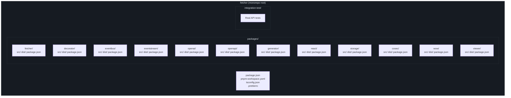
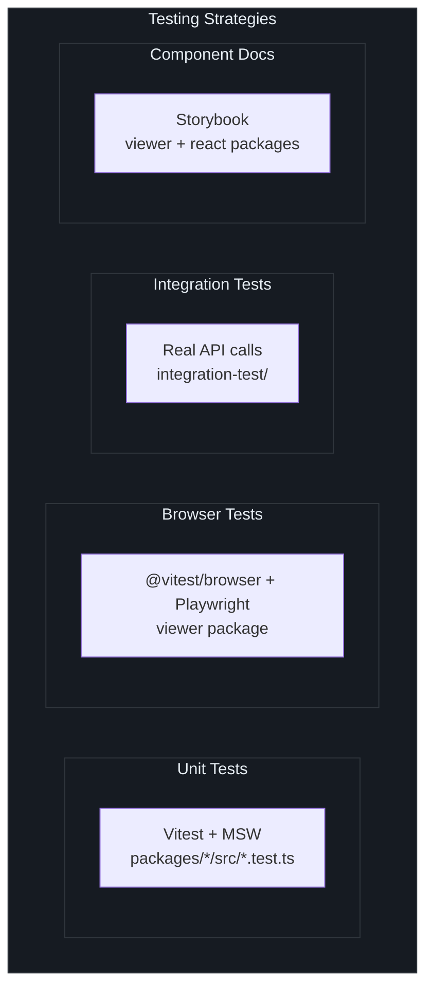
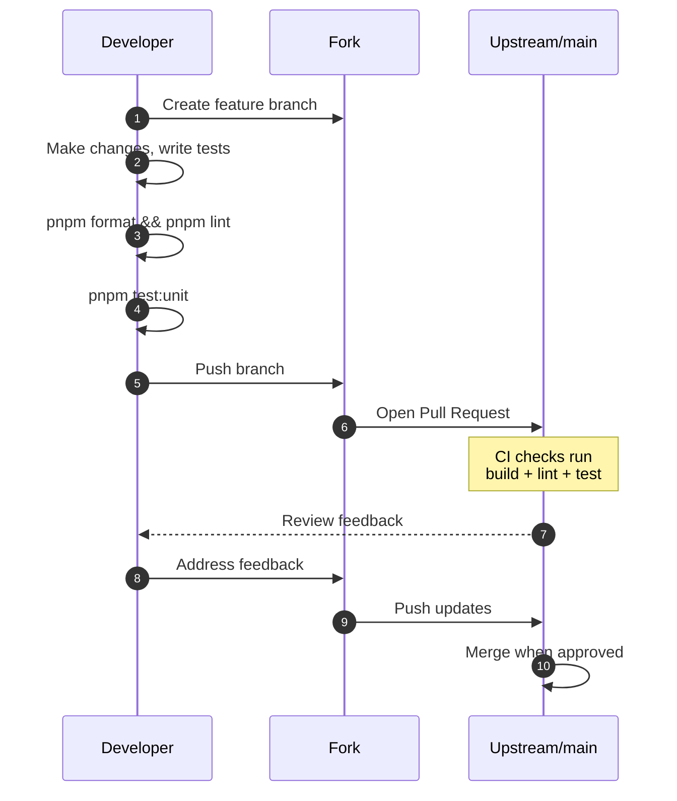

# 贡献指南

Fetcher 是一个基于 [Apache 2.0](https://github.com/Ahoo-Wang/fetcher/blob/main/package.json#L29) 许可证的开源项目。本指南涵盖了在本地运行项目并提交高质量 Pull Request 所需的一切信息。

## 开发环境搭建

### 前提条件

| 要求 | 最低版本 | 检查命令 |
|------|---------|---------|
| Node.js | 18.0.0 | `node --version` |
| pnpm | 10.33.0 | `pnpm --version` |
| Git | 2.x | `git --version` |

Fetcher 独占使用 ES 模块（`"type": "module"`），目标为 Node.js >= 18 以支持原生 Fetch API。

### 快速开始

```bash
# Fork 并克隆
git clone https://github.com/<your-username>/fetcher.git
cd fetcher

# 安装 monorepo 中所有依赖
pnpm install

# 构建所有包
pnpm build

# 运行单元测试以验证环境
pnpm test:unit
```

### 仓库结构



每个包遵循相同的内部布局：

```
packages/<name>/
  src/               # TypeScript 源文件
  dist/              # 构建输出（ESM + UMD + 类型声明）
  package.json       # 包特定的配置和脚本
  vite.config.ts     # Vite 构建配置
  tsconfig.json      # 继承根配置的 TypeScript 配置
```

## Monorepo 约定

### 工作区协议

依赖版本通过 [`pnpm-workspace.yaml`](https://github.com/Ahoo-Wang/fetcher/blob/main/pnpm-workspace.yaml) 中的 `catalog:` 协议集中管理。包引用 `catalog:` 而非硬编码版本范围：

```yaml
# pnpm-workspace.yaml
catalog:
  vitest: ^4.1.5
  vite: ^8.0.11
  typescript: ^6.0.3
```

```json
// packages/fetcher/package.json
{
  "devDependencies": {
    "vitest": "catalog:",
    "vite": "catalog:"
  }
}
```

这确保了所有包使用相同的依赖版本。

### 构建配置

所有包使用 [Vite](https://vite.dev/) 进行构建，配合 [`unplugin-dts`](https://github.com/unplugin/unplugin-dts) 生成类型声明。每个包输出：

| 产物 | 文件 | 格式 |
|------|------|------|
| ESM | `dist/index.es.js` | ES 模块 |
| UMD | `dist/index.umd.js` | 通用模块 |
| 类型声明 | `dist/index.d.ts` | TypeScript 声明 |

包含 React 组件的包（viewer、react）额外使用 `@vitejs/plugin-react` 配合 React Compiler 和 `@babel/plugin-proposal-decorators`（legacy 模式）。

### 包脚本

每个包都支持以下脚本：

```bash
# 构建单个包
pnpm --filter @ahoo-wang/fetcher build

# 测试单个包
pnpm --filter @ahoo-wang/fetcher test

# Lint 单个包
pnpm --filter @ahoo-wang/fetcher lint
```

或者使用根级别的命令对所有包进行操作：

```bash
pnpm build       # 构建所有包
pnpm test:unit   # 所有包的单元测试
pnpm test:it     # 仅集成测试
pnpm lint        # Lint 所有包
pnpm format      # 使用 Prettier 格式化所有文件
pnpm clean       # 清理所有 dist/ 目录
```

## 测试

Fetcher 使用 [Vitest](https://vitest.dev/) 作为测试运行器，采用多种测试策略：



### 单元测试

单元测试位于包根目录下的 `test/` 目录中（镜像 `src/` 结构），使用 `*.test.ts` 或 `*.test.tsx` 后缀。Vitest 全局变量已启用（`describe`、`it`、`expect`、`vi` 可直接使用，无需导入）：

```typescript
// 示例：packages/fetcher/test/fetcher.test.ts
import { Fetcher } from '../src/fetcher';

describe('Fetcher', () => {
  it('should create with default options', () => {
    const fetcher = new Fetcher();
    expect(fetcher.headers).toEqual({ 'Content-Type': 'application/json' });
  });
});
```

Fetcher 包使用 [MSW (Mock Service Worker)](https://mswjs.io/) 进行 HTTP 模拟：

```typescript
import { http, HttpResponse } from 'msw';
import { setupServer } from 'msw/node';

const server = setupServer(
  http.get('https://api.example.com/users', () => {
    return HttpResponse.json([{ id: 1, name: 'Alice' }]);
  }),
);

beforeAll(() => server.listen());
afterEach(() => server.resetHandlers());
afterAll(() => server.close());
```

### 运行测试

```bash
# 所有单元测试
pnpm test:unit

# 单个包
pnpm --filter @ahoo-wang/fetcher test

# 单个测试文件
pnpm --filter @ahoo-wang/fetcher vitest run test/fetcher.test.ts

# 带覆盖率
pnpm --filter @ahoo-wang/fetcher vitest run --coverage

# 集成测试（需要网络）
pnpm test:it
```

### 浏览器测试

Viewer 包通过 `@vitest/browser` 配合 Playwright 在真实浏览器中运行测试：

```bash
pnpm --filter @ahoo-wang/fetcher-viewer test
```

### 覆盖率

所有包使用 `@vitest/coverage-v8` 进行代码覆盖率报告。

### 测试命名约定

| 文件模式 | 用途 | ESLint |
|---------|------|--------|
| `*.test.ts` | 单元测试 | ESLint 忽略 |
| `*.test.tsx` | 组件测试 | ESLint 忽略 |

ESLint 配置为跳过测试文件，因此测试文件不会被 lint。

## 代码风格

Fetcher 通过 Prettier 和 ESLint 强制执行一致的代码风格。

### Prettier 配置

仓库根目录下的 [`.prettierrc`](https://github.com/Ahoo-Wang/fetcher/blob/main/.prettierrc)：

```json
{
  "semi": true,
  "trailingComma": "all",
  "singleQuote": true,
  "printWidth": 80,
  "tabWidth": 2,
  "useTabs": false,
  "bracketSpacing": true,
  "arrowParens": "avoid"
}
```

提交前运行格式化工具：

```bash
pnpm format
```

### ESLint

ESLint 使用 `@typescript-eslint`，关键规则如下：

| 规则 | 设置 | 备注 |
|------|------|------|
| `@typescript-eslint/no-explicit-any` | OFF | 允许使用 `any` |
| `@typescript-eslint/consistent-type-imports` | `prefer: "type-imports"` | 在 integration-test 和 story 文件中强制执行 |

运行 linter：

```bash
pnpm lint
```

### TypeScript

所有包使用严格 TypeScript 模式。根 `tsconfig.json` 启用了：

- `experimentalDecorators` -- `@ahoo-wang/fetcher-decorator` 所需
- `emitDecoratorMetadata` -- reflect-metadata 支持所需
- `strict: true` -- 完全严格模式

### 许可证头

每个源文件必须包含 Apache 2.0 许可证头：

```typescript
/*
 * Copyright [2021-present] [ahoo wang <ahoowang@qq.com> (https://github.com/Ahoo-Wang)].
 * Licensed under the Apache License, Version 2.0 (the "License");
 * you may not use this file except in compliance with the License.
 * You may obtain a copy of the License at
 *      http://www.apache.org/licenses/LICENSE-2.0
 * Unless required by applicable law or agreed to in writing, software
 * distributed under the License is distributed on an "AS IS" BASIS,
 * WITHOUT WARRANTIES OR CONDITIONS OF ANY KIND, either express or implied.
 * See the License for the specific language governing permissions and
 * limitations under the License.
 */
```

### 提交信息

遵循约定式提交风格：

```
type(scope): description

feat(fetcher): add support for custom abort controllers
fix(decorator): resolve parameter name extraction for arrow functions
test(eventstream): add integration tests for SSE parsing
chore(project): update dependencies to latest versions
docs(wiki): add configuration reference page
```

## Pull Request 流程

### 分支工作流



### 提交前检查

在提交 PR 之前，请在本地运行以下检查：

```bash
# 1. 格式化代码
pnpm format

# 2. Lint 所有包
pnpm lint

# 3. 构建所有包
pnpm build

# 4. 运行单元测试
pnpm test:unit
```

### PR 检查清单

- [ ] 代码编译无错误（`pnpm build`）
- [ ] 所有现有测试通过（`pnpm test:unit`）
- [ ] 新功能附带了单元测试
- [ ] 代码已格式化（`pnpm format`）
- [ ] Linter 通过（`pnpm lint`）
- [ ] 新文件包含许可证头
- [ ] 提交信息遵循约定式提交格式
- [ ] 如果公共 API 变更，文档已更新

## 版本管理

Fetcher 使用集中式版本管理脚本来保持所有包同步：

```bash
# 将所有包版本更新到新版本
pnpm update-version 3.17.0
```

此脚本（[`scripts/update-all-versions.sh`](https://github.com/Ahoo-Wang/fetcher/blob/main/scripts/update-all-versions.sh)）会更新 monorepo 中每个 `package.json` 的 version 字段，确保一致性。

当前版本维护在根 [`package.json`](https://github.com/Ahoo-Wang/fetcher/blob/main/package.json#L3) 中：

```json
{
  "version": "3.16.4"
}
```

## 添加新包

要向 monorepo 添加新包：

1. 在 `packages/` 下创建目录
2. 添加 `package.json`，名称为 `@ahoo-wang/fetcher-<name>`
3. 参照现有包的模式添加 `vite.config.ts`
4. 添加继承根配置的 `tsconfig.json`
5. 对所有共享依赖使用 `catalog:`
6. 根据需要更新包间依赖

```bash
# 示例：创建新包
mkdir packages/my-package
cd packages/my-package
# 创建 package.json、vite.config.ts、tsconfig.json、src/index.ts
```

[`pnpm-workspace.yaml`](https://github.com/Ahoo-Wang/fetcher/blob/main/pnpm-workspace.yaml#L1-L2) 中的 pnpm 工作区配置会自动识别新包：

```yaml
packages:
  - packages/*
  - integration-test
```

## 包体积分析

每个包都包含一个 `analyze` 脚本，使用 `vite-bundle-analyzer` 生成可视化的包体积报告：

```bash
pnpm --filter @ahoo-wang/fetcher analyze
```

## 下一步阅读

| 主题 | 页面 |
|------|------|
| 项目概览 | [简介](./index.md) |
| 快速开始指南 | [快速开始](./quick-start.md) |
| 完整配置参考 | [配置](./configuration.md) |
