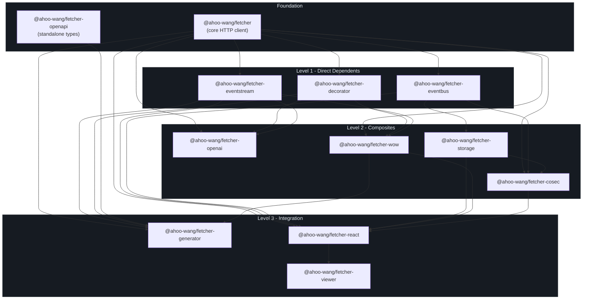
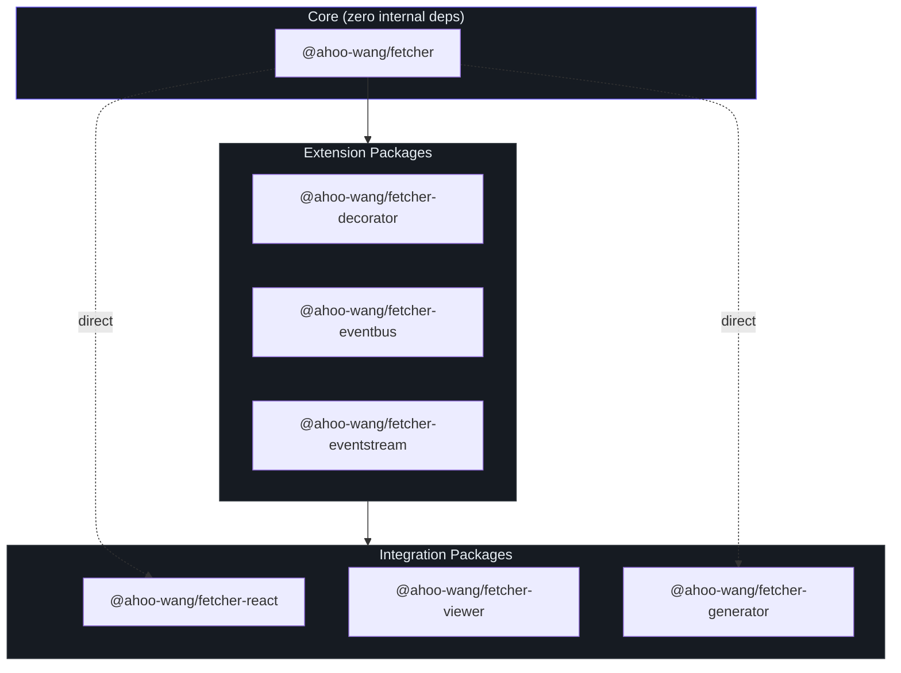
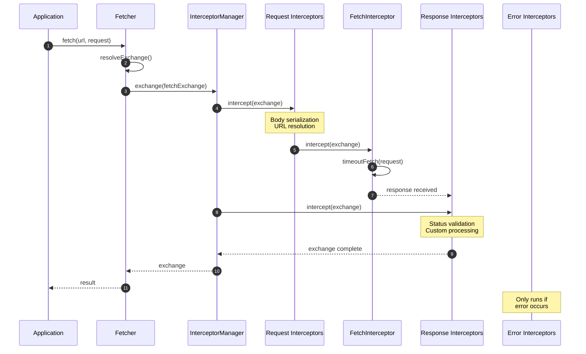
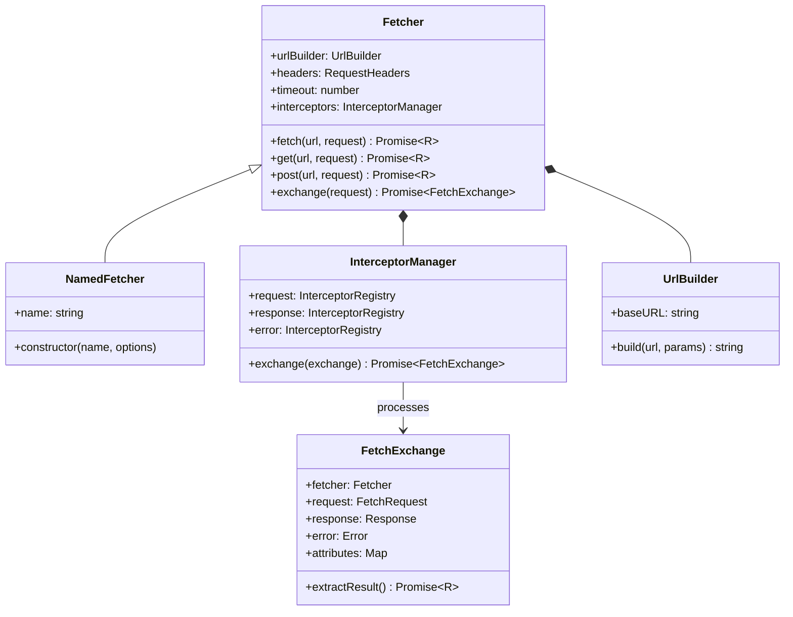

# 简介

Fetcher 是一个基于原生 Fetch API 构建的模块化 HTTP 客户端生态系统。它提供了类似 Axios 的开发体验，具备拦截器驱动的中间件、TypeScript 优先设计和原生 LLM 流式支持 -- 所有功能均以 `@ahoo-wang/*` 作用域下的 pnpm monorepo 形式发布。

## 为什么选择 Fetcher？

原生 Fetch API 功能强大但过于基础。应用需要基础 URL 管理、超时处理、请求/响应拦截器、URL 模板参数和结构化错误处理。现有的解决方案如 Axios 会增加显著的包体积，并且没有原生利用现代 Fetch API。

Fetcher 在保持轻量和模块化的同时解决了这些问题：

| 问题 | 原生 Fetch | Axios | Fetcher |
|------|-----------|-------|---------|
| 基础 URL 支持 | 手动 | 内置 | 内置（[`FetcherOptions.baseURL`](https://github.com/Ahoo-Wang/fetcher/blob/main/packages/fetcher/src/fetcher.ts#L51-L80)） |
| 超时处理 | 手动 AbortController | 内置 | 内置 [`TimeoutCapable`](https://github.com/Ahoo-Wang/fetcher/blob/main/packages/fetcher/src/timeout.ts#L60-L68) |
| 拦截器 | 无 | 有 | 有 -- 三阶段管道（[`InterceptorManager`](https://github.com/Ahoo-Wang/fetcher/blob/main/packages/fetcher/src/interceptorManager.ts#L48-L212)） |
| URL 路径参数 | 手动 | 手动 | 内置 `{param}` 和 `:param` 风格（[`UrlTemplateStyle`](https://github.com/Ahoo-Wang/fetcher/blob/main/packages/fetcher/src/urlTemplateResolver.ts#L20-L38)） |
| SSE/LLM 流式传输 | 手动 | 无 | 通过副作用导入原生支持（[`@ahoo-wang/fetcher-eventstream`](https://github.com/Ahoo-Wang/fetcher/blob/main/packages/eventstream/src/responses.ts#L102-L239)） |
| 声明式 API 客户端 | 无 | 无 | 基于装饰器（[`@ahoo-wang/fetcher-decorator`](https://github.com/Ahoo-Wang/fetcher/blob/main/packages/decorator/src/apiDecorator.ts#L232-L247)） |
| 包体积基线 | 0 KB（原生） | ~13 KB | ~4 KB（仅核心） |
| TypeScript 泛型 | 有限 | 良好 | 一流支持 |

## 包生态系统

Fetcher 以单个 monorepo 中的 12 个包发布，每个包可独立安装：

| 包 | npm 名称 | 描述 |
|----|----------|------|
| **fetcher** | `@ahoo-wang/fetcher` | 核心 HTTP 客户端 -- 一切的基础 |
| **decorator** | `@ahoo-wang/fetcher-decorator` | 用于声明式 API 服务的 TypeScript 装饰器 |
| **eventbus** | `@ahoo-wang/fetcher-eventbus` | 事件总线，支持串行、并行和广播实现 |
| **eventstream** | `@ahoo-wang/fetcher-eventstream` | SSE 和 LLM 流式支持（副作用模块） |
| **openai** | `@ahoo-wang/fetcher-openai` | 类型安全的 OpenAI API 客户端 |
| **openapi** | `@ahoo-wang/fetcher-openapi` | OpenAPI 3.x TypeScript 类型定义 |
| **generator** | `@ahoo-wang/fetcher-generator` | 从 OpenAPI 规范生成代码的 CLI 工具 |
| **react** | `@ahoo-wang/fetcher-react` | 用于数据获取的 React Hooks |
| **storage** | `@ahoo-wang/fetcher-storage` | 跨环境存储抽象 |
| **cosec** | `@ahoo-wang/fetcher-cosec` | CoSec 认证集成 |
| **wow** | `@ahoo-wang/fetcher-wow` | Wow DDD/CQRS 框架支持 |
| **viewer** | `@ahoo-wang/fetcher-viewer` | React + Ant Design API 文档组件 |

## 包依赖关系图

## 模块化设计

每个包均可独立安装。核心包 `@ahoo-wang/fetcher` 没有任何内部依赖 -- 所有其他包都基于它构建：

## 核心架构

请求生命周期流经三阶段拦截器管道：

## 核心类层次结构

## 核心特性

- **拦截器管道** -- 三阶段（请求/响应/错误）中间件链，支持有序执行。内置拦截器处理 URL 解析、请求体序列化、HTTP 执行和状态验证。
- **URL 模板参数** -- 通过 [`UrlTemplateStyle`](https://github.com/Ahoo-Wang/fetcher/blob/main/packages/fetcher/src/urlTemplateResolver.ts#L20-L38) 同时支持 URI 模板（`{id}`）和 Express 风格（`:param`）的路径参数插值。
- **命名 Fetcher 注册表** -- 使用 [`NamedFetcher`](https://github.com/Ahoo-wang/fetcher/blob/main/packages/fetcher/src/namedFetcher.ts#L38-L66) 和 [`FetcherRegistrar`](https://github.com/Ahoo-Wang/fetcher/blob/main/packages/fetcher/src/fetcherRegistrar.ts#L41-L150) 管理具有不同配置的多个 fetcher 实例。
- **声明式 API 客户端** -- 使用 `@api`、`@get`、`@post`、`@path`、`@query`、`@body` 装饰器定义类型安全的 API 服务，无需编写样板请求代码。
- **SSE 和 LLM 流式传输** -- 通过副作用导入原生支持 Server-Sent Events。为 `Response.prototype` 补充 `eventStream()` 和 `jsonEventStream()` 方法。
- **结果提取器** -- 通过 [`ResultExtractors`](https://github.com/Ahoo-Wang/fetcher/blob/main/packages/fetcher/src/resultExtractor.ts#L131-L160) 提供可配置的响应提取策略（`Json`、`Text`、`Blob`、`Exchange` 等）。
- **TypeScript 严格模式** -- 所有包均启用严格模式，全面支持泛型类型。
- **支持 Tree-Shaking** -- 每个包均可独立安装，只导入你需要的部分。

## 下一步阅读

| 目标 | 页面 |
|------|------|
| 快速上手运行 | [快速开始](./quick-start.md) |
| 为项目配置 Fetcher | [配置](./configuration.md) |
| 参与项目贡献 | [贡献指南](./contributing.md) |
