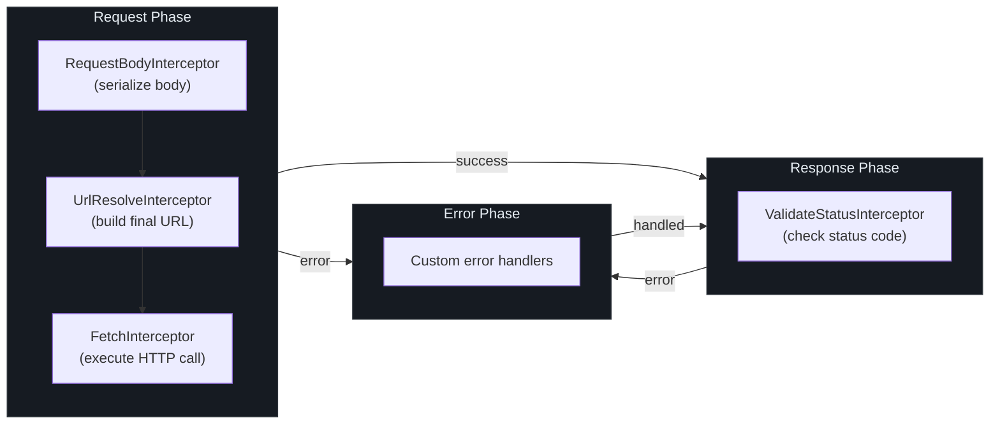
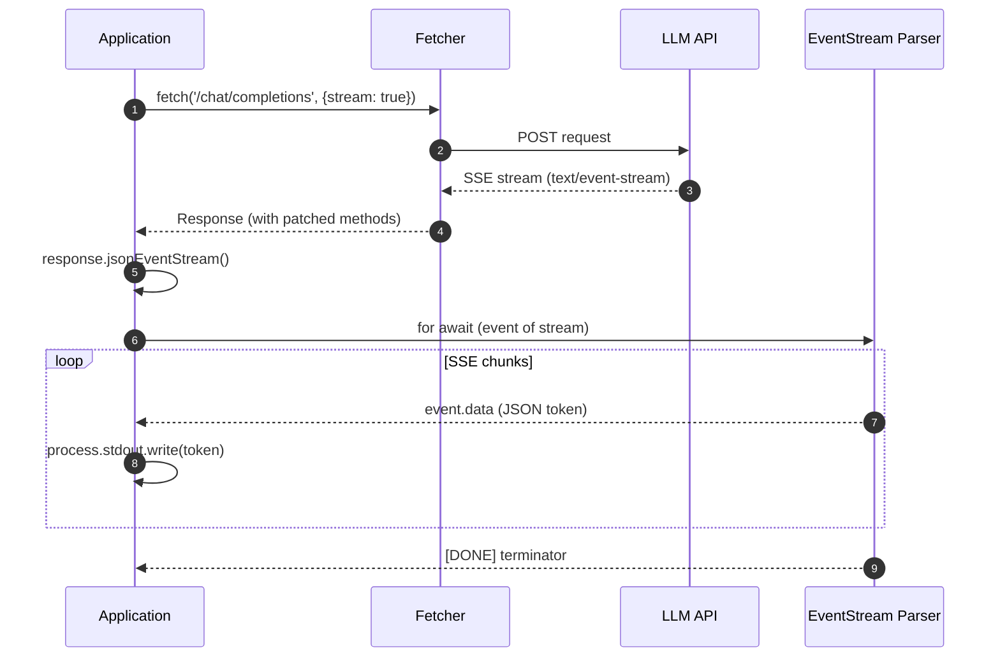
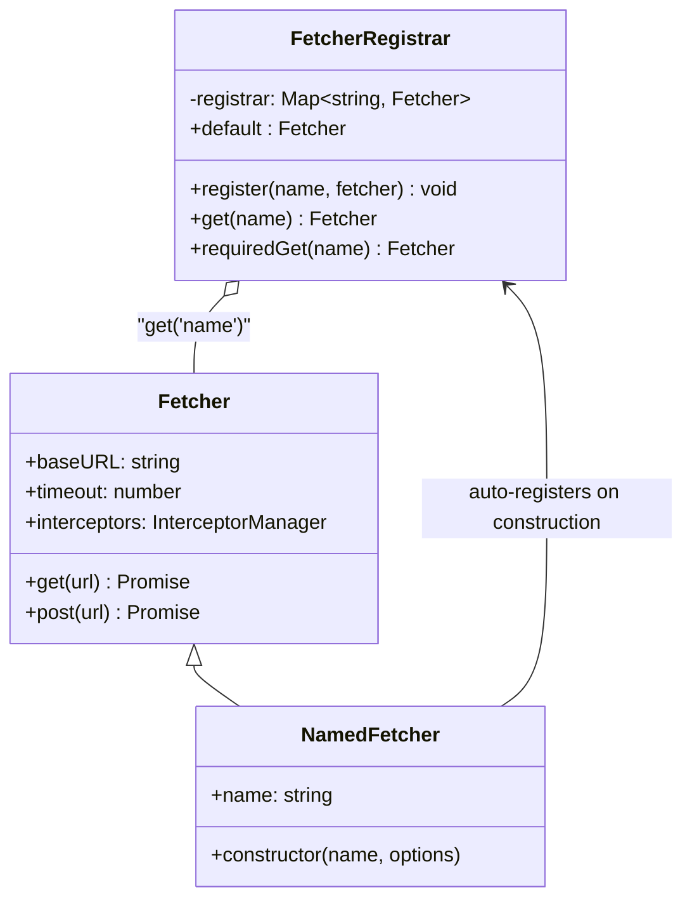

# 快速开始

本指南将引导你完成 Fetcher 的安装、第一个请求的发送、拦截器的添加、装饰器风格 API 服务的定义，以及 LLM 流的消费。

## 安装

安装核心包以及你需要的额外包：

::: code-group

```bash [pnpm]
# 核心 HTTP 客户端
pnpm add @ahoo-wang/fetcher

# 可选：声明式 API 装饰器
pnpm add @ahoo-wang/fetcher-decorator reflect-metadata

# 可选：SSE / LLM 流式传输
pnpm add @ahoo-wang/fetcher-eventstream

# 可选：OpenAI 客户端
pnpm add @ahoo-wang/fetcher-openai

# 可选：React hooks
pnpm add @ahoo-wang/fetcher-react
```

```bash [npm]
npm install @ahoo-wang/fetcher

# 可选：声明式 API 装饰器
npm install @ahoo-wang/fetcher-decorator reflect-metadata

# 可选：SSE / LLM 流式传输
npm install @ahoo-wang/fetcher-eventstream
```

```bash [yarn]
yarn add @ahoo-wang/fetcher

# 可选：声明式 API 装饰器
yarn add @ahoo-wang/fetcher-decorator reflect-metadata

# 可选：SSE / LLM 流式传输
yarn add @ahoo-wang/fetcher-eventstream
```

:::

::: tip
Fetcher 要求 Node.js >= 18.0.0 并使用 ES 模块（`"type": "module"`）。请确保你的项目以 ESM 为目标或使用打包工具。
:::

## 基本用法

### 创建 Fetcher 实例

使用基础 URL 和默认配置创建一个 `Fetcher` 实例：

```typescript
import { Fetcher } from '@ahoo-wang/fetcher';

const fetcher = new Fetcher({
  baseURL: 'https://api.example.com',
  timeout: 5000,
  headers: {
    'Content-Type': 'application/json',
  },
});
```

[`Fetcher` 构造函数](https://github.com/Ahoo-Wang/fetcher/blob/main/packages/fetcher/src/fetcher.ts#L144-L150) 接受一个 [`FetcherOptions`](https://github.com/Ahoo-Wang/fetcher/blob/main/packages/fetcher/src/fetcher.ts#L51-L80) 对象。如果未提供选项，则应用默认值：空的基础 URL、JSON Content-Type 头、无超时。

### 发送请求

Fetcher 为所有标准 HTTP 方法提供了便捷方法。每个方法默认返回 `Response`：

```typescript
// GET 请求
const users = await fetcher.get('/users');

// 带路径和查询参数的 GET 请求
const user = await fetcher.get('/users/{id}', {
  urlParams: {
    path: { id: 123 },
    query: { include: 'profile' },
  },
});

// 带 JSON 请求体的 POST 请求
const created = await fetcher.post('/users', {
  body: { name: 'Alice', email: 'alice@example.com' },
});

// PUT 更新资源
const updated = await fetcher.put('/users/{id}', {
  urlParams: { path: { id: 123 } },
  body: { name: 'Alice Smith' },
});

// DELETE 删除资源
await fetcher.delete('/users/{id}', {
  urlParams: { path: { id: 123 } },
});
```

路径参数语法默认遵循 [RFC 6570 URI 模板](https://github.com/Ahoo-Wang/fetcher/blob/main/packages/fetcher/src/urlTemplateResolver.ts#L186-L295)。你可以通过 [`urlTemplateStyle`](https://github.com/Ahoo-Wang/fetcher/blob/main/packages/fetcher/src/urlTemplateResolver.ts#L20-L38) 选项切换为 Express 风格（`:param`）。

### 使用结果提取器

默认情况下，`get()` 和 `post()` 等便捷方法返回原始的 `Response` 对象。使用内置的 [`ResultExtractors`](https://github.com/Ahoo-Wang/fetcher/blob/main/packages/fetcher/src/resultExtractor.ts#L131-L160) 以所需格式提取数据：

```typescript
import { ResultExtractors } from '@ahoo-wang/fetcher';

// 提取为解析后的 JSON
const user = await fetcher.get<User>('/users/{id}', {
  urlParams: { path: { id: 123 } },
}, { resultExtractor: ResultExtractors.Json });

// 提取为文本
const html = await fetcher.get<string>('/pages/home', {}, {
  resultExtractor: ResultExtractors.Text,
});

// 提取为 Blob（例如用于图片）
const avatar = await fetcher.get('/users/{id}/avatar', {
  urlParams: { path: { id: 123 } },
}, { resultExtractor: ResultExtractors.Blob });
```

可用的提取器：

| 提取器 | 返回类型 | 用途 |
|--------|---------|------|
| `ResultExtractors.Exchange` | `FetchExchange` | 完全访问请求、响应和元数据 |
| `ResultExtractors.Response` | `Response` | 原始响应对象 |
| `ResultExtractors.Json` | `Promise<any>` | 解析后的 JSON 主体 |
| `ResultExtractors.Text` | `Promise<string>` | 文本主体 |
| `ResultExtractors.Blob` | `Promise<Blob>` | 二进制数据 |
| `ResultExtractors.ArrayBuffer` | `Promise<ArrayBuffer>` | 原始缓冲区 |
| `ResultExtractors.Bytes` | `Promise<Uint8Array>` | 字节数组 |

## 请求生命周期

每个请求都流经 [`Fetcher.exchange()`](https://github.com/Ahoo-Wang/fetcher/blob/main/packages/fetcher/src/fetcher.ts#L206-L212) 管道，该管道执行三阶段拦截器链：



## 使用拦截器

拦截器是主要的扩展点。它们实现了 [`Interceptor`](https://github.com/Ahoo-Wang/fetcher/blob/main/packages/fetcher/src/interceptor.ts#L44-L85) 接口，包含 `name`、`order` 和 `intercept()` 方法。

### 请求拦截器

为每个请求添加授权头：

```typescript
fetcher.interceptors.request.use({
  name: 'AuthInterceptor',
  order: 100,
  async intercept(exchange) {
    const token = await getAuthToken();
    exchange.request.headers = {
      ...exchange.request.headers,
      Authorization: `Bearer ${token}`,
    };
  },
});
```

### 响应拦截器

记录响应状态码：

```typescript
fetcher.interceptors.response.use({
  name: 'ResponseLogger',
  order: 100,
  async intercept(exchange) {
    console.log(
      `${exchange.request.method} ${exchange.request.url} -> ${exchange.response?.status}`
    );
  },
});
```

### 错误拦截器

处理错误并可选择恢复：

```typescript
fetcher.interceptors.error.use({
  name: 'ErrorRecovery',
  order: 100,
  async intercept(exchange) {
    if (exchange.error instanceof HttpStatusValidationError &&
        exchange.response?.status === 401) {
      await refreshToken();
      // 清除错误以触发重试或返回备选值
      exchange.error = undefined;
    }
  },
});
```

拦截器按 `order` 值升序执行。内置拦截器使用间隔较大的值（步长为 [`BUILT_IN_INTERCEPTOR_ORDER_STEP = 10000`](https://github.com/Ahoo-Wang/fetcher/blob/main/packages/fetcher/src/interceptor.ts#L20-L21)），因此你可以在它们之间插入自定义拦截器。

### 移除拦截器

```typescript
// 按名称移除
fetcher.interceptors.request.eject('AuthInterceptor');

// 清除所有自定义拦截器（内置拦截器会重新创建）
fetcher.interceptors.request.clear();
```

## 使用装饰器的声明式 API 服务

装饰器包允许你使用类和方法装饰器定义类型安全的 API 客户端。这完全消除了样板请求代码。

### 配置

在 `tsconfig.json` 中启用装饰器支持：

```json
{
  "compilerOptions": {
    "experimentalDecorators": true,
    "emitDecoratorMetadata": true
  }
}
```

在应用入口点导入一次 `reflect-metadata`：

```typescript
import 'reflect-metadata';
```

### 定义 API 服务

使用 [`@api`](https://github.com/Ahoo-Wang/fetcher/blob/main/packages/decorator/src/apiDecorator.ts#L232-L247) 进行类级别的配置，使用 [`@get`/`@post`/`@put`/`@del`/`@patch`](https://github.com/Ahoo-Wang/fetcher/blob/main/packages/decorator/src/endpointDecorator.ts#L59-L259) 定义方法端点。参数装饰器 [`@path`](https://github.com/Ahoo-Wang/fetcher/blob/main/packages/decorator/src/parameterDecorator.ts#L258-L260)、[`@query`](https://github.com/Ahoo-Wang/fetcher/blob/main/packages/decorator/src/parameterDecorator.ts#L290-L292)、[`@header`](https://github.com/Ahoo-Wang/fetcher/blob/main/packages/decorator/src/parameterDecorator.ts#L322-L324) 和 [`@body`](https://github.com/Ahoo-Wang/fetcher/blob/main/packages/decorator/src/parameterDecorator.ts#L340-L342) 将方法参数绑定到请求的各个部分：

```typescript
import { api, get, post, del, path, query, body } from '@ahoo-wang/fetcher-decorator';

interface User {
  id: number;
  name: string;
  email: string;
}

@api('/api/v1')
class UserService {
  @get('/users')
  getUsers(@query('limit') limit: number): Promise<User[]> {
    throw autoGeneratedError();
  }

  @get('/users/{id}')
  getUser(@path('id') userId: number): Promise<User> {
    throw autoGeneratedError();
  }

  @post('/users')
  createUser(@body() user: Omit<User, 'id'>): Promise<User> {
    throw autoGeneratedError();
  }

  @del('/users/{id}')
  deleteUser(@path('id') userId: number): Promise<void> {
    throw autoGeneratedError();
  }
}
```

::: warning
方法体必须抛出 `autoGeneratedError()`。`@api` 装饰器会在装饰时将被装饰的方法替换为自动生成的 HTTP 请求实现。请参阅 [`bindExecutor`](https://github.com/Ahoo-Wang/fetcher/blob/main/packages/decorator/src/apiDecorator.ts#L105-L152) 了解其内部工作原理。
:::

### 使用服务

```typescript
const userService = new UserService();

const users = await userService.getUsers(10);
const user = await userService.getUser(1);
const newUser = await userService.createUser({
  name: 'Bob',
  email: 'bob@example.com',
});
```

### 自定义 Fetcher 实例

将服务指向特定的命名 fetcher：

```typescript
import { NamedFetcher } from '@ahoo-wang/fetcher';

// 在全局 FetcherRegistrar 中以 'admin-api' 注册自身
new NamedFetcher('admin-api', {
  baseURL: 'https://admin.example.com',
  timeout: 10000,
});

@api('/v2/users', { fetcher: 'admin-api' })
class AdminUserService {
  @get('/')
  listUsers(): Promise<User[]> {
    throw autoGeneratedError();
  }
}
```

## LLM 流式传输（SSE）

将 `@ahoo-wang/fetcher-eventstream` 作为副作用模块导入。它会为 `Response.prototype` 补充 `eventStream()` 和 `jsonEventStream()` 方法，用于消费 Server-Sent Events。

流式传输的工作流程如下：



### 配置

```typescript
// 副作用导入 -- 补丁 Response.prototype
import '@ahoo-wang/fetcher-eventstream';
import { Fetcher, ResultExtractors } from '@ahoo-wang/fetcher';
```

### 流式聊天补全

```typescript
const fetcher = new Fetcher({
  baseURL: 'https://api.openai.com/v1',
  headers: {
    Authorization: `Bearer ${OPENAI_API_KEY}`,
  },
});

// 使用 JsonEventStreamResultExtractor 实现类型安全的 JSON 流式传输
import { JsonEventStreamResultExtractor } from '@ahoo-wang/fetcher-eventstream';

// resultExtractor 直接返回 JsonServerSentEventStream<ChatResponse>
const jsonStream = await fetcher.fetch('/chat/completions', {
  method: 'POST',
  body: {
    model: 'gpt-4',
    messages: [{ role: 'user', content: 'Hello!' }],
    stream: true,
  },
}, { resultExtractor: JsonEventStreamResultExtractor });

for await (const event of jsonStream) {
  const content = event.data.choices[0]?.delta?.content;
  if (content) {
    process.stdout.write(content);
  }
}
```

副作用模块为 `Response.prototype` 添加了以下方法：

| 方法 | 返回类型 | 描述 |
|------|---------|------|
| `eventStream()` | `ServerSentEventStream \| null` | 原始 SSE 流 |
| `requiredEventStream()` | `ServerSentEventStream` | SSE 流，不可用时抛出异常 |
| `jsonEventStream<T>()` | `JsonServerSentEventStream<T> \| null` | 类型化的 JSON SSE 流 |
| `requiredJsonEventStream<T>()` | `JsonServerSentEventStream<T>` | 类型化的 JSON SSE，不可用时抛出异常 |
| `isEventStream` | `boolean` | 检查响应是否为 `text/event-stream` |

## 取消请求

每个请求都支持通过原生 `AbortController` 进行取消。在请求选项中传入 `abortController` 即可获得取消的手动控制：

```typescript
const controller = new AbortController();

// 发起一个耗时请求
const dataPromise = fetcher.get('/slow-endpoint', {
  abortController: controller,
});

// 稍后取消（例如用户离开了页面，或触发了超时）
controller.abort();

try {
  await dataPromise;
} catch (error) {
  console.log(error.name); // 'AbortError'
}
```

::: tip 重试安全
如果你提供了自定义的 `abortController` 且请求超时，Fetcher 会清除请求中的控制器并删除 `signal`——因此后续重试会自动获得新的 `AbortController`。你无需在重试之间重新创建控制器。
:::

## 使用命名 Fetcher 注册表

使用 [`NamedFetcher`](https://github.com/Ahoo-Wang/fetcher/blob/main/packages/fetcher/src/namedFetcher.ts#L38-L66) 和 [`fetcherRegistrar`](https://github.com/Ahoo-Wang/fetcher/blob/main/packages/fetcher/src/fetcherRegistrar.ts#L166) 管理多个客户端：

```typescript
import { NamedFetcher, fetcherRegistrar } from '@ahoo-wang/fetcher';

// 创建命名 fetcher（自动注册）
new NamedFetcher('public-api', { baseURL: 'https://api.example.com' });
new NamedFetcher('admin-api', {
  baseURL: 'https://admin.example.com',
  headers: { Authorization: 'Bearer admin-token' },
});

// 按名称获取
const publicClient = fetcherRegistrar.get('public-api');
const adminClient = fetcherRegistrar.requiredGet('admin-api');

// 使用默认 fetcher
const defaultClient = fetcherRegistrar.default;
```



## 下一步阅读

| 主题 | 页面 |
|------|------|
| 完整配置参考 | [配置](./configuration.md) |
| OpenAPI 代码生成 | [配置 -- 生成器](./configuration.md#openapi-code-generation) |
| 参与 Fetcher 贡献 | [贡献指南](./contributing.md) |
