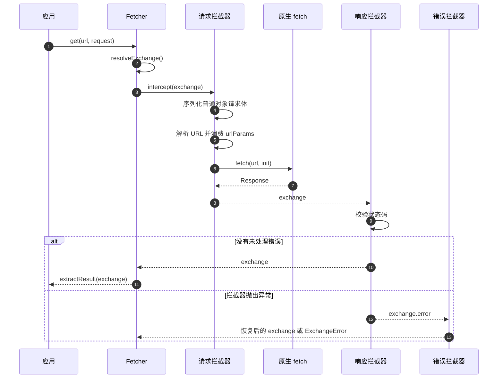

# 请求生命周期

一次 Fetcher 调用会创建一个可变的 `FetchExchange`。请求、响应和错误拦截器读取或更新该 Exchange，最后由选定的结果提取器返回值。



## 1. 构建 Exchange

`get`、`post` 等 HTTP 辅助方法最终调用 `request()`。客户端请求头和超时会与请求级值合并，请求级值优先。HTTP 辅助方法默认返回原生 `Response`。

## 2. 执行请求拦截器

拦截器按 `order` 升序执行。内置请求顺序为：

1. `RequestBodyInterceptor` 将普通对象请求体序列化为 JSON。
2. `UrlResolveInterceptor` 合并 `baseURL`、路径模板、路径值和查询值，然后清除 `urlParams`，避免重试同一 Exchange 时重复追加参数。
3. `FetchInterceptor` 通过超时处理调用原生 `fetch`。

自定义拦截器应根据导出的内置顺序常量选择位置。同一个 Registry 中拦截器名称必须唯一；名称重复时 `use()` 返回 `false`。

## 3. 校验响应

`ValidateStatusInterceptor` 默认接受 `200 <= status < 300`。被拒绝的状态会抛出保留 Exchange 的 `HttpStatusValidationError`。

## 4. 处理错误

请求或响应拦截器抛出异常后，错误拦截器按升序执行。错误拦截器通过清除 `exchange.error` 恢复 Exchange；恢复后不会重复执行响应拦截器。如果仍有错误，Fetcher 抛出 `ExchangeError`。

## 5. 提取结果

管线成功后，`Fetcher.request()` 调用配置的 `ResultExtractor`。HTTP 方法选择 `ResponseResultExtractor`；底层 `request()` 默认选择完整 Exchange。

## 定位管线问题

```ts
try {
  await api.get('/users/{id}', { urlParams: { path: { id: '42' } } });
} catch (error) {
  if (error instanceof ExchangeError) {
    console.error({
      request: error.exchange.request,
      response: error.exchange.response,
      cause: error.cause,
    });
  }
}
```

源码：[`InterceptorManager`](https://github.com/Ahoo-Wang/fetcher/blob/main/packages/fetcher/src/interceptorManager.ts)、[`Fetcher`](https://github.com/Ahoo-Wang/fetcher/blob/main/packages/fetcher/src/fetcher.ts)。
