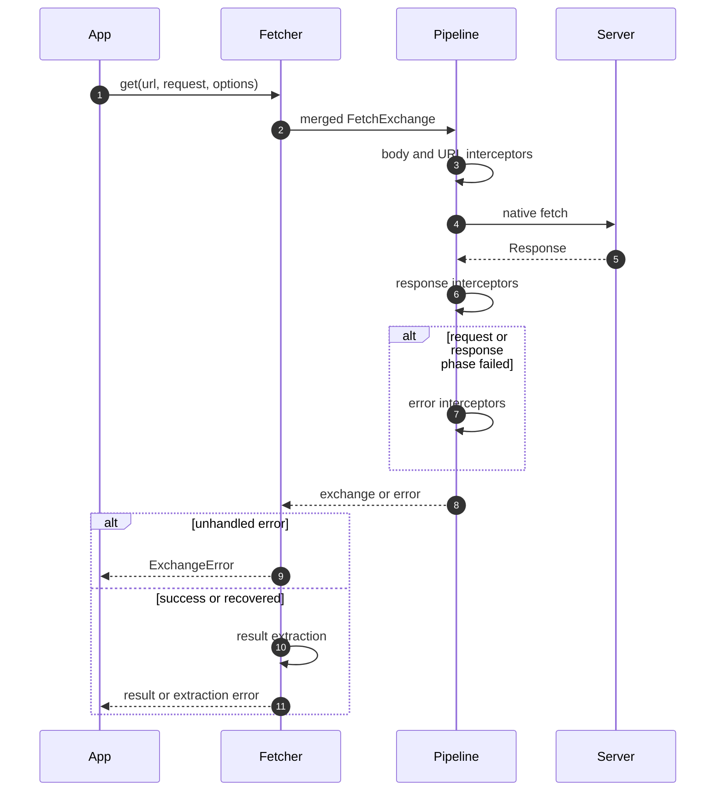

# 理解请求生命周期

一次调用创建一个可变的 FetchExchange，包含请求、响应、属性与错误。拦截器共享该上下文，结果提取器将它转换成调用者需要的返回值。

## 按阶段理解

1. Fetcher 合并客户端与请求选项。HTTP 方法默认选择 Response，request 默认选择 exchange。
2. 请求拦截器按 order 升序执行。默认管线依次序列化请求体、解析 URL 参数，再调用原生 fetch。
3. 响应拦截器执行策略，包括默认状态校验。
4. 请求或响应阶段失败时，错误拦截器接收失败的 exchange；清除错误可以恢复，但不会重新执行响应拦截器。
5. 未处理错误成为 ExchangeError；否则执行结果提取。提取失败在这条拦截器恢复路径之外传播。

## 一次扩展一个职责

请求拦截器修改出站数据，响应拦截器检查策略，错误拦截器执行明确的恢复动作。根据导出的顺序常量选择位置。每个注册表内名称唯一，重复注册返回 false。多个响应体读取器必须协调，因为 body 是流。

URL 解析构建地址后会消费 urlParams。复用 exchange 与重新发起调用并不相同；重试还要考虑已消费的请求/响应体和操作的服务端语义。

详见[拦截器契约](../reference/fetcher/interceptors.md)与[结果提取器](../reference/fetcher/results.md)。图表工具栏可展开查看完整时序。
