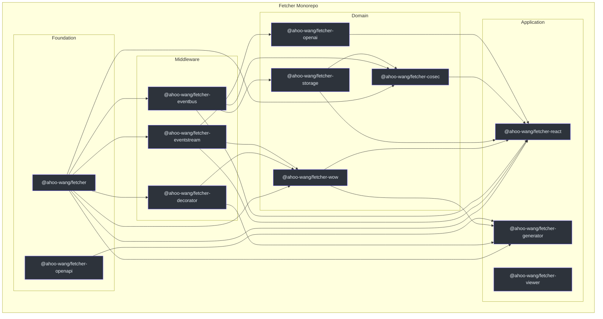
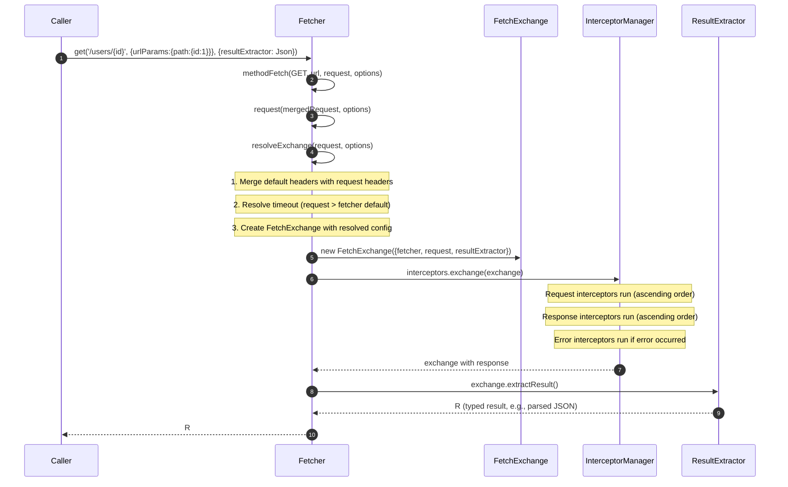
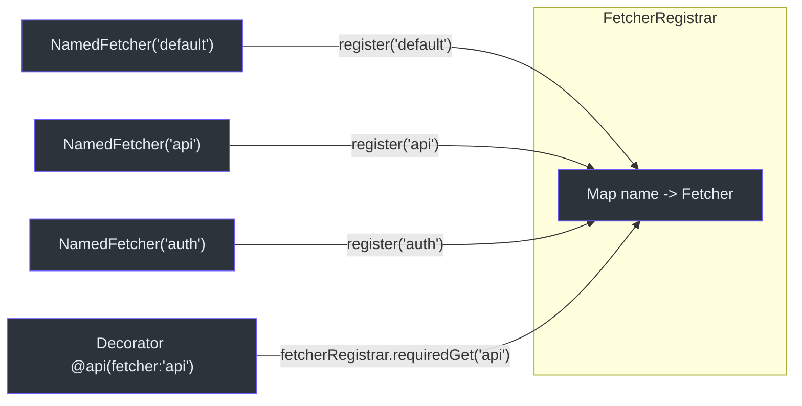
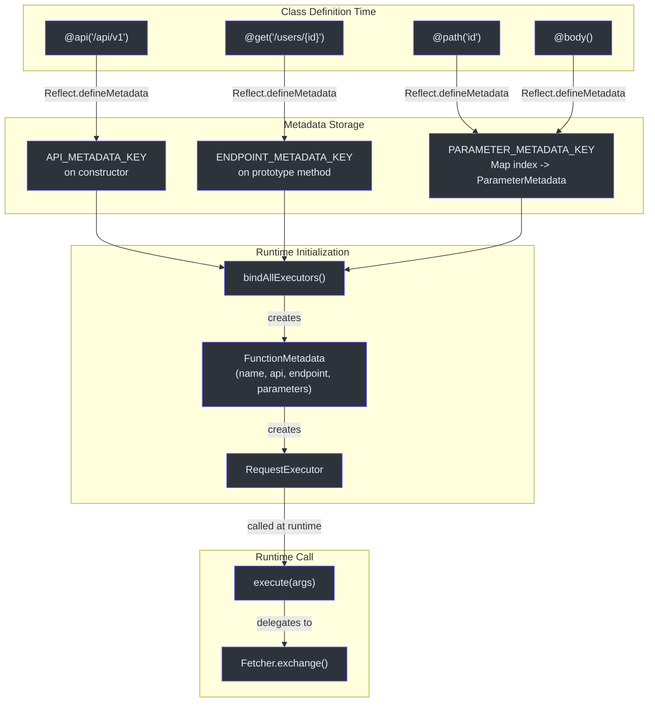
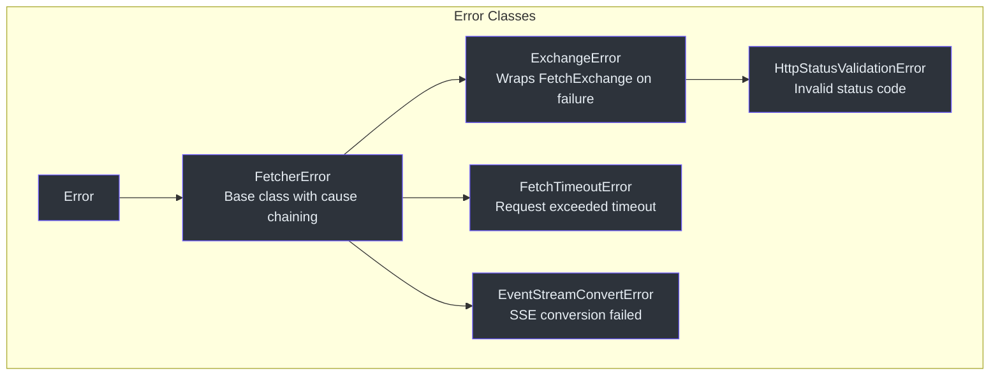

# 贡献者入门指南

欢迎加入 Fetcher 项目。本指南假设你已经具备 JavaScript 和 TypeScript 基础知识，希望快速上手这个代码库。它涵盖了项目所依赖的语言和框架基础、将各部分串联起来的架构模式，以及你日常开发中会用到的工作流程。

---

## 第一部分 -- 语言与框架基础

### TypeScript 严格模式

本 monorepo 中的每个包都使用 TypeScript 严格模式编译。根目录的 [tsconfig.json](https://github.com/Ahoo-Wang/fetcher/blob/main/tsconfig.json) 启用了 `strict: true`，这会激活 `strictNullChecks`、`noImplicitAny`、`strictFunctionTypes` 以及其余所有严格检查项。如果你之前没有使用严格模式的经验，请做好准备 -- 编译器会拒绝你之前能够通过的写法。

你需要了解的关键编译器选项：

| 选项 | 值 | 重要性 |
|---|---|---|
| `strict` | `true` | 所有严格检查均已开启；无隐式 `any`，无未检查的 `null` |
| `experimentalDecorators` | `true` | 用于 `decorator` 包的旧版（Stage 1）装饰器 |
| `emitDecoratorMetadata` | `true` | 发出 `Reflect.metadata` 以实现参数类型反射 |
| `target` | `ES2020` | 允许使用原生 `async`/`await`、可选链、空值合并 |
| `module` | `ESNext` | ESM 输出，与每个 `package.json` 中的 `"type": "module"` 保持一致 |
| `moduleResolution` | `bundler` | 现代打包器感知的模块解析；无旧版 `node` 解析的怪异行为 |
| `declaration` | `true` | 在生成 JavaScript 的同时生成 `.d.ts` 类型声明文件 |
| `declarationMap` | `true` | 为声明生成源映射；IDE 的"跳转到定义"将直接定位到 `.ts` 源文件 |
| `sourceMap` | `true` | 生成 `.js.map` 文件用于调试 |
| `composite` | `true` | 启用项目引用以支持增量构建 |
| `jsx` | `react-jsx` | 使用 React 17+ JSX 转换（无需 `import React`） |

**来源**: [tsconfig.json:8-21](https://github.com/Ahoo-Wang/fetcher/blob/main/tsconfig.json#L8-L21)

在本项目中编写代码时，编译器将强制执行：
- 不允许使用隐式 `any` 类型的变量。
- 不允许在未进行空值检查的情况下访问可能为 `undefined` 的属性。
- 不允许将 `null` 赋值给非空参数。
- 函数返回类型必须一致（不允许意外的隐式返回）。

如果你认为某个类型错误是误报，请先验证你对空值性的假设是否正确，再考虑抑制该错误。

### TypeScript 装饰器（旧版 Stage 1）

`@ahoo-wang/fetcher-decorator` 包使用的是**旧版（Stage 1）**装饰器提案，而非 TypeScript 5+ 中现已支持的 TC39 Stage 3 装饰器。这就是根配置中启用 `experimentalDecorators` 和 `emitDecoratorMetadata` 的原因。

旧版装饰器有三种形式：

1. **类装饰器** -- 接收构造函数并返回新的构造函数（或修改现有原型）。`@api(basePath, metadata)` 装饰器就是一个类装饰器。

2. **方法装饰器** -- 接收原型、属性键和属性描述符。`@get`、`@post`、`@put`、`@delete`、`@patch`、`@head`、`@options` 装饰器都是方法装饰器。

3. **参数装饰器** -- 接收原型、属性键和参数索引。它们不返回值；而是通过 `Reflect.defineMetadata` 存储元数据。`@path`、`@query`、`@header`、`@body`、`@request`、`@attribute` 装饰器都是参数装饰器。

在 Fetcher 中，`@api(basePath, metadata)` 类装饰器会在类加载时遍历所有带有端点装饰器的原型方法，并用 `RequestExecutor` 实例替换它们的实现。这意味着原始方法体（通常抛出 `autoGeneratedError()`）会被完全替换。

**来源**: [packages/decorator/src/apiDecorator.ts:232-247](https://github.com/Ahoo-Wang/fetcher/blob/main/packages/decorator/src/apiDecorator.ts#L232-L247)

与 Stage 3 装饰器的关键区别：旧版装饰器直接接收目标对象，而 Stage 3 装饰器接收一个上下文对象。这是一个根本性的 API 差异，当项目迁移到 Stage 3 时需要进行相应的改动。

### reflect-metadata

`reflect-metadata` polyfill 是 `@ahoo-wang/fetcher-decorator` 的硬依赖。它提供 `Reflect.defineMetadata` 和 `Reflect.getMetadata`，装饰器系统使用这些方法在运行时附加和检索参数元数据。

当你编写 `@path('id') userId: string` 时，参数装饰器会在方法的原型上以 `Symbol('parameter:metadata')` 为键存储一条 `ParameterMetadata` 记录。`@api` 类装饰器随后读取此元数据来构建 `RequestExecutor`。

数据流如下：

1. 在类定义时，`@path('id')` 在元数据中存储 `{type: ParameterType.PATH, name: 'id', index: 0}`。
2. `@get('/users/{id}')` 在元数据中存储 `{method: HttpMethod.GET, path: '/users/{id}'}`。
3. `@api('/api/v1')` 读取这两组元数据，创建 `FunctionMetadata`，并构建一个 `RequestExecutor` 来替换方法体。

**来源**: [packages/decorator/src/parameterDecorator.ts:199-228](https://github.com/Ahoo-Wang/fetcher/blob/main/packages/decorator/src/parameterDecorator.ts#L199-L228)

### Fetch API

Fetcher 封装了浏览器原生的 `fetch()` 函数。你需要了解：

- `fetch(url, init)` 返回 `Promise<Response>`。
- `Response` 是一次性流；调用 `.json()` 或 `.text()` 会消耗请求体。你无法两次读取请求体。
- `AbortController` / `signal` 是请求取消和超时的标准机制。
- `RequestInit` 是传递给 `fetch()` 的选项对象；它包括 `method`、`headers`、`body`、`signal`、`mode`、`credentials` 等。
- `body` 参数接受 `string`、`Blob`、`ArrayBuffer`、`FormData`、`URLSearchParams` 和 `ReadableStream`，但**不接受**普通对象。Fetcher 的 `RequestBodyInterceptor` 负责将普通对象转换为 JSON 字符串。

Fetcher 从不使用 Axios、`XMLHttpRequest` 或任何其他 HTTP 传输层。每个请求最终都在 `FetchInterceptor` 内部调用 `fetch()`。

**来源**: [packages/fetcher/src/fetchInterceptor.ts:101-103](https://github.com/Ahoo-Wang/fetcher/blob/main/packages/fetcher/src/fetchInterceptor.ts#L101-L103)

### 服务器推送事件（SSE）与 LLM 流式传输

`@ahoo-wang/fetcher-eventstream` 包是一个**副作用模块**。在顶层导入它会为 `Response.prototype` 打上四个新方法的补丁：

- `eventStream()` -- 返回 `ReadableStream<ServerSentEvent>`，如果响应不是事件流则返回 `null`。
- `requiredEventStream()` -- 同上，但如果响应不是 `text/event-stream` 则抛出 `EventStreamConvertError`。
- `jsonEventStream<T>(terminateDetector?)` -- 返回一个类型化的 JSON SSE 事件 `ReadableStream`，支持可选的终止检测。
- `requiredJsonEventStream<T>(terminateDetector?)` -- 同上，如果不是事件流则抛出异常。

这之所以可行，是因为该模块在导入时检查 `typeof Response !== 'undefined'`，并对 `Response.prototype` 调用 `Object.defineProperty`。每个属性/方法都通过 `Object.prototype.hasOwnProperty.call` 进行保护，以防止重复打补丁。

**来源**: [packages/eventstream/src/responses.ts:102-239](https://github.com/Ahoo-Wang/fetcher/blob/main/packages/eventstream/src/responses.ts#L102-L239)

SSE 解析管道是一个三阶段的 `ReadableStream` 管道：

```text
Response.body (Uint8Array)
  -> TextDecoderStream (UTF-8 strings)
  -> TextLineTransformStream (individual lines)
  -> ServerSentEventTransformStream (structured SSE objects)
```

**来源**: [packages/eventstream/src/eventStreamConverter.ts:127-138](https://github.com/Ahoo-Wang/fetcher/blob/main/packages/eventstream/src/eventStreamConverter.ts#L127-L138)

`jsonEventStream` 中的 `TerminateDetector` 回调对于 LLM 流式传输非常重要：OpenAI 兼容的 API 在流完成时会发送一个 `[DONE]` 标记。你可以通过以下方式检测：

```text
(event) => event.data === '[DONE]'
```

### React Hooks

`@ahoo-wang/fetcher-react` 包提供与 Fetcher 生态系统集成的 Hooks。核心 Hook 是 `useExecutePromise`，它提供加载/结果/错误/状态管理，并自动清理 AbortController。

`useFetcher<R>` 在 `useExecutePromise` 基础上增加了 Fetcher 特定的行为：
- 它在 promise executor 中调用 `fetcher.exchange()`。
- 它将 `AbortController` 附加到请求上，这样当新请求启动时，之前的请求会自动取消。
- 它在 React 状态中跟踪 `FetchExchange` 对象，使组件能够访问完整的请求/响应上下文。

`useQuery<Q, R>` 在此基础上添加了查询参数跟踪：它管理一个 `query` 状态，并在查询变化时自动重新执行（前提是 `autoExecute` 为 true）。这对于搜索即输入模式非常有用。

**来源**: [packages/react/src/fetcher/useFetcher.ts:162-226](https://github.com/Ahoo-Wang/fetcher/blob/main/packages/react/src/fetcher/useFetcher.ts#L162-L226)

**来源**: [packages/react/src/core/useQuery.ts:105-173](https://github.com/Ahoo-Wang/fetcher/blob/main/packages/react/src/core/useQuery.ts#L105-L173)

### EventBus

`@ahoo-wang/fetcher-eventbus` 包提供了一个类型安全的事件总线系统，包含三种实现：

- **`SerialTypedEventBus`** -- 处理器按优先级顺序依次执行。当处理器的执行顺序很重要时使用（例如，先记录日志再进行分析）。
- **`ParallelTypedEventBus`** -- 处理器并发执行。当处理器相互独立时，可用于提升性能。
- **`BroadcastTypedEventBus`** -- 使用 `BroadcastChannel` API 并带有 `localStorage` 降级方案。用于跨标签页通信。

事件总线基于泛型实现事件类型，为事件载荷提供编译时类型安全。

**来源**: [packages/eventbus/src/typedEventBus.ts](https://github.com/Ahoo-Wang/fetcher/blob/main/packages/eventbus/src/typedEventBus.ts)

### Storage

`@ahoo-wang/fetcher-storage` 包提供了通过事件总线实现跨标签页同步的浏览器存储。它包括：

- `InMemoryStorage` -- 内存键值存储，用于测试。
- `KeyStorage` -- 封装了 `localStorage`，支持 TTL 和序列化。
- 通过 `BroadcastTypedEventBus` 实现跨标签页同步。

**来源**: [packages/storage/src/keyStorage.ts](https://github.com/Ahoo-Wang/fetcher/blob/main/packages/storage/src/keyStorage.ts)

### CoSec（身份验证）

`@ahoo-wang/fetcher-cosec` 包将身份验证实现为拦截器：

- **`AuthorizationRequestInterceptor`** -- 将 JWT 令牌附加到请求头。
- **`AuthorizationResponseInterceptor`** -- 处理 401 响应并刷新令牌。
- **`CosecRequestInterceptor`** -- 添加设备 ID 和资源归属头。
- **`ForbiddenErrorInterceptor`** -- 处理 403 响应。
- **`UnauthorizedErrorInterceptor`** -- 处理无法刷新令牌的 401 响应。

令牌生命周期由 `JWTTokenManager` 管理，支持可配置的令牌存储和刷新策略。

**来源**: [packages/cosec/src/authorizationRequestInterceptor.ts](https://github.com/Ahoo-Wang/fetcher/blob/main/packages/cosec/src/authorizationRequestInterceptor.ts)

### OpenAI 客户端

`@ahoo-wang/fetcher-openai` 包提供了一个类型安全的 OpenAI 聊天补全客户端，基于装饰器系统和 eventstream 构建。它支持：

- 带流式传输的聊天补全请求。
- 逐令牌的响应交付。
- 与 Wow 框架集成以实现事件溯源的 AI 交互。

**来源**: [packages/openai/src/openai.ts](https://github.com/Ahoo-Wang/fetcher/blob/main/packages/openai/src/openai.ts)

### Wow（DDD/CQRS）

`@ahoo-wang/fetcher-wow` 包为 [Wow](https://github.com/Ahoo-Wang/Wow) 领域驱动设计框架提供 API 客户端。它包括：

- 用于发送领域命令的命令客户端。
- 用于读取聚合状态的查询客户端。
- 用于订阅领域事件的事件流客户端。
- 同时支持常规命令模式和事件流命令模式。

**来源**: [packages/wow/src/command](https://github.com/Ahoo-Wang/fetcher/blob/main/packages/wow/src/command)

### Generator（代码生成）

`@ahoo-wang/fetcher-generator` 包是一个 CLI 工具（`fetcher-generator`），它读取 OpenAPI 3.x 规范（JSON、YAML 或 URL）并生成：

- 从 Schema 生成 TypeScript 接口和枚举。
- 基于装饰器的 API 客户端类。
- Wow CQRS 特定的客户端（命令、事件流）。
- 用于整洁模块组织的索引文件。

它使用 `ts-morph` 进行代码生成，使用 `commander` 进行 CLI 解析，使用 `yaml` 提供 YAML 支持。

**来源**: [packages/generator/src/cli.ts](https://github.com/Ahoo-Wang/fetcher/blob/main/packages/generator/src/cli.ts)

### Viewer（API 文档）

`@ahoo-wang/fetcher-viewer` 包提供 React + Ant Design 组件，用于构建交互式 API 文档查看器。它包括：

- 用于搜索和过滤 API 端点的过滤面板组件。
- 带有单元格渲染器的表格组件，用于展示 API 响应。
- 通过 Less 与 Ant Design 主题系统集成。
- React Compiler 支持自动记忆化。

**来源**: [packages/viewer/src/](https://github.com/Ahoo-Wang/fetcher/blob/main/packages/viewer/src/)

---

## 第二部分 -- Fetcher 架构

### Monorepo 结构

Fetcher 是一个 pnpm 工作区 monorepo，在 `packages/` 下有 12 个包，外加一个 `integration-test/` 工作区。依赖版本通过 [pnpm-workspace.yaml](https://github.com/Ahoo-Wang/fetcher/blob/main/pnpm-workspace.yaml) 中的 `catalog:` 协议集中管理。

`catalog:` 协议意味着每个包不需要各自指定依赖的版本（如 `"vitest": "^4.1.5"`），而是使用 `"vitest": "catalog:"`，实际版本只在工作区根文件中定义一次。这可以防止跨包的版本漂移。



### 包依赖关系图（表格）

| 包 | 依赖（内部） | 核心用途 |
|---|---|---|
| `fetcher` | 无 | 核心 HTTP 客户端，拦截器系统 |
| `openapi` | 无 | OpenAPI 3.x TypeScript 类型定义 |
| `decorator` | fetcher | 通过装饰器声明式 API 服务类 |
| `eventstream` | fetcher | 通过副作用 `Response.prototype` 打补丁实现 SSE 支持 |
| `eventbus` | fetcher | 类型安全的事件总线（串行、并行、广播） |
| `openai` | fetcher, eventstream, decorator | OpenAI 聊天补全客户端 |
| `wow` | fetcher, eventstream, decorator | Wow DDD/CQRS 框架集成 |
| `storage` | eventbus | 跨标签页同步的浏览器存储 |
| `cosec` | fetcher, eventbus, storage | 身份验证和授权拦截器 |
| `react` | fetcher, eventstream, eventbus, storage, wow, cosec | 数据获取的 React Hooks |
| `viewer` | 以上所有 + antd | API 文档查看器组件 |
| `generator` | fetcher, eventstream, decorator, openapi, wow | OpenAPI 转 TypeScript 代码生成器 CLI |

### 核心模式：拦截器链

Fetcher 中最重要的模式是**拦截器链**。每个 HTTP 请求都流经 `InterceptorManager` 管理的三个有序注册表：

```mermaid
sequenceDiagram
autonumber

    participant App as Application
    participant FM as InterceptorManager
    participant ReqReg as Request Registry
    participant BodyInt as RequestBodyInterceptor<br>order: MIN+10K
    participant UrlInt as UrlResolveInterceptor<br>order: MAX-20K
    participant FetchInt as FetchInterceptor<br>order: MAX-10K
    participant RespReg as Response Registry
    participant ValidInt as ValidateStatusInterceptor<br>order: MAX-10K
    participant ErrReg as Error Registry

    App->>FM: exchange(fetchExchange)
    FM->>ReqReg: intercept(fetchExchange)

    rect rgb(30, 40, 50)
        Note over ReqReg: Request Phase (ascending order)
        ReqReg->>BodyInt: intercept(exchange)
        Note over BodyInt: If body is plain object,<br>JSON.stringify it and set Content-Type
        BodyInt-->>ReqReg: exchange mutated
        ReqReg->>UrlInt: intercept(exchange)
        Note over UrlInt: Resolve URL: combineURLs(baseURL, url)<br>+ path params + query string
        UrlInt-->>ReqReg: exchange.request.url resolved
        ReqReg->>FetchInt: intercept(exchange)
        FetchInt->>FetchInt: timeoutFetch(request)
        Note over FetchInt: Race fetch() vs AbortController timeout
        FetchInt-->>ReqReg: exchange.response set
    end

    ReqReg-->>FM: request phase complete
    FM->>RespReg: intercept(fetchExchange)

    rect rgb(30, 40, 50)
        Note over RespReg: Response Phase (ascending order)
        RespReg->>ValidInt: intercept(exchange)
        Note over ValidInt: Check validateStatus(status)<br>Throw HttpStatusValidationError if invalid
        ValidInt-->>RespReg: status validated
    end

    RespReg-->>FM: response phase complete
    FM-->>App: exchange returned

```



关键实现细节：

- 拦截器实现 `Interceptor` 接口，具有 `name`、`order` 和 `intercept(exchange)` 属性。
- 拦截器按 `order` 升序排列。较小的值先执行。
- 内置拦截器使用 `BUILT_IN_INTERCEPTOR_ORDER_STEP`（10,000）作为间隔，为自定义拦截器留出插入空间。
- `InterceptorRegistry` 本身也是一个 `Interceptor`，这使得递归组合成为可能。
- 每个拦截器接收 `FetchExchange` 并原地修改它。没有返回值要求。
- 如果任何拦截器抛出异常，错误阶段将开始。错误拦截器可以通过清除 `exchange.error` 来"修复"错误。

**来源**: [packages/fetcher/src/interceptorManager.ts:191-211](https://github.com/Ahoo-Wang/fetcher/blob/main/packages/fetcher/src/interceptorManager.ts#L191-L211)

### 内置拦截器的顺序值

理解顺序值对于正确放置自定义拦截器至关重要：

| 拦截器 | 阶段 | 顺序值 | 位置 |
|---|---|---|---|
| `RequestBodyInterceptor` | 请求 | `MIN_SAFE_INTEGER + 10,000` | 最先执行 |
| `UrlResolveInterceptor` | 请求 | `MAX_SAFE_INTEGER - 20,000` | 中间 |
| `FetchInterceptor` | 请求 | `MAX_SAFE_INTEGER - 10,000` | 最后执行（执行 `fetch()`） |
| `ValidateStatusInterceptor` | 响应 | `MAX_SAFE_INTEGER - 10,000` | 最先执行（验证状态码） |

要在 `RequestBodyInterceptor` 和 `UrlResolveInterceptor` 之间插入自定义拦截器，请选择一个介于 `MIN_SAFE_INTEGER + 10,000` 和 `MAX_SAFE_INTEGER - 20,000` 之间的顺序值。例如，`order: 0` 就可以正常工作。

**来源**: [packages/fetcher/src/requestBodyInterceptor.ts:29-30](https://github.com/Ahoo-Wang/fetcher/blob/main/packages/fetcher/src/requestBodyInterceptor.ts#L29-L30), [packages/fetcher/src/urlResolveInterceptor.ts:29-30](https://github.com/Ahoo-Wang/fetcher/blob/main/packages/fetcher/src/urlResolveInterceptor.ts#L29-L30)

### FetchExchange 对象

`FetchExchange` 是流经整个拦截器链的数据容器。它携带：

- `fetcher` -- 发起请求的 `Fetcher` 实例（可访问 `urlBuilder`、`headers`、`timeout` 等）
- `request` -- 包含 `url`、`method`、`headers`、`body`、`urlParams`、`timeout`、`abortController` 的 `FetchRequest`
- `response` -- 原生 `Response` 对象（由 `FetchInterceptor` 设置，初始为 `undefined`）
- `error` -- 发生的任何 `Error`（在拦截器抛出异常时设置）
- `resultExtractor` -- 函数 `(exchange) => R`，决定 `extractResult()` 的返回内容
- `attributes` -- 一个 `Map<string, any>`，用于在拦截器之间传递数据（例如，追踪 ID、计时数据）

该 exchange 还提供了便捷方法：
- `ensureRequestHeaders()` -- 惰性初始化 headers 对象
- `ensureRequestUrlParams()` -- 惰性初始化路径和查询参数对象
- `hasError()` / `hasResponse()` -- 布尔检查
- `requiredResponse` -- getter，如果没有可用的响应则抛出 `ExchangeError`
- `extractResult<R>()` -- 应用结果提取器并缓存结果

**来源**: [packages/fetcher/src/fetchExchange.ts:105-286](https://github.com/Ahoo-Wang/fetcher/blob/main/packages/fetcher/src/fetchExchange.ts#L105-L286)

### 请求生命周期

通过 Fetcher 的完整请求遵循以下流程：



**来源**: [packages/fetcher/src/fetcher.ts:206-238](https://github.com/Ahoo-Wang/fetcher/blob/main/packages/fetcher/src/fetcher.ts#L206-L238)

### 命名 Fetcher 注册表

`FetcherRegistrar` 是一个全局单例，按名称存储 `Fetcher` 实例。当你创建 `NamedFetcher` 时，它会自动注册自身：



一个默认的 `NamedFetcher` 从核心包中作为 `fetcher` 导出：

```text
import { fetcher } from '@ahoo-wang/fetcher';
// This is a NamedFetcher registered with name 'default'
```

这个模式是装饰器系统解析给定 API 服务类应使用哪个 fetcher 的核心机制。`@api` 装饰器在其元数据中存储一个 fetcher 名称；在运行时，`RequestExecutor` 调用 `getFetcher()`，该方法通过注册表进行解析。

**来源**: [packages/fetcher/src/namedFetcher.ts:38-89](https://github.com/Ahoo-Wang/fetcher/blob/main/packages/fetcher/src/namedFetcher.ts#L38-L89)

### 装饰器系统

装饰器包将类方法转换为 HTTP 请求执行器。以下是各组件如何协同工作：



**来源**: [packages/decorator/src/apiDecorator.ts:105-152](https://github.com/Ahoo-Wang/fetcher/blob/main/packages/decorator/src/apiDecorator.ts#L105-L152)

### 副作用导入

`@ahoo-wang/fetcher-eventstream` 包被声明为副作用模块。它的 `package.json` **没有**设置 `"sideEffects": false` -- 事实上，它的全部目的就是在导入时修改 `Response.prototype`。只需在应用程序中的任何位置编写 `import '@ahoo-wang/fetcher-eventstream'` 即可全局激活 SSE 支持。

这功能强大，但需要注意：
- 导入顺序很重要：副作用必须在任何调用 `.eventStream()` 的代码之前运行。
- Tree-shaking 不会移除它：打包器会保留副作用导入。
- 该模块通过 `Object.prototype.hasOwnProperty.call` 检查来防止重复打补丁。
- 副作用仅在 `typeof Response !== 'undefined'` 的环境中运行（即浏览器，而非没有 polyfill 的 Node.js）。

### 结果提取器

`ResultExtractor` 是一个函数 `(exchange: FetchExchange) => R | Promise<R>`，决定 `fetcher.request()` 和 `fetcher.fetch()` 的返回内容。内置提取器如下：

| 提取器 | 返回值 | 使用场景 |
|---|---|---|
| `ResultExtractors.Exchange` | 完整的 `FetchExchange` 对象 | 当你需要访问 headers、计时信息等时 |
| `ResultExtractors.Response` | 原始 `Response` | 当你需要流式读取 body 或访问响应元数据时 |
| `ResultExtractors.Json` | `Promise<any>`（解析后的 JSON） | REST API 最常用 |
| `ResultExtractors.Text` | `Promise<string>` | HTML 或纯文本响应 |
| `ResultExtractors.Blob` | `Promise<Blob>` | 文件下载 |
| `ResultExtractors.ArrayBuffer` | `Promise<ArrayBuffer>` | 二进制数据处理 |
| `ResultExtractors.Bytes` | `Promise<Uint8Array>` | 底层字节操作 |

**来源**: [packages/fetcher/src/resultExtractor.ts:131-160](https://github.com/Ahoo-Wang/fetcher/blob/main/packages/fetcher/src/resultExtractor.ts#L131-L160)

不同方法的默认提取器不同：
- `fetcher.request()` 默认使用 `ResultExtractors.Exchange`（返回完整的 exchange）。
- `fetcher.fetch()`、`fetcher.get()`、`fetcher.post()` 等默认使用 `ResultExtractors.Response`（返回原始 `Response`）。

### 错误层次结构

Fetcher 具有完善的错误层次结构：



- `FetcherError` 是基类；它支持通过 `cause` 进行错误链。如果可用，它会从 cause 复制堆栈跟踪。
- `ExchangeError` 封装了 `FetchExchange`，当拦截器链遇到未处理的错误时抛出。它提供了对完整请求/响应上下文的访问。
- `HttpStatusValidationError` 继承自 `ExchangeError`，在响应状态码未通过 `validateStatus` 检查时触发（默认：status >= 200 && status < 300）。
- `FetchTimeoutError` 继承自 `FetcherError`，包含超时的请求信息。
- `EventStreamConvertError` 继承自 `FetcherError`，包含转换失败的 Response。

**来源**: [packages/fetcher/src/fetcherError.ts:37-106](https://github.com/Ahoo-Wang/fetcher/blob/main/packages/fetcher/src/fetcherError.ts#L37-L106)

### URL 构建与模板解析

`UrlBuilder` 组合了三项任务：
1. 通过 `combineURLs` 将 `baseURL` 与请求路径拼接
2. 使用 `UrlTemplateResolver` 解析路径参数
3. 将查询参数附加为查询字符串

支持两种模板风格：

| 风格 | 语法 | 示例 | 正则表达式 |
|---|---|---|---|
| `UrlTemplateStyle.UriTemplate`（默认） | `{param}` | `/users/{id}` | `/{([^}]+)}/g` |
| `UrlTemplateStyle.Express` | `:param` | `/users/:id` | `/:[^/]+/g` |

路径参数通过 `encodeURIComponent` 自动进行 URL 编码。如果缺少必需的路径参数，解析器会抛出 `Error("Missing required path parameter: {name}")`。

**来源**: [packages/fetcher/src/urlTemplateResolver.ts:20-38](https://github.com/Ahoo-Wang/fetcher/blob/main/packages/fetcher/src/urlTemplateResolver.ts#L20-L38)

### 超时机制

`timeoutFetch` 函数使用基于 `AbortController` 的超时来封装原生 `fetch()`：

1. 如果请求已有 `signal`，则直接委托给 `fetch()`（不进行超时封装以避免冲突）。
2. 如果没有配置超时但提供了 `abortController`，则使用该控制器的 signal。
3. 如果配置了超时，则创建（或复用）一个 `AbortController`，然后让 `fetch()` 与一个 `setTimeout` 进行竞争，后者在超时后中止控制器。
4. 计时器始终在 `finally` 块中清理，以防止资源泄漏。

**来源**: [packages/fetcher/src/timeout.ts:120-172](https://github.com/Ahoo-Wang/fetcher/blob/main/packages/fetcher/src/timeout.ts#L120-L172)

### RequestBodyInterceptor 逻辑

`RequestBodyInterceptor` 按以下规则处理自动请求体序列化：

1. 如果 `body` 为 `null` 或 `undefined`，则不执行任何操作。
2. 如果 `body` 不是对象（字符串、数字等），则不执行任何操作。
3. 如果 `body` 是 `Blob`、`File`、`FormData` 或 `URLSearchParams`，则移除 `Content-Type` 头（浏览器会自动设置正确的 boundary）。
4. 如果 `body` 是 `ArrayBuffer`、`TypedArray`、`DataView` 或 `ReadableStream`，则不执行任何操作。
5. 否则（普通对象），对 body 执行 `JSON.stringify` 并设置 `Content-Type: application/json`。

**来源**: [packages/fetcher/src/requestBodyInterceptor.ts:135-166](https://github.com/Ahoo-Wang/fetcher/blob/main/packages/fetcher/src/requestBodyInterceptor.ts#L135-L166)

### ValidateStatusInterceptor 逻辑

`ValidateStatusInterceptor` 在响应阶段运行，验证 HTTP 状态码。默认情况下，它接受 200-299（2xx 范围）的状态码。如果验证失败，它会抛出 `HttpStatusValidationError`。

关键行为：
- 如果 `exchange.attributes.get(IGNORE_VALIDATE_STATUS) === true`，则完全跳过验证。这对于有意返回非 2xx 状态码的端点很有用（例如，通过 404 检查资源是否存在）。
- 如果 `exchange.response` 为 `undefined`，则跳过验证（请求在获得响应之前就失败了）。
- 验证函数可通过每个 Fetcher 实例的 `validateStatus` 选项进行自定义。

**来源**: [packages/fetcher/src/validateStatusInterceptor.ts:126-187](https://github.com/Ahoo-Wang/fetcher/blob/main/packages/fetcher/src/validateStatusInterceptor.ts#L126-L187)

### Fetcher 类方法

`Fetcher` 类公开了以下公共方法：

| 方法 | 返回值 | 备注 |
|---|---|---|
| `fetch(url, request, options)` | `Promise<R>` | 主入口点；默认返回 `Response` 类型 |
| `get(url, request, options)` | `Promise<R>` | GET 便捷方法；body 从请求类型中省略 |
| `post(url, request, options)` | `Promise<R>` | POST 便捷方法 |
| `put(url, request, options)` | `Promise<R>` | PUT 便捷方法 |
| `delete(url, request, options)` | `Promise<R>` | DELETE 便捷方法；body 被省略 |
| `patch(url, request, options)` | `Promise<R>` | PATCH 便捷方法 |
| `head(url, request, options)` | `Promise<R>` | HEAD 便捷方法；body 被省略 |
| `options(url, request, options)` | `Promise<R>` | OPTIONS 便捷方法；body 被省略 |
| `trace(url, request, options)` | `Promise<R>` | TRACE 便捷方法；body 被省略 |
| `request(request, options)` | `Promise<R>` | 底层方法；请求对象必须包含 `url` |
| `exchange(request, options)` | `Promise<FetchExchange>` | 返回完整的 exchange 而不提取结果 |

**来源**: [packages/fetcher/src/fetcher.ts:123-501](https://github.com/Ahoo-Wang/fetcher/blob/main/packages/fetcher/src/fetcher.ts#L123-L501)

### FetchRequest 和 FetchRequestInit

`FetchRequestInit` 是单个请求的选项接口。它在原生 `RequestInit` 的基础上扩展了 Fetcher 特定的属性：

| 属性 | 类型 | 用途 |
|---|---|---|
| `url` | `string`（在 `FetchRequest` 中为必需） | 请求的 URL 路径 |
| `method` | `HttpMethod` | HTTP 方法（GET、POST 等） |
| `headers` | `RequestHeaders` | 与默认值合并的自定义头 |
| `body` | `BodyInit \| Record<string, any> \| string \| null` | 请求体（对象会自动 JSON 序列化） |
| `urlParams` | `UrlParams` | `{path: {...}, query: {...}}`，用于 URL 构建 |
| `timeout` | `number` | 请求超时时间（毫秒），覆盖 fetcher 默认值 |
| `abortController` | `AbortController` | 用于取消请求的自定义中止控制器 |

**来源**: [packages/fetcher/src/fetchRequest.ts:112-183](https://github.com/Ahoo-Wang/fetcher/blob/main/packages/fetcher/src/fetchRequest.ts#L112-L183)

### 参数装饰器深入解析

参数装饰器系统支持六种参数类型。以下是每种参数类型如何将参数映射到 HTTP 请求：

| 装饰器 | ParameterType | 参数去向 | 支持对象 |
|---|---|---|---|
| `@path('name')` | `PATH` | `request.urlParams.path[name]` | 是（展开键） |
| `@query('name')` | `QUERY` | `request.urlParams.query[name]` | 是（展开键） |
| `@header('name')` | `HEADER` | `request.headers[name]` | 是（展开键） |
| `@body()` | `BODY` | `request.body` | 不适用（整个值） |
| `@request()` | `REQUEST` | 合并到 `FetchRequest` 中 | 不适用（整个对象） |
| `@attribute('name')` | `ATTRIBUTE` | `attributes.set(name, value)` | 是（展开键或 Map 条目） |

当未提供名称（空字符串）时，参数名称会通过 `reflect-metadata` 从 TypeScript 参数名中自动提取。

**来源**: [packages/decorator/src/parameterDecorator.ts:19-128](https://github.com/Ahoo-Wang/fetcher/blob/main/packages/decorator/src/parameterDecorator.ts#L19-L128)

### 包构建配置

每个包遵循相同的构建配置模式：

| 文件 | 用途 |
|---|---|
| `package.json` | 包元数据、脚本、使用 `catalog:` 协议的依赖 |
| `vite.config.ts` | 使用 `unplugin-dts` 的 Vite 构建配置 |
| `tsconfig.json` | 继承自根配置的 TypeScript 配置 |
| `src/index.ts` | 桶文件，重新导出所有内容 |
| `dist/` | 构建输出（ESM、UMD、类型、源映射） |

`package.json` 中的 `exports` 字段定义了 ESM 和 UMD 入口点以及类型定义。这使得以下用法成为可能：
- `import { Fetcher } from '@ahoo-wang/fetcher'`（ESM）
- `const { Fetcher } = require('@ahoo-wang/fetcher')`（UMD/CJS）
- TypeScript 类型解析通过 `"types": "./dist/index.d.ts"`

### 集成测试工作区

`integration-test/` 工作区与包测试是分开的。它的特点是：
- 需要先构建所有包（`pnpm build`）。
- 向外部 API 发起真实的 HTTP 请求。
- 测试从 fetcher 经过拦截器到响应解析的完整技术栈。
- 拥有自己的 `package.json`，依赖所有内部包。

运行命令：
```bash
pnpm test:it
```

---

## 第三部分 -- 高效开发

### 前置要求

- **Node.js** >= 18.0.0
- **pnpm** 10.x（精确版本固定在根 `package.json` 的 `packageManager` 字段中）

**来源**: [package.json:42-44](https://github.com/Ahoo-Wang/fetcher/blob/main/package.json#L42-L44)

### 设置工作区

```bash
# Clone the repository
git clone https://github.com/Ahoo-Wang/fetcher.git
cd fetcher

# Install all dependencies (uses catalog: protocol for version centralization)
pnpm install

# Build all packages (required before running integration tests)
pnpm build
```

### 构建系统

每个包使用 Vite 进行构建。构建产生三种输出：

| 输出 | 格式 | 路径 | 用途 |
|---|---|---|---|
| ESM | `es` | `dist/index.es.js` | 现代打包器（Vite、webpack、Rollup） |
| UMD | `umd` | `dist/index.umd.js` | 旧版打包器、script 标签、Node.js CJS |
| 类型 | declaration | `dist/index.d.ts` | TypeScript 类型定义 |

类型声明由 `unplugin-dts` 生成。基于 React 的包（`viewer`、`react`）还使用了 `@vitejs/plugin-react`，配合 React Compiler 和旧版装饰器支持。

**来源**: [packages/fetcher/vite.config.ts:17-38](https://github.com/Ahoo-Wang/fetcher/blob/main/packages/fetcher/vite.config.ts#L17-L38)

### 运行测试

```bash
# Run all unit tests across all packages
pnpm test:unit

# Run integration tests (requires built packages)
pnpm test:it

# Run tests for a single package
pnpm --filter @ahoo-wang/fetcher test

# Run a single test file
pnpm --filter @ahoo-wang/fetcher vitest run test/fetcher.test.ts
```

测试规范：
- **Vitest** 是测试框架，配合 `@vitest/coverage-v8` 用于覆盖率。
- Vitest 全局变量已启用（`describe`、`it`、`expect`、`vi` 无需导入即可使用）。
- 测试文件使用 `*.test.ts` 或 `*.test.tsx` 命名，位于包根目录下的 `test/` 目录中（镜像 `src/` 目录结构）。
- ESLint 忽略测试文件（`**/**.test.ts`）。
- `fetcher` 包使用 **MSW**（Mock Service Worker）进行 HTTP 模拟。
- `viewer` 包在 `jsdom` 环境中运行测试，使用 `test/setup.ts`。
- 浏览器测试使用 `@vitest/browser` 配合 Playwright（viewer 包）。

### 代码检查与格式化

```bash
# Lint all packages
pnpm lint

# Format all files with Prettier
pnpm format
```

ESLint 使用 `typescript-eslint` 进行配置。关键规则：
- `@typescript-eslint/no-explicit-any` 设置为 `warn`（非 `error`）。
- 集成测试和 story 文件强制执行 `consistent-type-imports`，设置 `prefer: "type-imports"`。
- Storybook 文件有来自 `eslint-plugin-storybook` 的额外 ESLint 规则。

**来源**: [eslint.config.js:22-51](https://github.com/Ahoo-Wang/fetcher/blob/main/eslint.config.js#L22-L51)

### Storybook

该项目使用 Storybook 为 viewer 和 react 组件提供交互式文档：

```bash
# Start Storybook dev server on port 6006
pnpm storybook

# Build static Storybook
pnpm build-storybook
```

Stories 使用 `*.stories.tsx` 模式，放在每个包内的 `stories/` 子目录中。

### 版本管理

所有包共享同一个版本号。更新方法：

```bash
pnpm update-version <new-version>
```

这会运行 `scripts/update-all-versions.sh`，更新 monorepo 中每个 `package.json` 的版本。

### 贡献工作流程

1. **Fork 并克隆**仓库。
2. 从 `main` 分支**创建新分支**：`git checkout -b feature/your-feature`
3. 在 `packages/` 下的相关包中**进行修改**。
4. **编写测试**，放在 `test/` 目录中（`*.test.ts` 文件，镜像 `src/` 结构）。
5. **运行测试**：`pnpm --filter @ahoo-wang/<package-name> test`
6. **运行 lint**：`pnpm lint`
7. **构建**：`pnpm build`
8. 使用规范化的消息格式**提交**（项目使用标准提交规范）。
9. 向 `main` 分支**发起 PR**。

所有源文件必须包含 Apache 2.0 许可证头。许可证模板如下：

```text
/*
 * Copyright [2021-present] [ahoo wang <ahoowang@qq.com> (https://github.com/Ahoo-Wang)].
 * Licensed under the Apache License, Version 2.0 ...
 */
```

### 调试技巧

- **Vitest UI**：每个包都有一个 `test:ui` 脚本，可打开 Vitest 的浏览器 UI 进行可视化测试调试。
- **Bundle 分析**：运行 `pnpm --filter @ahoo-wang/<package-name> analyze` 使用 `vite-bundle-analyzer` 检查 bundle 组成。
- **集成测试**：位于 `integration-test/` 工作区；它们发起真实的 API 调用，需要完整的构建。
- **Storybook**：用于 React 组件的可视化调试。
- **TypeScript 错误**：如果遇到意外的类型错误，请检查是否已运行 `pnpm build` 来生成依赖的 `.d.ts` 文件。

### 常见贡献模式

#### 添加新的拦截器

1. 创建实现 `RequestInterceptor`、`ResponseInterceptor` 或 `ErrorInterceptor` 的拦截器类。
2. 选择一个 `order` 值，使其相对于内置拦截器正确定位。
3. 使用 MSW 模拟 HTTP 层来编写测试。
4. 如果它应该是内置的，在 `InterceptorManager` 中注册它。如果是自定义的，记录用户应如何添加它。

#### 添加新的装饰器

1. 在 `decorator` 包中创建装饰器函数。
2. 使用 `Reflect.defineMetadata` 在目标上存储元数据。
3. 确保 `@api` 类装饰器的 `bindAllExecutors` 函数能读取你的新元数据。
4. 如果新元数据需要参与请求构建，更新 `FunctionMetadata`。

#### 添加新的包

1. 在 `packages/` 下创建目录。
2. 添加 `package.json`，设置 `"type": "module"`、正确的 `exports` 字段和 `catalog:` 依赖。
3. 按照现有模式添加 `vite.config.ts`。
4. 添加继承自根配置的 `tsconfig.json`。
5. 将包添加到根 `package.json` 的 `workspaces` 数组中（已通过 `packages/*` 包含）。

---

## 第四部分 -- 实战配方

### 配方：编写自定义请求拦截器

以下是添加一个向每个请求注入关联 ID 的请求拦截器的分步指南：

**第一步**：创建拦截器类。

```text
// correlationIdInterceptor.ts
import type { RequestInterceptor, FetchExchange } from '@ahoo-wang/fetcher';

export class CorrelationIdInterceptor implements RequestInterceptor {
  readonly name = 'CorrelationIdInterceptor';
  readonly order = 500; // After RequestBodyInterceptor, before UrlResolveInterceptor

  intercept(exchange: FetchExchange) {
    const headers = exchange.ensureRequestHeaders();
    headers['X-Correlation-ID'] = crypto.randomUUID();
  }
}
```

**第二步**：在 fetcher 实例上注册它。

```text
import { fetcher } from '@ahoo-wang/fetcher';
import { CorrelationIdInterceptor } from './correlationIdInterceptor';

fetcher.interceptors.request.use(new CorrelationIdInterceptor());
```

**第三步**：使用 MSW 编写测试。

```text
import { http, HttpResponse } from 'msw';
import { setupServer } from 'msw/node';
import { fetcher, ResultExtractors } from '@ahoo-wang/fetcher';

const server = setupServer(
  http.get('/api/test', ({ request }) => {
    const correlationId = request.headers.get('X-Correlation-ID');
    return HttpResponse.json({ correlationId });
  })
);

beforeAll(() => server.listen());
afterAll(() => server.close());

it('should include correlation ID in request headers', async () => {
  const result = await fetcher.get('/api/test', {}, {
    resultExtractor: ResultExtractors.Json
  });
  expect(result.correlationId).toBeDefined();
});
```

### 配方：使用装饰器系统

以下是定义和使用基于装饰器的 API 服务的方法：

**第一步**：定义服务类。

```text
import { api, get, post, path, body, query } from '@ahoo-wang/fetcher-decorator';
import { autoGeneratedError } from '@ahoo-wang/fetcher-decorator';

interface User {
  id: string;
  name: string;
  email: string;
}

interface UserQuery {
  name?: string;
  limit?: number;
}

@api('/api/v1/users')
class UserService {
  @get('/')
  getUsers(@query() query: UserQuery): Promise<User[]> {
    throw autoGeneratedError();
  }

  @get('/{id}')
  getUser(@path('id') id: string): Promise<User> {
    throw autoGeneratedError();
  }

  @post('/')
  createUser(@body() user: Omit<User, 'id'>): Promise<User> {
    throw autoGeneratedError();
  }
}
```

**第二步**：使用该服务。

```text
const userService = new UserService();
const users = await userService.getUsers({ limit: 10 });
const user = await userService.getUser('123');
const newUser = await userService.createUser({ name: 'Jane', email: 'jane@example.com' });
```

**第三步**：自定义 fetcher（可选）。

```text
import { NamedFetcher } from '@ahoo-wang/fetcher';

// Create a fetcher with a different base URL
new NamedFetcher('users-api', {
  baseURL: 'https://users.example.com',
  timeout: 5000,
});

@api('/api/v1/users', { fetcher: 'users-api' })
class UserService {
  // ... same as above
}
```

### 配方：消费 SSE 流

以下是使用 eventstream 包消费服务器推送事件的方法：

**第一步**：导入 eventstream 副作用模块（只需在应用入口点导入一次）。

```text
import '@ahoo-wang/fetcher-eventstream';
```

**第二步**：请求 SSE 端点并消费流。

```text
import { fetcher, ResultExtractors } from '@ahoo-wang/fetcher';

const response = await fetcher.get('/api/events', {}, {
  resultExtractor: ResultExtractors.Response
});

const eventStream = response.requiredEventStream();

for await (const event of eventStream) {
  console.log(`Event: ${event.event}, Data: ${event.data}`);
}
```

**第三步**：用于基于 JSON 的 LLM 流式传输。

```text
import '@ahoo-wang/fetcher-eventstream';

const response = await fetcher.post('/api/chat/completions', {
  body: { model: 'gpt-4', messages: [{ role: 'user', content: 'Hello' }] }
}, {
  resultExtractor: ResultExtractors.Response
});

const jsonStream = response.requiredJsonEventStream<{content: string}>(
  (event) => event.data === '[DONE]'
);

for await (const event of jsonStream) {
  process.stdout.write(event.data.content);
}
```

### 配方：使用 useFetcher 构建 React 组件

以下是构建一个获取并展示数据的 React 组件的方法：

```text
import { useFetcher } from '@ahoo-wang/fetcher-react';
import { ResultExtractors } from '@ahoo-wang/fetcher';

interface User {
  id: string;
  name: string;
}

function UserProfile({ userId }: { userId: string }) {
  const { loading, result, error, execute } = useFetcher<User>({
    resultExtractor: ResultExtractors.Json,
  });

  const fetchUser = () => {
    execute({
      url: `/api/users/${userId}`,
      method: 'GET',
    });
  };

  return (
    <div>
      <button onClick={fetchUser} disabled={loading}>
        {loading ? 'Loading...' : 'Load User'}
      </button>
      {error && <p>Error: {error.message}</p>}
      {result && <p>Name: {result.name}</p>}
    </div>
  );
}
```

### 配方：使用错误拦截器实现重试

以下是实现重试拦截器的方法：

```text
import type { ErrorInterceptor, FetchExchange } from '@ahoo-wang/fetcher';

export class RetryInterceptor implements ErrorInterceptor {
  readonly name = 'RetryInterceptor';
  readonly order = 100;

  constructor(private maxRetries: number = 3) {}

  async intercept(exchange: FetchExchange) {
    if (!exchange.error) return;

    const retryCount = (exchange.attributes.get('retryCount') as number) || 0;
    if (retryCount >= this.maxRetries) return; // Give up

    // Mark this as a retry attempt
    exchange.attributes.set('retryCount', retryCount + 1);

    // Clear the error so the exchange can be retried
    exchange.error = undefined;

    // Re-execute the request through the interceptor chain
    await exchange.fetcher.interceptors.exchange(exchange);
  }
}
```

### 配方：使用 Generator CLI

以下是从 OpenAPI 规范生成 TypeScript 客户端的方法：

```bash
# Install the generator
pnpm --filter @ahoo-wang/fetcher-generator build

# Generate from a local file
npx fetcher-generator generate --input ./openapi.yaml --output ./generated

# Generate from a URL
npx fetcher-generator generate --input https://api.example.com/openapi.json --output ./generated

# Generate with Wow CQRS support
npx fetcher-generator generate --input ./wow-openapi.yaml --output ./generated --cqrs
```

生成器将产生：
- 所有 Schema 的 TypeScript 接口。
- 基于装饰器的 API 客户端类。
- 用于整洁导入的索引文件。
- 可选的 Wow CQRS 命令/查询客户端。

---

## 术语表

| 术语 | 定义 |
|---|---|
| **FetchExchange** | 流经拦截器链的数据对象，携带请求、响应、错误、属性和结果提取器 |
| **Interceptor** | 具有 `name`、`order` 和 `intercept(exchange)` 的中间件组件，用于处理请求/响应/错误 |
| **InterceptorRegistry** | 同一阶段（请求、响应或错误）的有序拦截器集合 |
| **InterceptorManager** | 编排器，拥有请求、响应和错误注册表并按顺序运行它们 |
| **ResultExtractor** | 函数 `(exchange) => R`，决定 fetch 操作的返回类型 |
| **NamedFetcher** | `Fetcher` 子类，在构造时自动注册到全局 `FetcherRegistrar` |
| **FetcherRegistrar** | 全局单例注册表，将字符串名称映射到 `Fetcher` 实例 |
| **UrlBuilder** | 组合 baseURL、路径模板解析和查询参数追加 |
| **UrlTemplateResolver** | 将 URL 中的 `{param}` 或 `:param` 占位符替换为实际值 |
| **副作用模块** | 仅通过导入就修改全局状态（如 `Response.prototype`）的模块 |
| **catalog: 协议** | pnpm 功能，用于在 `pnpm-workspace.yaml` 中集中管理依赖版本 |
| **FetchTimeoutError** | 请求超过配置的超时时间时抛出的错误 |
| **ExchangeError** | 封装 `FetchExchange` 的错误，当拦截器链遇到未处理的错误时抛出 |
| **HttpStatusValidationError** | 响应状态码未通过 `validateStatus` 检查时抛出的错误 |
| **autoGeneratedError()** | 装饰器方法体中使用的占位符函数；装饰器系统会在运行时替换该方法 |
| **RequestExecutor** | 由 `@api` 装饰器创建的运行时类，使用解析后的元数据执行 HTTP 请求 |
| **FunctionMetadata** | 已装饰方法的聚合元数据（端点配置、参数绑定、API 配置） |
| **EndpointReturnType** | 枚举，控制已装饰方法是返回 exchange 还是提取的结果 |
| **ExecuteLifeCycle** | 接口，包含 `beforeExecute`/`afterExecute` 钩子，服务类可以实现此接口 |
| **ServerSentEvent** | 解析后的 SSE 事件对象，包含 `event`、`data`、`id` 和 `retry` 字段 |
| **TerminateDetector** | 回调 `(event) => boolean`，检测 SSE 流是否应结束（如 `[DONE]` 标记） |

---

## 关键文件参考

| 文件 | 用途 |
|---|---|
| [packages/fetcher/src/fetcher.ts](https://github.com/Ahoo-Wang/fetcher/blob/main/packages/fetcher/src/fetcher.ts) | `Fetcher` 类 -- 核心 HTTP 客户端，包含 get/post/put/delete/patch/head/options/trace 方法 |
| [packages/fetcher/src/interceptor.ts](https://github.com/Ahoo-Wang/fetcher/blob/main/packages/fetcher/src/interceptor.ts) | `Interceptor`、`RequestInterceptor`、`ResponseInterceptor`、`ErrorInterceptor` 接口和 `InterceptorRegistry` 类 |
| [packages/fetcher/src/interceptorManager.ts](https://github.com/Ahoo-Wang/fetcher/blob/main/packages/fetcher/src/interceptorManager.ts) | `InterceptorManager` -- 编排请求/响应/错误阶段 |
| [packages/fetcher/src/fetchExchange.ts](https://github.com/Ahoo-Wang/fetcher/blob/main/packages/fetcher/src/fetchExchange.ts) | `FetchExchange` -- 流经拦截器的数据载体 |
| [packages/fetcher/src/namedFetcher.ts](https://github.com/Ahoo-Wang/fetcher/blob/main/packages/fetcher/src/namedFetcher.ts) | `NamedFetcher` -- 自动注册的 fetcher 子类和默认 `fetcher` 实例 |
| [packages/fetcher/src/fetcherRegistrar.ts](https://github.com/Ahoo-Wang/fetcher/blob/main/packages/fetcher/src/fetcherRegistrar.ts) | `FetcherRegistrar` -- 全局命名 fetcher 注册表 |
| [packages/fetcher/src/fetcherCapable.ts](https://github.com/Ahoo-Wang/fetcher/blob/main/packages/fetcher/src/fetcherCapable.ts) | `FetcherCapable` 接口和 `getFetcher()` 解析器 |
| [packages/fetcher/src/fetchInterceptor.ts](https://github.com/Ahoo-Wang/fetcher/blob/main/packages/fetcher/src/fetchInterceptor.ts) | `FetchInterceptor` -- 调用 `fetch()` 的终端请求拦截器 |
| [packages/fetcher/src/requestBodyInterceptor.ts](https://github.com/Ahoo-Wang/fetcher/blob/main/packages/fetcher/src/requestBodyInterceptor.ts) | `RequestBodyInterceptor` -- 将对象 body 自动序列化为 JSON |
| [packages/fetcher/src/urlResolveInterceptor.ts](https://github.com/Ahoo-Wang/fetcher/blob/main/packages/fetcher/src/urlResolveInterceptor.ts) | `UrlResolveInterceptor` -- 使用路径/查询参数解析最终 URL |
| [packages/fetcher/src/validateStatusInterceptor.ts](https://github.com/Ahoo-Wang/fetcher/blob/main/packages/fetcher/src/validateStatusInterceptor.ts) | `ValidateStatusInterceptor` -- 验证 HTTP 状态码 |
| [packages/fetcher/src/resultExtractor.ts](https://github.com/Ahoo-Wang/fetcher/blob/main/packages/fetcher/src/resultExtractor.ts) | `ResultExtractors` -- 内置提取器（Json、Text、Blob 等） |
| [packages/fetcher/src/timeout.ts](https://github.com/Ahoo-Wang/fetcher/blob/main/packages/fetcher/src/timeout.ts) | `timeoutFetch` -- 基于 AbortController 超时的 fetch 封装和 `FetchTimeoutError` |
| [packages/fetcher/src/urlBuilder.ts](https://github.com/Ahoo-Wang/fetcher/blob/main/packages/fetcher/src/urlBuilder.ts) | `UrlBuilder` -- 组合 baseURL、路径参数和查询参数 |
| [packages/fetcher/src/urlTemplateResolver.ts](https://github.com/Ahoo-Wang/fetcher/blob/main/packages/fetcher/src/urlTemplateResolver.ts) | `UriTemplateResolver` 和 `ExpressUrlTemplateResolver` |
| [packages/fetcher/src/fetcherError.ts](https://github.com/Ahoo-Wang/fetcher/blob/main/packages/fetcher/src/fetcherError.ts) | 错误类：`FetcherError`、`ExchangeError` |
| [packages/fetcher/src/fetchRequest.ts](https://github.com/Ahoo-Wang/fetcher/blob/main/packages/fetcher/src/fetchRequest.ts) | `FetchRequest`、`FetchRequestInit`、`HttpMethod`、`ContentTypeValues` |
| [packages/decorator/src/apiDecorator.ts](https://github.com/Ahoo-Wang/fetcher/blob/main/packages/decorator/src/apiDecorator.ts) | `@api` 类装饰器和 `bindExecutor`/`bindAllExecutors` 逻辑 |
| [packages/decorator/src/endpointDecorator.ts](https://github.com/Ahoo-Wang/fetcher/blob/main/packages/decorator/src/endpointDecorator.ts) | `@get`、`@post`、`@put`、`@delete`、`@patch`、`@head`、`@options` |
| [packages/decorator/src/parameterDecorator.ts](https://github.com/Ahoo-Wang/fetcher/blob/main/packages/decorator/src/parameterDecorator.ts) | `@path`、`@query`、`@header`、`@body`、`@request`、`@attribute` 和 `ParameterType` 枚举 |
| [packages/decorator/src/requestExecutor.ts](https://github.com/Ahoo-Wang/fetcher/blob/main/packages/decorator/src/requestExecutor.ts) | `RequestExecutor` -- 使用解析后的元数据执行 HTTP 请求 |
| [packages/decorator/src/functionMetadata.ts](https://github.com/Ahoo-Wang/fetcher/blob/main/packages/decorator/src/functionMetadata.ts) | `FunctionMetadata` -- 已装饰方法的聚合元数据 |
| [packages/decorator/src/generated.ts](https://github.com/Ahoo-Wang/fetcher/blob/main/packages/decorator/src/generated.ts) | `autoGeneratedError()` -- 未实现方法体的占位符 |
| [packages/eventstream/src/responses.ts](https://github.com/Ahoo-Wang/fetcher/blob/main/packages/eventstream/src/responses.ts) | 为 `Response.prototype` 打补丁以添加 `eventStream()`、`jsonEventStream()` 的副作用模块 |
| [packages/eventstream/src/eventStreamConverter.ts](https://github.com/Ahoo-Wang/fetcher/blob/main/packages/eventstream/src/eventStreamConverter.ts) | `toServerSentEventStream()` -- Response 到 SSE 流的转换管道 |
| [packages/react/src/fetcher/useFetcher.ts](https://github.com/Ahoo-Wang/fetcher/blob/main/packages/react/src/fetcher/useFetcher.ts) | `useFetcher` Hook -- 带自动中止的 fetch 状态管理 |
| [packages/react/src/core/useQuery.ts](https://github.com/Ahoo-Wang/fetcher/blob/main/packages/react/src/core/useQuery.ts) | `useQuery` Hook -- 支持自动执行的查询状态管理 |
| [pnpm-workspace.yaml](https://github.com/Ahoo-Wang/fetcher/blob/main/pnpm-workspace.yaml) | 使用 `catalog:` 依赖版本的工作区配置 |
| [tsconfig.json](https://github.com/Ahoo-Wang/fetcher/blob/main/tsconfig.json) | 根 TypeScript 配置 |
| [eslint.config.js](https://github.com/Ahoo-Wang/fetcher/blob/main/eslint.config.js) | 使用 typescript-eslint 的 ESLint 扁平配置 |
| [package.json](https://github.com/Ahoo-Wang/fetcher/blob/main/package.json) | 根脚本：build、test、lint、format、clean、storybook |

---

## 快速入门备忘单

```bash
# Install everything
pnpm install

# Build all packages
pnpm build

# Run all unit tests
pnpm test:unit

# Test one package
pnpm --filter @ahoo-wang/fetcher test

# Test one file
pnpm --filter @ahoo-wang/fetcher vitest run test/fetcher.test.ts

# Lint
pnpm lint

# Format
pnpm format

# Clean
pnpm clean

# Storybook
pnpm storybook

# Bundle analysis for one package
pnpm --filter @ahoo-wang/fetcher analyze

# Update all package versions
pnpm update-version 3.17.0
```

---

## 常见陷阱

### 陷阱 1：忘记导入 eventstream 副作用模块

eventstream 包只有在任何 SSE 响应被处理之前导入才会生效。一个常见的错误是在没有导入该模块的情况下调用 `response.eventStream()`。

```text
// WRONG: eventStream() will not exist on Response
const response = await fetcher.get('/api/events', {}, { resultExtractor: ResultExtractors.Response });
const stream = response.eventStream(); // TypeError: response.eventStream is not a function

// CORRECT: Import the side-effect module first
import '@ahoo-wang/fetcher-eventstream';
// Now response.eventStream() is available
```

### 陷阱 2：拦截器顺序放置错误

如果你的自定义拦截器需要在 URL 解析之前运行，它的 order 值必须小于 `URL_RESOLVE_INTERCEPTOR_ORDER`（`MAX_SAFE_INTEGER - 20,000`）。如果它需要在 body 序列化之后运行，则必须大于 `REQUEST_BODY_INTERCEPTOR_ORDER`（`MIN_SAFE_INTEGER + 10,000`）。

```text
// WRONG: Order 0 runs BEFORE RequestBodyInterceptor (which has order MIN+10K)
const interceptor = { name: 'MyInterceptor', order: 0, intercept(exchange) { ... } };

// CORRECT: Order 500 runs AFTER RequestBodyInterceptor but BEFORE UrlResolveInterceptor
const interceptor = { name: 'MyInterceptor', order: 500, intercept(exchange) { ... } };
```

### 陷阱 3：两次读取响应 body

Fetch API 的 `Response` body 是一次性流。你不能在同一个响应上调用 `.json()` 然后再调用 `.text()`。Fetcher 在 `FetchExchange` 上缓存提取的结果，因此 `exchange.extractResult()` 在后续调用时会返回相同的缓存值。

### 陷阱 4：新依赖未使用 catalog: 协议

添加新依赖时，务必在消费包的 `package.json` 中使用 `catalog:` 指定它，并在 `pnpm-workspace.yaml` 中添加实际版本。这可以确保 monorepo 中的版本一致性。

### 陷阱 5：缺少许可证头

所有源文件必须包含 Apache 2.0 许可证头。CI 可能不会检测到这一点，但这是项目要求。从任何现有文件中复制许可证头即可。

### 陷阱 6：多次导入 reflect-metadata

`reflect-metadata` 包每个应用只需导入一次。装饰器包在内部导入了它（`import 'reflect-metadata'`），因此除非你在一个不经过装饰器包的测试环境中工作，否则不需要单独导入。

---

## 架构决策记录（ADR）

### ADR-001：使用原生 Fetch 而非 Axios

**状态**：已采纳

**背景**：Fetcher 需要一个 HTTP 传输层。Axios 是最流行的选择，但会增加 13 KB 的体积，并且为兼容旧浏览器使用了已弃用的 XHR API。

**决策**：直接使用原生 Fetch API。

**影响**：
- 不支持 Internet Explorer 或非常旧的浏览器。
- 原生支持 `ReadableStream` 用于 SSE。
- 对于没有 `fetch` 的环境没有 XHR 降级方案。
- 超时通过 `AbortController` 实现，而非 Axios 的内置机制。

### ADR-002：三阶段拦截器模型

**状态**：已采纳

**背景**：大多数 HTTP 客户端使用两阶段拦截器（请求和响应）。错误处理通常在 catch 块中完成。

**决策**：在拦截器链中添加第三个"错误"阶段。

**影响**：
- 错误拦截器可以从错误中恢复（重试、令牌刷新），而调用方无需感知。
- 拦截器生命周期更加复杂，需要更多的理解成本。
- 能够实现断路器和优雅降级等模式。

### ADR-003：SSE 的副作用模块方案

**状态**：已采纳

**背景**：SSE 支持需要向 `Response.prototype` 添加方法。替代方案是使用包装函数或拦截器。

**决策**：使用在导入时修补 `Response.prototype` 的副作用导入。

**影响**：
- 导入后 `response.eventStream()` 在任何地方都可用。
- 导入顺序很重要；副作用必须在任何 SSE 代码之前运行。
- 无法被 tree-shaking 移除。
- 保护检查防止重复打补丁。

### ADR-004：旧版装饰器而非 Stage 3

**状态**：已采纳（附迁移计划）

**背景**：TC39 Stage 3 装饰器与旧提案具有不同的语义。TypeScript 通过配置标志同时支持两者。

**决策**：为装饰器包使用旧版装饰器（Stage 1）。

**影响**：
- 需要在 tsconfig 中启用 `experimentalDecorators` 和 `emitDecoratorMetadata`。
- 依赖 `reflect-metadata` polyfill。
- 迁移到 Stage 3 装饰器将需要主版本号升级。
- 代码生成路径作为不依赖运行时装饰器的替代方案存在。

### ADR-005：可变 Exchange 模式

**状态**：已采纳

**背景**：拦截器需要在数据流经链时修改请求/响应数据。

**决策**：传递可变的 `FetchExchange` 对象通过链。

**影响**：
- 拦截器 API 简洁（不需要返回值）。
- 拦截器必须注意顺序以避免读取未初始化的属性。
- exchange 上的结果缓存防止了两次读取 body。
- attributes 映射支持拦截器之间的通信。

---

## 贡献者常见问题

**问：如何向 monorepo 添加新包？**
答：在 `packages/` 下创建目录，添加包含 `catalog:` 依赖的 `package.json`，按现有模式添加 `vite.config.ts` 和 `tsconfig.json`，并创建 `src/index.ts` 作为桶文件。工作区配置中的 `packages/*` glob 模式会自动包含它。

**问：如何只运行我修改的测试？**
答：使用 `pnpm --filter @ahoo-wang/<package-name> test` 运行一个包的所有测试。对于单个文件：`pnpm --filter @ahoo-wang/<package-name> vitest run src/myFile.test.ts`。

**问：为什么测试文件被排除在 ESLint 之外？**
答：测试文件使用全局变量（`describe`、`it`、`expect`、`vi`）和模式（mock 对象、`any` 类型），这会触发太多警告。ESLint 配置显式忽略了 `**/**.test.ts`。

**问：如何调试失败的测试？**
答：使用 Vitest UI：`pnpm --filter @ahoo-wang/<package-name> test:ui`。这会打开一个基于浏览器的测试运行器，提供可视化差异对比、覆盖率和逐步调试功能。

**问：如果我的改动影响了多个包怎么办？**
答：先构建所有包（`pnpm build`），然后为每个受影响的包运行测试。集成测试工作区（`pnpm test:it`）会捕获跨包的回归问题。

**问：如何检查 bundle 大小的影响？**
答：在改动前后运行 `pnpm --filter @ahoo-wang/<package-name> analyze`。分析器会打开一个树状图可视化，展示每个模块对 bundle 的贡献。

**问：我可以添加新的外部依赖吗？**
答：可以，但请遵循 `catalog:` 协议。将版本添加到 `pnpm-workspace.yaml` 的 `catalog:` 部分，然后在包的 `package.json` 中引用 `"catalog:"`。重要的新依赖请在 PR 描述中讨论。

**问：Storybook 是如何工作的？**
答：每个包可以有一个 `stories/` 目录，其中包含 `*.stories.tsx` 文件。从根目录运行 `pnpm storybook` 即可在 6006 端口启动 Storybook 开发服务器。Stories 作为组件和行为的交互式文档。

**问：`FetchRequestInit` 和 `FetchRequest` 有什么区别？**
答：`FetchRequestInit` 是选项对象（除 `body` 外所有字段均为可选）。`FetchRequest` 在其基础上扩展了一个必需的 `url` 字段。`fetcher.fetch()` 方法接受 `FetchRequestInit` 并单独添加 `url` 参数；`fetcher.request()` 接受包含 URL 的 `FetchRequest`。

**问：如何在测试中处理请求取消？**
答：在测试中像在生产环境中一样使用 `AbortController`。创建一个控制器，将其传入请求选项，然后调用 `controller.abort()` 来模拟取消。MSW 支持请求中断测试。

**问：应该使用什么许可证头？**
答：从任何现有文件复制 Apache 2.0 许可证头。版权行应为 `Copyright [2021-present] [ahoo wang <ahoowang@qq.com> (https://github.com/Ahoo-Wang)]`。

**问：如何测试拦截器中的错误处理？**
答：创建一个带有失败拦截器的 mock fetcher，方法是从错误阶段返回一个被拒绝的 Promise。`InterceptorManager` 按顺序链接拦截器，因此在错误注册表中将测试拦截器放在 `order: 0` 可以让你在错误传播之前拦截它。使用 `vi.spyOn(global, 'fetch')` 模拟网络错误，并在测试断言中验证 exchange 的错误状态。

**问：如何理解一个请求的生命周期？**
答：一个请求经过以下阶段：

1. `Fetcher.fetch()` 创建一个包含 URL、方法、headers 和 body 的 `FetchExchange`。
2. `InterceptorManager.exchange()` 按升序运行请求阶段的拦截器。
3. `FetchInterceptor` 调用带有超时逻辑封装的原生 `fetch()`。
4. 响应阶段的拦截器按降序运行（最高 order 先执行）。
5. 如果任何阶段抛出异常，错误阶段的拦截器按升序运行。
6. 配置的 `ResultExtractor` 将 exchange 转换为返回类型。

**问：如何为 wiki 做贡献？**
答：wiki 是一个位于 `wiki/` 下的 VitePress 站点。在 wiki 目录中运行 `pnpm install` 安装依赖，然后运行 `pnpm dev` 启动本地预览。Markdown 文件使用标准的 VitePress 约定：`title` 和 `description` 的 frontmatter，图表使用 Mermaid 块（由 `vitepress-plugin-mermaid` 处理），内容使用标准 Markdown。

**问：如何向内置拦截器集合中添加新的拦截器？**
答：在 `packages/fetcher/src/` 中创建实现 `Interceptor` 接口的拦截器类。从 `packages/fetcher/src/index.ts` 中导出它。然后在 `packages/fetcher/src/interceptorManager.ts` 的构造函数中通过实例化并设置适当的 `order` 值将其添加到默认拦截器链中。内置拦截器使用 `BUILT_IN_INTERCEPTOR_ORDER_STEP`（10,000）作为间隔，以允许用户拦截器在它们之间插入。

**问：如果忘记从 `index.ts` 导出新文件会怎样？**
答：该文件会被打包进包中（Vite 会处理 `src/` 中的所有文件），但它的导出不会对消费者可用。构建时不会有警告。症状是当另一个包尝试导入缺失的符号时出现运行时错误。构建后务必通过检查 `dist/index.d.ts` 来验证你的导出。

**问：如何处理特定平台的代码？**
答：Fetcher 面向浏览器原生 Fetch API。Node.js 特定的功能（如 `fs`、`path`、`crypto`）不可用。如果你需要特定平台的行为，请使用依赖注入或拦截器模式 -- 通过选项注入特定平台的实现，而不是直接导入平台 API。

**问：如何编写有效的 commit 消息？**
答：使用 conventional commit 格式：`type(scope): description`。类型包括 `feat`、`fix`、`refactor`、`test`、`docs`、`chore`。scope 是包名称（如 `fetcher`、`decorator`、`eventstream`）。示例：`feat(fetcher): add retry interceptor`、`fix(decorator): correct parameter order in @query`、`test(eventstream): add SSE parsing tests`。

**问：如何对我的改动进行基准测试？**
答：使用 bundle 分析器（`pnpm --filter @ahoo-wang/<package> analyze`）进行大小基准测试。对于运行时性能，使用 `vi.fn()` 配合计时编写 Vitest 基准测试。对于延迟敏感的改动（如拦截器链），在测试中使用 `performance.now()` 并断言执行时间在可接受范围内。

---

## 常见贡献模式

### 添加新的拦截器

拦截器是最常见的贡献类型。以下是标准模式：

1. 创建 `packages/fetcher/src/myInterceptor.ts`。
2. 实现 `Interceptor` 接口，设置有意义的 `order` 值。
3. 在 `packages/fetcher/src/myInterceptor.test.ts` 中编写单元测试。
4. 从 `packages/fetcher/src/index.ts` 中导出。
5. 如果拦截器应该是内置的，将其添加到 `InterceptorManager` 的默认链中。

### 添加新的结果提取器

结果提取器将 exchange 转换为返回类型。添加方法：

1. 在 `packages/fetcher/src/resultExtractor.ts` 中定义提取器函数。
2. 函数签名为 `(exchange: FetchExchange) => T`。
3. 将其添加到 `ResultExtractors` 命名空间对象中。
4. 编写测试，验证它能处理成功和错误两种情况。

### 添加新的 React Hook

React Hooks 位于 `packages/react/src/`。模式如下：

1. 在适当的子目录中创建 Hook 文件（`fetcher/`、`core/`、`wow/`）。
2. 遵循现有的 Hook 模式：管理 loading/error/data 状态。
3. 通过 `AbortController` 支持请求取消。
4. 从 `packages/react/src/index.ts` 中导出。
5. 使用 React Testing Library 编写测试。

### 修改 URL 模板解析

URL 模板解析支持两种风格。修改时：

1. 对 `UriTemplateResolver` 的修改必须保持 RFC 6570 兼容性。
2. 对 `ExpressUrlTemplateResolver` 的修改必须保持 Express.js `:param` 语法。
3. 使用边界情况测试两种风格：空参数、特殊字符、嵌套花括号。
4. 验证 `UrlTemplateStyle` 枚举能正确选择解析器。

### 更新 OpenAPI 生成器

生成器读取 OpenAPI 规范并生成 TypeScript 代码。修改时：

1. 使用 JSON 和 YAML 两种输入格式进行测试。
2. 通过添加快照测试来验证生成的代码可以编译。
3. 处理边界情况：`allOf`、`oneOf`、`anyOf`、循环引用、可空类型。
4. 如果添加新的生成模式，更新 `commander` CLI 选项。
5. 运行 `pnpm --filter @ahoo-wang/fetcher-generator test` 进行验证。

---

## 社区与沟通

| 渠道 | 用途 |
|---|---|
| [GitHub Issues](https://github.com/Ahoo-Wang/fetcher/issues) | Bug 报告、功能请求和讨论 |
| [GitHub Pull Requests](https://github.com/Ahoo-Wang/fetcher/pulls) | 代码贡献和审查 |
| [GitHub Discussions](https://github.com/Ahoo-Wang/fetcher/discussions) | 问题、想法和社区支持 |

提交 Issue 时，请包含：

- Fetcher 版本（来自 `package.json`）。
- 浏览器及版本。
- 最小复现步骤。
- 预期行为与实际行为。
- 相关的错误消息或控制台输出。
