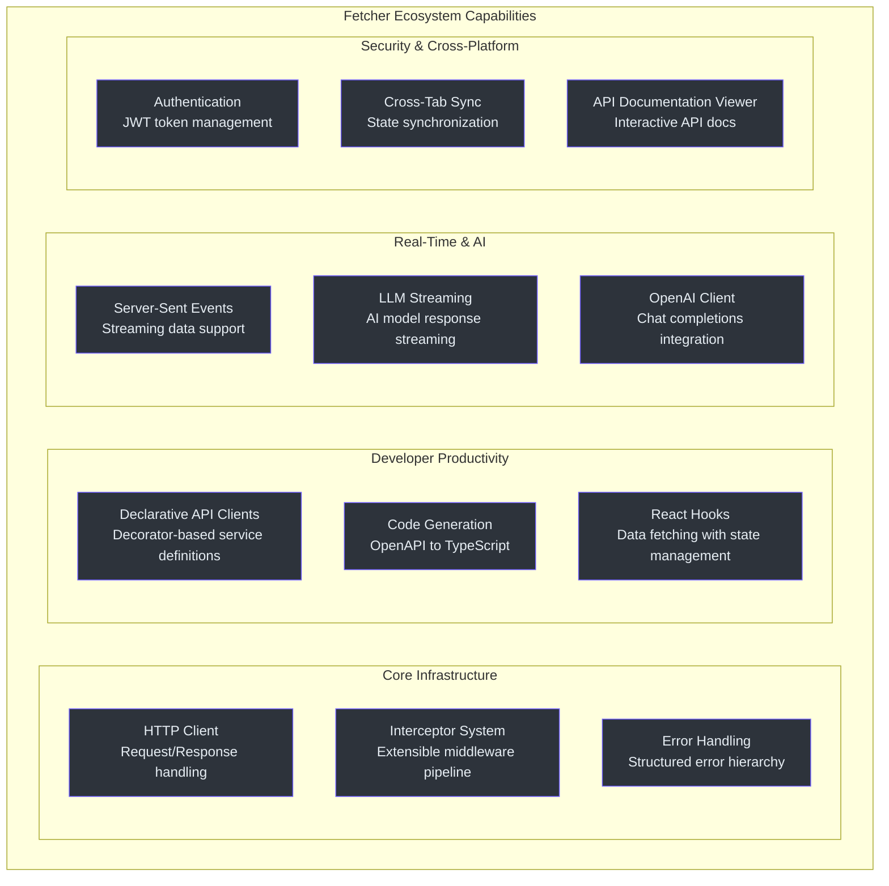
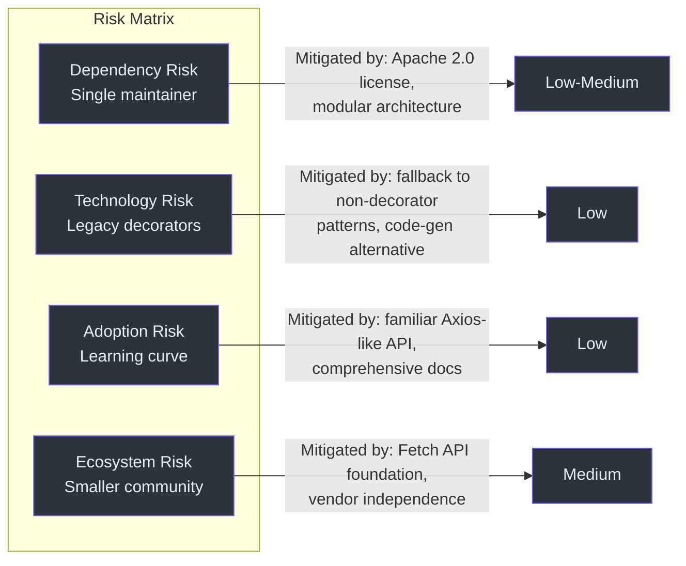
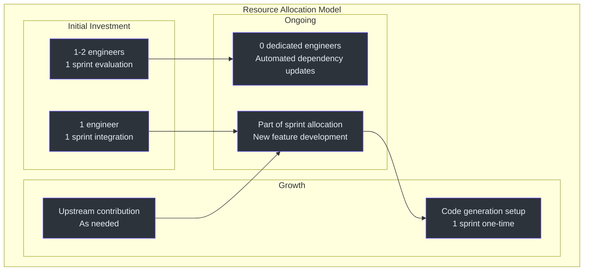

# 高管入门指南

本指南为工程管理层提供 Fetcher 的战略概览。内容涵盖平台交付的能力、涉及的风险与权衡，以及支持其持续发展的投资论证。

---

## Fetcher 是什么？

Fetcher 是一个面向 Web 应用的开源 HTTP 客户端平台。它不是一个单一的库，而是一个**由 12 个模块化包组成的生态系统**，共同处理以下任务：

- 向后端 API 发送 HTTP 请求
- 通过配置声明 API 客户端（而非手动编码）
- 从服务器流式传输实时数据，包括 AI 语言模型的响应
- 用户身份验证和安全令牌管理
- 跨浏览器标签页的状态同步
- 根据 API 规范自动生成客户端代码

该平台基于浏览器原生网络能力构建，使用 TypeScript 编写，并以 Apache 2.0 许可证开源发布。

---

## 能力图谱

| 能力 | 包名 | 业务价值 |
|---|---|---|
| 核心 HTTP 客户端 | `@ahoo-wang/fetcher` | 3 KB 替代 13+ KB 的方案；全面缩减所有应用的包体积 |
| 声明式 API 客户端 | `@ahoo-wang/fetcher-decorator` | 减少样板代码；开发者通过配置定义 API，而非手动编写代码 |
| 代码生成 | `@ahoo-wang/fetcher-generator` | 从 OpenAPI 规范自动生成 TypeScript 客户端；消除手写 API 层的工作 |
| 实时流式传输 | `@ahoo-wang/fetcher-eventstream` | Server-Sent Events 支持；赋能实时仪表盘、通知推送、AI 响应流式传输 |
| AI 集成 | `@ahoo-wang/fetcher-openai` | 原生 OpenAI 聊天补全流式传输；对 AI 产品功能至关重要 |
| DDD/CQRS 支持 | `@ahoo-wang/fetcher-wow` | 对领域驱动设计模式的一等支持；赋能事件溯源架构 |
| 身份验证 | `@ahoo-wang/fetcher-cosec` | JWT 令牌生命周期管理；自动令牌刷新；授权请求头 |
| 跨标签页状态 | `@ahoo-wang/fetcher-storage` + `eventbus` | 浏览器存储与跨标签页同步；多标签页一致性 |
| React 集成 | `@ahoo-wang/fetcher-react` | 用于数据获取的 React Hooks；加载/错误/成功状态管理；自动取消请求 |
| API 查看器 | `@ahoo-wang/fetcher-viewer` | 交互式 API 文档组件；内部开发者门户 |

---

## 技术投资论证

### 市场定位

JavaScript HTTP 客户端市场由 Axios（周下载量约 1 亿次）和原生 Fetch API 主导。Fetcher 定位于两者之间的空隙：提供 Axios 级别的开发者体验（拦截器、基础 URL、超时控制），同时完全基于原生平台构建，包体积仅为前者的零头。

### 战略价值主张

1. **包体积缩减**：核心包仅 3 KB，比 Axios 小 77%。对于交付多个 Web 应用的团队来说，累积的带宽节省相当可观。

2. **AI 原生架构**：Fetcher 在设计之初就将 LLM 流式传输作为一等公民。随着 AI 功能成为 Web 应用的标准配置，使用 Fetcher 的团队天然拥有流式传输 AI 响应的能力，无需引入额外的库。

3. **全栈类型安全**：OpenAPI 生成器直接从 API 规范生成 TypeScript 客户端，实现从后端 API 定义到前端消费的端到端类型安全。

4. **可组合的安全性**：身份验证通过拦截器实现，而非独立的层。这意味着安全策略是模块化的、可测试的，并且可以按应用或按服务灵活组合。

---

## 风险评估

### 依赖风险

| 因素 | 评估 | 缓解措施 |
|---|---|---|
| 巴士系数 | 主要维护者为单一开发者（Ahoo-Wang） | Apache 2.0 许可证确保代码可分叉；模块化架构意味着各包可独立替换 |
| 平台依赖 | 基于原生 Fetch API（浏览器标准）构建 | Fetch API 是 W3C 标准，所有主流浏览器均支持；无供应商锁定 |
| 构建工具链 | Vite + Vitest 生态系统 | 这些是拥有庞大社区的主流工具 |
| 装饰器依赖 | 使用旧版（Stage 1）TypeScript 装饰器 | 存在备选的代码生成路径；需制定 TC39 Stage 3 装饰器的迁移计划 |

### 维护负担

| 方面 | 当前状态 |
|---|---|
| 版本对齐 | 所有 12 个包共享单一版本（当前为 3.16.4），由 `pnpm update-version` 统一管理 |
| 测试覆盖 | 每个包独立运行 `vitest run --coverage`，使用 `@vitest/coverage-v8` |
| 依赖更新 | 通过 Renovate 自动化管理（[renovate.json](https://github.com/Ahoo-Wang/fetcher/blob/main/renovate.json)） |
| CI/CD | GitHub Actions 自动化构建、测试和覆盖率报告（Codecov） |
| 文档 | 中英双语 README；交互式 Storybook；Wiki 站点 |

### 采纳曲线

| 阶段 | 工作量 | 成果 |
|---|---|---|
| 即插即用 HTTP 客户端 | 低（数小时） | 将 `@ahoo-wang/fetcher` 作为 `fetch()` 的直接封装使用；类 Axios API |
| 拦截器定制 | 中低（数天） | 添加认证、日志、重试拦截器 |
| 声明式 API 客户端 | 中等（数天至数周） | 采用 `@ahoo-wang/fetcher-decorator` 进行服务定义 |
| 完整生态系统 | 中高（数周） | 集成 eventstream、cosec、storage、react hooks |
| 代码生成 | 中等（数天） | 使用 `@ahoo-wang/fetcher-generator` 搭建 OpenAPI 到 TypeScript 的流水线 |

---

## 成本与扩展模型

### 团队技能要求

| 技能水平 | 能力范围 |
|---|---|
| 初级开发者 | 使用预配置的 fetcher 实例；调用由装饰器定义的 API 方法 |
| 中级开发者 | 使用装饰器定义新的 API 服务类；编写自定义拦截器 |
| 高级开发者 | 设计拦截器链；实现认证流程；搭建代码生成流水线 |
| 资深开发者 | 架构横切关注点；评估各包的权衡；向社区上游贡献 |

### 资源模型

---

## 竞争格局

| 维度 | Fetcher | Axios | SWR/React Query | Ky |
|---|---|---|---|---|
| 包体积 | ~3 KB | ~13 KB | ~6-45 KB | ~3 KB |
| 平台 | Fetch API | XHR + Fetch | Fetch API（通过库） | Fetch API |
| 拦截器模型 | 三阶段（请求/响应/错误） | 两阶段（请求/响应） | 中间件钩子 | 钩子 |
| 原生 TypeScript | 是 | 部分 | 是 | 是 |
| SSE/LLM 流式传输 | 内置 | 否 | 否 | 否 |
| 装饰器式 API | 是 | 否 | 否 | 否 |
| OpenAPI 代码生成 | 是 | 否 | 否 | 否 |
| 认证管理 | 是（CoSec） | 否 | 否 | 否 |
| 跨标签页同步 | 是 | 否 | 否 | 否 |
| 社区规模 | 小型 | 非常大 | 大型 | 中型 |

---

## 可操作建议

### 面向启动新前端项目的团队

1. **将 Fetcher 作为默认 HTTP 客户端进行评估**。3 KB 的核心包可直接替代手动 `fetch()` 调用，同时提供类 Axios 的开发体验。
2. **尽早搭建 OpenAPI 生成器**。如果后端暴露了 OpenAPI 规范，生成器可以消除一整类手写 API 代码的工作。
3. **在 React 项目中采用 React Hooks 包**。`useFetcher` 和 `useQuery` 提供了经过实战检验的加载状态、错误处理和请求取消模式。

### 面向已有 Axios 代码的团队

1. **渐进式迁移**。核心 `Fetcher` 类与 Axios 拥有相同的概念模型（拦截器、基础 URL、请求头、超时控制）。迁移可以按服务逐步进行。
2. **从核心包开始**。无需立即采用装饰器系统。直接使用 `fetcher.get()`、`fetcher.post()` 即可。
3. **评估 SSE 流式传输包**，如果你的应用消费实时数据或 AI 模型响应。这是 Fetcher 最强的差异化优势。

### 面向构建 AI 功能的团队

1. **采用 `@ahoo-wang/fetcher-eventstream`** 用于基于 SSE 的 LLM 响应流式传输。
2. **考虑 `@ahoo-wang/fetcher-openai`**，获取原生流式传输支持的 OpenAI 聊天补全功能。
3. **使用 React Hooks** 将流式响应绑定到 UI 组件，支持自动清理。

### 面向平台/基础设施团队

1. **评估 CoSec**，用于跨应用的集中式认证拦截器管理。
2. **使用 EventBus 和 Storage 包**，实现多标签应用中的跨标签页状态同步。
3. **向社区上游贡献** -- 项目欢迎在 Apache 2.0 许可证下的贡献。

---

## 需要跟踪的关键指标

| 指标 | 如何衡量 | 目标 |
|---|---|---|
| 包体积影响 | 使用包分析器对比前后差异 | 相比当前 HTTP 客户端实现净缩减 |
| 开发者效率 | 实现新 API 集成所需时间 | 通过装饰器系统和代码生成实现可衡量的缩减 |
| 类型安全事故 | 来自 API 响应的运行时类型错误 | 通过端到端 TypeScript 覆盖实现降低 |
| 流式传输可靠性 | AI 功能的 SSE 连接稳定性 | 可靠的逐令牌传输 |
| 认证令牌管理 | 移除的手动令牌处理代码量 | 通过 CoSec 拦截器消除自定义认证代码 |
| 测试覆盖 | 每包覆盖率报告 | 在采纳增长过程中保持或提升覆盖率 |
| 事故率 | 生产环境 HTTP 相关事故 | 通过结构化错误处理和状态验证实现降低 |

---

## 实施路线图

### 第一阶段：基础搭建（第 1-2 周）

| 活动 | 负责方 | 交付物 |
|---|---|---|
| 安装核心 `@ahoo-wang/fetcher` 包 | 前端团队 | 包添加到项目中 |
| 将手动 `fetch()` 调用替换为 `fetcher.get()` / `fetcher.post()` | 前端开发者 | API 调用的渐进式迁移 |
| 配置基础 URL 和默认请求头 | 前端负责人 | 共享 fetcher 配置 |
| 使用 Vitest 搭建单元测试 | QA/开发团队 | HTTP 层的测试基础设施 |

### 第二阶段：提升效率（第 3-4 周）

| 活动 | 负责方 | 交付物 |
|---|---|---|
| 为新 API 服务采用 `@ahoo-wang/fetcher-decorator` | 前端团队 | 基于装饰器的 API 类 |
| 使用后端 OpenAPI 规范配置 `@ahoo-wang/fetcher-generator` | 平台团队 | 自动化代码生成流水线 |
| 集成 React Hooks（`useFetcher`、`useQuery`） | 前端开发者 | 替代临时拼凑的数据获取模式 |

### 第三阶段：高级特性（第 5-8 周）

| 活动 | 负责方 | 交付物 |
|---|---|---|
| 集成 `@ahoo-wang/fetcher-eventstream` 用于 SSE | 前端团队 | 实时数据流式传输能力 |
| 采用 `@ahoo-wang/fetcher-cosec` 进行认证管理 | 安全团队 + 前端 | 集中式令牌生命周期管理 |
| 搭建跨标签页同步 | 前端团队 | 多标签页状态一致性 |
| 评估 OpenAI 客户端用于 AI 功能 | 产品 + 前端 | AI 功能就绪 |

### 第四阶段：持续优化（长期）

| 活动 | 负责方 | 交付物 |
|---|---|---|
| 使用分析器监控包体积 | DevOps | 包体积回归检测 |
| 向上游贡献改进 | 高级开发者 | 社区参与 |
| 编写团队约定和模式文档 | 技术负责人 | 内部知识库 |

---

## 治理考量

### 开源许可证

Fetcher 采用 Apache 2.0 许可证，该许可证：
- 允许不受限制的商业使用。
- 要求归属声明（在分发中包含许可证声明）。
- 不要求衍生作品必须开源。
- 提供专利授权保护。

### 安全态势

| 安全方面 | 状态 |
|---|---|
| 依赖扫描 | Renovate 自动化更新 |
| 许可证合规 | Apache 2.0（宽松型许可证） |
| 已知漏洞 | 通过自动化依赖更新处理 |
| 令牌处理 | CoSec 提供结构化的 JWT 生命周期管理 |
| 传输安全 | 委托给浏览器原生 Fetch API（使用 TLS） |

### 支持模式

| 级别 | 来源 | 响应时间 |
|---|---|---|
| 社区支持 | GitHub Issues | 不确定（社区驱动） |
| 文档 | Wiki、Storybook、README | 自助服务 |
| 企业支持 | 目前暂不可用 | 不适用 |
| 分叉/自行维护 | Apache 2.0 允许分叉 | 团队自行控制 |

对于需要保证 SLA 的团队，Apache 2.0 许可证允许团队分叉仓库并维护内部版本。模块化架构意味着在需要时可以替换单个包，而不影响生态系统的其余部分。

---

## 成功标准

### 短期（30 天）

| 标准 | 衡量方式 |
|---|---|
| 核心包集成完成 | `@ahoo-wang/fetcher` 已安装并用于至少 5 个 API 调用 |
| 开发者入门完成 | 所有前端开发者已完成贡献者入门指南 |
| 测试基础设施运转正常 | HTTP 层的单元测试通过，覆盖率达到 80% 以上 |

### 中期（90 天）

| 标准 | 衡量方式 |
|---|---|
| 声明式 API 采纳 | 至少 50% 的新 API 服务使用基于装饰器的定义 |
| 代码生成流水线 | OpenAPI 生成器在 CI 中运行，从后端规范生成 TypeScript 客户端 |
| 认证集中管理 | CoSec 管理所有需认证 API 调用的令牌 |

### 长期（180 天）

| 标准 | 衡量方式 |
|---|---|
| 包体积缩减 | HTTP 客户端总包体积相比基线实现可衡量的缩减 |
| 开发者效率提升 | 实现新 API 集成所需时间至少减少 30% |
| AI 功能就绪 | 至少一个流式 AI 功能在生产环境中使用 eventstream |
| 零手动令牌处理 | 所有认证由 CoSec 拦截器处理；无手动令牌代码 |

---

## 风险缓解清单

- [ ] 确定一名了解 Fetcher 架构的第二位团队成员（降低巴士系数）。
- [ ] 编写团队拦截器约定和命名模式的文档。
- [ ] 设置包体积监控，以便及早发现回归问题。
- [ ] 建立评估主要版本更新的流程。
- [ ] 规划 TC39 Stage 3 装饰器迁移（时间线：TypeScript 稳定支持时）。
- [ ] 评估是否需要响应缓存，如果同时使用 SWR/React Query 和 Fetcher。

---

## 延伸阅读

| 资源 | 说明 |
|---|---|
| [贡献者入门指南](./contributor.md) | 面向加入 Fetcher 代码库的开发者的实践指南 |
| [资深工程师入门指南](./staff-engineer.md) | 深入的架构分析和设计权衡文档 |
| [产品经理入门指南](./product-manager.md) | 非技术性的功能概览和采纳框架 |
| [Fetcher GitHub 仓库](https://github.com/Ahoo-Wang/fetcher) | 源代码、问题追踪和贡献指南 |
| [npm 包](https://www.npmjs.com/search?q=%40ahoo-wang%2Ffetcher) | 发布在 npm 注册表上的包 |

---

## 文档修订历史

| 日期 | 版本 | 变更内容 |
|---|---|---|
| 2026-05 | 1.0 | 初始高管入门指南 |
