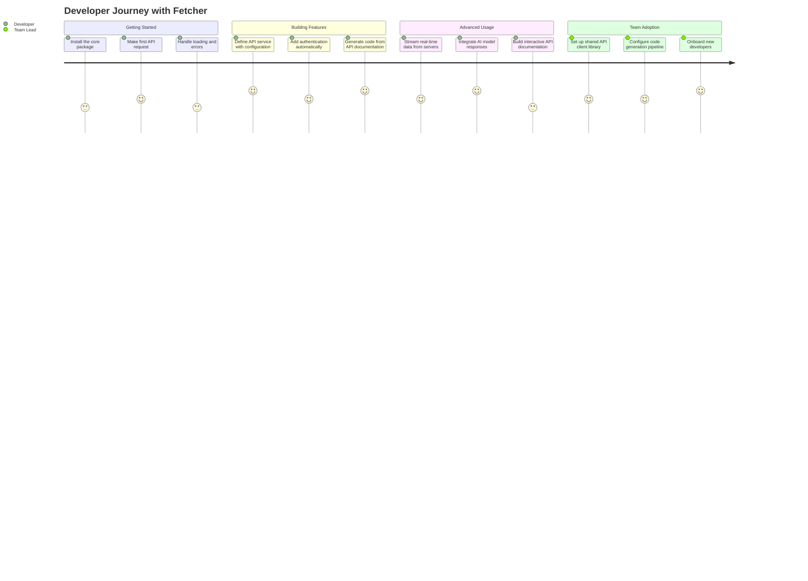
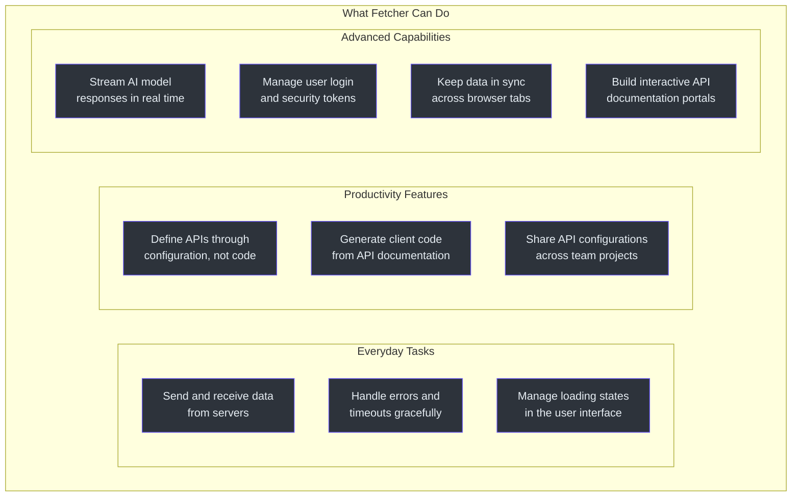
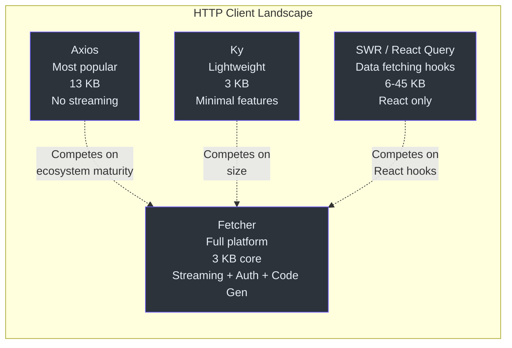

# 产品经理入门指南

本指南用通俗易懂的语言解释 Fetcher，不使用工程术语。面向产品经理、项目经理和需要了解 Fetcher 功能、价值及局限性的非工程利益相关者。

---

## Fetcher 做什么

每个 Web 应用都需要与服务器通信。当用户点击"加载个人资料"时，应用会向服务器发送请求，然后接收返回的个人资料数据。Fetcher 就是负责处理这种通信的软件。

可以把 Fetcher 想象成一个 **Web 应用与服务器之间的通用翻译器**。它负责：

- 将请求发送到正确的地址
- 在服务器不可用时处理错误
- 自动管理登录凭据
- 实时流式传输数据（例如来自 AI 的聊天回复）
- 当用户打开多个浏览器标签页时保持数据同步

Fetcher 不是单一产品 -- 它是一个**由 12 个互相关联的工具组成的平台**。工程团队可以根据需要只使用其中的部分工具。

---

## 开发者如何使用 Fetcher

### 开发者旅程

### 第一步：发起 API 请求

Fetcher 最基础的用途是与服务器发送和接收数据。开发者编写简单的指令，如"获取用户资料"或"保存订单"，Fetcher 则负责处理所有技术细节。

### 第二步：定义 API 服务

开发者无需反复编写相同的请求代码，而是可以用结构化的方式描述他们的 API。例如，他们可以定义"这是一个用户服务，地址在这里，支持这些操作"。Fetcher 会根据描述自动生成可运行的代码。

### 第三步：自动生成代码

当后端团队发布 API 文档（使用行业标准的 OpenAPI 格式）时，Fetcher 可以自动生成与该 API 通信所需的全部前端代码。这消除了整个类别的手动工作。

### 第四步：实时功能

对于需要实时更新的功能 -- 聊天界面、实时仪表盘、AI 助手回复 -- Fetcher 提供了内置的流式数据支持。开发者无需学习或集成额外的工具。

---

## 功能能力图谱

| 功能类别 | 功能描述 | 受益方 |
|---|---|---|
| API 通信 | 向服务器发送请求并处理响应 | 团队中的每一位开发者 |
| 错误处理 | 自动捕获并报告故障 | 终端用户（更好的错误提示） |
| 加载状态 | 跟踪数据加载中、成功或失败的状态 | UI 开发者、产品设计师 |
| API 定义 | 通过配置描述 API，而非手动编写代码 | 开发者（减少工作量）、项目经理（加快交付） |
| 代码生成 | 从 API 文档自动生成可运行的代码 | 开发团队（消除手动编码） |
| AI 流式传输 | 逐令牌流式传输来自 AI 模型（ChatGPT、Claude 等）的响应 | 构建 AI 功能的产品团队 |
| 身份验证 | 管理登录令牌并自动刷新 | 安全团队、开发者 |
| 跨标签页同步 | 用户打开多个标签页时保持数据一致 | 终端用户（一致的体验） |
| API 文档 | 提供交互式组件来浏览和测试 API | 开发者体验团队 |

---

## Fetcher 的对比

### 与主要替代方案的对比

| 需求 | 不使用 Fetcher | 使用 Fetcher |
|---|---|---|
| 发起 API 请求 | 编写 15-30 行错误处理代码 | 编写 1-2 行 |
| 为所有请求添加认证 | 手动在每个请求中添加登录令牌 | 配置一次，自动应用于所有请求 |
| 流式传输 AI 响应 | 集成一个独立的流式传输库 | 内置功能，一次导入即可激活 |
| 生成 API 客户端代码 | 使用独立的代码生成工具或手动编写 | 内置生成器读取 API 文档并创建代码 |
| 处理多个 API 服务器 | 分别配置每个服务器连接 | 命名服务器注册表；配置一次，按名称引用 |
| 保持标签页同步 | 自行构建自定义同步逻辑 | 内置跨标签页通信 |

### 市场格局

Fetcher 的独特定位：它是唯一一个将小巧的核心包体积与内置 AI 流式传输、认证管理、代码生成和跨标签页同步结合在一起的 HTTP 客户端平台。竞争对手通常只覆盖其中的一到两个领域。

---

## Fetcher 不做什么

了解其边界很重要：

| 局限性 | 详情 |
|---|---|
| 不支持服务端 | Fetcher 是前端工具，不运行在服务器上。 |
| 不支持旧版浏览器 | 需要支持原生 Fetch API 的现代浏览器。不支持 Internet Explorer。 |
| 无内置缓存 | 与 SWR 或 React Query 不同，Fetcher 不缓存 API 响应。缓存需另外处理。 |
| 不支持离线模式 | Fetcher 不提供离线优先能力或 Service Worker 集成。 |
| 不支持 GraphQL | Fetcher 专为 REST API 和 SSE 设计。GraphQL 需要单独的工具。 |
| 社区较小 | Fetcher 的用户和贡献者少于 Axios 或 React Query。支持资源相对有限。 |
| 需要 Node.js 18+ | 不支持较旧的 Node.js 版本。 |

---

## 常见问题

### 综合问题

**问：Fetcher 是否已经可用于生产环境？**
答：Fetcher 当前版本为 3.16.4，具备自动化测试和覆盖率报告，已在生产环境使用。但其社区规模小于 Axios 等主要替代方案，企业团队应根据自身风险承受能力进行评估。

**问：我们可以在现有 HTTP 客户端的基础上同时使用 Fetcher 吗？**
答：可以。Fetcher 是模块化的。你可以仅为新功能采用核心包，同时保留现有 HTTP 客户端处理遗留代码。两者不会冲突。

**问：Fetcher 能否兼容我们的后端框架？**
答：Fetcher 通过 HTTP 通信，与框架无关。它能与任何暴露 HTTP 端点的后端配合使用 -- Java/Spring、Node.js/Express、Python/Django、Go 等。

### 产品决策相关

**问：Fetcher 能节省多少开发者时间？**
答：主要的节省来自三个方面：
1. 声明式 API 定义减少了开发者为每个 API 端点编写的代码量。
2. 当有 OpenAPI 规范可用时，代码生成消除了手动编写 API 客户端的工作。
3. 内置的认证和流式传输减少了对第三方库集成的需求。

具体节省量取决于 API 端点数量和应用复杂度。

**问：如果项目停止维护，风险是什么？**
答：Fetcher 是在 Apache 2.0 许可证下开源的。代码可以被分叉并独立维护。模块化架构意味着可以替换单个包而无需重写整个应用。核心包无外部依赖，降低了传递性风险。

**问：Fetcher 如何影响页面加载性能？**
答：核心包为应用包体积增加约 3 KB（经过压缩和 minify）。作为对比，Axios 增加约 13 KB。对于典型应用，这个差异虽然微小，但在受限网络环境下是可衡量的。

**问：Fetcher 能否支撑我们的规模？**
答：Fetcher 是客户端库。其性能特征取决于浏览器和网络，而非 Fetcher 本身。它不会施加任何服务端限制。

### AI 功能相关

**问：Fetcher 如何支持 AI 功能？**
答：Fetcher 内置了对 AI 模型流式响应的支持。当用户向 AI 助手发送问题时，响应会逐词（或逐令牌）到达。Fetcher 原生处理这种流式传输，无需额外的库。它还包含一个预构建的 OpenAI 客户端，兼容 ChatGPT API。

**问：我们需要 Fetcher 才能在产品中使用 AI 吗？**
答：不需要。Fetcher 只是连接 AI 服务的一种方式。但如果你的产品需要实时流式传输 AI 响应（即"打字机"效果），Fetcher 可以开箱即用地提供这一功能。否则你需要集成一个独立的流式传输库。

---

## 关键利益相关者图谱

| 利益相关者 | 与 Fetcher 的关系 | 关注点 |
|---|---|---|
| 前端开发者 | 日常使用者 | API 开发体验、类型安全、文档质量 |
| 后端开发者 | API 规范提供者 | OpenAPI 规范兼容性、代码生成输出 |
| 技术负责人 | 采纳决策者 | 架构适配性、迁移工作量、团队学习曲线 |
| 安全团队 | 策略执行者 | 令牌管理、认证模式、漏洞面 |
| 产品经理 | 功能推动者 | 交付速度、AI 功能能力、开发者效率 |
| QA 团队 | 质量守门人 | 测试基础设施兼容性、错误报告质量 |
| DevOps/SRE | 基础设施运维者 | 包体积影响、监控集成、部署流水线 |

---

## Fetcher 如何融入开发流程

### 使用 Fetcher 之前：当前状态

在许多组织中，前端与后端的通信层是临时搭建的。每个功能团队编写自己的请求代码、错误处理和认证逻辑。这导致：

- **不一致的错误处理**：某些页面显示"出了点问题"，而其他页面什么都不显示。
- **重复的认证代码**：每个团队都编写自己的令牌管理代码，导致令牌过期时出现 Bug。
- **手动维护 API 客户端**：当后端更改 API 时，开发者需要手动更新前端代码以匹配。
- **缺乏流式传输支持**：实时功能需要独立的库或自定义 WebSocket 实现。

### 使用 Fetcher 之后：改进的状态

通过 Fetcher，通信层实现了标准化：

- **一致的行为**：所有 API 调用都经过相同的拦截器流水线，确保统一的错误处理、日志记录和认证。
- **自动令牌管理**：登录令牌自动添加到请求中，并在过期时自动刷新。开发者无需关心认证细节。
- **生成的 API 客户端**：当后端更新 API 文档时，前端代码自动重新生成。无需手动更新。
- **原生流式传输**：实时功能（聊天、通知、AI 响应）开箱即用，无需额外的库。

### 对团队结构的影响

| 角色 | 使用 Fetcher 之前 | 使用 Fetcher 之后 |
|---|---|---|
| 前端开发者 | 每次 API 调用编写 20-30 行代码，手动处理认证 | 每次 API 调用编写 1-2 行代码，认证自动处理 |
| 后端开发者 | 必须与前端就 API 变更进行协调 | 发布 OpenAPI 规范；前端代码自动生成 |
| QA 工程师 | 按功能测试错误处理；行为不一致 | 针对标准化的拦截器流水线测试；行为一致 |
| 安全工程师 | 审查每个功能中的认证代码 | 审查一次 CoSec 配置；自动应用于所有功能 |

---

## 用例场景

### 场景 1：电商产品目录

产品团队需要构建一个产品目录页面，从 API 加载产品，等待时显示加载动画，优雅地处理错误，并支持筛选。

**不使用 Fetcher**：开发者编写自定义的 fetch 代码，手动管理加载状态，自行创建错误组件，从零开始处理分页逻辑。预估工作量：每位开发者 2-3 天。

**使用 Fetcher**：开发者使用装饰器一次性定义产品 API，使用 `useQuery` 钩子获取数据并自动管理加载/错误状态，拦截器模式免费提供分页功能。预估工作量：0.5-1 天。

### 场景 2：AI 聊天助手

产品团队希望添加一个 AI 聊天助手，流式传输来自语言模型的响应。

**不使用 Fetcher**：开发者必须集成一个独立的流式传输库，手动处理 Server-Sent Events 解析，在 React 中管理流式传输状态，从零实现"打字机"效果。预估工作量：1-2 周。

**使用 Fetcher**：开发者导入 eventstream 模块，使用内置的流式传输支持，并通过现有的钩子将流绑定到 React 组件。"打字机"效果自动生效。预估工作量：1-2 天。

### 场景 3：多标签页银行应用

一个金融应用需要在用户打开多个标签页时保持会话和账户数据的一致性。

**不使用 Fetcher**：开发者必须使用 `BroadcastChannel` 或 `localStorage` 事件实现自定义的跨标签页通信系统，处理标签页关闭等边界情况，并在各标签页间同步令牌刷新。预估工作量：1-2 周。

**使用 Fetcher**：开发者使用 storage 和 eventbus 包实现跨标签页同步。CoSec 包在处理令牌刷新时自动通知所有标签页。预估工作量：1-2 天的配置工作。

---

## 采纳决策框架

### 适合使用 Fetcher 的情况

- 你的应用向后端服务发起多个 API 调用。
- 你希望在整个应用中实现一致的错误处理和加载状态。
- 你的后端团队提供 OpenAPI 规范。
- 你需要实时数据流式传输（聊天、通知、实时仪表盘）。
- 你正在构建需要流式响应的 AI 功能。
- 你的应用使用多个浏览器标签页，需要状态同步。
- 你希望减少开发者编写的样板代码量。

### 可能不适合使用 Fetcher 的情况

- 你的应用只发起极少的 API 调用（一两个简单的端点）。
- 你需要支持旧版浏览器（Internet Explorer）。
- 你的团队在 Axios 上有大量投入，没有迁移的动力。
- 你需要内置的响应缓存（SWR 或 React Query 更适合此场景）。
- 你完全使用 GraphQL（Fetcher 聚焦于 REST/SSE）。
- 你的团队没有使用 TypeScript（Fetcher 以 TypeScript 优先，但也兼容纯 JavaScript）。

---

## 术语表（非技术版）

| 术语 | 通俗解释 |
|---|---|
| **API** | 不同软件系统之间互相沟通的方式。当你的应用需要从服务器获取数据时，它会发送一个 API 请求。 |
| **HTTP 客户端** | 向服务器发送请求并接收响应的软件。Fetcher 就是一个 HTTP 客户端。 |
| **拦截器** | 请求流水线中的一个检查点。就像机场的安检通道，每个拦截器都可以在请求继续之前检查、修改或拒绝它。 |
| **SSE（Server-Sent Events）** | 服务器实时向浏览器发送数据的方式，类似实时滚动新闻。用于聊天回复、通知和实时仪表盘。 |
| **LLM 流式传输** | 来自 AI 语言模型（如 ChatGPT）的流式响应。响应逐词出现，就像一个人在打字一样。 |
| **JWT 令牌** | 一种数字身份证，用于证明用户已登录。它附加在每个请求上，让服务器知道是谁在发出请求。 |
| **OpenAPI** | 一种用于描述 API 功能的标准格式。可以把它想象成餐厅的菜单 -- 它告诉你有哪些菜品（端点）可供选择以及需要哪些配料（参数）。 |
| **代码生成** | 根据规范自动编写计算机代码。开发者无需手写 API 客户端代码，工具读取 API 规范并自动生成代码。 |
| **装饰器** | 附加在代码上的标签，告诉系统如何使用这段代码。就像在包裹上贴"易碎"标签一样，像 `@get` 这样的装饰器告诉系统"这个方法应该发起一个 GET 请求"。 |
| **包体积** | 当用户加载你的网站时，发送到浏览器的代码总量。越小越快。 |
| **TypeScript** | JavaScript 的一个版本，增加了类型检查功能。它有助于在代码运行前发现错误，而不是等到用户使用产品时才发现。 |
| **React Hook** | React 组件使用数据获取、状态管理和副作用等功能的方式。可以理解为将组件接入数据管道。 |
| **Monorepo** | 一个包含多个相关项目的单一代码仓库。Fetcher 使用一个包含 12 个包的 monorepo。 |
| **跨标签页同步** | 当用户在多个浏览器标签页中打开同一网站时保持数据一致。如果你在一个标签页登录，其他标签页也应该知道。 |

---

## 总结

Fetcher 是一个模块化的 HTTP 客户端平台，用统一的、配置驱动的系统取代了分散的手写服务器通信代码。其关键差异化优势包括：小巧的核心体积（3 KB）、内置 AI 流式传输支持、从 API 规范自动生成代码以及集成的认证管理。

该平台最适合正在构建新前端应用、采纳 AI 功能或希望标准化 API 通信层的团队。它要求使用现代浏览器和 TypeScript，社区规模小于 Axios 等成熟替代方案。

对于评估 Fetcher 的团队，建议的方式是从单个功能开始使用核心包，评估开发体验，然后根据结果逐步扩大采纳范围。上述决策框架可以帮助你判断 Fetcher 是否适合你的具体情况。

---

## 常见问题

### 综合问题

**问：Fetcher 能否替代 Axios？**
答：可以，Fetcher 提供了相同的核心能力（拦截器、基础 URL、超时控制、错误处理），且包体积小得多。目前使用 Axios 的团队可以逐步迁移，因为两者概念模型相似。

**问：Fetcher 能否在 JavaScript（非 TypeScript）中使用？**
答：可以。虽然 Fetcher 使用 TypeScript 编写，但你可以从纯 JavaScript 中使用它。你会失去类型检查的好处，但运行时行为完全一致。

**问：Fetcher 支持哪些浏览器？**
答：Fetcher 基于原生 Fetch API 构建，所有现代浏览器（Chrome、Firefox、Safari、Edge）均支持。不支持 Internet Explorer。

**问：Fetcher 是否已经可用于生产环境？**
答：Fetcher 当前版本为 3.16.4，表明其已相当成熟。它包含全面的测试覆盖、自动化的 CI/CD 和结构化的发布管理。但社区规模小于 Axios，因此社区提供的边缘情况解决方案可能相对有限。

**问：Fetcher 如何处理错误？**
答：Fetcher 有一套结构化的错误系统。当请求失败（网络错误、超时或无效状态码）时，它会创建一个 `FetcherError` 对象，包含请求详情、响应（如果可用）和错误原因。这为开发者提供了清晰、可操作的信息来诊断问题。

### 采纳问题

**问：集成 Fetcher 需要多长时间？**
答：对于基本集成（仅核心包），开发者可以在几小时内上手。对于完整生态系统（装饰器、代码生成、认证），小型团队预计需要一到两个迭代周期。

**问：我们需要一次性重写所有 API 调用吗？**
答：不需要。Fetcher 专为渐进式采纳设计。你可以逐个替换 API 调用，甚至可以在同一应用内逐步进行。核心包与现有 HTTP 客户端代码并行使用，不会产生冲突。

**问：如果项目停止维护怎么办？**
答：Fetcher 采用 Apache 2.0 许可证，允许分叉。模块化架构意味着可以替换单个包而不影响系统的其余部分。核心依赖是浏览器原生 Fetch API，因此底层运行时由浏览器供应商维护。

**问：Fetcher 能否用于移动应用？**
答：Fetcher 面向 Web 浏览器和 Fetch API。对于 React Native 或原生移动应用，你需要验证移动运行时的 Fetch API 兼容性。核心概念（拦截器、装饰器）仍然适用，但需要针对平台进行特定测试。

---

## 延伸阅读

| 资源 | 说明 |
|---|---|
| [高管入门指南](./executive.md) | 面向工程管理层的战略概览 |
| [资深工程师入门指南](./staff-engineer.md) | 面向高级技术岗位的深度架构分析 |
| [贡献者入门指南](./contributor.md) | 面向贡献代码的开发者的实践指南 |
| [Fetcher GitHub 仓库](https://github.com/Ahoo-Wang/fetcher) | 源代码、问题追踪和发布说明 |
| [npm 包](https://www.npmjs.com/search?q=%40ahoo-wang%2Ffetcher) | 发布在 npm 注册表上的包，含版本历史和下载统计 |
