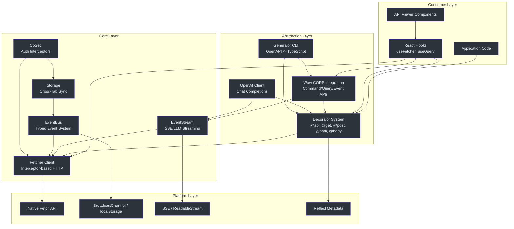
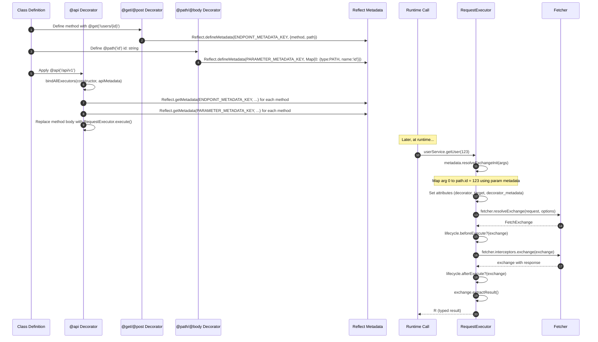
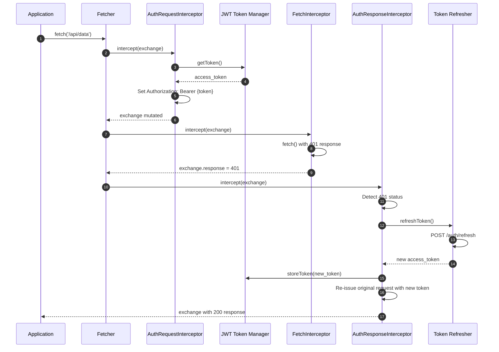
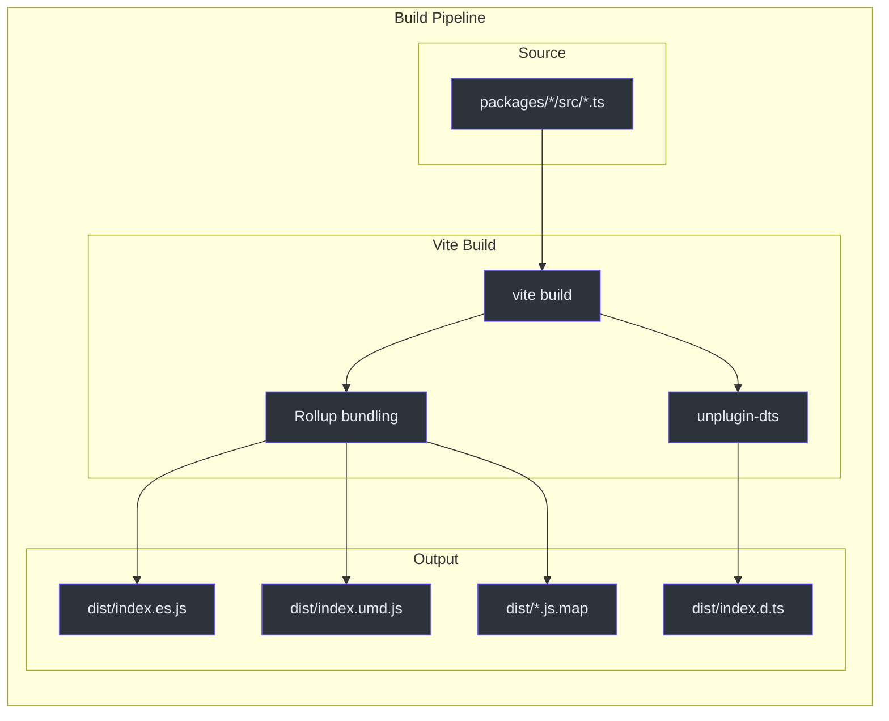
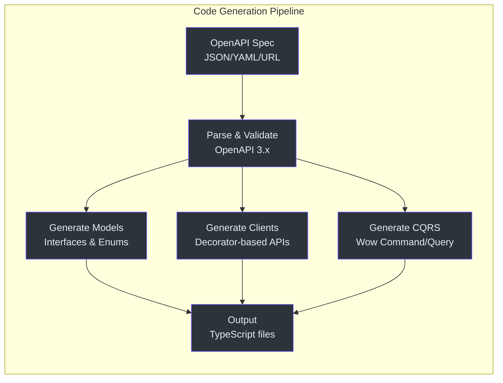

# 资深工程师入门指南

本指南面向需要在架构层面理解 Fetcher 的资深和首席工程师。它聚焦于设计背后的"为什么"、所做的权衡，以及塑造持续开发的约束条件。本指南假设你对 TypeScript、Fetch API 和常见的前端架构模式有深入的了解。

---

## 一个核心洞察

Fetcher 的架构建立在一个单一的设计洞察之上：**拦截器链就是整个系统**。每一个 HTTP 操作 -- 身份验证、URL 解析、请求体序列化、超时控制、状态验证、错误处理 -- 都实现为拦截器，而非硬编码在客户端内部的逻辑。

这意味着系统是完全可组合的。你可以：

- 在认证拦截器和 fetch 拦截器之间插入一个重试拦截器。
- 用 Protocol Buffers 序列化器替换默认的 JSON body 序列化器。
- 通过在请求拦截器中注入追踪头，在响应拦截器中提取计时数据来添加分布式追踪。
- 通过在 exchange 属性中设置 `IGNORE_VALIDATE_STATUS` 来按请求抑制状态验证。
- 在错误拦截器中实现断路器逻辑，跟踪每个端点的失败率。

`InterceptorManager` 编排三个阶段 -- 请求、响应、错误 -- 每个阶段都由一个 `InterceptorRegistry` 支撑，该注册表按 `order` 属性维护已排序的拦截器。内置拦截器之间以 `BUILT_IN_INTERCEPTOR_ORDER_STEP`（10,000）为间隔，为开发者留出了宽广的插入空间。

这并不是一个原创的想法 -- Axios 使用了类似的模型 -- 但 Fetcher 对其进行了扩展，添加了错误阶段、用于拦截器间通信的 exchange 属性系统，以及结果提取器抽象。

**来源**: [packages/fetcher/src/interceptorManager.ts:48-212](https://github.com/Ahoo-Wang/fetcher/blob/main/packages/fetcher/src/interceptorManager.ts#L48-L212)

---

## 系统架构

### 分层图



### 请求处理管道

单个 HTTP 请求的完整处理管道：

```mermaid
sequenceDiagram
autonumber

    participant Caller as Caller
    participant F as Fetcher
    participant IM as InterceptorManager
    participant RBI as RequestBodyInterceptor<br>order: MIN+10K
    participant URI as UrlResolveInterceptor<br>order: MAX-20K
    participant FI as FetchInterceptor<br>order: MAX-10K
    participant VSI as ValidateStatusInterceptor<br>order: MAX-10K

    Caller->>F: exchange(request, options)
    F->>F: resolveExchange(request, options)
    Note over F: 1. Merge default + request headers
    Note over F: 2. Resolve timeout (request > fetcher default)
    Note over F: 3. Merge request options with defaults
    Note over F: 4. Create FetchExchange
    F->>IM: interceptors.exchange(exchange)

    rect rgb(30, 40, 50)
        Note over IM: Request Phase
        IM->>RBI: intercept(exchange)
        Note over RBI: If body is plain object,<br>JSON.stringify and set Content-Type
        RBI-->>IM: exchange mutated
        IM->>URI: intercept(exchange)
        Note over URI: Resolve URL: combineURLs(baseURL, url)<br>+ path params + query params
        URI-->>IM: exchange.request.url resolved
        IM->>FI: intercept(exchange)
        FI->>FI: timeoutFetch(request)
        Note over FI: Race fetch() vs AbortController timeout
        FI-->>IM: exchange.response = Response
    end

    rect rgb(30, 40, 50)
        Note over IM: Response Phase
        IM->>VSI: intercept(exchange)
        Note over VSI: Check validateStatus(status)<br>Throw HttpStatusValidationError if invalid
        VSI-->>IM: status validated
    end

    IM-->>F: exchange
    F->>F: exchange.extractResult()
    F-->>Caller: R (typed result)

```



**来源**: [packages/fetcher/src/interceptorManager.ts:191-211](https://github.com/Ahoo-Wang/fetcher/blob/main/packages/fetcher/src/interceptorManager.ts#L191-L211)

### 装饰器系统架构

装饰器系统分两个阶段运作：在类定义时收集元数据，在方法调用时执行运行时逻辑。



**来源**: [packages/decorator/src/requestExecutor.ts:114-146](https://github.com/Ahoo-Wang/fetcher/blob/main/packages/decorator/src/requestExecutor.ts#L114-L146)

### CoSec 认证流程



---

## 设计权衡分析

### 为什么选择原生 Fetch 而非 Axios？

| 维度 | 原生 Fetch | Axios | Fetcher 的选择 |
|---|---|---|---|
| 包大小 | 0 KB（内置） | 约 13 KB min+gzip | 封装层约 3 KB min+gzip |
| 浏览器支持 | 所有现代浏览器 + Node 18+ | 广泛（XHR 降级） | 仅现代浏览器；需要 Node 18+ |
| 拦截器模型 | 无 | 请求/响应 | 请求/响应/错误（三阶段） |
| 中止机制 | `AbortController`（原生） | `CancelToken`（已弃用） | 原生 `AbortController` |
| 流式传输 | 原生 `ReadableStream` | 有限支持 | 完整的 SSE/LLM 流式传输支持 |
| Tree-shaking | 不适用 | 较差（单体式） | 优秀（模块化包） |
| 请求体类型 | 仅 `BodyInit` 子类型 | 对象自动序列化 | 通过拦截器自动序列化对象 |
| 响应类型 | `.json()`、`.text()` 等 | 通过 `responseType` 配置 | 可插拔的 `ResultExtractor` |
| 超时 | 非内置 | 内置 | 通过 `AbortController` 竞争实现 |
| 错误语义 | 仅网络错误 | 状态 + 网络 | 通过拦截器处理状态 + 网络 |

选择基于 `fetch()` 构建而非封装 Axios 的决策消除了 13 KB 的依赖，启用了原生 `ReadableStream` 支持用于 SSE，并与平台发展方向保持一致。权衡的代价是失去了 Axios 面向旧浏览器的自动 XHR 降级支持，以及它的 `transformRequest`/`transformResponse` 快捷方式 -- Fetcher 的拦截器系统用更通用的机制替代了它们。

### 为什么选择旧版装饰器而非代码生成优先？

Fetcher 支持两种 API 客户端生成方式：
1. **装饰器优先**：编写带有装饰器的 TypeScript 类，方法在运行时执行。
2. **代码生成优先**：通过 `@ahoo-wang/fetcher-generator` 从 OpenAPI 规范生成 TypeScript 类。

装饰器优先的方式被选为主要模式，原因在于：

- 它在代码库中提供了唯一的事实来源（装饰后的类）。
- 它避免了简单用例的构建步骤复杂性。
- `@api` 装饰器在类加载时处理方法替换，初始化后没有运行时开销。
- IDE 支持出色：TypeScript 在设计时就能看到带正确类型的装饰方法。

权衡的代价是依赖 `reflect-metadata`（约 18 KB）以及使用了旧版（Stage 1）装饰器，这些不是 TC39 标准的一部分。这是一个经过计算的风险：TC39 Stage 3 装饰器提案有不同的语义（装饰器接收上下文对象而非目标），迁移将需要主版本号升级。代码生成路径作为逃生舱口而存在。

### 为什么 EventStream 使用副作用导入？

`@ahoo-wang/fetcher-eventstream` 模块在导入时修补 `Response.prototype`。这在 JavaScript 生态系统中是有争议的。考虑过的替代方案有：

1. **包装函数**：`const stream = toEventStream(response)` -- 显式但冗长。
2. **自定义 Response 子类**：需要包装 `fetch()` 返回的每个 `Response`。
3. **拦截器**：可以工作，但将 SSE 支持仅耦合到 Fetcher 类。
4. **混入模式**：通过拦截器应用到所有 Response 实例 -- 类似当前方案，但发现性更差。

选择副作用方案的原因：
- 它使 `response.eventStream()` 在任何存在 `Response` 对象的地方都可用，甚至在 Fetcher 生态系统之外。
- 它是一次性导入（`import '@ahoo-wang/fetcher-eventstream'`），全局激活。
- 它包含保护检查（`hasOwnProperty`）以防止重复打补丁。
- 该模块检查 `typeof Response !== 'undefined'` 以避免在服务端环境中出错。

权衡的代价是导入该模块的任何位置都会改变全局行为。这已被文档记录并做了保护，但需要团队的意识。可以通过 linter 规则强制该导入只出现在中央配置文件中。

### 为什么使用三阶段错误处理？

大多数 HTTP 客户端库只有两个阶段：请求和响应。Fetcher 添加了第三个阶段：**错误拦截器**。这使得以下模式成为可能：

- **重试**：错误拦截器可以检测到可重试的错误，重新发起请求，并清除 exchange 上的错误。exchange 继续进行，就像请求成功了一样。
- **令牌刷新**：错误拦截器检测到 401，刷新认证令牌，重新发起原始请求，并清除错误。
- **优雅降级**：错误拦截器可以设置一个回退响应，而不是传播错误。
- **错误日志和遥测**：错误拦截器可以记录错误详情而不修改错误流。

如果错误拦截器清除了 `exchange.error`，则 exchange 成功返回。如果错误持续存在，它会被包装为 `ExchangeError`。

将错误拦截器设计为"可修复的"（通过清除错误）而非总是传播，这使得重试和令牌刷新可以在调用方不知情的情况下实现。

**来源**: [packages/fetcher/src/interceptorManager.ts:191-211](https://github.com/Ahoo-Wang/fetcher/blob/main/packages/fetcher/src/interceptorManager.ts#L191-L211)

### 为什么 FetchExchange 是可变的？

`FetchExchange` 是可变的。拦截器原地修改它，而不是返回一个新对象。这是一个经过深思熟虑的选择：

- **性能**：避免了每个拦截器的对象分配。每个请求创建一个 exchange，拦截器对其进行修改。
- **简洁性**：拦截器没有返回值；它们只是修改 exchange。
- **错误恢复**：错误拦截器可以原地清除 `exchange.error`，实现"修复并继续"的模式。

权衡的代价是拦截器必须注意顺序。如果一个请求拦截器在 `FetchInterceptor` 之前运行，它读取 `exchange.response` 会得到 `undefined`。`order` 属性和文档使这一点变得明确。

---

## 性能特征

### 包大小

核心 `@ahoo-wang/fetcher` 包的目标是 **3 KB min+gzip**。实现方式：

- 零外部依赖（无 `axios`、无 `node-fetch`、无 polyfill）。
- 无 polyfill（要求原生 `fetch` 和 `AbortController`）。
- 可 tree-shaking 的 ESM 导出：`export * from './fetcher'` 允许打包器消除未使用的代码。
- 模块化架构：只导入你需要的。

每个包都可进行 bundle 分析：
```bash
pnpm --filter @ahoo-wang/fetcher analyze
```

### 运行时性能

- **拦截器链**：在 `use()`（添加）时通过 `Array.sort` 排序一次。执行是线性迭代，每个拦截器都有 `await`。排序后的数组被缓存为 `sortedInterceptors`。
- **URL 构建**：基于正则表达式的模板解析。正则表达式（URI Template 使用 `/{([^}]+)}/g`，Express 使用 `/:[^/]+/g`）在每个类实例中编译一次，通过静态属性复用。
- **超时**：使用 `Promise.race` 让 `fetch()` 和计时器竞争。计时器清理在 `finally` 块中执行以避免资源泄漏。`aborted` 标志防止重复拒绝。
- **结果提取**：结果通过 `cachedExtractedResult` 缓存在 `FetchExchange` 上，防止重复反序列化。`hasCachedResult` 布尔标志跟踪缓存状态。
- **元数据查找**：`Reflect.getMetadata` 调用在每个类定义时执行一次（在 `@api` 时），而非每个请求一次。生成的 `RequestExecutor` 缓存在原型实例上。

**来源**: [packages/fetcher/src/timeout.ts:120-172](https://github.com/Ahoo-Wang/fetcher/blob/main/packages/fetcher/src/timeout.ts#L120-L172)

### 内存考量

- `FetchExchange` 对象按请求创建，不做池化。一旦请求完成且调用方丢弃引用，它们即可被 GC 回收。
- `FetchExchange` 上的 `attributes` 映射使用 `Map<string, any>`，如果拦截器不小心存储了大量对象，可能会导致内存积累。文档建议使用命名空间键（如 `mylib.traceId`）。
- `FetcherRegistrar` 持有对所有已注册 fetcher 的强引用。如果 fetcher 实例是动态创建的（如按租户），则必须显式取消注册以避免泄漏。
- `FetchExchange` 上的结果提取器缓存意味着响应 body 只能读取一次（这与 Fetch API 的一次性 body 约束一致）。

---

## 决策日志

### D1：拦截器顺序间隔

**决策**：内置拦截器使用 `BUILT_IN_INTERCEPTOR_ORDER_STEP`（10,000）作为间隔，战略性地靠近 `Number.MIN_SAFE_INTEGER` 和 `Number.MAX_SAFE_INTEGER` 布局。

**理由**：这保证了自定义拦截器总是可以在任意两个内置拦截器之间插入，而无需重新排序。

**来源**: [packages/fetcher/src/interceptor.ts:18-21](https://github.com/Ahoo-Wang/fetcher/blob/main/packages/fetcher/src/interceptor.ts#L18-L21)

### D2：FetchExchange 作为可变状态容器

**决策**：`FetchExchange` 是可变的。拦截器原地修改它，而非返回新对象。

**理由**：避免了每个拦截器的对象分配开销，并简化了拦截器 API（不需要返回值）。权衡的代价是拦截器必须注意顺序以避免冲突。

### D3：ResultExtractor 模式

**决策**：`fetcher.fetch()` 的返回类型由可插拔的 `ResultExtractor` 函数决定，而非方法参数。

**理由**：这允许同一个 `fetcher.get()` 调用根据提取器返回 `Response`、解析后的 JSON 或完整的 `FetchExchange`。它还使得装饰器系统可以按端点指定提取器，而无需更改 fetcher API。

**来源**: [packages/fetcher/src/resultExtractor.ts:17-25](https://github.com/Ahoo-Wang/fetcher/blob/main/packages/fetcher/src/resultExtractor.ts#L17-L25)

### D4：全局单例 FetcherRegistrar

**决策**：从核心包导出一个全局唯一的 `fetcherRegistrar` 实例。

**理由**：简化了装饰器系统的 fetcher 解析。`@api(fetcher: 'name')` 装饰器存储一个字符串名称；在运行时，`RequestExecutor` 通过全局注册表解析它。这避免了在每个调用点传递 fetcher 引用。

**权衡**：测试需要仔细清理注册表。需要多组隔离 fetcher 的应用程序必须显式管理注册表状态。

**来源**: [packages/fetcher/src/fetcherRegistrar.ts:166](https://github.com/Ahoo-Wang/fetcher/blob/main/packages/fetcher/src/fetcherRegistrar.ts#L166)

### D5：pnpm Catalog 协议用于版本集中管理

**决策**：所有共享依赖版本通过 `catalog:` 协议集中在 `pnpm-workspace.yaml` 中管理。

**理由**：防止了 12 个包之间的版本漂移。在一个地方更新依赖版本会传播到所有消费包。这对于维护这种规模的 monorepo 的一致性至关重要。

### D6：使用 Vite 构建，Vitest 测试

**决策**：所有包使用 Vite 进行构建（配合 `unplugin-dts` 生成类型），使用 Vitest 进行测试。

**理由**：Vite 和 Vitest 共享相同的插件系统和配置，减少了工具链复杂性。`unplugin-dts` 插件生成类型声明，无需单独的 `tsc` 步骤，而 `vite-bundle-analyzer` 提供每个包的 bundle 检查。

### D7：CoSec 作为基于拦截器的认证

**决策**：`cosec` 包将身份验证和授权实现为请求/响应拦截器，而非中间件或上下文提供者。

**理由**：保持认证与拦截器链的其余部分可组合。令牌刷新、设备 ID 注入和授权头管理都是可以添加、移除或重新排序的拦截器。这也意味着无论你使用装饰器系统还是直接 fetcher 调用，认证都能一致地工作。

**来源**: [packages/cosec/src/authorizationRequestInterceptor.ts](https://github.com/Ahoo-Wang/fetcher/blob/main/packages/cosec/src/authorizationRequestInterceptor.ts)

### D8：Wow CQRS 客户端集成

**决策**：`wow` 包提供 CQRS 特定的 API 客户端（命令、查询、事件流），构建在装饰器系统之上，为 [Wow](https://github.com/Ahoo-Wang/Wow) DDD 框架而设计。

**理由**：紧密集成使得可以从 Wow 聚合元数据直接生成 TypeScript 客户端。Generator CLI（`@ahoo-wang/fetcher-generator`）读取 Wow 后端导出的 OpenAPI 规范，生成完全类型化的命令/查询客户端，包括用于实时 CQRS 模式的事件流命令客户端。

### D9：通过事件总线实现跨标签页通信

**决策**：`storage` 包使用 `eventbus` 实现跨标签页同步。`eventbus` 包提供三种实现：串行、并行和广播。

**理由**：跨标签页认证令牌同步是一个常见需求。与其构建一次性的解决方案，事件总线抽象使得该能力可在生态系统中复用（存储事件、认证事件、自定义应用事件）。广播实现使用 `BroadcastChannel`，并为旧版浏览器提供 `localStorage` 降级方案。

---

## 构建管道架构



### React 特定的构建扩展

`react` 和 `viewer` 包额外添加了：
- `@vitejs/plugin-react`，配合 React Compiler（`babel-plugin-react-compiler`）实现自动记忆化。
- `@babel/plugin-proposal-decorators`（旧版模式），用于使用装饰器的包。
- Less 处理用于 Ant Design 集成（仅 viewer）。
- `@rolldown/plugin-babel` 用于在 Vite 的 Rolldown 构建中集成 React 编译器。

---

## 横切关注点

### 错误传播策略

错误在拦截器链中按以下规则传播：

1. 如果**请求拦截器**抛出异常，请求阶段立即中止，错误阶段开始。后续的请求拦截器被跳过。
2. 如果**响应拦截器**抛出异常，错误阶段开始。后续的响应拦截器被跳过。
3. 如果**错误拦截器**清除了 `exchange.error`（设置为 `undefined`），则 exchange 成功返回。这就是"恢复"机制。
4. 如果所有错误拦截器处理后错误仍然存在，它会被包装为 `ExchangeError` 并抛出。

这意味着错误拦截器可以实现恢复策略（重试、降级、令牌刷新），在调用方不知情的情况下有效地"修复"失败的请求。

### 类型安全架构

类型系统是分层的：

- `FetchRequest<BODY>` 对 body 类型是泛型的，允许类型安全的 body 构建。
- `ResultExtractor<R>` 对返回类型是泛型的，控制 `extractResult()` 的返回内容。
- `Fetcher.fetch<R>()`、`Fetcher.get<R>()` 等都是泛型的，类型参数传递到结果提取器。
- 装饰器系统使用 `reflect-metadata` 在运行时推断参数类型，但 TypeScript 编译器在调用处强制执行类型。
- `FetchExchange.extractResult<R>()` 应用结果提取器并返回 `Promise<R>`。

基于装饰器调用的类型流：

```text
UserService.getUser(123) 
  -> RequestExecutor.execute(args) 
  -> metadata.resolveExchangeInit(args) 
  -> fetcher.resolveExchange(request, options) 
  -> FetchExchange 
  -> exchange.extractResult<User>() 
  -> Promise<User>
```

### 跨标签页通信

`storage` 包通过 `eventbus` 提供带有跨标签页同步的浏览器存储。`eventbus` 包支持三种实现：

- `SerialTypedEventBus` -- 处理器按优先级顺序依次执行。当处理器的执行顺序很重要时使用。
- `ParallelTypedEventBus` -- 处理器并发执行。当处理器相互独立时，可用于提升性能。
- `BroadcastTypedEventBus` -- 使用 `BroadcastChannel` API 并带有 `localStorage` 降级方案。用于跨标签页通信。

这使得以下场景成为可能：用户在标签页 A 登录，认证令牌被存储，标签页 B 的 CoSec 拦截器通过事件总线获取新令牌。

---

## 扩展点

| 扩展 | 机制 | 示例 |
|---|---|---|
| 自定义请求拦截器 | `fetcher.interceptors.request.use(interceptor)` | 添加追踪头、请求日志 |
| 自定义响应拦截器 | `fetcher.interceptors.response.use(interceptor)` | 记录响应时间、转换响应数据 |
| 自定义错误拦截器 | `fetcher.interceptors.error.use(interceptor)` | 实现指数退避重试 |
| 自定义结果提取器 | 在 `RequestOptions` 中传递 `resultExtractor` | 解析 Protocol Buffers、提取嵌套数据 |
| 自定义 fetcher 实例 | `new NamedFetcher('name', options)` | 按服务的 baseURL、不同的超时 |
| 自定义状态验证 | `new Fetcher({ validateStatus })` | 接受 2xx 和 304，或所有状态码 |
| 装饰器生命周期钩子 | 在服务类上实现 `ExecuteLifeCycle` | 请求前后的日志、缓存 |
| 自定义 URL 模板风格 | `UrlTemplateStyle.Express` | 使用 `:param` 语法替代 `{param}` |
| 按请求忽略状态验证 | 设置 `IGNORE_VALIDATE_STATUS` 属性 | 接受错误响应而不抛出异常 |

**来源**: [packages/decorator/src/executeLifeCycle.ts](https://github.com/Ahoo-Wang/fetcher/blob/main/packages/decorator/src/executeLifeCycle.ts)

---

## 测试策略

- **单元测试**：使用 Vitest，测试文件与源文件同位放置（`*.test.ts`）。fetcher 包使用 MSW 进行 HTTP 模拟。
- **浏览器测试**：viewer 包使用 `@vitest/browser` 配合 Playwright 进行浏览器环境测试。
- **集成测试**：单独的 `integration-test/` 工作区针对真实 API 运行测试。
- **覆盖率**：每个包配置了 `@vitest/coverage-v8`，使用 `vitest run --coverage`。覆盖率报告上传到 Codecov。

任何包的测试命令是：
```bash
pnpm --filter @ahoo-wang/<package-name> test
```

Vitest 全局变量已启用（`describe`、`it`、`expect`、`vi` 无需导入即可使用）。测试文件遵循 `*.test.ts` / `*.test.tsx` 命名，位于包根目录下的 `test/` 目录中（镜像 `src/` 结构）。

---

## CoSec 认证架构

CoSec 包将完整的令牌生命周期管理系统实现为拦截器：

### 令牌流程

1. **请求阶段**：`AuthorizationRequestInterceptor` 从 `TokenStorage` 读取当前 JWT 令牌，并将 `Authorization: Bearer {token}` 添加到请求头。
2. **响应阶段**：如果收到 401 响应，`UnauthorizedErrorInterceptor` 触发 `TokenRefresher` 获取新令牌。
3. **令牌刷新**：刷新器使用 refresh token 调用令牌端点。成功后，新令牌被存储，原始请求被重试。
4. **跨标签页同步**：当一个标签页刷新了令牌，`BroadcastTypedEventBus` 会通知其他标签页更新其存储的令牌。

### 设备身份

`CosecRequestInterceptor` 添加一个由 `idGenerator` 生成并持久化在 `DeviceIdStorage` 中的 `Device-Id` 头。这使得服务端设备追踪和会话管理成为可能。

### 资源归属

`ResourceAttributionRequestInterceptor` 添加标识当前资源上下文的头（如租户 ID、组织 ID），实现多租户 API 路由。

**来源**: [packages/cosec/src/](https://github.com/Ahoo-Wang/fetcher/blob/main/packages/cosec/src/)

---

## Generator 架构

代码生成器（`@ahoo-wang/fetcher-generator`）是一个 CLI 工具，将 OpenAPI 3.x 规范转换为 TypeScript 代码：

### 管道



生成器使用 `ts-morph`（TypeScript 编译器 API 封装）来生成格式良好、类型正确的代码。它处理：
- 复杂的 Schema 类型（联合、交叉、枚举、引用、oneOf、allOf、anyOf）。
- 递归类型引用。
- Wow 特定的聚合、命令和事件类型。
- 自动生成索引文件以实现整洁的模块组织。

**来源**: [packages/generator/src/](https://github.com/Ahoo-Wang/fetcher/blob/main/packages/generator/src/)

---

## 关键架构模式总结

| 模式 | 使用位置 | 文件 |
|---|---|---|
| 拦截器链（CoR） | 所有 HTTP 操作 | [interceptorManager.ts](https://github.com/Ahoo-Wang/fetcher/blob/main/packages/fetcher/src/interceptorManager.ts) |
| 命名注册表 | Fetcher 实例 | [fetcherRegistrar.ts](https://github.com/Ahoo-Wang/fetcher/blob/main/packages/fetcher/src/fetcherRegistrar.ts) |
| 策略模式 | 结果提取、URL 模板 | [resultExtractor.ts](https://github.com/Ahoo-Wang/fetcher/blob/main/packages/fetcher/src/resultExtractor.ts), [urlTemplateResolver.ts](https://github.com/Ahoo-Wang/fetcher/blob/main/packages/fetcher/src/urlTemplateResolver.ts) |
| 副作用模块 | SSE 支持激活 | [responses.ts](https://github.com/Ahoo-Wang/fetcher/blob/main/packages/eventstream/src/responses.ts) |
| 装饰器 + 元数据 | API 服务类 | [apiDecorator.ts](https://github.com/Ahoo-Wang/fetcher/blob/main/packages/decorator/src/apiDecorator.ts) |
| 模板方法 | RequestExecutor 生命周期 | [requestExecutor.ts](https://github.com/Ahoo-Wang/fetcher/blob/main/packages/decorator/src/requestExecutor.ts) |
| 观察者（事件总线） | 跨标签页同步、存储事件 | [typedEventBus.ts](https://github.com/Ahoo-Wang/fetcher/blob/main/packages/eventbus/src/typedEventBus.ts) |
| 可变状态容器 | FetchExchange 在链中传递 | [fetchExchange.ts](https://github.com/Ahoo-Wang/fetcher/blob/main/packages/fetcher/src/fetchExchange.ts) |

---

## 迁移考量

### 从 Axios 迁移

从 Axios 迁移到 Fetcher 的团队应理解以下概念映射：

| Axios 概念 | Fetcher 等价物 |
|---|---|
| `axios.create({baseURL, timeout})` | `new Fetcher({baseURL, timeout})` |
| `axios.interceptors.request.use(fn)` | `fetcher.interceptors.request.use(interceptor)` |
| `axios.interceptors.response.use(fn)` | `fetcher.interceptors.response.use(interceptor)` |
| `axios.get('/path')` | `fetcher.get('/path')` |
| `response.data` | `exchange.extractResult()` 或 `response.json()` |
| `axios.CancelToken` | 通过 `request.abortController` 使用 `AbortController` |
| `transformRequest` | 自定义请求拦截器 |
| `transformResponse` | 自定义响应拦截器或 `ResultExtractor` |

关键区别：
- Fetcher 的拦截器是带有 `name`、`order` 和 `intercept()` 的对象 -- 不是简单函数。
- Fetcher 有 Axios 所缺少的第三个错误阶段。
- Fetcher 的 `ResultExtractor` 模式替代了 Axios 的 `responseType` 配置。
- Fetcher 没有自动的 XHR 降级支持。

### 从装饰器迁移到代码生成

如果一个团队从基于装饰器的 API 类开始，后来想切换到代码生成：

1. 针对后端的 OpenAPI 规范运行生成器。
2. 将生成的接口与现有的 TypeScript 接口进行比较。
3. 用生成的类替换装饰后的类。
4. 如果没有其他代码使用 `reflect-metadata`，则移除该依赖。

生成的代码在内部使用相同的装饰器系统，因此拦截器和 fetcher 配置保持兼容。

---

## 开放问题与未来工作

| 主题 | 当前状态 | 可能方向 |
|---|---|---|
| TC39 Stage 3 装饰器 | 使用旧版装饰器 | 迁移需要主版本号升级；Stage 3 装饰器有根本不同的 API |
| 请求缓存 | 非内置 | 可以作为响应拦截器添加，基于 URL 和方法进行缓存 |
| 离线支持 | 非内置 | Service Worker 集成可以作为单独的包添加 |
| GraphQL 支持 | 非内置 | 可以添加 GraphQL 结果提取器；核心足够通用 |
| WebSocket 支持 | 非内置 | 可以作为 eventstream 旁边的单独包添加 |
| Node.js 兼容性 | 需要 Node 18+ | 使用 Node 原生 `fetch` 即可工作；无需 polyfill |
| Bundle 分析器 CI | 每个包的 `analyze` 脚本 | 可以添加 CI bundle 大小跟踪和回归检测 |

---

## 快速参考：拦截器顺序值

编写自定义拦截器时的快速参考：

```text
Number.MIN_SAFE_INTEGER + 10,000  = RequestBodyInterceptor (earliest request)
                                     ---- Your custom interceptors go here ----
Number.MAX_SAFE_INTEGER - 20,000  = UrlResolveInterceptor
Number.MAX_SAFE_INTEGER - 10,000  = FetchInterceptor (latest request, executes fetch())
Number.MAX_SAFE_INTEGER - 10,000  = ValidateStatusInterceptor (earliest response)
                                     ---- Your custom interceptors go here ----
                                     ---- Error interceptors (no built-in) ----
```

自定义拦截器的实用顺序值：
- `order: -1000` -- 在 body 序列化之前（少见）
- `order: 0` -- 在 body 序列化和 URL 解析之间（认证头常用）
- `order: 1000000` -- 在 URL 解析和 fetch 之间（少见）
- 响应阶段 `order: 0` -- 在状态验证之后（响应日志常用）
- 错误阶段 `order: 0` -- 重试逻辑的标准位置

---

## 附录：关键类型定义

### FetchExchange 生命周期

`FetchExchange` 对象在请求期间经历以下状态：

| 状态 | `request` | `response` | `error` | 描述 |
|---|---|---|---|---|
| 已创建 | 已设置 | `undefined` | `undefined` | 在 `resolveExchange()` 中创建的 exchange |
| 请求拦截器之后 | 已修改 | `undefined` 或 `Response` | `undefined` 或 `Error` | 拦截器可能已修改请求；`FetchInterceptor` 设置了 response |
| 响应拦截器之后 | 已修改 | `Response` | `undefined` | 状态已验证；响应可用 |
| 错误状态 | 已修改 | `undefined` 或 `Response` | `Error` | 拦截器抛出异常；错误拦截器可能修复它 |
| 最终状态 | 已修改 | `Response` 或 `undefined` | `undefined` 或 `Error` | 返回给调用方 |

### 拦截器接口契约

每个拦截器必须实现：

```text
interface Interceptor extends NamedCapable, OrderedCapable {
  readonly name: string;    // Unique identifier, used for deduplication
  readonly order: number;   // Execution order (ascending, lower = earlier)
  intercept(exchange: FetchExchange): void | Promise<void>;
}
```

`intercept` 方法：
- 接收可变的 `FetchExchange`。
- 可以修改 `exchange.request`、`exchange.response`、`exchange.error` 或 `exchange.attributes`。
- 可以抛出异常以中止链（请求和响应拦截器）。
- 应返回 `void`（不是 exchange）。
- 在错误拦截器中，清除 `exchange.error` 表示恢复。

### FetcherOptions 接口

`FetcherOptions` 接口控制 `Fetcher` 的构造：

| 属性 | 类型 | 默认值 | 用途 |
|---|---|---|---|
| `baseURL` | `string` | `''` | 添加到所有请求前的基础 URL |
| `headers` | `RequestHeaders` | `{Content-Type: 'application/json'}` | 所有请求的默认头 |
| `timeout` | `number` | `undefined`（无超时） | 默认超时时间（毫秒） |
| `urlTemplateStyle` | `UrlTemplateStyle` | `UriTemplate` | URL 模板参数风格 |
| `interceptors` | `InterceptorManager` | 默认（内置拦截器） | 自定义拦截器管理器 |
| `validateStatus` | `(status) => boolean` | `status >= 200 && status < 300` | 状态验证函数 |

**来源**: [packages/fetcher/src/fetcher.ts:51-80](https://github.com/Ahoo-Wang/fetcher/blob/main/packages/fetcher/src/fetcher.ts#L51-L80)

---

## 术语表

| 术语 | 定义 |
|---|---|
| **责任链** | 行为设计模式，请求通过一连串处理器传递；每个处理器决定是处理还是传递 |
| **副作用导入** | 在模块加载时执行代码的导入，修改全局状态 |
| **拦截器** | 在管道中处理请求/响应/错误的中间件组件 |
| **Exchange** | 流经拦截器链的数据对象（FetchExchange） |
| **结果提取器** | 将 FetchExchange 转换为类型化返回值的函数 |
| **命名注册表** | 实例按字符串名称存储和检索的模式 |
| **装饰器元数据** | 通过 `Reflect.defineMetadata` 附加到类/方法/参数上的数据 |
| **模板解析** | 将 URL 占位符（`{param}` 或 `:param`）替换为实际值 |
| **AbortController** | 用于取消 fetch 请求的浏览器 API；也用于超时实现 |
| **ReadableStream** | 用于流式数据的浏览器 API；被 eventstream 包用于 SSE |
| **BroadcastChannel** | 用于跨标签页通信的浏览器 API；被 eventbus 包使用 |
| **令牌刷新** | 当前认证令牌过期时获取新令牌的过程 |
| **Catalog 协议** | pnpm 功能，用于在工作区配置中集中管理依赖版本 |

---

## 延伸阅读

| 资源 | 描述 |
|---|---|
| [贡献者入门指南](./contributor.md) | 面向为 Fetcher 贡献代码的开发者的实操指南 |
| [高管入门指南](./executive.md) | 面向工程管理层的战略概览 |
| [Fetcher API 参考](https://github.com/Ahoo-Wang/fetcher/tree/main/packages/fetcher/src) | 核心包源代码，包含内联文档 |
| [VitePress Wiki](https://github.com/Ahoo-Wang/fetcher/tree/main/wiki) | 完整的项目文档，包含交互式示例 |
| [Storybook](https://github.com/Ahoo-Wang/fetcher/tree/main/packages/viewer/stories) | viewer 包的交互式组件文档 |
| [集成测试](https://github.com/Ahoo-Wang/fetcher/tree/main/integration-test) | 真实 API 集成测试示例 |
