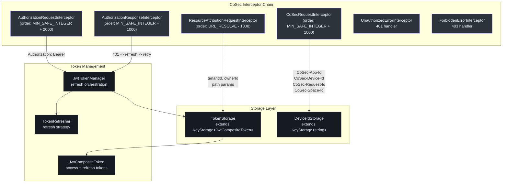
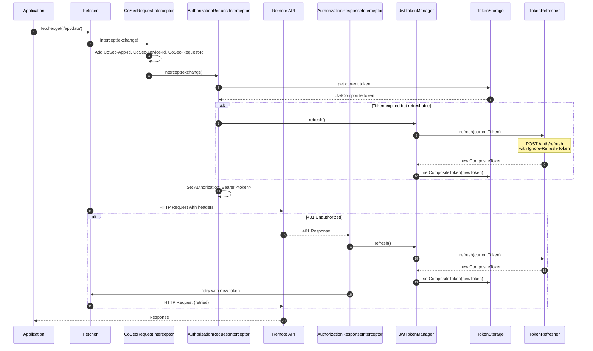
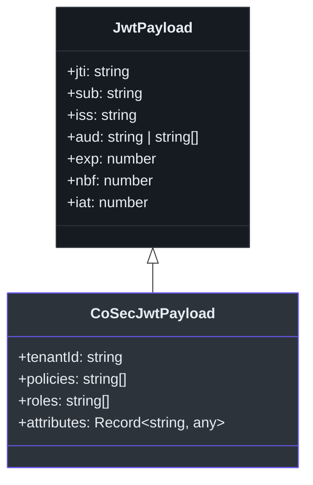

# @ahoo-wang/fetcher-cosec

`@ahoo-wang/fetcher-cosec` 包将 CoSec（企业安全）认证与 Fetcher HTTP 客户端集成。它提供了带自动刷新的 JWT 令牌管理、通过 [Storage](./storage.md) 实现的令牌和设备 ID 持久化存储、多租户请求归属，以及处理授权、401 重试和 403 错误传播的完整拦截器链。

## 安装

```bash
pnpm add @ahoo-wang/fetcher-cosec
```

## 架构概览



## 快速开始

```typescript
import { Fetcher } from '@ahoo-wang/fetcher';
import { CoSecConfigurer, CoSecTokenRefresher } from '@ahoo-wang/fetcher-cosec';

const fetcher = new Fetcher({ baseUrl: 'https://api.example.com' });

const configurer = new CoSecConfigurer({
  appId: 'my-web-app',
  tokenRefresher: new CoSecTokenRefresher({
    fetcher,
    endpoint: '/auth/refresh',
  }),
  onUnauthorized: () => (window.location.href = '/login'),
  onForbidden: () => alert('Access Denied'),
});

configurer.applyTo(fetcher);

// All requests now include CoSec headers and Bearer token
const users = await fetcher.get('/api/users');
```

## 配置

### CoSecConfig

`CoSecConfigurer` 接受一个 `CoSecConfig` 对象，包含三个配置级别：

| 级别 | 必需属性 | 功能 |
|------|----------|------|
| **最小配置** | 仅 `appId` | 仅安全头（设备 ID、请求 ID、应用 ID） |
| **标准配置** | `appId` + `tokenRefresher` | 完整的 JWT 认证，含自动刷新 |
| **企业配置** | 所有选项 | 多租户、自定义存储、自定义错误处理器 |

| 属性 | 类型 | 必填 | 默认值 | 描述 |
|------|------|------|--------|------|
| `appId` | `string` | 是 | -- | 应用标识符，用于 `CoSec-App-Id` 请求头 |
| `tokenRefresher` | `TokenRefresher` | 否 | -- | 令牌刷新策略。提供时启用 JWT 认证。 |
| `tokenStorage` | `TokenStorage` | 否 | `new TokenStorage()` | 令牌持久化后端 |
| `deviceIdStorage` | `DeviceIdStorage` | 否 | `new DeviceIdStorage()` | 设备 ID 持久化 |
| `spaceIdProvider` | `SpaceIdProvider` | 否 | `NoneSpaceIdProvider` | 多租户空间解析器 |
| `onUnauthorized` | `(exchange) => Promise<void>` | 否 | -- | 自定义 401 错误处理器 |
| `onForbidden` | `(exchange) => Promise<void>` | 否 | -- | 自定义 403 错误处理器 |

来源: [packages/cosec/src/cosecConfigurer.ts:86-298](https://github.com/Ahoo-Wang/fetcher/blob/main/packages/cosec/src/cosecConfigurer.ts#L86-L298)

## 拦截器

### CoSecRequestInterceptor

向每个发出的请求注入安全头：

| 请求头 | 值 | 描述 |
|--------|-----|------|
| `CoSec-App-Id` | 配置的 `appId` | 应用标识符 |
| `CoSec-Device-Id` | 来自 `DeviceIdStorage` | 持久化设备标识符（nanoid） |
| `CoSec-Request-Id` | 每次请求生成 | 唯一的请求关联 ID |
| `CoSec-Space-Id` | 来自 `SpaceIdProvider` | 空间标识符（如已解析） |

来源: [packages/cosec/src/cosecRequestInterceptor.ts:214-382](https://github.com/Ahoo-Wang/fetcher/blob/main/packages/cosec/src/cosecRequestInterceptor.ts#L214-L382)

### AuthorizationRequestInterceptor

添加 `Authorization: Bearer <token>` 请求头。在注入之前，它会检查访问令牌是否需要刷新，并在可能的情况下进行主动刷新。遵循 `Ignore-Refresh-Token` 属性以防止在刷新请求本身中触发递归刷新。

来源: [packages/cosec/src/authorizationRequestInterceptor.ts:41-92](https://github.com/Ahoo-Wang/fetcher/blob/main/packages/cosec/src/authorizationRequestInterceptor.ts#L41-L92)

### AuthorizationResponseInterceptor

处理 401 响应：

1. 检查响应状态是否为 401
2. 验证刷新令牌是否仍然有效
3. 刷新访问令牌
4. 使用新令牌重试原始请求
5. 刷新失败时清除令牌

来源: [packages/cosec/src/authorizationResponseInterceptor.ts:42-81](https://github.com/Ahoo-Wang/fetcher/blob/main/packages/cosec/src/authorizationResponseInterceptor.ts#L42-L81)

### ResourceAttributionRequestInterceptor

当 URL 模板包含 `{tenantId}` 或 `{ownerId}` 占位符时，自动从当前 JWT 载荷中注入 `tenantId` 和 `ownerId` 路径参数。在 URL 解析之前运行。

来源: [packages/cosec/src/resourceAttributionRequestInterceptor.ts:58-127](https://github.com/Ahoo-Wang/fetcher/blob/main/packages/cosec/src/resourceAttributionRequestInterceptor.ts#L58-L127)

### 错误拦截器

| 拦截器 | 状态码 | 行为 |
|--------|--------|------|
| `UnauthorizedErrorInterceptor` | 401 | 调用配置中的 `onUnauthorized` 回调 |
| `ForbiddenErrorInterceptor` | 403 | 调用配置中的 `onForbidden` 回调 |

来源: [packages/cosec/src/unauthorizedErrorInterceptor.ts](https://github.com/Ahoo-Wang/fetcher/blob/main/packages/cosec/src/unauthorizedErrorInterceptor.ts), [packages/cosec/src/forbiddenErrorInterceptor.ts](https://github.com/Ahoo-Wang/fetcher/blob/main/packages/cosec/src/forbiddenErrorInterceptor.ts)

## 认证流程



## JWT 令牌管理

### JwtToken

解析 JWT 字符串并提供类型化的载荷访问和过期检查。支持 `earlyPeriod` 以在实际过期前触发主动刷新。

```typescript
import { JwtToken } from '@ahoo-wang/fetcher-cosec';

const token = new JwtToken<CoSecJwtPayload>('eyJ...', 300); // 5 min early period
console.log(token.isExpired);     // false if not yet expired
console.log(token.payload?.sub);  // user ID from payload
```

### JwtCompositeToken

一起管理访问令牌和刷新令牌对：

```typescript
import { JwtCompositeToken } from '@ahoo-wang/fetcher-cosec';

const composite = new JwtCompositeToken({
  accessToken: 'access.jwt.token',
  refreshToken: 'refresh.jwt.token',
}, 300);

console.log(composite.authenticated);    // true if access token valid
console.log(composite.isRefreshNeeded);  // true if access token expired
console.log(composite.isRefreshable);    // true if refresh token still valid
```

### TokenStorage

扩展 `KeyStorage<JwtCompositeToken>`，增加了认证特定的方法和跨标签页同步：

| 方法 | 描述 |
|------|------|
| `signIn(compositeToken)` | 存储新的复合令牌 |
| `signOut()` | 移除已存储的令牌 |
| `authenticated` | 检查是否存在有效令牌 |
| `currentUser` | 如已认证则获取 JWT 载荷 |

来源: [packages/cosec/src/tokenStorage.ts:43-121](https://github.com/Ahoo-Wang/fetcher/blob/main/packages/cosec/src/tokenStorage.ts#L43-L121)

### JwtTokenManager

编排令牌刷新操作，支持去重（防止并发刷新请求）：

| 属性 / 方法 | 描述 |
|-------------|------|
| `currentToken` | 从存储中获取当前复合令牌 |
| `refresh()` | 刷新令牌。对并发调用进行去重。 |
| `isRefreshNeeded` | 检查访问令牌是否需要刷新 |
| `isRefreshable` | 检查刷新令牌是否仍然有效 |

来源: [packages/cosec/src/jwtTokenManager.ts:33-105](https://github.com/Ahoo-Wang/fetcher/blob/main/packages/cosec/src/jwtTokenManager.ts#L33-L105)

### CoSecTokenRefresher

内置的 `TokenRefresher` 实现，向配置的端点发送 POST 请求：

```typescript
import { CoSecTokenRefresher } from '@ahoo-wang/fetcher-cosec';

const refresher = new CoSecTokenRefresher({
  fetcher: myFetcher,
  endpoint: '/auth/refresh',
});

// The refresher automatically sets IGNORE_REFRESH_TOKEN_ATTRIBUTE_KEY
// to prevent infinite refresh loops
```

**重要**：刷新请求包含 `IGNORE_REFRESH_TOKEN_ATTRIBUTE_KEY` 属性，以防止 `AuthorizationRequestInterceptor` 触发另一个刷新循环。

来源: [packages/cosec/src/tokenRefresher.ts:141-207](https://github.com/Ahoo-Wang/fetcher/blob/main/packages/cosec/src/tokenRefresher.ts#L141-L207)

## JWT 载荷类型



| 接口 | 关键字段 |
|------|----------|
| `JwtPayload` | `jti`、`sub`、`iss`、`aud`、`exp`、`nbf`、`iat` |
| `CoSecJwtPayload` | 继承所有字段 + `tenantId`、`policies`、`roles`、`attributes` |

来源: [packages/cosec/src/jwts.ts:17-80](https://github.com/Ahoo-Wang/fetcher/blob/main/packages/cosec/src/jwts.ts#L17-L80)

## 设备追踪

`DeviceIdStorage` 扩展了 `KeyStorage<string>`，增加了 `getOrCreate()` 方法，该方法在首次使用时生成唯一的设备 ID（通过 nanoid）并持久化存储：

```typescript
import { DeviceIdStorage } from '@ahoo-wang/fetcher-cosec';

const deviceStorage = new DeviceIdStorage();
const deviceId = deviceStorage.getOrCreate();
// First call: generates and stores a new nanoid
// Subsequent calls: returns the stored ID
```

来源: [packages/cosec/src/deviceIdStorage.ts:35-71](https://github.com/Ahoo-Wang/fetcher/blob/main/packages/cosec/src/deviceIdStorage.ts#L35-L71)

## 主要导出

| 导出 | 描述 |
|------|------|
| `CoSecConfigurer` | 注册所有 CoSec 拦截器的 `FetcherConfigurer` |
| `CoSecConfig` | CoSec 配置接口 |
| `CoSecHeaders` | 请求头名称常量（`DEVICE_ID`、`APP_ID`、`SPACE_ID`、`AUTHORIZATION`、`REQUEST_ID`） |
| `CoSecRequestInterceptor` | 向请求添加安全头 |
| `AuthorizationRequestInterceptor` | 添加 Bearer 令牌并支持主动刷新 |
| `AuthorizationResponseInterceptor` | 处理 401，刷新令牌并重试 |
| `ResourceAttributionRequestInterceptor` | 从 JWT 注入 tenantId/ownerId |
| `UnauthorizedErrorInterceptor` | 自定义 401 处理器 |
| `ForbiddenErrorInterceptor` | 自定义 403 处理器 |
| `TokenStorage` | 带认证方法的 JWT 令牌持久化 |
| `DeviceIdStorage` | 带 `getOrCreate()` 的设备 ID 持久化 |
| `JwtTokenManager` | 带去重的令牌刷新编排 |
| `JwtToken<Payload>` | 带类型化载荷的已解析 JWT |
| `JwtCompositeToken` | 访问令牌 + 刷新令牌对 |
| `JwtCompositeTokenSerializer` | 复合令牌序列化器 |
| `CoSecTokenRefresher` | 内置的基于 POST 的令牌刷新器 |
| `TokenRefresher` | 自定义刷新策略的接口 |
| `JwtPayload` | 标准 JWT 载荷接口 |
| `CoSecJwtPayload` | CoSec 扩展的 JWT 载荷，包含 tenantId、roles、policies |
| `AuthorizeResults` | 授权结果常量（`ALLOW`、`EXPLICIT_DENY`、`IMPLICIT_DENY` 等） |
| `SpaceIdProvider` | 多租户空间解析接口 |
| `DefaultSpaceIdProvider` | 基于谓词和存储的空间提供者，适用于多租户应用 |
| `NoneSpaceIdProvider` | 空操作的空间提供者（默认） |

## 多租户空间解析

对于多租户应用，`DefaultSpaceIdProvider` 通过谓词确定哪些请求需要空间范围控制，并从持久化存储中解析空间 ID：

```typescript
import { CoSecConfigurer, DefaultSpaceIdProvider } from '@ahoo-wang/fetcher-cosec';

const cosecConfigurer = new CoSecConfigurer({
  appId: 'my-app',                       // 必填
  tokenRefresher: {                      // TokenRefresher 对象，而非裸函数
    async refresh(compositeToken) {
      // 发送刷新请求，返回新的 JwtCompositeToken
      return refreshedToken;
    },
  },
  spaceIdProvider: new DefaultSpaceIdProvider({
    // 仅 /api/ 请求会被空间范围控制
    spacedResourcePredicate: {
      test: (exchange) => exchange.request.url.includes('/api/'),
    },
    // SpaceIdStorage 持久化当前租户的空间 ID
    spaceIdStorage: new SpaceIdStorage(),
  }),
});
```

当谓词匹配时，`CoSecRequestInterceptor` 会自动注入 `CoSec-Space-Id` 头。

## 交叉引用

- **[Fetcher](./fetcher.md)** -- `CoSecConfigurer` 实现 `FetcherConfigurer` 以与 Fetcher 的拦截器链集成
- **[Storage](./storage.md)** -- `TokenStorage` 和 `DeviceIdStorage` 扩展 `KeyStorage` 用于持久化
- **[React](./react.md)** -- `useSecurity`、`RouteGuard` 和 `RefreshableRouteGuard` 提供 React 集成
- **[EventBus](./eventbus.md)** -- 令牌和设备存储使用 `BroadcastTypedEventBus` 实现跨标签页同步
