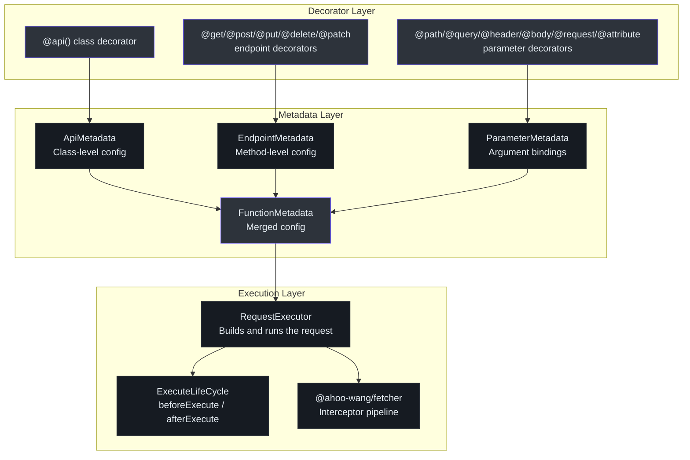
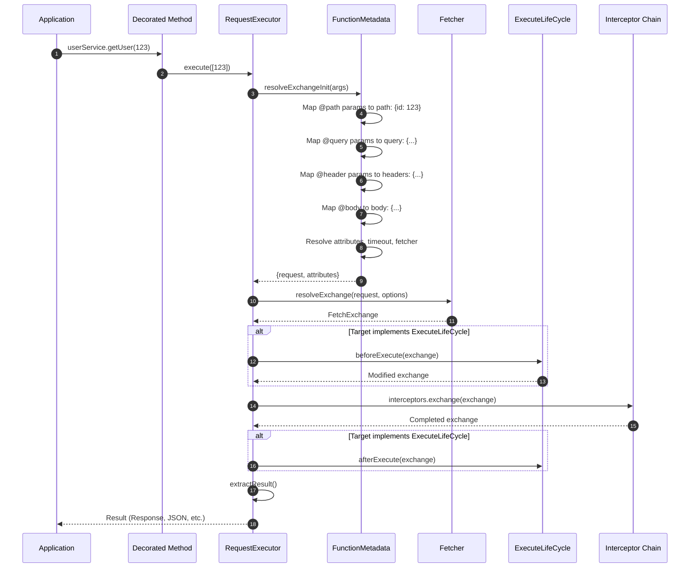
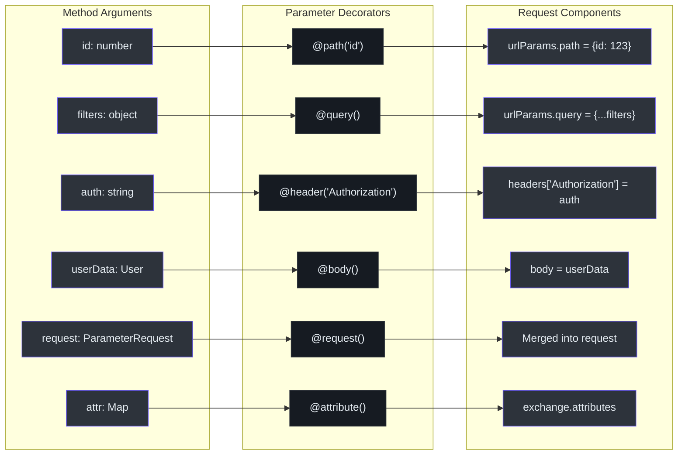
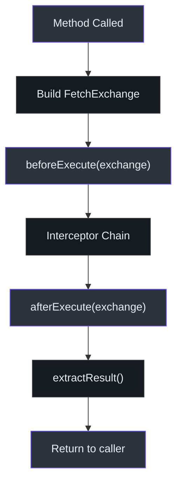
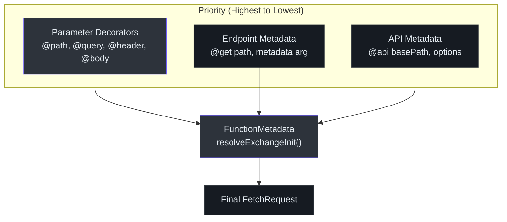

# @ahoo-wang/fetcher-decorator

`@ahoo-wang/fetcher-decorator` 包使用 TypeScript 装饰器实现声明式 API 服务定义。无需编写命令式的 HTTP 调用，您只需用装饰器注解定义 API 类，框架就会在运行时自动生成实现。

**源码**: [`packages/decorator/src/`](https://github.com/Ahoo-Wang/fetcher/blob/main/packages/decorator/src/)

## 安装

```bash
pnpm add @ahoo-wang/fetcher-decorator reflect-metadata
```

::: warning
`reflect-metadata` 是必需的对等依赖。在使用装饰器之前，必须在应用程序入口点导入一次：

```typescript
import 'reflect-metadata';
```
:::

## 架构



## 装饰器执行流程

当调用一个被装饰的方法时，框架会执行一个明确定义的管道：



## 定义 API 类

### @api 装饰器

`@api` 类装饰器为类中所有方法设置基础路径、请求头、超时时间和 Fetcher 实例。([`apiDecorator.ts:232`](https://github.com/Ahoo-Wang/fetcher/blob/main/packages/decorator/src/apiDecorator.ts#L232))

```typescript
import { api, get, post, put, del, path, query, body, header, autoGeneratedError } from '@ahoo-wang/fetcher-decorator';
import 'reflect-metadata';

interface User {
  id: number;
  name: string;
  email: string;
}

@api('/api/v1/users', {
  headers: { 'X-Api-Version': '1.0' },
  timeout: 10000,
  fetcher: 'api', // 使用 'api' 命名的 fetcher
})
class UserService {
  @get('/')
  getUsers(
    @query('page') page: number,
    @query('limit') limit: number,
  ): Promise<User[]> {
    throw autoGeneratedError();
  }

  @get('/:id')
  getUser(@path('id') id: number): Promise<User> {
    throw autoGeneratedError();
  }

  @post('/')
  createUser(@body() user: Omit<User, 'id'>): Promise<User> {
    throw autoGeneratedError();
  }

  @put('/:id')
  updateUser(
    @path('id') id: number,
    @body() user: Partial<User>,
  ): Promise<User> {
    throw autoGeneratedError();
  }

  @del('/:id')
  deleteUser(@path('id') id: number): Promise<void> {
    throw autoGeneratedError();
  }
}
```

### 端点装饰器

| 装饰器 | HTTP 方法 | 源码 |
|-----------|------------|--------|
| `@get(path?, metadata?)` | GET | [`endpointDecorator.ts:101`](https://github.com/Ahoo-Wang/fetcher/blob/main/packages/decorator/src/endpointDecorator.ts#L101) |
| `@post(path?, metadata?)` | POST | [`endpointDecorator.ts:126`](https://github.com/Ahoo-Wang/fetcher/blob/main/packages/decorator/src/endpointDecorator.ts#L126) |
| `@put(path?, metadata?)` | PUT | [`endpointDecorator.ts:151`](https://github.com/Ahoo-Wang/fetcher/blob/main/packages/decorator/src/endpointDecorator.ts#L151) |
| `@del(path?, metadata?)` | DELETE | [`endpointDecorator.ts:176`](https://github.com/Ahoo-Wang/fetcher/blob/main/packages/decorator/src/endpointDecorator.ts#L176) |
| `@patch(path?, metadata?)` | PATCH | [`endpointDecorator.ts:201`](https://github.com/Ahoo-Wang/fetcher/blob/main/packages/decorator/src/endpointDecorator.ts#L201) |
| `@head(path?, metadata?)` | HEAD | [`endpointDecorator.ts:229`](https://github.com/Ahoo-Wang/fetcher/blob/main/packages/decorator/src/endpointDecorator.ts#L229) |
| `@options(path?, metadata?)` | OPTIONS | [`endpointDecorator.ts:254`](https://github.com/Ahoo-Wang/fetcher/blob/main/packages/decorator/src/endpointDecorator.ts#L254) |

每个端点装饰器都接受可选的 `MethodEndpointMetadata` 来覆盖类级别的设置：

```typescript
@get('/special', {
  headers: { 'X-Special': 'true' },
  timeout: 30000,
  resultExtractor: ResultExtractors.Json,
})
specialEndpoint(): Promise<any> {
  throw autoGeneratedError();
}
```

### 参数装饰器

参数装饰器将函数参数映射到 HTTP 请求组件。当未提供显式名称时，参数名会自动从函数签名中提取。([`parameterDecorator.ts:199`](https://github.com/Ahoo-Wang/fetcher/blob/main/packages/decorator/src/parameterDecorator.ts#L199))

| 装饰器 | 类型 | 映射到 | 对象展开 |
|-----------|------|---------|-----------------|
| `@path(name?)` | `ParameterType.PATH` | URL 路径段 | 是 - 对象键成为路径参数 |
| `@query(name?)` | `ParameterType.QUERY` | URL 查询字符串 | 是 - 对象键成为查询参数 |
| `@header(name?)` | `ParameterType.HEADER` | 请求头 | 是 - 对象键成为请求头 |
| `@body()` | `ParameterType.BODY` | 请求体 | 否 |
| `@request()` | `ParameterType.REQUEST` | 基础请求对象 | 否 |
| `@attribute(name?)` | `ParameterType.ATTRIBUTE` | Exchange 属性 | 是 - 对象和 Map |



## 对象参数展开

路径、查询和请求头装饰器支持对象参数。当传入对象时，其键值对会被展开为独立的参数：

```typescript
@api('/api')
class SearchService {
  @get('/search')
  search(
    @query() filters: { limit: number; offset: number; sort: string },
  ): Promise<SearchResult[]> {
    throw autoGeneratedError();
  }
}

// 调用时：
service.search({ limit: 10, offset: 20, sort: 'name' });
// => GET /api/search?limit=10&offset=20&sort=name
```

## @request 装饰器

`@request()` 装饰器允许传入 `ParameterRequest` 对象以完全控制请求。它会与端点级别的配置合并，参数请求具有更高优先级。([`parameterDecorator.ts:372`](https://github.com/Ahoo-Wang/fetcher/blob/main/packages/decorator/src/parameterDecorator.ts#L372))

```typescript
@api('/api/users')
class UserService {
  @post('/')
  createUser(@request() req: ParameterRequest): Promise<User> {
    throw autoGeneratedError();
  }
}

// 使用：
service.createUser({
  path: '/api/users',
  headers: { 'X-Idempotency-Key': 'abc123' },
  body: { name: 'John' },
  timeout: 30000,
});
```

## @attribute 装饰器

`@attribute()` 装饰器将数据传递到 exchange 属性中，可被管道中的任何拦截器读取。([`parameterDecorator.ts:408`](https://github.com/Ahoo-Wang/fetcher/blob/main/packages/decorator/src/parameterDecorator.ts#L408))

```typescript
@api('/api/orders')
class OrderService {
  @post('/')
  createOrder(
    @body() order: Order,
    @attribute('tenantId') tenantId: string,
  ): Promise<Order> {
    throw autoGeneratedError();
  }
}
```

## 生命周期钩子（ExecuteLifeCycle）

类可以实现 `ExecuteLifeCycle` 接口来挂钩请求执行管道。[OpenAI 包](./openai.md) 使用此机制根据是否启用流式传输来动态切换结果提取器。([`executeLifeCycle.ts:23`](https://github.com/Ahoo-Wang/fetcher/blob/main/packages/decorator/src/executeLifeCycle.ts#L23))



```typescript
import { api, get, ExecuteLifeCycle, autoGeneratedError } from '@ahoo-wang/fetcher-decorator';
import type { FetchExchange } from '@ahoo-wang/fetcher';

@api('/api/data')
class DataService implements ExecuteLifeCycle {
  async beforeExecute(exchange: FetchExchange): Promise<void> {
    // 从会话中添加租户 ID
    exchange.ensureRequestHeaders()['X-Tenant-Id'] = getTenantId();
    // 添加请求跟踪
    exchange.attributes.set('requestId', crypto.randomUUID());
  }

  async afterExecute(exchange: FetchExchange): Promise<void> {
    // 记录完成信息
    const requestId = exchange.attributes.get('requestId');
    console.log(`Request ${requestId} completed: ${exchange.response?.status}`);
  }

  @get('/items')
  getItems(): Promise<Item[]> {
    throw autoGeneratedError();
  }
}
```

## EndpointReturnType

默认情况下，被装饰的方法返回提取的结果（如解析后的 JSON）。您可以将此行为更改为返回整个 `FetchExchange` 对象。([`endpointReturnTypeCapable.ts:14`](https://github.com/Ahoo-Wang/fetcher/blob/main/packages/decorator/src/endpointReturnTypeCapable.ts#L14))

| 值 | 描述 |
|-------|-------------|
| `EndpointReturnType.RESULT` | 返回提取的结果（默认） |
| `EndpointReturnType.EXCHANGE` | 返回完整的 `FetchExchange` 对象 |

```typescript
import { EndpointReturnType } from '@ahoo-wang/fetcher-decorator';

@api('/api/users', { returnType: EndpointReturnType.EXCHANGE })
class UserService {
  @get('/')
  getUsers(): Promise<FetchExchange> {
    throw autoGeneratedError();
  }
}
```

## 元数据解析

`FunctionMetadata` 类将 API 级别、端点级别和参数元数据合并为单一的解析配置。端点级别的值覆盖 API 级别的值，参数装饰器的值覆盖两者。([`functionMetadata.ts:98`](https://github.com/Ahoo-Wang/fetcher/blob/main/packages/decorator/src/functionMetadata.ts#L98))



## autoGeneratedError

`autoGeneratedError()` 函数创建一个占位错误，既能满足 ESLint 的 `no-unused-vars` 规则，又能表明方法体在运行时会被替换。([`generated.ts:41`](https://github.com/Ahoo-Wang/fetcher/blob/main/packages/decorator/src/generated.ts#L41))

```typescript
import { autoGeneratedError } from '@ahoo-wang/fetcher-decorator';

@get('/users/:id')
getUser(@path('id') id: number): Promise<User> {
  throw autoGeneratedError(id); // 参数会被接受但会被忽略
}
```

## 完整示例

```typescript
import 'reflect-metadata';
import { api, get, post, del, path, query, body, header, autoGeneratedError } from '@ahoo-wang/fetcher-decorator';
import { NamedFetcher, ResultExtractors } from '@ahoo-wang/fetcher';

// 设置：创建命名 fetcher
new NamedFetcher('myApi', {
  baseURL: 'https://api.example.com',
  headers: { 'Accept': 'application/json' },
  timeout: 5000,
});

interface Product {
  id: string;
  name: string;
  price: number;
}

interface ProductFilters {
  category?: string;
  minPrice?: number;
  maxPrice?: number;
}

@api('/api/v2/products', { fetcher: 'myApi' })
class ProductService {
  @get('/')
  listProducts(
    @query() filters: ProductFilters,
    @query('page') page: number = 1,
    @query('limit') limit: number = 20,
  ): Promise<Product[]> {
    throw autoGeneratedError();
  }

  @get('/:id')
  getProduct(
    @path('id') id: string,
    @header('Accept-Language') locale: string = 'en',
  ): Promise<Product> {
    throw autoGeneratedError();
  }

  @post('/')
  createProduct(@body() product: Omit<Product, 'id'>): Promise<Product> {
    throw autoGeneratedError();
  }

  @del('/:id')
  deleteProduct(@path('id') id: string): Promise<void> {
    throw autoGeneratedError();
  }
}

// 使用
const products = new ProductService();
const items = await products.listProducts({ category: 'electronics' }, 1, 10);
```

## 导出 API 总结

| 导出 | 类型 | 源码 |
|--------|------|--------|
| `api` | 装饰器 | [`apiDecorator.ts`](https://github.com/Ahoo-Wang/fetcher/blob/main/packages/decorator/src/apiDecorator.ts) |
| `get`、`post`、`put`、`del`、`patch`、`head`、`options` | 装饰器 | [`endpointDecorator.ts`](https://github.com/Ahoo-Wang/fetcher/blob/main/packages/decorator/src/endpointDecorator.ts) |
| `path`、`query`、`header`、`body`、`request`、`attribute` | 装饰器 | [`parameterDecorator.ts`](https://github.com/Ahoo-Wang/fetcher/blob/main/packages/decorator/src/parameterDecorator.ts) |
| `ApiMetadata` | 接口 | [`apiDecorator.ts`](https://github.com/Ahoo-Wang/fetcher/blob/main/packages/decorator/src/apiDecorator.ts) |
| `EndpointMetadata` | 接口 | [`endpointDecorator.ts`](https://github.com/Ahoo-Wang/fetcher/blob/main/packages/decorator/src/endpointDecorator.ts) |
| `ParameterType` | 枚举 | [`parameterDecorator.ts`](https://github.com/Ahoo-Wang/fetcher/blob/main/packages/decorator/src/parameterDecorator.ts) |
| `ParameterMetadata` | 接口 | [`parameterDecorator.ts`](https://github.com/Ahoo-Wang/fetcher/blob/main/packages/decorator/src/parameterDecorator.ts) |
| `FunctionMetadata` | 类 | [`functionMetadata.ts`](https://github.com/Ahoo-Wang/fetcher/blob/main/packages/decorator/src/functionMetadata.ts) |
| `RequestExecutor` | 类 | [`requestExecutor.ts`](https://github.com/Ahoo-Wang/fetcher/blob/main/packages/decorator/src/requestExecutor.ts) |
| `ExecuteLifeCycle` | 接口 | [`executeLifeCycle.ts`](https://github.com/Ahoo-Wang/fetcher/blob/main/packages/decorator/src/executeLifeCycle.ts) |
| `EndpointReturnType` | 枚举 | [`endpointReturnTypeCapable.ts`](https://github.com/Ahoo-Wang/fetcher/blob/main/packages/decorator/src/endpointReturnTypeCapable.ts) |
| `autoGeneratedError` | 函数 | [`generated.ts`](https://github.com/Ahoo-Wang/fetcher/blob/main/packages/decorator/src/generated.ts) |
| `buildRequestExecutor` | 函数 | [`apiDecorator.ts`](https://github.com/Ahoo-Wang/fetcher/blob/main/packages/decorator/src/apiDecorator.ts) |
| `getParameterNames` | 函数 | [`reflection.ts`](https://github.com/Ahoo-Wang/fetcher/blob/main/packages/decorator/src/reflection.ts) |

## 相关页面

- [Fetcher（核心）](./fetcher.md) - 装饰器委托的 HTTP 客户端
- [OpenAI](./openai.md) - 使用装饰器配合 `ExecuteLifeCycle` 的实际案例
- [Generator](./generator.md) - 从 OpenAPI 规范自动生成基于装饰器的 API 类
- [Wow](./wow.md) - DDD/CQRS 基于装饰器的客户端
- [包概览](./index.md) - 生态系统中的所有包
