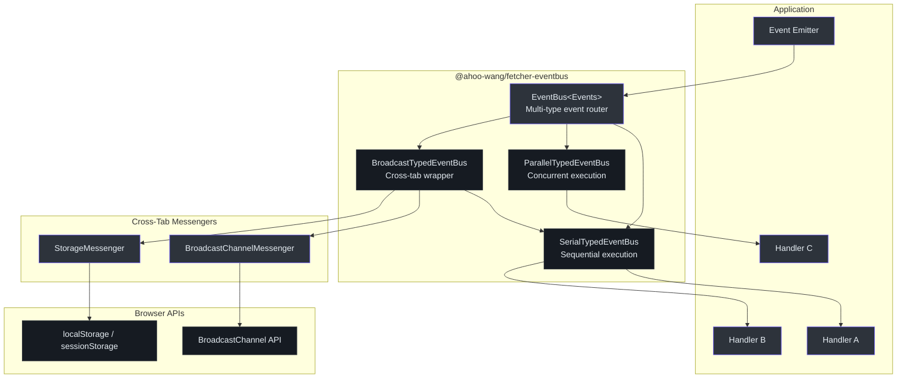
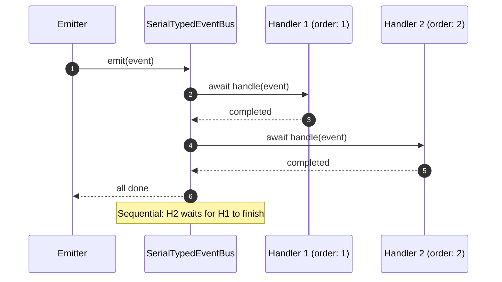
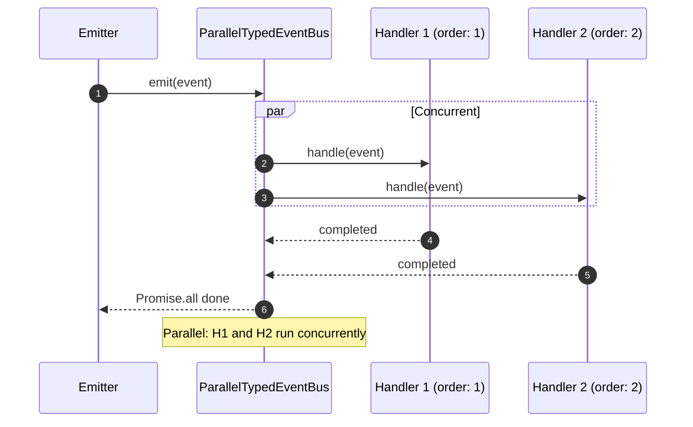
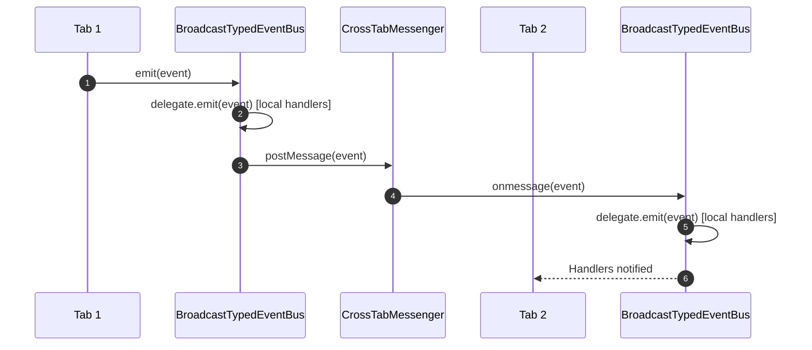
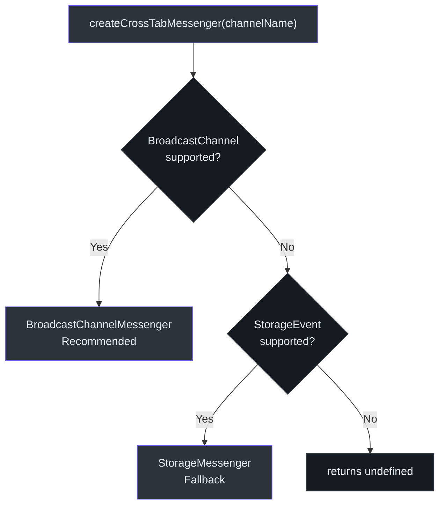
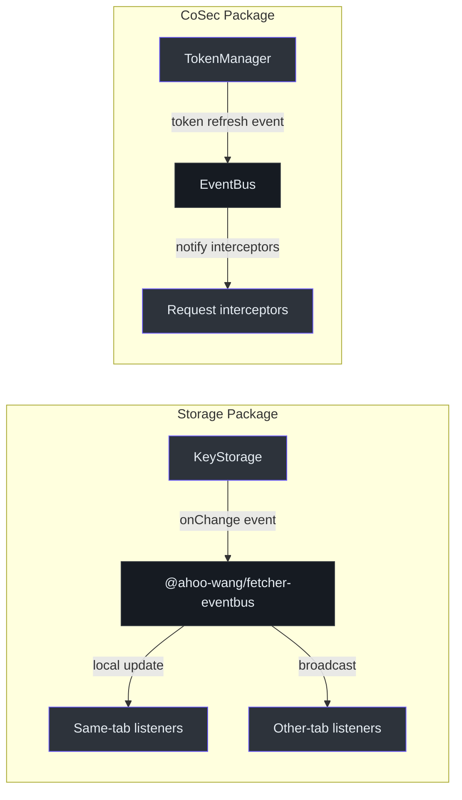

# @ahoo-wang/fetcher-eventbus

`@ahoo-wang/fetcher-eventbus` 包提供了一个通用的、类型化的事件总线系统，支持三种执行策略：串行（顺序执行）、并行（并发执行）和广播（跨标签页）。它被 [storage](./storage.md) 和 [cosec](./cosec.md) 包用于响应式状态变更通知和跨标签页同步。

**源码**: [`packages/eventbus/src/`](https://github.com/Ahoo-Wang/fetcher/blob/main/packages/eventbus/src/)

## 安装

```bash
pnpm add @ahoo-wang/fetcher-eventbus
```

## 架构



## 核心接口

### EventHandler

每个处理器都实现 `EventHandler<EVENT>` 接口。处理器通过 `name` 唯一标识，按 `order` 排序，还可以设置为仅触发 `once`。([`types.ts:19`](https://github.com/Ahoo-Wang/fetcher/blob/main/packages/eventbus/src/types.ts#L19))

```typescript
interface EventHandler<EVENT> {
  name: string;       // 唯一标识符
  order: number;      // 执行优先级（值越小越先执行）
  once?: boolean;     // 首次执行后自动移除
  handle(event: EVENT): void | Promise<void>;
}
```

### TypedEventBus

`TypedEventBus<EVENT>` 接口定义了处理单一事件类型的事件总线契约。([`typedEventBus.ts:21`](https://github.com/Ahoo-Wang/fetcher/blob/main/packages/eventbus/src/typedEventBus.ts#L21))

| 方法 | 描述 |
|--------|-------------|
| `on(handler)` | 注册处理器（如果名称已存在则返回 `false`） |
| `off(name)` | 按名称移除处理器 |
| `emit(event)` | 将事件分发给所有已注册的处理器 |
| `destroy()` | 清理所有资源 |

## 串行与并行执行





## SerialTypedEventBus

按优先级顺序串行执行处理器。`order` 值较低的处理器优先执行。如果某个处理器抛出异常，后续处理器将不会被调用。([`serialTypedEventBus.ts:34`](https://github.com/Ahoo-Wang/fetcher/blob/main/packages/eventbus/src/serialTypedEventBus.ts#L34))

```typescript
import { SerialTypedEventBus } from '@ahoo-wang/fetcher-eventbus';

const bus = new SerialTypedEventBus<string>('user-created');

bus.on({
  name: 'audit-logger',
  order: 1,
  handle(userId) {
    console.log(`[AUDIT] User created: ${userId}`);
  },
});

bus.on({
  name: 'send-welcome-email',
  order: 2,
  handle(userId) {
    console.log(`[EMAIL] Sending welcome to: ${userId}`);
  },
});

bus.on({
  name: 'one-time-migration',
  order: 3,
  once: true,
  handle(userId) {
    console.log(`[MIGRATION] Migrated: ${userId}`);
    // 首次执行后将自动移除
  },
});

await bus.emit('user-123');
// [AUDIT] User created: user-123
// [EMAIL] Sending welcome to: user-123
// [MIGRATION] Migrated: user-123
```

## ParallelTypedEventBus

使用 `Promise.all` 并发执行所有处理器。适用于处理器相互独立且为 I/O 密集型的场景。([`parallelTypedEventBus.ts:33`](https://github.com/Ahoo-Wang/fetcher/blob/main/packages/eventbus/src/parallelTypedEventBus.ts#L33))

```typescript
import { ParallelTypedEventBus } from '@ahoo-wang/fetcher-eventbus';

const bus = new ParallelTypedEventBus<Notification>('notification');

bus.on({
  name: 'push-notification',
  order: 1,
  handle(event) {
    return sendPushNotification(event); // 异步
  },
});

bus.on({
  name: 'email-notification',
  order: 2,
  handle(event) {
    return sendEmail(event); // 异步，与推送并行执行
  },
});

await bus.emit({ message: 'Your order shipped!', userId: 'user-123' });
```

## EventBus（多类型路由器）

`EventBus<Events>` 类使用类型安全的映射管理多种事件类型。它通过供应函数为每种事件类型懒创建 `TypedEventBus` 实例。([`eventBus.ts:35`](https://github.com/Ahoo-Wang/fetcher/blob/main/packages/eventbus/src/eventBus.ts#L35))

```typescript
import { EventBus, SerialTypedEventBus } from '@ahoo-wang/fetcher-eventbus';

// 定义事件类型及其数据结构
interface AppEvents {
  'user:login': { userId: string; timestamp: number };
  'user:logout': { userId: string };
  'order:created': { orderId: string; total: number };
}

// 使用串行策略创建事件总线
const bus = new EventBus<AppEvents>(
  (type) => new SerialTypedEventBus(type)
);

// 为不同事件类型注册处理器
bus.on('user:login', {
  name: 'track-login',
  order: 1,
  handle(event) {
    analytics.track('login', { userId: event.userId });
  },
});

bus.on('order:created', {
  name: 'send-confirmation',
  order: 1,
  handle(event) {
    sendOrderConfirmation(event.orderId);
  },
});

// 发射类型安全的事件
await bus.emit('user:login', { userId: 'u1', timestamp: Date.now() });
await bus.emit('order:created', { orderId: 'o1', total: 99.99 });
```

## BroadcastTypedEventBus（跨标签页）

`BroadcastTypedEventBus` 包装任意 `TypedEventBus` 委托对象，并添加跨标签页/窗口广播功能。当事件被发射时，首先在本地处理，然后通过 `CrossTabMessenger` 广播到其他浏览器上下文。([`broadcastTypedEventBus.ts:111`](https://github.com/Ahoo-Wang/fetcher/blob/main/packages/eventbus/src/broadcastTypedEventBus.ts#L111))



```typescript
import { BroadcastTypedEventBus, SerialTypedEventBus } from '@ahoo-wang/fetcher-eventbus';

// 创建委托总线
const delegate = new SerialTypedEventBus<string>('sync-events');

// 用广播包装
const bus = new BroadcastTypedEventBus({ delegate });

bus.on({
  name: 'update-ui',
  order: 1,
  handle(data) {
    console.log('Updating UI in this tab:', data);
  },
});

// 这将触发所有已打开标签页中的处理器
await bus.emit('theme-changed-to-dark');
```

## 跨标签页 Messenger

该包提供了两种 Messenger 实现用于跨标签页通信，并支持自动降级：([`messengers/crossTabMessenger.ts`](https://github.com/Ahoo-Wang/fetcher/blob/main/packages/eventbus/src/messengers/crossTabMessenger.ts))



| Messenger | API | 源码 |
|-----------|-----|--------|
| `BroadcastChannelMessenger` | `BroadcastChannel` | [`messengers/broadcastChannelMessenger.ts`](https://github.com/Ahoo-Wang/fetcher/blob/main/packages/eventbus/src/messengers/broadcastChannelMessenger.ts) |
| `StorageMessenger` | `localStorage` / `StorageEvent` | [`messengers/storageMessenger.ts`](https://github.com/Ahoo-Wang/fetcher/blob/main/packages/eventbus/src/messengers/storageMessenger.ts) |

```typescript
import { createCrossTabMessenger } from '@ahoo-wang/fetcher-eventbus';

// 自动检测最佳可用的 Messenger
const messenger = createCrossTabMessenger('my-app-sync');
if (messenger) {
  messenger.onmessage = (data) => {
    console.log('Received from another tab:', data);
  };
  messenger.postMessage({ action: 'logout' });
}
```

## NameGenerator

`DefaultNameGenerator` 通过在前缀后追加递增计数器来创建唯一的处理器名称。([`nameGenerator.ts:24`](https://github.com/Ahoo-Wang/fetcher/blob/main/packages/eventbus/src/nameGenerator.ts#L24))

```typescript
import { nameGenerator } from '@ahoo-wang/fetcher-eventbus';

const name1 = nameGenerator.generate('handler'); // "handler_1"
const name2 = nameGenerator.generate('handler'); // "handler_2"
```

## 在生态系统中的使用场景



[storage](./storage.md) 包使用 `BroadcastTypedEventBus` 在浏览器标签页之间同步存储变更。当某个键的值在一个标签页中发生变化时，所有其他标签页都会收到通知以更新其缓存值。

## 导出 API 总结

| 导出 | 类型 | 源码 |
|--------|------|--------|
| `EventBus` | 类 | [`eventBus.ts`](https://github.com/Ahoo-Wang/fetcher/blob/main/packages/eventbus/src/eventBus.ts) |
| `TypedEventBus` | 接口 | [`typedEventBus.ts`](https://github.com/Ahoo-Wang/fetcher/blob/main/packages/eventbus/src/typedEventBus.ts) |
| `AbstractTypedEventBus` | 抽象类 | [`abstractTypedEventBus.ts`](https://github.com/Ahoo-Wang/fetcher/blob/main/packages/eventbus/src/abstractTypedEventBus.ts) |
| `SerialTypedEventBus` | 类 | [`serialTypedEventBus.ts`](https://github.com/Ahoo-Wang/fetcher/blob/main/packages/eventbus/src/serialTypedEventBus.ts) |
| `ParallelTypedEventBus` | 类 | [`parallelTypedEventBus.ts`](https://github.com/Ahoo-Wang/fetcher/blob/main/packages/eventbus/src/parallelTypedEventBus.ts) |
| `BroadcastTypedEventBus` | 类 | [`broadcastTypedEventBus.ts`](https://github.com/Ahoo-Wang/fetcher/blob/main/packages/eventbus/src/broadcastTypedEventBus.ts) |
| `EventHandler` | 接口 | [`types.ts`](https://github.com/Ahoo-Wang/fetcher/blob/main/packages/eventbus/src/types.ts) |
| `CrossTabMessenger` | 接口 | [`messengers/crossTabMessenger.ts`](https://github.com/Ahoo-Wang/fetcher/blob/main/packages/eventbus/src/messengers/crossTabMessenger.ts) |
| `BroadcastChannelMessenger` | 类 | [`messengers/broadcastChannelMessenger.ts`](https://github.com/Ahoo-Wang/fetcher/blob/main/packages/eventbus/src/messengers/broadcastChannelMessenger.ts) |
| `StorageMessenger` | 类 | [`messengers/storageMessenger.ts`](https://github.com/Ahoo-Wang/fetcher/blob/main/packages/eventbus/src/messengers/storageMessenger.ts) |
| `createCrossTabMessenger` | 函数 | [`messengers/crossTabMessenger.ts`](https://github.com/Ahoo-Wang/fetcher/blob/main/packages/eventbus/src/messengers/crossTabMessenger.ts) |
| `nameGenerator` | 实例 | [`nameGenerator.ts`](https://github.com/Ahoo-Wang/fetcher/blob/main/packages/eventbus/src/nameGenerator.ts) |

## 相关页面

- [Storage](./storage.md) - 使用 EventBus 进行跨标签页存储同步
- [Fetcher（核心）](./fetcher.md) - 提供 `NamedCapable` 和 `OrderedCapable` 接口
- [React](./react.md) - 消费事件驱动更新的响应式 Hooks
- [包概览](./index.md) - 生态系统中的所有包
