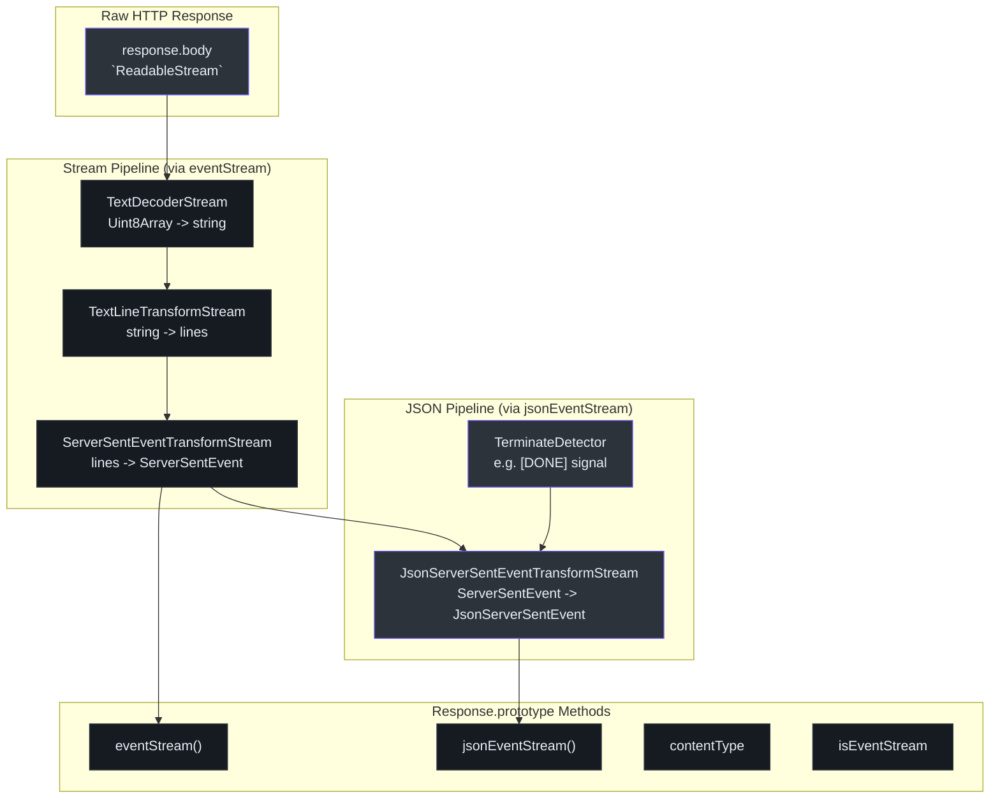
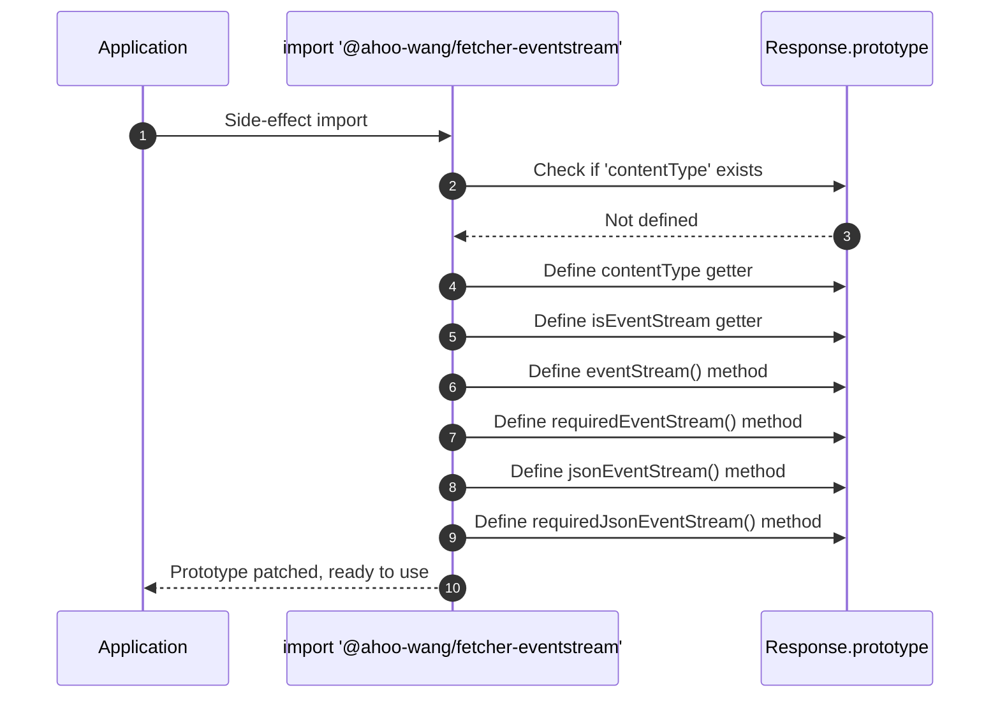
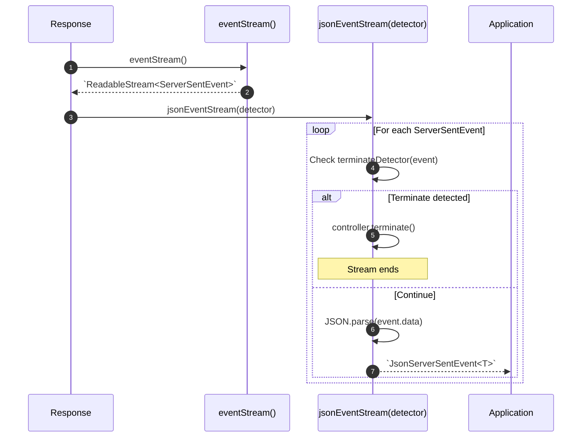
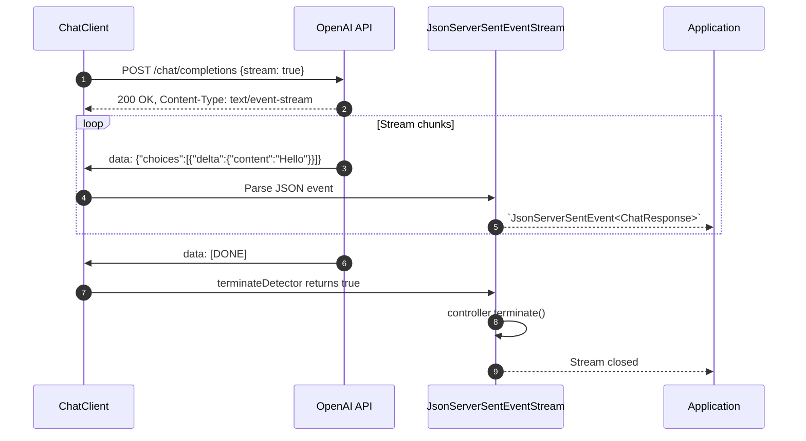

# @ahoo-wang/fetcher-eventstream

`@ahoo-wang/fetcher-eventstream` 包为 Fetcher 生态系统提供服务器发送事件（SSE）处理和 LLM 流式传输支持。它使用**副作用导入模式**：只需导入该模块即可为 `Response.prototype` 添加 `eventStream()`、`jsonEventStream()` 及相关方法。无需显式初始化。

**源码**: [`packages/eventstream/src/`](https://github.com/Ahoo-Wang/fetcher/blob/main/packages/eventstream/src/)

## 安装

```bash
pnpm add @ahoo-wang/fetcher-eventstream
```

::: tip 副作用导入
在应用程序中的任意位置导入此包即可自动启用所有 `Response` 对象的 SSE 支持：

```typescript
import '@ahoo-wang/fetcher-eventstream'; // 副作用：修补 Response.prototype
```
:::

## 架构



## 副作用导入的工作原理

当导入 `@ahoo-wang/fetcher-eventstream` 时，它会检查 `typeof Response !== 'undefined'`，如果可用，则使用 `Object.defineProperty` 向 `Response.prototype` 添加新的属性和方法。这些添加是幂等的 -- 每个属性只定义一次，由 `hasOwnProperty` 检查保护。([`responses.ts:102`](https://github.com/Ahoo-Wang/fetcher/blob/main/packages/eventstream/src/responses.ts#L102))



## 修补后的 Response 方法

导入后，每个 `Response` 对象都会获得以下方法：

| 成员 | 类型 | 描述 |
|--------|------|-------------|
| `contentType` | `get string \| null` | 返回 `Content-Type` 头的值 |
| `isEventStream` | `get boolean` | 如果 Content-Type 包含 `text/event-stream` 则为 `true` |
| `eventStream()` | 方法 | 返回 `ServerSentEventStream \| null` |
| `requiredEventStream()` | 方法 | 返回 `ServerSentEventStream`，如果不是事件流则抛出异常 |
| `jsonEventStream<D>(detector?)` | 方法 | 返回 `JsonServerSentEventStream<D> \| null` |
| `requiredJsonEventStream<D>(detector?)` | 方法 | 返回 `JsonServerSentEventStream<D>`，如果不是事件流则抛出异常 |

**源码**: [`responses.ts:27`](https://github.com/Ahoo-Wang/fetcher/blob/main/packages/eventstream/src/responses.ts#L27)

## SSE 流处理管道

从原始字节到结构化事件的转换通过一系列 Web Streams 链完成：

```mermaid
flowchart LR
    subgraph sg_1 ["Step 1: Decode Bytes"]
        RAW["Uint8Array chunks"] --> TD["TextDecoderStream<br>(utf-8)"]
        TD --> STR["string chunks"]
    end

    subgraph sg_2 ["Step 2: Split Lines"]
        STR --> TL["TextLineTransformStream"]
        TL --> LINES["individual lines"]
    end

    subgraph sg_3 ["Step 3: Parse SSE"]
        LINES --> SSE_T["ServerSentEventTransformer"]
        SSE_T --> EVENTS["ServerSentEvent objects"]
    end

    subgraph sg_4 ["Step 4: Parse JSON (optional)"]
        EVENTS --> JSE["JsonServerSentEventTransform"]
        JSE --> JSON_EVENTS["JsonServerSentEvent objects"]
    end

    style RAW fill:#2d333b,stroke:#6d5dfc,color:#e6edf3
    style TD fill:#161b22,stroke:#30363d,color:#e6edf3
    style STR fill:#2d333b,stroke:#6d5dfc,color:#e6edf3
    style TL fill:#161b22,stroke:#30363d,color:#e6edf3
    style LINES fill:#2d333b,stroke:#6d5dfc,color:#e6edf3
    style SSE_T fill:#161b22,stroke:#30363d,color:#e6edf3
    style EVENTS fill:#2d333b,stroke:#6d5dfc,color:#e6edf3
    style JSE fill:#161b22,stroke:#30363d,color:#e6edf3
    style JSON_EVENTS fill:#2d333b,stroke:#6d5dfc,color:#e6edf3
```



### toServerSentEventStream

将 `Response` 转换为 `ReadableStream<ServerSentEvent>`，通过完整的解码管道进行传输。([`eventStreamConverter.ts:127`](https://github.com/Ahoo-Wang/fetcher/blob/main/packages/eventstream/src/eventStreamConverter.ts#L127))

```typescript
import { toServerSentEventStream } from '@ahoo-wang/fetcher-eventstream';

const response = await fetch('/api/events');
const eventStream = toServerSentEventStream(response);

for await (const event of eventStream) {
  console.log(`Event: ${event.event}, Data: ${event.data}`);
}
```

## ServerSentEvent

`ServerSentEvent` 接口建模了 W3C 服务器发送事件格式。([`serverSentEventTransformStream.ts:23`](https://github.com/Ahoo-Wang/fetcher/blob/main/packages/eventstream/src/serverSentEventTransformStream.ts#L23))

| 属性 | 类型 | 描述 |
|----------|------|-------------|
| `event` | `string` | 事件类型（默认为 `"message"`） |
| `data` | `string` | 事件数据（多行数据以 `\n` 连接） |
| `id` | `string?` | 用于重连的事件 ID |
| `retry` | `number?` | 重连间隔（毫秒） |

```typescript
interface ServerSentEvent {
  id?: string;
  event: string;
  data: string;
  retry?: number;
}
```

## ServerSentEventTransformStream

一个 `TransformStream<string, ServerSentEvent>`，实现了 W3C 规范中的 SSE 解析算法。([`serverSentEventTransformStream.ts:277`](https://github.com/Ahoo-Wang/fetcher/blob/main/packages/eventstream/src/serverSentEventTransformStream.ts#L277))

关键解析行为：
- 空行分隔事件
- 以 `:` 开头的行是注释（被忽略）
- 多行 `data` 字段以 `\n` 连接
- `id` 和 `retry` 在同一连接内的事件之间保持持久
- `event` 字段默认为 `"message"`

## JsonServerSentEventTransformStream

扩展 SSE 管道以将事件数据解析为 JSON，支持可选的终止检测。([`jsonServerSentEventTransformStream.ts:130`](https://github.com/Ahoo-Wang/fetcher/blob/main/packages/eventstream/src/jsonServerSentEventTransformStream.ts#L130))

```typescript
interface JsonServerSentEvent<DATA> {
  event: string;
  data: DATA;       // 解析后的 JSON，而非原始字符串
  id?: string;
  retry?: number;
}
```

### TerminateDetector

一个用于确定流何时应终止的函数。这对于 LLM 流式传输至关重要，因为 API 会发送 `[DONE]` 信号。([`jsonServerSentEventTransformStream.ts:33`](https://github.com/Ahoo-Wang/fetcher/blob/main/packages/eventstream/src/jsonServerSentEventTransformStream.ts#L33))

```typescript
type TerminateDetector = (event: ServerSentEvent) => boolean;

// OpenAI 使用此模式
const doneDetector: TerminateDetector = (event) => event.data === '[DONE]';
```



## Fetcher 的结果提取器

该包提供了两个结果提取器，可直接与 [Fetcher](./fetcher.md) 的结果提取系统集成。([`eventStreamResultExtractor.ts`](https://github.com/Ahoo-Wang/fetcher/blob/main/packages/eventstream/src/eventStreamResultExtractor.ts))

| 提取器 | 返回值 | 使用场景 |
|-----------|---------|----------|
| `EventStreamResultExtractor` | `ServerSentEventStream` | 原始 SSE 事件（字符串数据） |
| `JsonEventStreamResultExtractor` | `JsonServerSentEventStream<any>` | 解析后的 JSON 事件 |

```typescript
import { fetcher } from '@ahoo-wang/fetcher';
import '@ahoo-wang/fetcher-eventstream'; // 副作用导入
import { JsonEventStreamResultExtractor } from '@ahoo-wang/fetcher-eventstream';

const stream = await fetcher.post(
  '/chat/completions',
  {
    body: {
      model: 'gpt-4',
      messages: [{ role: 'user', content: 'Hello!' }],
      stream: true,
    },
  },
  { resultExtractor: JsonEventStreamResultExtractor },
);

for await (const chunk of stream) {
  process.stdout.write(chunk.data.choices[0]?.delta?.content || '');
}
```

## LLM 流式传输使用场景

该包的主要使用场景是从 LLM API（如 OpenAI 等）获取流式响应，响应以 SSE 事件的形式逐个 token 到达。[openai](./openai.md) 包直接构建在此功能之上。



## EventStreamConvertError

当将 `Response` 转换为事件流失败时抛出。继承自核心包的 `FetcherError`。([`eventStreamConverter.ts:54`](https://github.com/Ahoo-Wang/fetcher/blob/main/packages/eventstream/src/eventStreamConverter.ts#L54))

```typescript
try {
  const stream = response.requiredEventStream();
} catch (error) {
  if (error instanceof EventStreamConvertError) {
    console.error('Status:', error.response.status);
    console.error('Content-Type:', error.response.contentType);
    console.error('Message:', error.message);
  }
}
```

## 导出 API 总结

| 导出 | 类型 | 源码 |
|--------|------|--------|
| `toServerSentEventStream` | 函数 | [`eventStreamConverter.ts`](https://github.com/Ahoo-Wang/fetcher/blob/main/packages/eventstream/src/eventStreamConverter.ts) |
| `toJsonServerSentEventStream` | 函数 | [`jsonServerSentEventTransformStream.ts`](https://github.com/Ahoo-Wang/fetcher/blob/main/packages/eventstream/src/jsonServerSentEventTransformStream.ts) |
| `ServerSentEvent` | 接口 | [`serverSentEventTransformStream.ts`](https://github.com/Ahoo-Wang/fetcher/blob/main/packages/eventstream/src/serverSentEventTransformStream.ts) |
| `ServerSentEventStream` | 类型 | [`eventStreamConverter.ts`](https://github.com/Ahoo-Wang/fetcher/blob/main/packages/eventstream/src/eventStreamConverter.ts) |
| `ServerSentEventTransformStream` | 类 | [`serverSentEventTransformStream.ts`](https://github.com/Ahoo-Wang/fetcher/blob/main/packages/eventstream/src/serverSentEventTransformStream.ts) |
| `ServerSentEventTransformer` | 类 | [`serverSentEventTransformStream.ts`](https://github.com/Ahoo-Wang/fetcher/blob/main/packages/eventstream/src/serverSentEventTransformStream.ts) |
| `JsonServerSentEvent` | 接口 | [`jsonServerSentEventTransformStream.ts`](https://github.com/Ahoo-Wang/fetcher/blob/main/packages/eventstream/src/jsonServerSentEventTransformStream.ts) |
| `JsonServerSentEventStream` | 类型 | [`jsonServerSentEventTransformStream.ts`](https://github.com/Ahoo-Wang/fetcher/blob/main/packages/eventstream/src/jsonServerSentEventTransformStream.ts) |
| `JsonServerSentEventTransformStream` | 类 | [`jsonServerSentEventTransformStream.ts`](https://github.com/Ahoo-Wang/fetcher/blob/main/packages/eventstream/src/jsonServerSentEventTransformStream.ts) |
| `TerminateDetector` | 类型 | [`jsonServerSentEventTransformStream.ts`](https://github.com/Ahoo-Wang/fetcher/blob/main/packages/eventstream/src/jsonServerSentEventTransformStream.ts) |
| `EventStreamResultExtractor` | 函数 | [`eventStreamResultExtractor.ts`](https://github.com/Ahoo-Wang/fetcher/blob/main/packages/eventstream/src/eventStreamResultExtractor.ts) |
| `JsonEventStreamResultExtractor` | 函数 | [`eventStreamResultExtractor.ts`](https://github.com/Ahoo-Wang/fetcher/blob/main/packages/eventstream/src/eventStreamResultExtractor.ts) |
| `EventStreamConvertError` | 类 | [`eventStreamConverter.ts`](https://github.com/Ahoo-Wang/fetcher/blob/main/packages/eventstream/src/eventStreamConverter.ts) |
| `TextLineTransformStream` | 类 | [`textLineTransformStream.ts`](https://github.com/Ahoo-Wang/fetcher/blob/main/packages/eventstream/src/textLineTransformStream.ts) |

## 相关页面

- [OpenAI](./openai.md) - 使用此包进行流式聊天补全
- [Fetcher（核心）](./fetcher.md) - 基础 HTTP 客户端和结果提取器模式
- [Decorator](./decorator.md) - 可与流感知的结果提取器结合使用
- [包概览](./index.md) - 生态系统中的所有包
