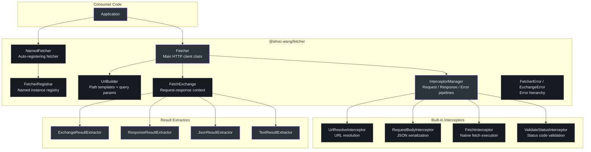
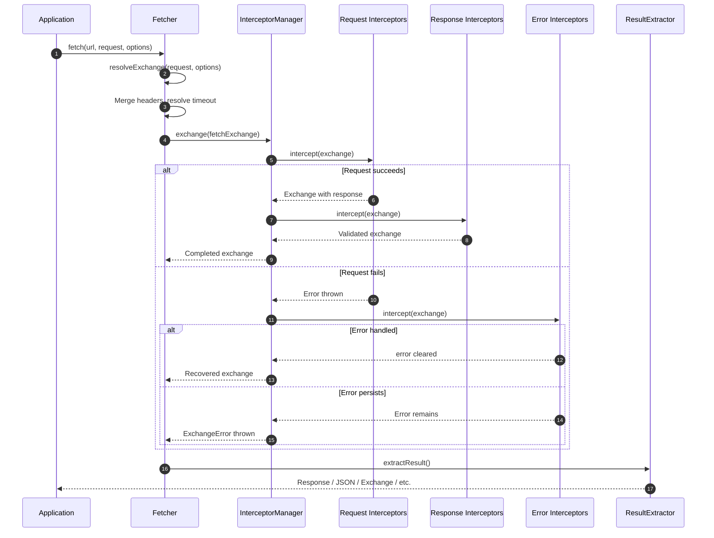
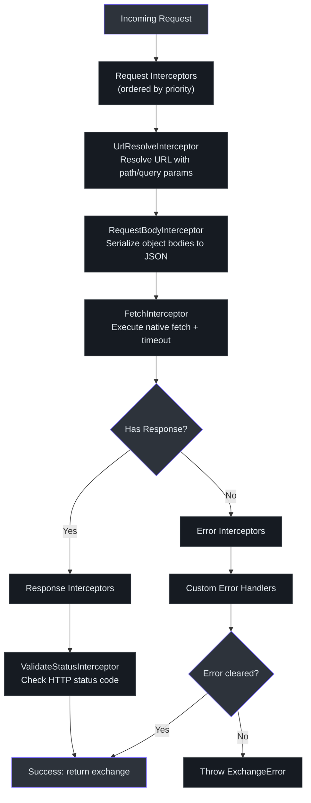
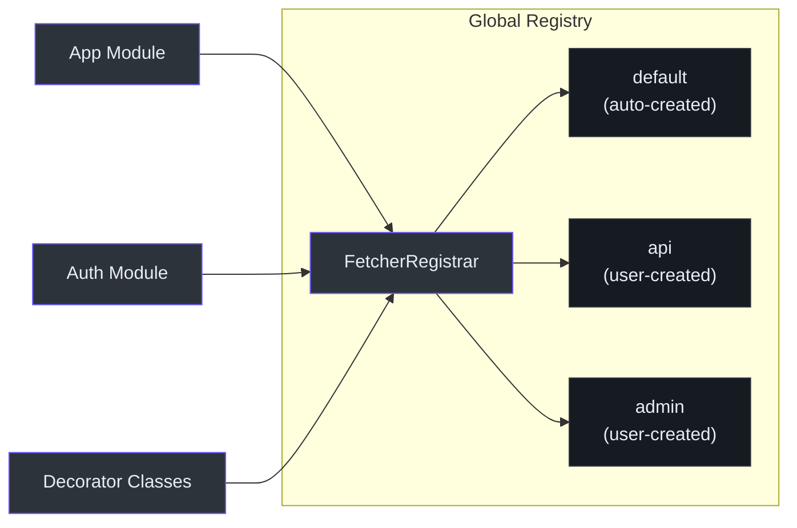
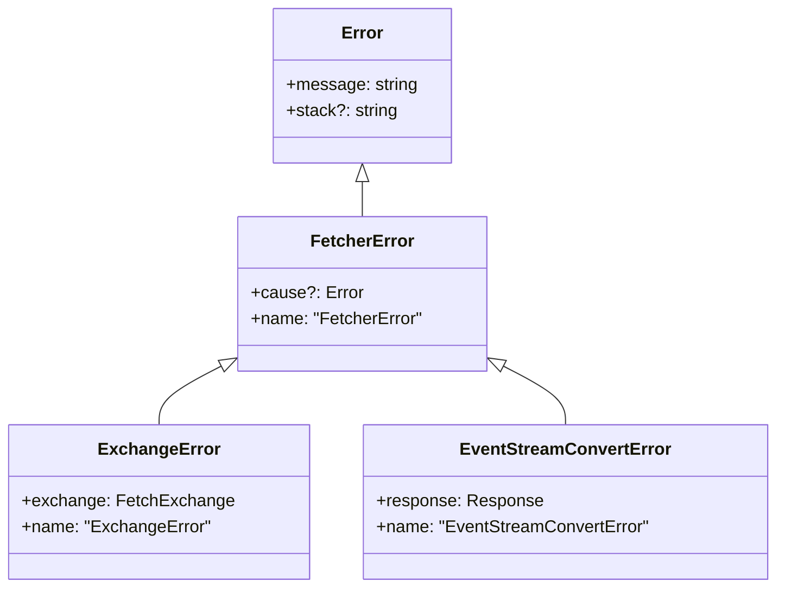

# @ahoo-wang/fetcher

`@ahoo-wang/fetcher` 包是 Fetcher 生态系统的基础。它提供了一个基于原生 Fetch API 的灵活 HTTP 客户端，内置拦截器管道、URL 模板构建、超时管理和命名 Fetcher 注册表。所有其他包都依赖于这个核心模块。

**源码**: [`packages/fetcher/src/`](https://github.com/Ahoo-Wang/fetcher/blob/main/packages/fetcher/src/)

## 安装

```bash
pnpm add @ahoo-wang/fetcher
```

## 架构



## 请求生命周期

每个 HTTP 请求都流经由 `InterceptorManager` 管理的相同管道：



## Fetcher

`Fetcher` 类是主要的 HTTP 客户端。它封装了原生 `fetch()` API，提供默认请求头、`UrlBuilder`、超时控制和完整的拦截器管道。([`fetcher.ts:123`](https://github.com/Ahoo-Wang/fetcher/blob/main/packages/fetcher/src/fetcher.ts#L123))

### 创建 Fetcher 实例

```typescript
import { Fetcher, ResultExtractors } from '@ahoo-wang/fetcher';

const fetcher = new Fetcher({
  baseURL: 'https://api.example.com',
  headers: { 'Content-Type': 'application/json' },
  timeout: 5000,
});
```

### 发起请求

```typescript
// 带路径参数和查询参数的 GET 请求
const users = await fetcher.get('/users/{id}', {
  urlParams: {
    path: { id: 123 },
    query: { include: 'profile' },
  },
});

// 带 JSON 请求体的 POST 请求
const created = await fetcher.post('/users', {
  body: { name: 'John', email: 'john@example.com' },
});

// 覆盖结果提取器以直接获取 JSON
const data = await fetcher.get<User[]>('/users', {}, {
  resultExtractor: ResultExtractors.Json,
});
```

### FetcherOptions

| 属性 | 类型 | 默认值 | 描述 |
|----------|------|---------|-------------|
| `baseURL` | `string` | `''` | 拼接在所有请求前面的基础 URL |
| `headers` | `RequestHeaders` | `{ 'Content-Type': 'application/json' }` | 所有请求的默认请求头 |
| `timeout` | `number` | `undefined` | 默认超时时间（毫秒） |
| `urlTemplateStyle` | `UrlTemplateStyle` | `Path` | URL 模板语法（`Path` 为 `:id` 格式，`UriTemplate` 为 `{id}` 格式） |
| `interceptors` | `InterceptorManager` | 内置管道 | 自定义拦截器管理器 |
| `validateStatus` | `ValidateStatus` | `status >= 200 && status < 300` | HTTP 状态码验证函数 |

**源码**: [`fetcher.ts:51`](https://github.com/Ahoo-Wang/fetcher/blob/main/packages/fetcher/src/fetcher.ts#L51)

### HTTP 方法

`Fetcher` 类提供了所有标准 HTTP 方法的便捷方法：

| 方法 | 签名 | 是否允许请求体 |
|--------|-----------|-------------|
| `get` | `get<R>(url, request?, options?)` | 否 |
| `post` | `post<R>(url, request?, options?)` | 是 |
| `put` | `put<R>(url, request?, options?)` | 是 |
| `patch` | `patch<R>(url, request?, options?)` | 是 |
| `delete` | `del<R>(url, request?, options?)` | 否 |
| `head` | `head<R>(url, request?, options?)` | 否 |
| `options` | `options<R>(url, request?, options?)` | 否 |
| `trace` | `trace<R>(url, request?, options?)` | 否 |

**源码**: [`fetcher.ts:325-500`](https://github.com/Ahoo-Wang/fetcher/blob/main/packages/fetcher/src/fetcher.ts#L325)

## 拦截器管道

拦截器系统是核心的可扩展机制。它通过三个有序阶段处理请求：请求阶段、响应阶段和错误阶段。



### 内置拦截器

| 拦截器 | 阶段 | 顺序 | 源码 |
|-------------|-------|-------|--------|
| `RequestBodyInterceptor` | 请求 | 非常靠前 | [`requestBodyInterceptor.ts`](https://github.com/Ahoo-Wang/fetcher/blob/main/packages/fetcher/src/requestBodyInterceptor.ts) |
| `UrlResolveInterceptor` | 请求 | 非常靠后 | [`urlResolveInterceptor.ts`](https://github.com/Ahoo-Wang/fetcher/blob/main/packages/fetcher/src/urlResolveInterceptor.ts) |
| `FetchInterceptor` | 请求 | 最后 | [`fetchInterceptor.ts`](https://github.com/Ahoo-Wang/fetcher/blob/main/packages/fetcher/src/fetchInterceptor.ts) |
| `ValidateStatusInterceptor` | 响应 | 默认 | [`validateStatusInterceptor.ts`](https://github.com/Ahoo-Wang/fetcher/blob/main/packages/fetcher/src/validateStatusInterceptor.ts) |

### 自定义拦截器

```typescript
import type { Interceptor, FetchExchange } from '@ahoo-wang/fetcher';

// 请求拦截器：添加授权头
const authInterceptor: Interceptor = {
  name: 'AuthInterceptor',
  order: 100,
  intercept(exchange: FetchExchange) {
    exchange.ensureRequestHeaders()['Authorization'] = `Bearer ${getToken()}`;
  },
};

// 错误拦截器：503 状态码时重试
const retryInterceptor: Interceptor = {
  name: 'RetryInterceptor',
  order: 100,
  async intercept(exchange: FetchExchange) {
    if (exchange.error?.response?.status === 503) {
      // 重试请求
      const response = await fetch(exchange.request);
      exchange.response = response;
      exchange.error = undefined; // 清除错误
    }
  },
};

// 注册拦截器
fetcher.interceptors.request.use(authInterceptor);
fetcher.interceptors.error.use(retryInterceptor);
```

**源码**: [`interceptor.ts:44`](https://github.com/Ahoo-Wang/fetcher/blob/main/packages/fetcher/src/interceptor.ts#L44)

## UrlBuilder

处理 URL 组合，包括路径参数插值和查询字符串生成。支持两种模板风格：

- **`UrlTemplateStyle.Express`**：Express 风格的 `:id` 参数
- **`UrlTemplateStyle.UriTemplate`**：RFC 6570 的 `{id}` 参数

```typescript
import { UrlBuilder, UrlTemplateStyle } from '@ahoo-wang/fetcher';

const builder = new UrlBuilder('https://api.example.com');

// URI 模板风格（默认）
const url1 = builder.build('/users/{id}/posts/{postId}', {
  path: { id: 123, postId: 456 },
  query: { filter: 'active', limit: 10 },
});
// => https://api.example.com/users/123/posts/456?filter=active&limit=10

// Express 风格
const expressBuilder = new UrlBuilder(
  'https://api.example.com',
  UrlTemplateStyle.Express,
);
const url2 = expressBuilder.build('/users/:id', { path: { id: 789 } });
// => https://api.example.com/users/789
```

**源码**: [`urlBuilder.ts:72`](https://github.com/Ahoo-Wang/fetcher/blob/main/packages/fetcher/src/urlBuilder.ts#L72)

## FetchExchange

`FetchExchange` 是流经整个拦截器链的上下文对象。它携带请求、响应、错误、结果提取器和共享属性。([`fetchExchange.ts:105`](https://github.com/Ahoo-Wang/fetcher/blob/main/packages/fetcher/src/fetchExchange.ts#L105))

| 属性 | 类型 | 描述 |
|----------|------|-------------|
| `fetcher` | `Fetcher` | 发起请求的 Fetcher 实例 |
| `request` | `FetchRequest` | 完整的请求配置 |
| `response` | `Response \| undefined` | HTTP 响应（由 `FetchInterceptor` 设置） |
| `error` | `Error \| undefined` | 请求失败时的错误 |
| `resultExtractor` | `ResultExtractor<any>` | 用于提取最终结果的函数 |
| `attributes` | `Map<string, any>` | 用于跨拦截器通信的共享数据映射 |

```typescript
// 在拦截器中访问 attributes
const timingInterceptor: Interceptor = {
  name: 'TimingInterceptor',
  order: 100,
  intercept(exchange: FetchExchange) {
    exchange.attributes.set('startTime', Date.now());
  },
};

// 在后续拦截器中读取
const logInterceptor: Interceptor = {
  name: 'LogInterceptor',
  order: 200,
  intercept(exchange: FetchExchange) {
    const elapsed = Date.now() - exchange.attributes.get('startTime');
    console.log(`${exchange.request.url} took ${elapsed}ms`);
  },
};
```

## 结果提取器

结果提取器控制 `fetcher.get()`、`fetcher.post()` 等方法的返回值。默认情况下，便捷方法返回原始 `Response` 对象。([`resultExtractor.ts`](https://github.com/Ahoo-Wang/fetcher/blob/main/packages/fetcher/src/resultExtractor.ts))

| 提取器 | 返回值 | 使用场景 |
|-----------|---------|----------|
| `ResultExtractors.Exchange` | `FetchExchange` | 访问完整的请求/响应上下文 |
| `ResultExtractors.Response` | `Response` | 原始响应对象（`.fetch()` 的默认值） |
| `ResultExtractors.Json` | `Promise<any>` | 解析后的 JSON 请求体 |
| `ResultExtractors.Text` | `Promise<string>` | 响应体的文本形式 |
| `ResultExtractors.Blob` | `Promise<Blob>` | 二进制数据（图片、文件） |
| `ResultExtractors.ArrayBuffer` | `Promise<ArrayBuffer>` | 原始二进制缓冲区 |
| `ResultExtractors.Bytes` | `Promise<Uint8Array>` | 字节数组 |

```typescript
// 默认：返回 Response
const response = await fetcher.get('/users');

// 覆盖：直接获取解析后的 JSON
const users = await fetcher.get<User[]>(
  '/users',
  {},
  { resultExtractor: ResultExtractors.Json },
);

// 自定义提取器
const statusOnly = async (exchange: FetchExchange) => {
  return exchange.requiredResponse.status;
};
const status = await fetcher.get('/health', {}, {
  resultExtractor: statusOnly,
});
```

## NamedFetcher 和 FetcherRegistrar

`NamedFetcher` 扩展了 `Fetcher`，并自动将自身注册到全局 `FetcherRegistrar` 中。这是 [decorator](./decorator.md) 包用于确定每个 API 类使用哪个 Fetcher 实例的机制。([`namedFetcher.ts:38`](https://github.com/Ahoo-Wang/fetcher/blob/main/packages/fetcher/src/namedFetcher.ts#L38), [`fetcherRegistrar.ts:41`](https://github.com/Ahoo-Wang/fetcher/blob/main/packages/fetcher/src/fetcherRegistrar.ts#L41))



```typescript
import {
  NamedFetcher,
  fetcherRegistrar,
  fetcher,
} from '@ahoo-wang/fetcher';

// 默认 fetcher 已预先创建并注册
console.log(fetcher === fetcherRegistrar.default); // true

// 创建具有不同配置的命名 fetcher
const apiFetcher = new NamedFetcher('api', {
  baseURL: 'https://api.example.com',
  timeout: 5000,
});

const adminFetcher = new NamedFetcher('admin', {
  baseURL: 'https://admin.example.com',
  headers: { 'X-Admin-Key': 'secret' },
});

// 从应用中的任何位置按名称获取
const f = fetcherRegistrar.get('api');
await f?.get('/users');

// decorator 包自动使用此机制：
// @api('/users', { fetcher: 'api' })
// class UserService { ... }
```

## 错误类

错误层次结构提供了结构化的错误信息，包括失败的 exchange 上下文。



| 错误类 | 描述 | 关键属性 |
|-------------|-------------|-------------|
| `FetcherError` | 所有 Fetcher 错误的基类 | `cause` - 底层错误 |
| `ExchangeError` | 拦截器管道失败时抛出 | `exchange` - 完整的 exchange 上下文 |

**源码**: [`fetcherError.ts:37`](https://github.com/Ahoo-Wang/fetcher/blob/main/packages/fetcher/src/fetcherError.ts#L37)

```typescript
try {
  await fetcher.get('/api/users');
} catch (error) {
  if (error instanceof ExchangeError) {
    console.log('Request URL:', error.exchange.request.url);
    console.log('Request method:', error.exchange.request.method);
    console.log('Underlying error:', error.exchange.error);
  }
}
```

## 类型工具

该包还导出了几个在整个生态系统中使用的 TypeScript 工具类型：

| 类型 | 描述 | 源码 |
|------|-------------|--------|
| `PartialBy<T, K>` | 将指定键变为可选 | [`types.ts:33`](https://github.com/Ahoo-Wang/fetcher/blob/main/packages/fetcher/src/types.ts#L33) |
| `RequiredBy<T, K>` | 将指定键变为必填 | [`types.ts:52`](https://github.com/Ahoo-Wang/fetcher/blob/main/packages/fetcher/src/types.ts#L52) |
| `RemoveReadonlyFields<T>` | 移除只读属性 | [`types.ts:85`](https://github.com/Ahoo-Wang/fetcher/blob/main/packages/fetcher/src/types.ts#L85) |
| `NamedCapable` | 包含 `name: string` 的接口 | [`types.ts:141`](https://github.com/Ahoo-Wang/fetcher/blob/main/packages/fetcher/src/types.ts#L141) |
| `OrderedCapable` | 包含 `order: number` 的接口 | [`orderedCapable.ts`](https://github.com/Ahoo-Wang/fetcher/blob/main/packages/fetcher/src/orderedCapable.ts) |
| `HttpMethod` | HTTP 方法枚举 | [`fetchRequest.ts:37`](https://github.com/Ahoo-Wang/fetcher/blob/main/packages/fetcher/src/fetchRequest.ts#L37) |

## 全局 Response 增强

该包增强了全局 `Response` 接口，添加了泛型 `json<T>()` 方法以实现类型安全的 JSON 解析：

```typescript
interface User { id: number; name: string; }

const response = await fetcher.get('/users/1');
const user = await response.json<User>();
console.log(user.name); // TypeScript 推断为 `string`
```

**源码**: [`types.ts:162`](https://github.com/Ahoo-Wang/fetcher/blob/main/packages/fetcher/src/types.ts#L162)

## 导出 API 总结

| 导出 | 类型 | 源码 |
|--------|------|--------|
| `Fetcher` | 类 | [`fetcher.ts`](https://github.com/Ahoo-Wang/fetcher/blob/main/packages/fetcher/src/fetcher.ts) |
| `NamedFetcher` | 类 | [`namedFetcher.ts`](https://github.com/Ahoo-Wang/fetcher/blob/main/packages/fetcher/src/namedFetcher.ts) |
| `FetcherRegistrar` | 类 | [`fetcherRegistrar.ts`](https://github.com/Ahoo-Wang/fetcher/blob/main/packages/fetcher/src/fetcherRegistrar.ts) |
| `fetcherRegistrar` | 实例 | [`fetcherRegistrar.ts`](https://github.com/Ahoo-Wang/fetcher/blob/main/packages/fetcher/src/fetcherRegistrar.ts) |
| `fetcher` | 实例 | [`namedFetcher.ts`](https://github.com/Ahoo-Wang/fetcher/blob/main/packages/fetcher/src/namedFetcher.ts) |
| `InterceptorManager` | 类 | [`interceptorManager.ts`](https://github.com/Ahoo-Wang/fetcher/blob/main/packages/fetcher/src/interceptorManager.ts) |
| `InterceptorRegistry` | 类 | [`interceptor.ts`](https://github.com/Ahoo-Wang/fetcher/blob/main/packages/fetcher/src/interceptor.ts) |
| `Interceptor` | 接口 | [`interceptor.ts`](https://github.com/Ahoo-Wang/fetcher/blob/main/packages/fetcher/src/interceptor.ts) |
| `FetchExchange` | 类 | [`fetchExchange.ts`](https://github.com/Ahoo-Wang/fetcher/blob/main/packages/fetcher/src/fetchExchange.ts) |
| `FetcherError` | 类 | [`fetcherError.ts`](https://github.com/Ahoo-Wang/fetcher/blob/main/packages/fetcher/src/fetcherError.ts) |
| `ExchangeError` | 类 | [`fetcherError.ts`](https://github.com/Ahoo-Wang/fetcher/blob/main/packages/fetcher/src/fetcherError.ts) |
| `UrlBuilder` | 类 | [`urlBuilder.ts`](https://github.com/Ahoo-Wang/fetcher/blob/main/packages/fetcher/src/urlBuilder.ts) |
| `ResultExtractors` | 对象 | [`resultExtractor.ts`](https://github.com/Ahoo-Wang/fetcher/blob/main/packages/fetcher/src/resultExtractor.ts) |
| `FetcherOptions` | 接口 | [`fetcher.ts`](https://github.com/Ahoo-Wang/fetcher/blob/main/packages/fetcher/src/fetcher.ts) |
| `FetchRequest` | 接口 | [`fetchRequest.ts`](https://github.com/Ahoo-Wang/fetcher/blob/main/packages/fetcher/src/fetchRequest.ts) |
| `HttpMethod` | 枚举 | [`fetchRequest.ts`](https://github.com/Ahoo-Wang/fetcher/blob/main/packages/fetcher/src/fetchRequest.ts) |

## 相关页面

- [Decorator](./decorator.md) - 基于 Fetcher 构建声明式 API 服务
- [EventStream](./eventstream.md) - 通过副作用导入添加 SSE 和 LLM 流式传输
- [EventBus](./eventbus.md) - 使用 Fetcher 工具的类型化事件系统
- [包概览](./index.md) - 生态系统中的所有包
