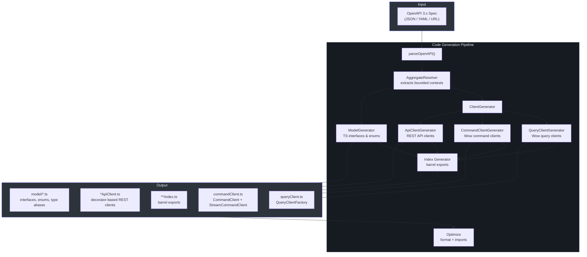
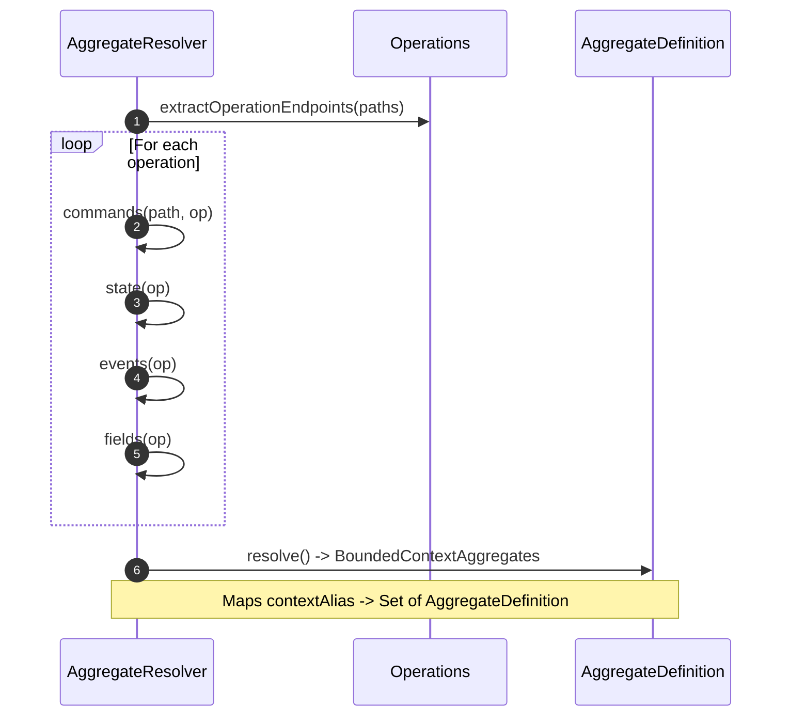
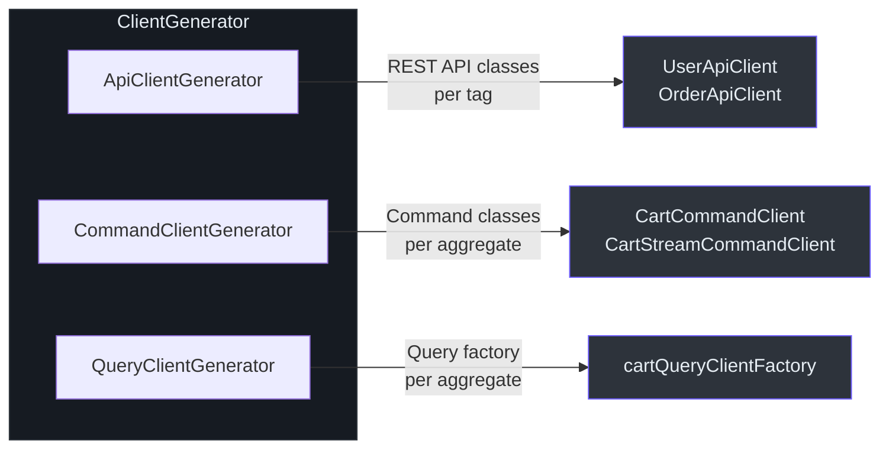

# @ahoo-wang/fetcher-generator

`@ahoo-wang/fetcher-generator` 包是一个 CLI 工具，用于读取 OpenAPI 3.x 规范（JSON、YAML 或 URL）并生成完全类型化的 TypeScript 代码——包括模型接口/枚举、基于装饰器的 API 客户端以及 Wow CQRS 特定的命令/查询客户端。基于 [ts-morph](https://ts-morph.com/) 进行代码生成，使用 [commander](https://github.com/tj/commander.js) 进行 CLI 参数解析。

## 安装

```bash
pnpm add -D @ahoo-wang/fetcher-generator
```

## 架构概览



## CLI 使用方式

`fetcher-generator` 二进制程序读取 OpenAPI 规范文件并将 TypeScript 源文件写入输出目录。

### 命令

| 命令 | 描述 |
|------|------|
| `generate` | 从 OpenAPI 规范生成 TypeScript 代码 |
| `-v, --version` | 显示版本信息 |

### Generate 选项

| 选项 | 简写 | 必填 | 默认值 | 描述 |
|------|------|------|--------|------|
| `--input <file>` | `-i` | 是 | -- | OpenAPI 规范文件路径或 URL |
| `--output <path>` | `-o` | 否 | `src/generated` | 输出目录 |
| `--config <file>` | `-c` | 否 | `./fetcher-generator.config.json` | 配置文件路径 |
| `--ts-config-file-path <file>` | `-t` | 否 | -- | TypeScript 配置文件 |

### CLI 命令示例

```bash
# 从本地 YAML 规范生成
npx fetcher-generator generate -i ./openapi.yaml -o ./src/generated

# 从远程 URL 生成
npx fetcher-generator generate -i https://api.example.com/v3/api-docs -o ./src/generated

# 使用自定义配置和 tsconfig 生成
npx fetcher-generator generate -i ./spec.json -o ./src/api -c ./generator.config.json -t ./tsconfig.json
```

来源: [packages/generator/src/cli.ts](https://github.com/Ahoo-Wang/fetcher/blob/main/packages/generator/src/cli.ts)

## 配置

生成器会读取一个可选的 JSON 配置文件（默认为 `./fetcher-generator.config.json`）：

```typescript
// GeneratorConfiguration
{
  "apiClients": {
    "TagName": {
      "ignorePathParameters": ["tenantId", "ownerId"]
    }
  }
}
```

默认情况下，生成 API 客户端方法时会忽略 `tenantId` 和 `ownerId` 路径参数，因为它们由 [CoSec 资源归属拦截器](./cosec.md#resource-attribution) 处理。

来源: [packages/generator/src/types.ts:73-87](https://github.com/Ahoo-Wang/fetcher/blob/main/packages/generator/src/types.ts#L73-L87)

## 代码生成流水线

### 步骤 1 -- 解析 OpenAPI 规范

`CodeGenerator` 将输入规范（JSON、YAML 或 URL）解析为类型化的 `OpenAPI` 对象。支持文件路径和 HTTP/HTTPS URL。

来源: [packages/generator/src/index.ts:45-142](https://github.com/Ahoo-Wang/fetcher/blob/main/packages/generator/src/index.ts#L45-L142)

### 步骤 2 -- 解析限界上下文聚合

`AggregateResolver` 遍历所有操作以提取 Wow 限界上下文聚合定义。它识别以下内容：

- **命令** -- 响应模式包含 `wow.CommandOk` 的操作
- **状态** -- 快照状态查询操作（`.snapshot_state.single`）
- **事件** -- 事件流列表查询（`.event.list_query`）
- **字段** -- 快照计数操作（`.snapshot.count`）



来源: [packages/generator/src/aggregate/aggregateResolver.ts:52-289](https://github.com/Ahoo-Wang/fetcher/blob/main/packages/generator/src/aggregate/aggregateResolver.ts#L52-L289)

### 步骤 3 -- 生成模型

`ModelGenerator` 遍历所有 OpenAPI 组件模式并生成 TypeScript 类型。它会过滤掉 Wow 框架内部模式（以 `wow.` 为前缀）以及聚合生成的后缀类型。

`TypeGenerator` 处理以下模式类型：

| 模式类型 | 生成的 TypeScript |
|----------|-------------------|
| `enum` | `enum` 声明 |
| 带属性的 `object` | 带类型化属性的 `interface` |
| `allOf` | `interface extends`（交叉类型） |
| `oneOf` / `anyOf` | 类型别名（联合类型） |
| `array` | `Array<T>` 类型别名 |
| `additionalProperties` | 带索引签名的 `Record<K, V>` |
| 基本类型 | `string`、`number`、`boolean` |

来源: [packages/generator/src/model/typeGenerator.ts:50-337](https://github.com/Ahoo-Wang/fetcher/blob/main/packages/generator/src/model/typeGenerator.ts#L50-L337)

### 步骤 4 -- 生成客户端

`ClientGenerator` 协调三个子生成器：



来源: [packages/generator/src/client/clientGenerator.ts](https://github.com/Ahoo-Wang/fetcher/blob/main/packages/generator/src/client/clientGenerator.ts)

#### API 客户端生成器

根据 OpenAPI 标签生成基于装饰器的 API 客户端类。每个类包含：

- `@api()` 类装饰器，指定基础路径
- `@get/@post/@put/@delete/@patch` 方法装饰器，指定端点路径
- `@path` 参数装饰器，用于路径模板变量
- `@request` 参数装饰器，用于请求体
- `@attribute` 参数装饰器，用于拦截器属性

名为 `wow`、`Actuator` 或与聚合名称匹配的标签会被排除。

来源: [packages/generator/src/client/apiClientGenerator.ts:73-598](https://github.com/Ahoo-Wang/fetcher/blob/main/packages/generator/src/client/apiClientGenerator.ts#L73-L598)

#### 命令客户端生成器

为每个 Wow 聚合生成命令客户端。对每个聚合，它生成：

1. `XxxCommandEndpointPaths` 枚举 -- 将命令名称映射到 URL 路径
2. `XxxCommand` 类型别名 -- 使用 `CommandBody<T>` 包装的类型化命令体
3. `XxxCommandClient` 类 -- 通过 `@post` 装饰器发送命令
4. `XxxStreamCommandClient` 类 -- 在命令客户端基础上扩展 SSE 流式传输

来源: [packages/generator/src/client/commandClientGenerator.ts:60-434](https://github.com/Ahoo-Wang/fetcher/blob/main/packages/generator/src/client/commandClientGenerator.ts#L60-L434)

#### 查询客户端生成器

为每个聚合生成查询客户端工厂：

- 领域事件类型联合（`XxxDomainEventType`）
- 领域事件标题枚举（`XxxDomainEventTypeMapTitle`）
- 配置了上下文别名、聚合名称和资源归属的 `QueryClientFactory` 实例

来源: [packages/generator/src/client/queryClientGenerator.ts:35-226](https://github.com/Ahoo-Wang/fetcher/blob/main/packages/generator/src/client/queryClientGenerator.ts#L35-L226)

### 步骤 5 -- 索引和优化

所有生成器运行完成后，代码生成器会：

1. 为每个输出目录递归创建 `index.ts` 桶导出文件
2. 使用 `formatText()` 格式化所有源文件
3. 使用 `organizeImports()` 整理导入语句
4. 使用 `fixMissingImports()` 修复缺失的导入
5. 将 ts-morph 项目保存到磁盘

来源: [packages/generator/src/index.ts:157-262](https://github.com/Ahoo-Wang/fetcher/blob/main/packages/generator/src/index.ts#L157-L262)

## 生成输出结构

对于一个包含限界上下文 `example` 和聚合 `Cart` 的规范：

```
src/generated/
  index.ts                          # barrel export
  example/
    index.ts                        # barrel export
    boundedContext.ts                # export const example = 'example';
    model/
      index.ts
      CartState.ts                  # interface CartState { ... }
      AddCartItem.ts                # interface AddCartItem { ... }
      CartItemAdded.ts              # interface CartItemAdded { ... }
      ...
    cart/
      index.ts
      commandClient.ts              # CartCommandClient, CartStreamCommandClient
      queryClient.ts                # cartQueryClientFactory
    order/
      ...
  UserApiClient.ts                  # @api() class
  OrderApiClient.ts                 # @api() class
```

## 编程式使用

```typescript
import { CodeGenerator } from '@ahoo-wang/fetcher-generator';

const generator = new CodeGenerator({
  inputPath: './openapi.yaml',
  outputDir: './src/generated',
  tsConfigFilePath: './tsconfig.json',
  logger: console,
});

await generator.generate();
```

## 主要导出

| 导出 | 描述 |
|------|------|
| `CodeGenerator` | 主协调器类 |
| `GeneratorOptions` | 代码生成配置选项 |
| `GenerateContext` | 在生成流水线中传递的上下文对象 |
| `Generator` | 所有生成器阶段实现的接口 |
| `Logger` | 用于进度报告的日志接口 |
| `GeneratorConfiguration` | API 客户端生成的逐标签配置 |
| `DEFAULT_CONFIG_PATH` | 默认配置文件路径（`./fetcher-generator.config.json`） |

## 依赖

- **[ts-morph](https://ts-morph.com/)** -- TypeScript 编译器 API 封装，用于源文件操作
- **[commander](https://github.com/tj/commander.js)** -- CLI 参数解析
- **[@ahoo-wang/fetcher-openapi](https://github.com/Ahoo-Wang/fetcher/blob/main/packages/openapi)** -- OpenAPI 3.x 类型定义
- **[@ahoo-wang/fetcher](https://github.com/Ahoo-Wang/fetcher/blob/main/packages/fetcher)** -- URL 工具（`combineURLs`）
- **[@ahoo-wang/fetcher-decorator](https://github.com/Ahoo-Wang/fetcher/blob/main/packages/decorator)** -- 用于生成客户端的装饰器工具
- **[@ahoo-wang/fetcher-wow](https://github.com/Ahoo-Wang/fetcher/blob/main/packages/wow)** -- Wow 框架类型，用于聚合定义

## 交叉引用

- **[Decorator](./decorator.md)** -- 生成的 API 客户端使用装饰器包中的 `@api`、`@get`、`@post` 及参数装饰器
- **[Wow](./wow.md)** -- 命令和查询客户端面向 Wow CQRS 框架的命令和快照端点
- **[EventStream](./eventstream.md)** -- 生成的流式客户端使用 `JsonEventStreamResultExtractor` 处理 SSE 结果
- **[OpenAPI](./openapi.md)** -- 生成器使用 openapi 包中的 OpenAPI 类型定义
