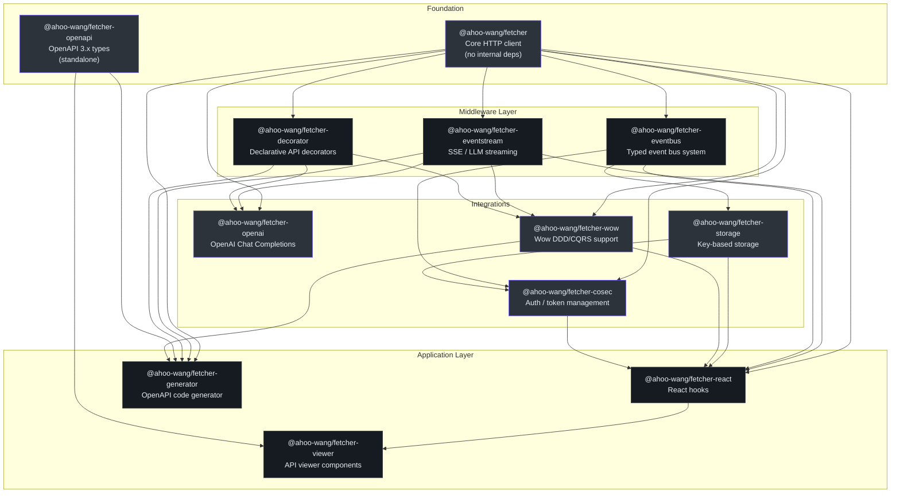
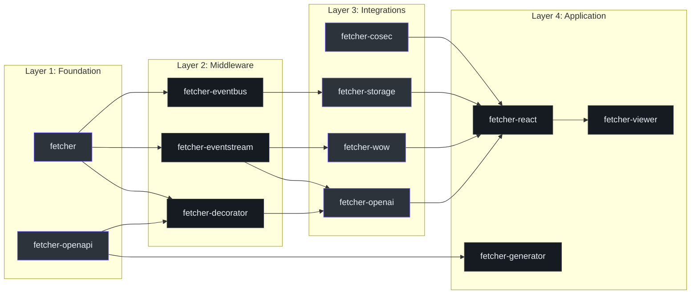
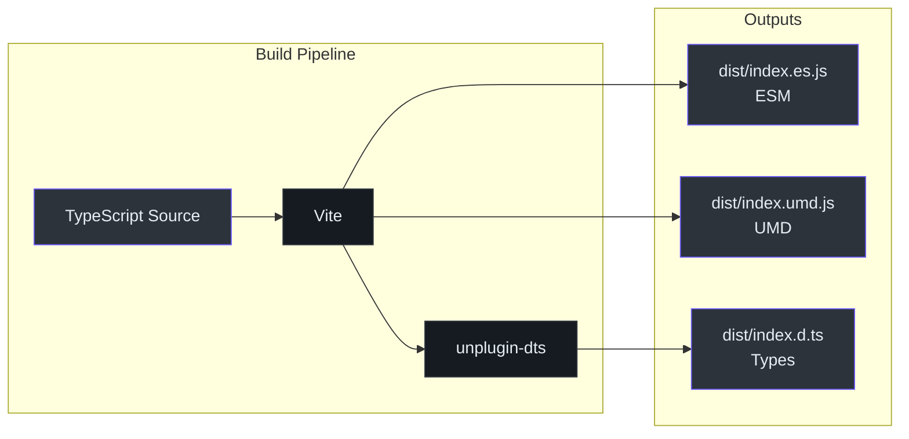
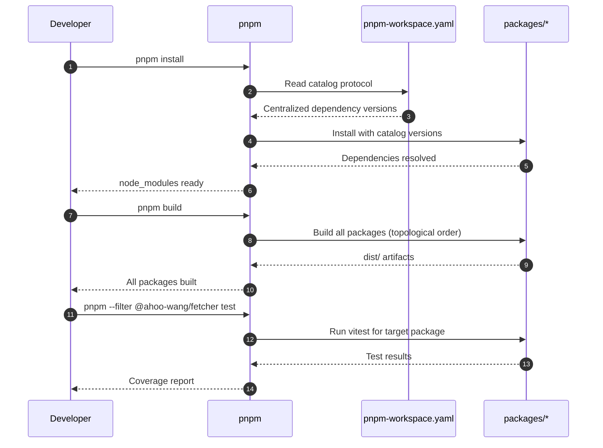

# 包概览

Fetcher 生态系统以 pnpm monorepo 的形式组织，包含 12 个发布在 `@ahoo-wang` npm 作用域下的包。每个包都可以独立发布，同时共享统一的版本管理和构建配置。

## 包依赖关系图



## 包注册表

| # | 包 | 描述 | 核心源码 | 依赖 |
|---|---------|-------------|------------|--------------|
| 1 | [@ahoo-wang/fetcher](./fetcher.md) | 核心 HTTP 客户端，支持拦截器、URL 构建和超时控制 | [`packages/fetcher/src/fetcher.ts`](https://github.com/Ahoo-Wang/fetcher/blob/main/packages/fetcher/src/fetcher.ts) | 无（独立） |
| 2 | [@ahoo-wang/fetcher-decorator](./decorator.md) | TypeScript 装饰器，用于声明式 API 服务定义 | [`packages/decorator/src/apiDecorator.ts`](https://github.com/Ahoo-Wang/fetcher/blob/main/packages/decorator/src/apiDecorator.ts) | `@ahoo-wang/fetcher`、`reflect-metadata` |
| 3 | [@ahoo-wang/fetcher-eventbus](./eventbus.md) | 类型化事件总线，支持串行、并行和广播实现 | [`packages/eventbus/src/eventBus.ts`](https://github.com/Ahoo-Wang/fetcher/blob/main/packages/eventbus/src/eventBus.ts) | `@ahoo-wang/fetcher` |
| 4 | [@ahoo-wang/fetcher-eventstream](./eventstream.md) | SSE 流处理和 LLM 流式传输支持（副作用模块） | [`packages/eventstream/src/responses.ts`](https://github.com/Ahoo-Wang/fetcher/blob/main/packages/eventstream/src/responses.ts) | `@ahoo-wang/fetcher` |
| 5 | [@ahoo-wang/fetcher-openai](./openai.md) | 类型安全的 OpenAI Chat Completions API 客户端 | [`packages/openai/src/chat/chatClient.ts`](https://github.com/Ahoo-Wang/fetcher/blob/main/packages/openai/src/chat/chatClient.ts) | `fetcher`、`eventstream`、`decorator` |
| 6 | [@ahoo-wang/fetcher-openapi](./openapi.md) | OpenAPI 3.x 规范的 TypeScript 类型定义 | [`packages/openapi/src/openAPI.ts`](https://github.com/Ahoo-Wang/fetcher/blob/main/packages/openapi/src/openAPI.ts) | 无（独立） |
| 7 | [@ahoo-wang/fetcher-storage](./storage.md) | 基于键的存储，支持序列化和变更通知 | [`packages/storage/src/`](https://github.com/Ahoo-Wang/fetcher/blob/main/packages/storage/src/) | `@ahoo-wang/fetcher-eventbus` |
| 8 | [@ahoo-wang/fetcher-cosec](./cosec.md) | 企业级认证，支持自动令牌管理 | [`packages/cosec/src/`](https://github.com/Ahoo-Wang/fetcher/blob/main/packages/cosec/src/) | `fetcher`、`eventbus`、`storage` |
| 9 | [@ahoo-wang/fetcher-wow](./wow.md) | Wow DDD/CQRS 框架集成 | [`packages/wow/src/`](https://github.com/Ahoo-Wang/fetcher/blob/main/packages/wow/src/) | `fetcher`、`eventstream`、`decorator` |
| 10 | [@ahoo-wang/fetcher-react](./react.md) | React Hooks，支持数据获取和自动重渲染 | [`packages/react/src/`](https://github.com/Ahoo-Wang/fetcher/blob/main/packages/react/src/) | `fetcher`、`eventstream`、`eventbus`、`storage`、`wow`、`cosec` |
| 11 | [@ahoo-wang/fetcher-viewer](./viewer.md) | React + Ant Design API 文档查看器 | [`packages/viewer/src/`](https://github.com/Ahoo-Wang/fetcher/blob/main/packages/viewer/src/) | 大部分包 + `antd`、`react` |
| 12 | [@ahoo-wang/fetcher-generator](./generator.md) | OpenAPI 到 TypeScript 的代码生成器 CLI | [`packages/generator/src/`](https://github.com/Ahoo-Wang/fetcher/blob/main/packages/generator/src/) | `fetcher`、`eventstream`、`decorator`、`openapi`、`wow` |

## 安装

根据需要安装单个包或组合安装：

```bash
# 核心 HTTP 客户端
pnpm add @ahoo-wang/fetcher

# 声明式 API 装饰器（需要 reflect-metadata）
pnpm add @ahoo-wang/fetcher-decorator reflect-metadata

# 事件总线系统
pnpm add @ahoo-wang/fetcher-eventbus

# SSE / LLM 流式传输支持
pnpm add @ahoo-wang/fetcher-eventstream

# OpenAI API 客户端
pnpm add @ahoo-wang/fetcher-openai

# OpenAPI 3.x 类型
pnpm add @ahoo-wang/fetcher-openapi

# 基于键的存储
pnpm add @ahoo-wang/fetcher-storage

# CoSec 认证
pnpm add @ahoo-wang/fetcher-cosec

# React Hooks
pnpm add @ahoo-wang/fetcher-react

# API 查看器组件（需要 antd）
pnpm add @ahoo-wang/fetcher-viewer antd @ant-design/icons

# Wow DDD/CQRS 支持
pnpm add @ahoo-wang/fetcher-wow

# 代码生成器（CLI 工具）
pnpm add -D @ahoo-wang/fetcher-generator
```

## 分层架构

各包遵循清晰的分层架构，从基础工具层逐步上升到应用层组件。



## 构建系统

所有包共享统一的 Vite 构建配置：



每个包的输出：

| 输出 | 格式 | 描述 |
|--------|--------|-------------|
| `dist/index.es.js` | ESM | 面向现代打包工具的 ES 模块包 |
| `dist/index.umd.js` | UMD | 可直接在浏览器中使用的通用模块 |
| `dist/index.d.ts` | TypeScript | 完整的类型声明 |

## Monorepo 管理



## 统一约定

所有包遵循以下约定：

- **ES 模块**：所有 `package.json` 文件中设置 `"type": "module"`
- **TypeScript 严格模式**：所有包均已启用严格模式
- **许可证**：Apache 2.0，每个源文件均包含许可证头
- **测试**：Vitest 配合 `@vitest/coverage-v8`
- **格式化**：Prettier，使用单引号、尾随逗号、80 字符宽度
- **版本**：通过 `pnpm update-version <version>` 在所有包间同步
- **包体积分析**：每个包都有 `vite-bundle-analyzer` 脚本

## 相关页面

- [Fetcher（核心）](./fetcher.md) - 基础 HTTP 客户端
- [Decorator](./decorator.md) - 声明式 API 定义
- [EventBus](./eventbus.md) - 类型化事件系统
- [EventStream](./eventstream.md) - SSE 和 LLM 流式传输
- [OpenAI](./openai.md) - Chat Completions 集成
- [OpenAPI](./openapi.md) - 规范类型定义
- [Storage](./storage.md) - 基于键的存储抽象
- [React](./react.md) - React Hooks 和集成
- [Generator](./generator.md) - 代码生成 CLI
