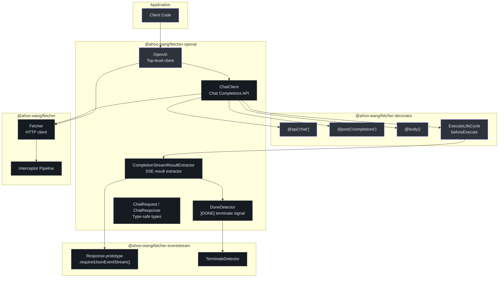
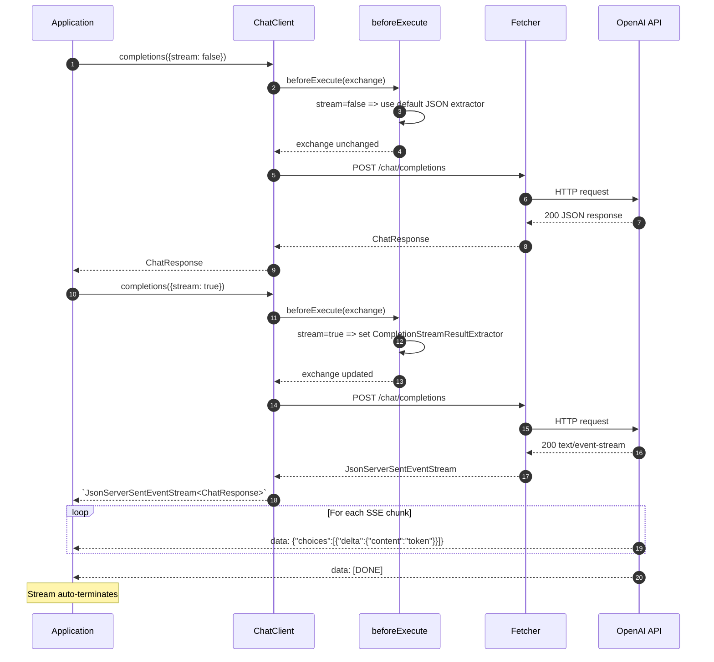
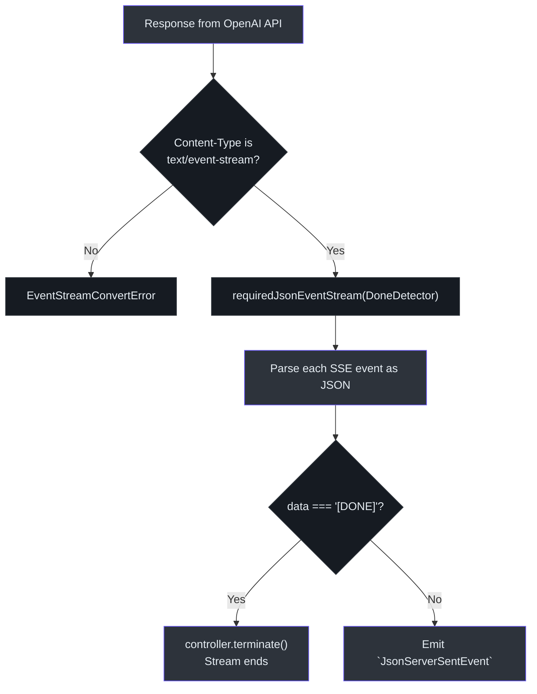

# @ahoo-wang/fetcher-openai

`@ahoo-wang/fetcher-openai` 包为 OpenAI 的 Chat Completions API 提供类型安全的客户端。它将 [decorator](./decorator.md) 包的声明式 API 风格与 [eventstream](./eventstream.md) 包的 SSE 处理相结合，通过单个方法调用即可实现无缝的流式和非流式体验。

**源码**: [`packages/openai/src/`](https://github.com/Ahoo-Wang/fetcher/blob/main/packages/openai/src/)

## 安装

```bash
pnpm add @ahoo-wang/fetcher-openai
```

::: warning 对等依赖
此包需要其全部三个对等依赖：

```bash
pnpm add @ahoo-wang/fetcher @ahoo-wang/fetcher-eventstream @ahoo-wang/fetcher-decorator reflect-metadata
```
:::

## 架构



## 快速开始

### 非流式

```typescript
import 'reflect-metadata';
import { OpenAI } from '@ahoo-wang/fetcher-openai';

const openai = new OpenAI({
  baseURL: 'https://api.openai.com/v1',
  apiKey: process.env.OPENAI_API_KEY!,
});

const response = await openai.chat.completions({
  model: 'gpt-3.5-turbo',
  messages: [
    { role: 'system', content: 'You are a helpful assistant.' },
    { role: 'user', content: 'What is TypeScript?' },
  ],
  temperature: 0.7,
  max_tokens: 150,
});

console.log(response.choices[0].message?.content);
// => "TypeScript is a programming language developed by Microsoft..."
console.log(response.usage.total_tokens);
// => 42
```

### 流式

```typescript
import 'reflect-metadata';
import { OpenAI } from '@ahoo-wang/fetcher-openai';

const openai = new OpenAI({
  baseURL: 'https://api.openai.com/v1',
  apiKey: process.env.OPENAI_API_KEY!,
});

const stream = await openai.chat.completions({
  model: 'gpt-4',
  messages: [{ role: 'user', content: 'Write a short story about a cat.' }],
  stream: true,
  temperature: 0.8,
});

for await (const chunk of stream) {
  const content = chunk.choices[0]?.delta?.content;
  if (content) {
    process.stdout.write(content); // 逐 token 输出
  }
}
// 收到 [DONE] 信号时流自动终止
```

## 流式与非流式流程

`ChatClient` 使用高级 TypeScript 条件类型，根据 `stream` 参数提供正确的返回类型。`beforeExecute` 生命周期钩子动态切换结果提取器。([`chatClient.ts:78`](https://github.com/Ahoo-Wang/fetcher/blob/main/packages/openai/src/chat/chatClient.ts#L78))



## OpenAI 客户端

`OpenAI` 类是顶层入口点。它创建一个带有 `Authorization` 头中 API 密钥的 `Fetcher`，并实例化子客户端。([`openai.ts:63`](https://github.com/Ahoo-Wang/fetcher/blob/main/packages/openai/src/openai.ts#L63))

```typescript
const openai = new OpenAI({
  baseURL: 'https://api.openai.com/v1',
  apiKey: 'sk-...',
});

// 访问底层 fetcher 以进行自定义配置
openai.fetcher.interceptors.request.use(myCustomInterceptor);

// 使用聊天客户端
await openai.chat.completions({ model: 'gpt-4', messages: [...] });
```

### OpenAIOptions

| 属性 | 类型 | 必填 | 描述 |
|----------|------|----------|-------------|
| `baseURL` | `string` | 是 | OpenAI API 基础 URL（如 `https://api.openai.com/v1`） |
| `apiKey` | `string` | 是 | OpenAI API 密钥（作为 `Bearer` 令牌发送） |

## ChatClient

`ChatClient` 使用 `@api('chat')` 装饰，同时实现了 `ApiMetadataCapable`（用于运行时元数据注入）和 `ExecuteLifeCycle`（用于动态结果提取器切换）。([`chatClient.ts:78`](https://github.com/Ahoo-Wang/fetcher/blob/main/packages/openai/src/chat/chatClient.ts#L78))

```typescript
@api('chat')
export class ChatClient implements ApiMetadataCapable, ExecuteLifeCycle {
  constructor(public readonly apiMetadata?: ApiMetadata) {}

  beforeExecute(exchange: FetchExchange): void {
    const chatRequest = exchange.request.body as ChatRequest;
    if (chatRequest.stream) {
      exchange.resultExtractor = CompletionStreamResultExtractor;
    }
  }

  @post('/completions')
  completions<T extends ChatRequest>(
    @body() chatRequest: T,
  ): Promise<
    T['stream'] extends true
      ? JsonServerSentEventStream<ChatResponse>
      : ChatResponse
  > {
    throw autoGeneratedError(chatRequest);
  }
}
```

条件返回类型 `T['stream'] extends true ? JsonServerSentEventStream<ChatResponse> : ChatResponse` 确保 TypeScript 在调用处正确推断返回类型。

## CompletionStreamResultExtractor

`CompletionStreamResultExtractor` 处理来自聊天补全 API 的 SSE 响应。它使用 `DoneDetector` 在接收到 `[DONE]` 信号时终止流。([`completionStreamResultExtractor.ts:88`](https://github.com/Ahoo-Wang/fetcher/blob/main/packages/openai/src/chat/completionStreamResultExtractor.ts#L88))



```typescript
export const DoneDetector: TerminateDetector = (event) => {
  return event.data === '[DONE]';
};

export const CompletionStreamResultExtractor: ResultExtractor<
  JsonServerSentEventStream<ChatResponse>
> = (exchange) => {
  return exchange.requiredResponse.requiredJsonEventStream(DoneDetector);
};
```

## 类型定义

### ChatRequest

聊天补全端点的完整请求体。([`types.ts:14`](https://github.com/Ahoo-Wang/fetcher/blob/main/packages/openai/src/chat/types.ts#L14))

| 属性 | 类型 | 默认值 | 描述 |
|----------|------|---------|-------------|
| `model` | `string` | - | 模型 ID（如 `gpt-3.5-turbo`、`gpt-4`） |
| `messages` | `Message[]` | - | 包含角色和内容的对话消息 |
| `stream` | `boolean` | `false` | 启用流式响应 |
| `temperature` | `number` | `1` | 采样温度（0-2） |
| `max_tokens` | `number` | `inf` | 最大生成 token 数 |
| `top_p` | `number` | `1` | 核采样阈值 |
| `frequency_penalty` | `number` | `0` | 重复惩罚（-2.0 到 2.0） |
| `presence_penalty` | `number` | `0` | 主题多样性惩罚（-2.0 到 2.0） |
| `stop` | `string` | `null` | 停止序列 |
| `n` | `number` | `1` | 生成的补全数量 |
| `user` | `string` | - | 终端用户标识符 |
| `tools` | `string[]` | - | 函数/工具调用的工具定义 |
| `tool_choice` | `{ [key: string]: any }` | - | 控制工具选择（如 `{ type: "auto" }`） |
| `response_format` | `object` | - | 输出格式约束（如 `{ type: "json_object" }`） |

### Message

::: tip 开放结构
`Message` 具有索引签名 `[property: string]: any`，因此它接受 `role` 和 `content` 之外的任何 OpenAI API 字段——包括 `tool_calls`、`tool_call_id`、`name` 和 `function_call`。
:::

| 属性 | 类型 | 描述 |
|----------|------|-------------|
| `role` | `string` | `"system"`、`"user"`、`"assistant"` 或 `"tool"` |
| `content` | `string?` | 消息文本内容 |
| `tool_calls` | `any[]?` | 助手发起的工具调用请求 |
| `tool_call_id` | `string?` | 将工具响应消息链接到其调用的 ID |
| `name` | `string?` | 函数/工具名称 |

### 函数 / 工具调用

客户端支持 OpenAI 的函数/工具调用。由于 `Message` 具有开放的索引签名，你可以传递工具定义并接收工具调用，无需额外的类型摩擦：

```typescript
const response = await openAI.chat.completions({
  model: 'gpt-4',
  messages: [{ role: 'user', content: '波士顿的天气如何？' }],
  tools: [{
    type: 'function',
    function: {
      name: 'get_weather',
      description: '获取指定地点的当前天气',
      parameters: {
        type: 'object',
        properties: {
          location: { type: 'string', description: '城市名称' },
        },
        required: ['location'],
      },
    },
  }],
  tool_choice: { type: 'auto' }, // 让模型决定
});

// 检查模型是否想要调用工具
const message = response.choices[0]?.message;
if (message?.tool_calls) {
  for (const toolCall of message.tool_calls) {
    const args = JSON.parse(toolCall.function.arguments);
    console.log(`调用 ${toolCall.function.name}(${JSON.stringify(args)})`);
    // 调用你的函数，然后继续对话：
    // messages.push(message);                    // 助手的工具调用消息
    // messages.push({ role: 'tool', tool_call_id: toolCall.id, content: result });
  }
}
```

### ChatResponse

| 属性 | 类型 | 描述 |
|----------|------|-------------|
| `id` | `string` | 唯一响应 ID |
| `object` | `string` | 对象类型（如 `"chat.completion"`） |
| `created` | `number` | 创建时间的 Unix 时间戳 |
| `choices` | `Choice[]` | 补全选项数组 |
| `usage` | `Usage` | token 使用统计 |

### Choice

| 属性 | 类型 | 描述 |
|----------|------|-------------|
| `index` | `number?` | 选项索引 |
| `message` | `Message?` | 补全消息（非流式） |
| `finish_reason` | `string?` | `"stop"`、`"length"`、`"content_filter"` 等 |

### Usage

| 属性 | 类型 | 描述 |
|----------|------|-------------|
| `prompt_tokens` | `number` | 提示中的 token 数 |
| `completion_tokens` | `number` | 补全中的 token 数 |
| `total_tokens` | `number` | 消耗的 token 总数 |

## 进阶：自定义拦截器

由于 `OpenAI` 类暴露了其 `Fetcher` 实例，您可以添加拦截器用于日志记录、重试或认证刷新：

```typescript
import { OpenAI } from '@ahoo-wang/fetcher-openai';

const openai = new OpenAI({
  baseURL: 'https://api.openai.com/v1',
  apiKey: process.env.OPENAI_API_KEY!,
});

// 添加日志拦截器
openai.fetcher.interceptors.request.use({
  name: 'RequestLogger',
  order: 100,
  intercept(exchange) {
    console.log(`[OpenAI] ${exchange.request.method} ${exchange.request.url}`);
  },
});

// 添加限流重试拦截器
openai.fetcher.interceptors.error.use({
  name: 'RateLimitRetry',
  order: 100,
  async intercept(exchange) {
    if (exchange.error?.response?.status === 429) {
      const retryAfter = parseInt(
        exchange.error.response.headers.get('Retry-After') || '1',
      );
      await new Promise(r => setTimeout(r, retryAfter * 1000));
      // 重试请求
      const response = await fetch(exchange.request);
      exchange.response = response;
      exchange.error = undefined;
    }
  },
});
```

## 导出 API 总结

| 导出 | 类型 | 源码 |
|--------|------|--------|
| `OpenAI` | 类 | [`openai.ts`](https://github.com/Ahoo-Wang/fetcher/blob/main/packages/openai/src/openai.ts) |
| `OpenAIOptions` | 接口 | [`openai.ts`](https://github.com/Ahoo-Wang/fetcher/blob/main/packages/openai/src/openai.ts) |
| `ChatClient` | 类 | [`chat/chatClient.ts`](https://github.com/Ahoo-Wang/fetcher/blob/main/packages/openai/src/chat/chatClient.ts) |
| `ChatRequest` | 接口 | [`chat/types.ts`](https://github.com/Ahoo-Wang/fetcher/blob/main/packages/openai/src/chat/types.ts) |
| `ChatResponse` | 接口 | [`chat/types.ts`](https://github.com/Ahoo-Wang/fetcher/blob/main/packages/openai/src/chat/types.ts) |
| `Message` | 接口 | [`chat/types.ts`](https://github.com/Ahoo-Wang/fetcher/blob/main/packages/openai/src/chat/types.ts) |
| `Choice` | 接口 | [`chat/types.ts`](https://github.com/Ahoo-Wang/fetcher/blob/main/packages/openai/src/chat/types.ts) |
| `Usage` | 接口 | [`chat/types.ts`](https://github.com/Ahoo-Wang/fetcher/blob/main/packages/openai/src/chat/types.ts) |
| `CompletionStreamResultExtractor` | 函数 | [`chat/completionStreamResultExtractor.ts`](https://github.com/Ahoo-Wang/fetcher/blob/main/packages/openai/src/chat/completionStreamResultExtractor.ts) |
| `DoneDetector` | 函数 | [`chat/completionStreamResultExtractor.ts`](https://github.com/Ahoo-Wang/fetcher/blob/main/packages/openai/src/chat/completionStreamResultExtractor.ts) |

## 相关页面

- [EventStream](./eventstream.md) - 驱动流式模式的 SSE 流处理
- [Decorator](./decorator.md) - `ChatClient` 使用的装饰器模式
- [Fetcher（核心）](./fetcher.md) - HTTP 客户端和拦截器管道
- [包概览](./index.md) - 生态系统中的所有包
