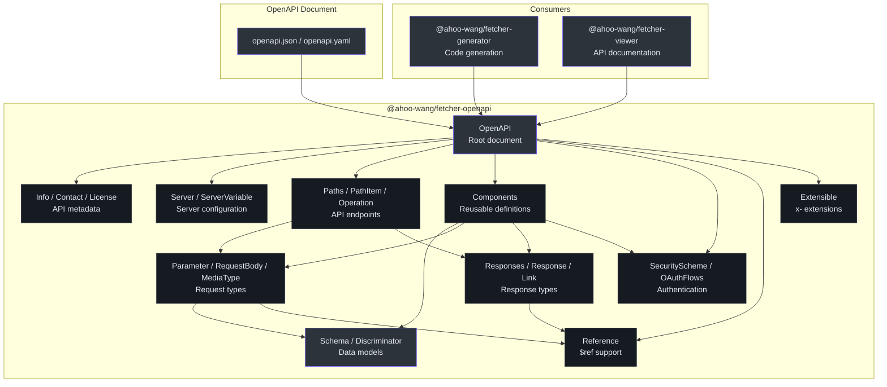
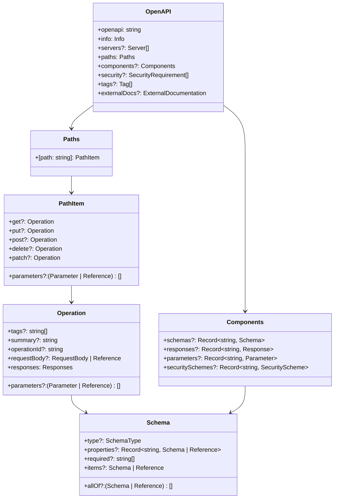
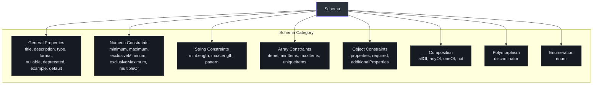
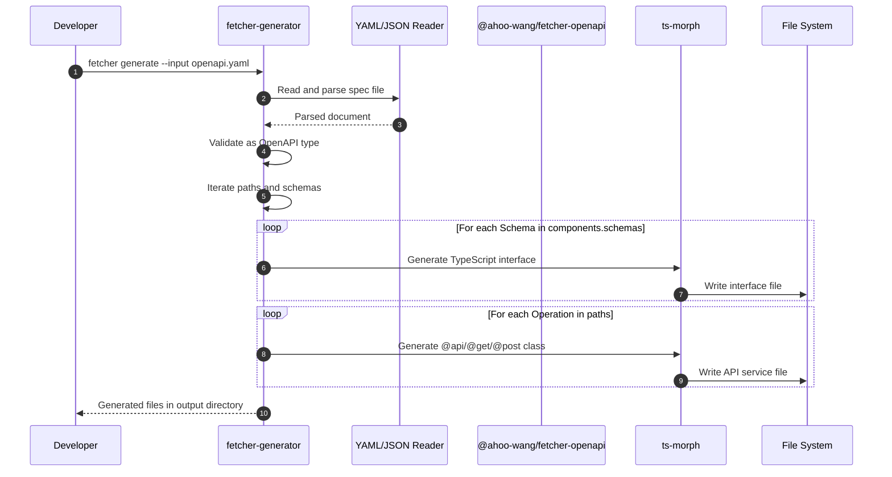
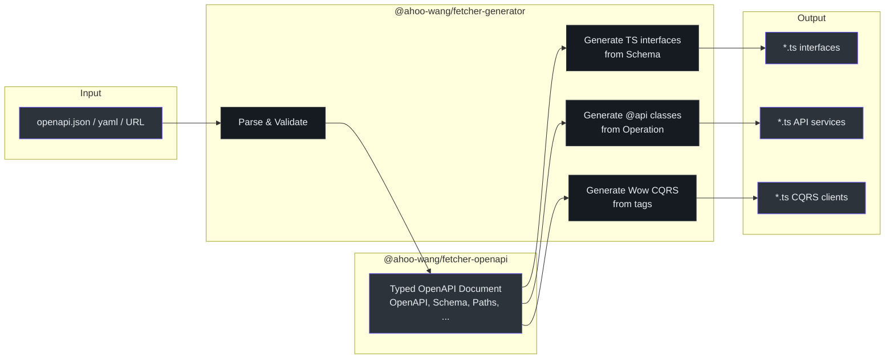

# @ahoo-wang/fetcher-openapi

`@ahoo-wang/fetcher-openapi` 包为 [OpenAPI 3.x 规范](https://spec.openapis.org/oas/v3.1.0) 提供全面的 TypeScript 类型定义。它**没有任何运行时依赖**，被 [generator](./generator.md) 包用于在生成类型安全的 API 客户端代码之前解析和验证 OpenAPI 文档。

**源码**: [`packages/openapi/src/`](https://github.com/Ahoo-Wang/fetcher/blob/main/packages/openapi/src/)

## 安装

```bash
pnpm add @ahoo-wang/fetcher-openapi
```

::: tip 独立包
此包没有对等依赖，也没有运行时代码。它仅导出 TypeScript 接口和类型，适用于任何处理 OpenAPI 文档的 TypeScript 项目。
:::

## 架构



## 类型层次结构



## 根文档（OpenAPI）

`OpenAPI` 接口表示根 OpenAPI 文档。([`openAPI.ts:41`](https://github.com/Ahoo-Wang/fetcher/blob/main/packages/openapi/src/openAPI.ts#L41))

```typescript
import type { OpenAPI } from '@ahoo-wang/fetcher-openapi';

const spec: OpenAPI = {
  openapi: '3.0.3',
  info: {
    title: 'My API',
    version: '1.0.0',
  },
  paths: {
    '/users': {
      get: {
        operationId: 'listUsers',
        parameters: [
          { name: 'limit', in: 'query', schema: { type: 'integer' } },
        ],
        responses: {
          '200': {
            description: 'Successful response',
            content: {
              'application/json': {
                schema: {
                  type: 'array',
                  items: { $ref: '#/components/schemas/User' },
                },
              },
            },
          },
        },
      },
    },
  },
  components: {
    schemas: {
      User: {
        type: 'object',
        required: ['id', 'name'],
        properties: {
          id: { type: 'integer', format: 'int64' },
          name: { type: 'string' },
          email: { type: 'string', format: 'email' },
        },
      },
    },
  },
};
```

## Schema 类型

`Schema` 接口是最复杂的类型，支持 OpenAPI 3.x 中使用的所有 JSON Schema 特性。([`schema.ts:91`](https://github.com/Ahoo-Wang/fetcher/blob/main/packages/openapi/src/schema.ts#L91))



### SchemaType

OpenAPI/JSON Schema 支持的原始类型：([`base-types.ts:44`](https://github.com/Ahoo-Wang/fetcher/blob/main/packages/openapi/src/base-types.ts#L44))

```typescript
type SchemaType = 'string' | 'number' | 'integer' | 'boolean' | 'array' | 'object' | 'null';
```

### 关键 Schema 属性

| 属性 | 类型 | 描述 |
|----------|------|-------------|
| `type` | `SchemaType \| SchemaType[]` | 数据类型 |
| `format` | `string` | 扩展格式（如 `int64`、`date-time`、`email`） |
| `properties` | `Record<string, Schema \| Reference>` | 对象属性 |
| `required` | `string[]` | 必填属性名 |
| `items` | `Schema \| Reference` | 数组项的 Schema |
| `allOf` | `(Schema \| Reference)[]` | 必须匹配所有 Schema |
| `anyOf` | `(Schema \| Reference)[]` | 匹配任一 Schema |
| `oneOf` | `(Schema \| Reference)[]` | 精确匹配一个 Schema |
| `enum` | `any[]` | 允许的值 |
| `nullable` | `boolean` | 是否允许 null |
| `discriminator` | `Discriminator` | 多态支持 |

## Paths 和 Operations

### PathItem

描述单个 URL 路径上可用的操作。支持所有 HTTP 方法。([`paths.ts:76`](https://github.com/Ahoo-Wang/fetcher/blob/main/packages/openapi/src/paths.ts#L76))

| 属性 | 类型 | 描述 |
|----------|------|-------------|
| `get` | `Operation` | GET 操作 |
| `put` | `Operation` | PUT 操作 |
| `post` | `Operation` | POST 操作 |
| `delete` | `Operation` | DELETE 操作 |
| `patch` | `Operation` | PATCH 操作 |
| `head` | `Operation` | HEAD 操作 |
| `options` | `Operation` | OPTIONS 操作 |
| `trace` | `Operation` | TRACE 操作 |
| `parameters` | `(Parameter \| Reference)[]` | 所有操作共享的参数 |

### Operation

描述单个 API 操作。([`paths.ts:44`](https://github.com/Ahoo-Wang/fetcher/blob/main/packages/openapi/src/paths.ts#L44))

| 属性 | 类型 | 描述 |
|----------|------|-------------|
| `operationId` | `string` | 唯一操作标识符 |
| `tags` | `string[]` | 文档标签 |
| `summary` | `string` | 简要摘要 |
| `description` | `string` | 详细描述 |
| `parameters` | `(Parameter \| Reference)[]` | 操作参数 |
| `requestBody` | `RequestBody \| Reference` | 请求体定义 |
| `responses` | `Responses` | 可能的响应 |
| `deprecated` | `boolean` | 该操作是否已弃用 |
| `security` | `SecurityRequirement[]` | 安全要求 |
| `callbacks` | `Record<string, Callback \| Reference>` | 带外回调 |

## Parameters 和 Request Bodies

### Parameter

描述单个操作参数。([`parameters.ts:40`](https://github.com/Ahoo-Wang/fetcher/blob/main/packages/openapi/src/parameters.ts#L40))

| 属性 | 类型 | 描述 |
|----------|------|-------------|
| `name` | `string` | 参数名 |
| `in` | `ParameterLocation` | 位置：`query`、`header`、`path` 或 `cookie` |
| `required` | `boolean` | 参数是否必填 |
| `schema` | `Schema \| Reference` | 参数 Schema |
| `description` | `string` | 参数描述 |
| `deprecated` | `boolean` | 参数是否已弃用 |

```typescript
type ParameterLocation = 'query' | 'header' | 'path' | 'cookie';
```

### RequestBody

| 属性 | 类型 | 描述 |
|----------|------|-------------|
| `content` | `Record<string, MediaType>` | 媒体类型映射 |
| `required` | `boolean` | 请求体是否必填 |
| `description` | `string` | 请求体描述 |

### MediaType

| 属性 | 类型 | 描述 |
|----------|------|-------------|
| `schema` | `Schema \| Reference` | 此媒体类型的 Schema |
| `example` | `any` | 示例值 |
| `examples` | `Record<string, Example \| Reference>` | 命名示例 |
| `encoding` | `Record<string, Encoding>` | 编码信息 |

## Responses

### Response

描述 API 操作的单个响应。([`responses.ts:52`](https://github.com/Ahoo-Wang/fetcher/blob/main/packages/openapi/src/responses.ts#L52))

| 属性 | 类型 | 描述 |
|----------|------|-------------|
| `description` | `string` | 响应描述 |
| `headers` | `Record<string, Header \| Reference>` | 响应头 |
| `content` | `Record<string, MediaType>` | 响应体媒体类型 |
| `links` | `Record<string, Link \| Reference>` | 后续操作链接 |

### Responses

一个将 HTTP 状态码映射到 Response 对象的容器：

```typescript
interface Responses {
  default?: Response | Reference;   // 回退响应
  [httpCode: string]: Response | Reference | undefined;  // 如 "200"、"404"、"500"
}
```

## Components

`Components` 对象保存可通过 `$ref` 在整个文档中引用的可复用定义。([`components.ts:42`](https://github.com/Ahoo-Wang/fetcher/blob/main/packages/openapi/src/components.ts#L42))

| 属性 | 类型 | 描述 |
|----------|------|-------------|
| `schemas` | `Record<string, Schema>` | 可复用的数据模型 |
| `responses` | `Record<string, Response>` | 可复用的响应定义 |
| `parameters` | `Record<string, Parameter>` | 可复用的参数 |
| `requestBodies` | `Record<string, RequestBody>` | 可复用的请求体 |
| `headers` | `Record<string, Header \| Reference>` | 可复用的请求头 |
| `securitySchemes` | `Record<string, SecurityScheme>` | 可复用的安全方案 |
| `links` | `Record<string, Link>` | 可复用的链接 |
| `callbacks` | `Record<string, Callback>` | 可复用的回调 |
| `examples` | `Record<string, Example \| Reference>` | 可复用的示例 |

## References

`Reference` 类型支持基于 JSON Pointer 的引用（`$ref`），指向可复用的组件。([`reference.ts:23`](https://github.com/Ahoo-Wang/fetcher/blob/main/packages/openapi/src/reference.ts#L23))

```typescript
interface Reference {
  $ref: string;
}

// 在 Schema 中使用
const userRef: Reference = { $ref: '#/components/schemas/User' };
const responseRef: Reference = { $ref: '#/components/responses/NotFound' };
```

`IsReference<T>` 工具类型帮助区分引用和内联定义：

```typescript
type IsReference<T> = T extends { $ref: string } ? T : never;
```

## Security

### SecurityScheme

支持四种认证类型：([`security.ts:63`](https://github.com/Ahoo-Wang/fetcher/blob/main/packages/openapi/src/security.ts#L63))

| 类型 | 描述 | 附加属性 |
|------|-------------|----------------------|
| `apiKey` | 位于 header、query 或 cookie 中的 API 密钥 | `name`、`in` |
| `http` | HTTP 认证 | `scheme`、`bearerFormat` |
| `oauth2` | OAuth 2.0 | `flows`（OAuthFlows） |
| `openIdConnect` | OpenID Connect | `openIdConnectUrl` |

### OAuthFlows

| 属性 | 类型 | 描述 |
|----------|------|-------------|
| `implicit` | `OAuthFlow` | 隐式授权流程 |
| `password` | `OAuthFlow` | 资源所有者密码流程 |
| `clientCredentials` | `OAuthFlow` | 客户端凭证流程 |
| `authorizationCode` | `OAuthFlow` | 授权码流程 |

## 扩展支持（Extensible）

大多数类型都扩展了 `Extensible` 接口，允许使用 `x-` 前缀的自定义属性：([`extensions.ts:22`](https://github.com/Ahoo-Wang/fetcher/blob/main/packages/openapi/src/extensions.ts#L22))

```typescript
interface Extensible {
  [extension: `x-${string}`]: any;
}

// 使用示例
const operation: Operation = {
  responses: { '200': { description: 'OK' } },
  'x-rate-limit': 100,
  'x-cache-ttl': 300,
};
```

## Generator 如何使用此包

[generator](./generator.md) 包读取 OpenAPI 文档并将其类型映射为 TypeScript 代码：





从 OpenAPI 构造到生成的 TypeScript 的映射：

| OpenAPI 构造 | 生成的 TypeScript |
|-------------------|---------------------|
| `components.schemas.*` | TypeScript `interface` 或 `enum` |
| `paths.*.get/post/put/delete` | `@get/@post/@put/@del` 装饰的方法 |
| `in: path` 的 `parameters` | `@path()` 参数 |
| `in: query` 的 `parameters` | `@query()` 参数 |
| `in: header` 的 `parameters` | `@header()` 参数 |
| `requestBody` | `@body()` 参数 |
| `responses.200.content.application/json.schema` | 返回类型 |

## 导出 API 总结

| 导出 | 类型 | 源码文件 |
|--------|------|------------|
| `OpenAPI` | 接口 | [`openAPI.ts`](https://github.com/Ahoo-Wang/fetcher/blob/main/packages/openapi/src/openAPI.ts) |
| `Schema` | 接口 | [`schema.ts`](https://github.com/Ahoo-Wang/fetcher/blob/main/packages/openapi/src/schema.ts) |
| `Discriminator` | 接口 | [`schema.ts`](https://github.com/Ahoo-Wang/fetcher/blob/main/packages/openapi/src/schema.ts) |
| `Paths` | 接口 | [`paths.ts`](https://github.com/Ahoo-Wang/fetcher/blob/main/packages/openapi/src/paths.ts) |
| `PathItem` | 接口 | [`paths.ts`](https://github.com/Ahoo-Wang/fetcher/blob/main/packages/openapi/src/paths.ts) |
| `Operation` | 接口 | [`paths.ts`](https://github.com/Ahoo-Wang/fetcher/blob/main/packages/openapi/src/paths.ts) |
| `Parameter` | 接口 | [`parameters.ts`](https://github.com/Ahoo-Wang/fetcher/blob/main/packages/openapi/src/parameters.ts) |
| `RequestBody` | 接口 | [`parameters.ts`](https://github.com/Ahoo-Wang/fetcher/blob/main/packages/openapi/src/parameters.ts) |
| `MediaType` | 接口 | [`parameters.ts`](https://github.com/Ahoo-Wang/fetcher/blob/main/packages/openapi/src/parameters.ts) |
| `Responses` | 接口 | [`responses.ts`](https://github.com/Ahoo-Wang/fetcher/blob/main/packages/openapi/src/responses.ts) |
| `Response` | 接口 | [`responses.ts`](https://github.com/Ahoo-Wang/fetcher/blob/main/packages/openapi/src/responses.ts) |
| `Components` | 接口 | [`components.ts`](https://github.com/Ahoo-Wang/fetcher/blob/main/packages/openapi/src/components.ts) |
| `Reference` | 接口 | [`reference.ts`](https://github.com/Ahoo-Wang/fetcher/blob/main/packages/openapi/src/reference.ts) |
| `SecurityScheme` | 接口 | [`security.ts`](https://github.com/Ahoo-Wang/fetcher/blob/main/packages/openapi/src/security.ts) |
| `OAuthFlows` | 接口 | [`security.ts`](https://github.com/Ahoo-Wang/fetcher/blob/main/packages/openapi/src/security.ts) |
| `Info` | 接口 | [`info.ts`](https://github.com/Ahoo-Wang/fetcher/blob/main/packages/openapi/src/info.ts) |
| `Server` | 接口 | [`server.ts`](https://github.com/Ahoo-Wang/fetcher/blob/main/packages/openapi/src/server.ts) |
| `Tag` | 接口 | [`tags.ts`](https://github.com/Ahoo-Wang/fetcher/blob/main/packages/openapi/src/tags.ts) |
| `Extensible` | 接口 | [`extensions.ts`](https://github.com/Ahoo-Wang/fetcher/blob/main/packages/openapi/src/extensions.ts) |
| `SchemaType` | 类型 | [`base-types.ts`](https://github.com/Ahoo-Wang/fetcher/blob/main/packages/openapi/src/base-types.ts) |
| `ParameterLocation` | 类型 | [`base-types.ts`](https://github.com/Ahoo-Wang/fetcher/blob/main/packages/openapi/src/base-types.ts) |
| `HTTPMethod` | 类型 | [`base-types.ts`](https://github.com/Ahoo-Wang/fetcher/blob/main/packages/openapi/src/base-types.ts) |

## 相关页面

- [Generator](./generator.md) - 使用此包生成 TypeScript API 客户端
- [Viewer](./viewer.md) - 使用这些类型进行 API 文档渲染
- [Decorator](./decorator.md) - 生成的代码使用这些装饰器
- [包概览](./index.md) - 生态系统中的所有包
