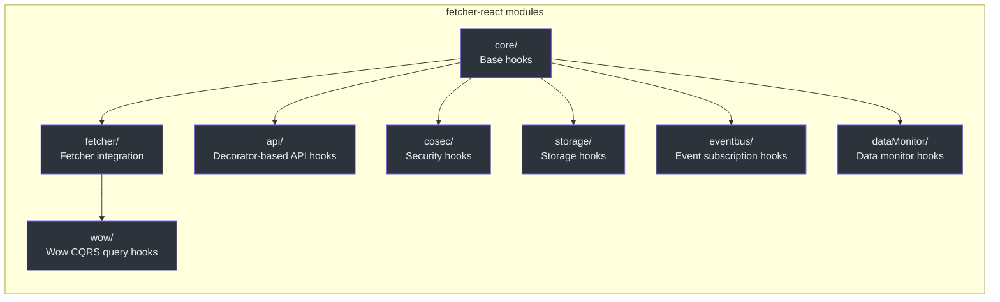
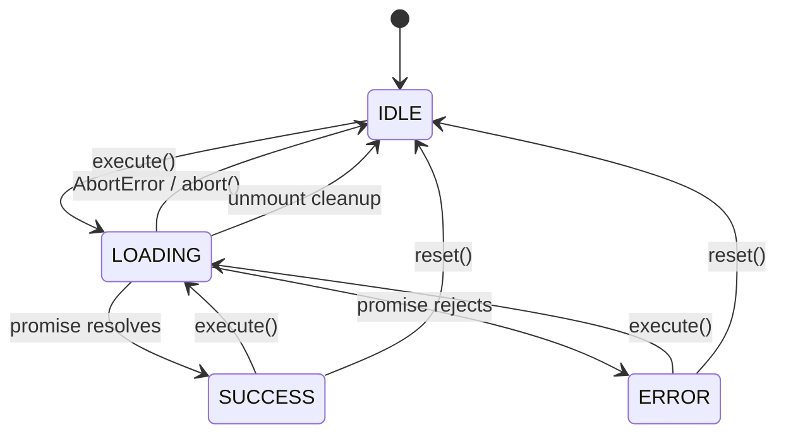
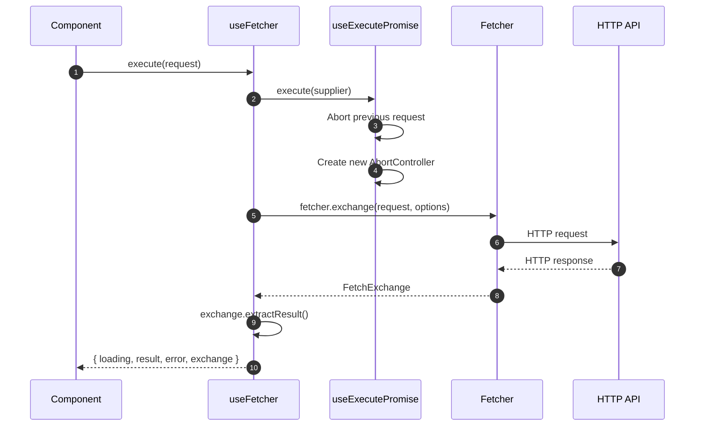
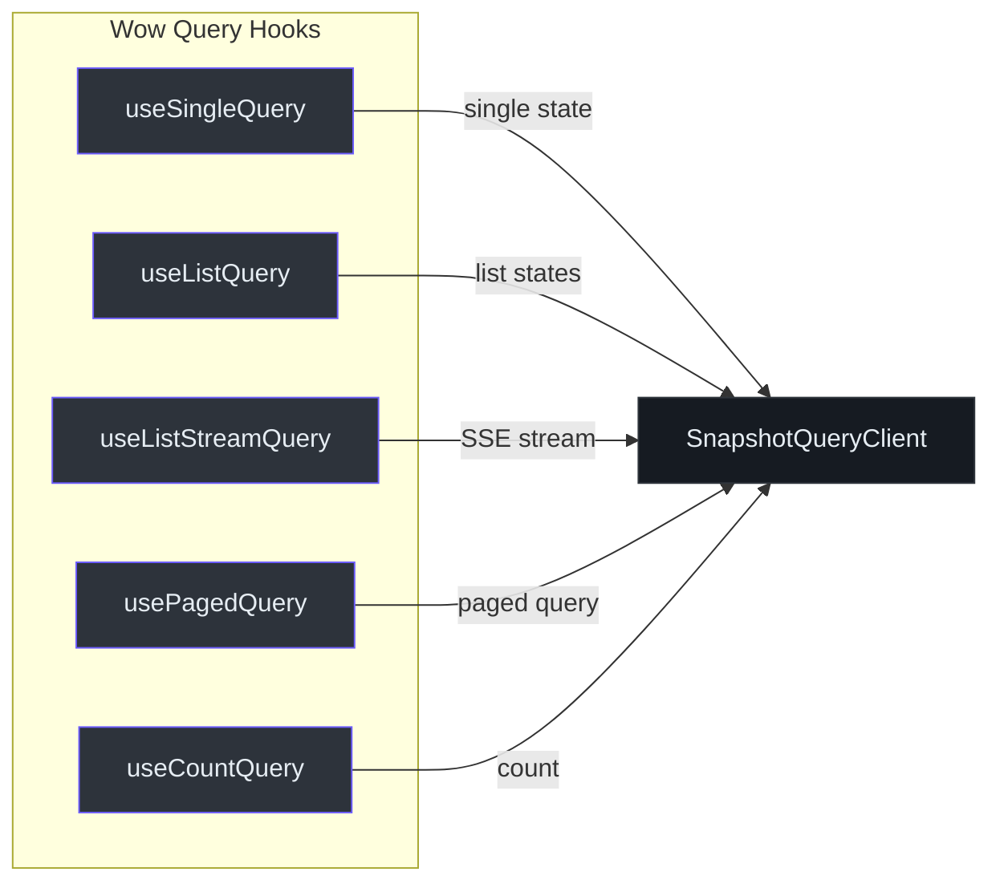

# @ahoo-wang/fetcher-react

`@ahoo-wang/fetcher-react` 包提供了一套全面的 React Hooks，用于封装 Fetcher HTTP 客户端生态系统。它提供了声明式数据获取、自动加载/错误状态管理、竞态条件保护、AbortController 集成、防抖查询，以及与 [Wow](./wow.md)、[CoSec](./cosec.md)、[EventBus](./eventbus.md) 和 [Storage](./storage.md) 的深度集成。

## 安装

```bash
pnpm add @ahoo-wang/fetcher-react
```

## 模块结构



来源: [packages/react/src/index.ts](https://github.com/Ahoo-Wang/fetcher/blob/main/packages/react/src/index.ts)

## 核心 Hooks

### usePromiseState

管理 Promise 生命周期状态的基础 Hook，不包含执行逻辑。追踪 `idle`、`loading`、`success` 和 `error` 状态。

```typescript
import { usePromiseState, PromiseStatus } from '@ahoo-wang/fetcher-react';

function MyComponent() {
  const { status, loading, result, error, setSuccess, setError, setIdle } =
    usePromiseState<string>();

  return (
    <div>
      <p>Status: {status}</p>
      {loading && <p>Loading...</p>}
      {result && <p>Result: {result}</p>}
      {error && <p>Error: {error.message}</p>}
    </div>
  );
}
```

| 属性 | 类型 | 描述 |
|------|------|------|
| `status` | `PromiseStatus` | 当前状态（`idle`、`loading`、`success`、`error`） |
| `loading` | `boolean` | 当状态为 `loading` 时为 `true` |
| `result` | `R \| undefined` | 成功解析的值 |
| `error` | `E \| undefined` | 拒绝时的错误 |
| `setLoading()` | `() => void` | 切换到加载状态 |
| `setSuccess(result)` | `(result: R) => Promise<void>` | 切换到成功状态并执行回调 |
| `setError(error)` | `(error: E) => Promise<void>` | 切换到错误状态并执行回调 |
| `setIdle()` | `() => void` | 重置为空闲状态 |

来源: [packages/react/src/core/usePromiseState.ts:119-190](https://github.com/Ahoo-Wang/fetcher/blob/main/packages/react/src/core/usePromiseState.ts#L119-L190)

### useExecutePromise

在 `usePromiseState` 基础上扩展了 Promise 执行功能，包括自动中止支持、通过请求 ID 实现的竞态条件保护，以及挂载安全性检查。

```typescript
import { useExecutePromise } from '@ahoo-wang/fetcher-react';

function DataFetcher() {
  const { loading, result, error, execute, reset, abort } =
    useExecutePromise<string>();

  const fetch = () =>
    execute(async (abortController) => {
      const response = await fetch('/api/data', { signal: abortController.signal });
      return response.text();
    });

  return (
    <div>
      <button onClick={fetch}>Fetch</button>
      <button onClick={abort}>Cancel</button>
      {loading && <p>Loading...</p>}
      {result && <p>{result}</p>}
    </div>
  );
}
```



主要特性：

- **自动中止** -- 在开始新请求前取消任何正在进行的请求
- **手动中止** -- 专用的 `abort()` 方法，支持 `onAbort` 回调
- **竞态条件保护** -- 请求 ID 防止过期更新
- **挂载安全** -- 卸载后不再更新状态

来源: [packages/react/src/core/useExecutePromise.ts:210-334](https://github.com/Ahoo-Wang/fetcher/blob/main/packages/react/src/core/useExecutePromise.ts#L210-L334)

### useQuery

将 `useExecutePromise` 与查询参数管理相结合。支持查询参数变化时自动执行。

```typescript
import { useQuery } from '@ahoo-wang/fetcher-react';

function UserComponent() {
  const { loading, result, execute, setQuery } = useQuery<UserQuery, User>({
    initialQuery: { id: '1' },
    execute: async (query) => {
      const res = await fetch(`/api/users/${query.id}`);
      return res.json();
    },
    autoExecute: true,
  });

  const handleChange = (userId: string) => {
    setQuery({ id: userId }); // auto-executes when autoExecute is true
  };

  return <div>{loading ? <p>Loading...</p> : <p>{result?.name}</p>}</div>;
}
```

来源: [packages/react/src/core/useQuery.ts:105-173](https://github.com/Ahoo-Wang/fetcher/blob/main/packages/react/src/core/useQuery.ts#L105-L173)

## Fetcher 集成 Hooks

### useFetcher

用于 HTTP 获取操作的主要 Hook。封装了 Fetcher 客户端，提供自动中止、竞态条件保护和全面的状态管理。



```typescript
import { useFetcher } from '@ahoo-wang/fetcher-react';

function UserProfile({ userId }: { userId: string }) {
  const { loading, result, error, execute } = useFetcher<User>({
    resultExtractor: ResultExtractors.Json,
  });

  useEffect(() => {
    execute({ url: `/api/users/${userId}`, method: 'GET' });
  }, [userId]);

  if (loading) return <p>Loading...</p>;
  if (error) return <p>Error: {error.message}</p>;
  return <p>{result?.name}</p>;
}
```

| 属性 | 类型 | 描述 |
|------|------|------|
| `exchange` | `FetchExchange \| undefined` | 当前/最近的 fetch 交换对象，包含请求/响应详情 |
| `execute(request)` | `(request: FetchRequest) => Promise<void>` | 执行 fetch 请求并自动中止之前的请求 |
| 继承自 `useExecutePromise` | -- | `loading`、`result`、`error`、`status`、`reset`、`abort` |

来源: [packages/react/src/fetcher/useFetcher.ts:162-226](https://github.com/Ahoo-Wang/fetcher/blob/main/packages/react/src/fetcher/useFetcher.ts#L162-L226)

### useFetcherQuery

更高层次的 Hook，将 `useFetcher` 与基于 POST 的查询语义相结合。将查询参数作为请求体发送，并支持自动执行。

```typescript
import { useFetcherQuery } from '@ahoo-wang/fetcher-react';

interface SearchQuery { keyword: string; limit: number; }
interface SearchResult { items: Item[]; total: number; }

function SearchComponent() {
  const { loading, result, execute, setQuery } = useFetcherQuery<SearchQuery, SearchResult>({
    url: '/api/search',
    initialQuery: { keyword: '', limit: 10 },
    autoExecute: false,
  });

  const handleSearch = (keyword: string) => {
    setQuery({ keyword, limit: 10 }); // auto-executes if autoExecute was true
  };

  return <div>{loading ? <p>Searching...</p> : <p>Found {result?.total} items</p>}</div>;
}
```

来源: [packages/react/src/fetcher/useFetcherQuery.ts:125-192](https://github.com/Ahoo-Wang/fetcher/blob/main/packages/react/src/fetcher/useFetcherQuery.ts#L125-L192)

### 防抖变体

对于搜索即输即查的场景，防抖变体会延迟执行直到输入稳定：

| Hook | 基础 Hook | 描述 |
|------|-----------|------|
| `useDebouncedCallback` | -- | 通过可配置的延迟对任意回调进行防抖 |
| `useDebouncedExecutePromise` | `useExecutePromise` | 防抖的 Promise 执行 |
| `useDebouncedQuery` | `useQuery` | 带自动执行的防抖查询 |
| `useDebouncedFetcher` | `useFetcher` | 防抖的 Fetcher 执行 |
| `useDebouncedFetcherQuery` | `useFetcherQuery` | 防抖的 POST 查询 |

来源: [packages/react/src/core/debounced/](https://github.com/Ahoo-Wang/fetcher/blob/main/packages/react/src/core/debounced/)

## API Hooks 自动生成

无需为每个 API 方法手动编写 `useExecutePromise` / `useQuery` 包装器，使用工厂函数即可从任何装饰器 API 服务类自动生成类型安全的 Hook。这些工厂会内省类、收集所有返回 Promise 的方法，并为每个方法创建 `useXxx` Hook——具有完整的参数和返回类型推断。

| 工厂 | Hook 基类 | 适用场景 |
|------|---------|---------|
| `createExecuteApiHooks` | `useExecutePromise` | 变更/命令方法（POST、PUT、DELETE）——手动触发 |
| `createQueryApiHooks` | `useQuery` | 查询方法（GET）——挂载/参数变化时自动执行 |

### 创建执行 Hook（变更）

```typescript
import { createExecuteApiHooks } from '@ahoo-wang/fetcher-react';
import { UserService } from './UserService'; // 使用 @api 装饰

// 自动生成 useCreateUser、useUpdateUser、useDeleteUser...
const userExecuteHooks = createExecuteApiHooks({ api: new UserService({ fetcher }) });

// 在组件中——参数和返回值的完整类型推断
function CreateUserForm() {
  const { result, loading, error, execute } = userExecuteHooks.useCreateUser();

  const handleSubmit = async (data: UserDTO) => {
    // 参数根据方法签名进行类型检查
    await execute(data);
  };

  return <button onClick={() => handleSubmit({ name: 'Alice' })}>创建</button>;
}
```

### 创建查询 Hook（读取）

```typescript
import { createQueryApiHooks } from '@ahoo-wang/fetcher-react';

// 自动生成 useGetUser、useListUsers、useSearchUsers...
const userQueryHooks = createQueryApiHooks({ api: new UserService({ fetcher }) });

function UserProfile({ userId }: { userId: string }) {
  // 挂载时和 userId 变化时自动执行
  const { result: user, loading, error } = userQueryHooks.useGetUser({ query: { id: userId } });

  if (loading) return <Spinner />;
  if (error) return <ErrorView error={error} />;
  return <div>{user?.name}</div>;
}
```

### 命名约定

`methodNameToHookName` 通过添加 `use` 前缀并大写首字母，将方法名转换为 Hook 名：

| 方法名 | 生成的 Hook |
|--------|------------|
| `getUser` | `useGetUser` |
| `createPost` | `useCreatePost` |
| `deleteById` | `useDeleteById` |

源码: [packages/react/src/api/](https://github.com/Ahoo-Wang/fetcher/blob/main/packages/react/src/api/createExecuteApiHooks.ts)

## Wow CQRS Hooks

对于使用 [Wow](./wow.md) 框架的应用程序，专用 Hook 提供了对聚合查询操作的类型化访问：



| Hook | 描述 |
|------|------|
| `useSingleQuery` | 获取单个聚合快照 |
| `useListQuery` | 获取聚合快照列表 |
| `useListStreamQuery` | 以 SSE 流形式获取聚合快照 |
| `usePagedQuery` | 获取分页聚合快照 |
| `useCountQuery` | 统计符合条件的聚合数量 |

基于 Fetcher 的变体（`useFetcherSingleQuery`、`useFetcherListQuery` 等）将这些与 fetcher Hook 结合，用于直接 HTTP 集成。

来源: [packages/react/src/wow/](https://github.com/Ahoo-Wang/fetcher/blob/main/packages/react/src/wow/)

## CoSec 集成

用于使用 [CoSec](./cosec.md) 认证的应用程序的安全相关 Hook：

| Hook / 组件 | 描述 |
|-------------|------|
| `useSecurity` | 访问当前认证状态（`authenticated`、`currentUser`） |
| `SecurityContext` | 向子组件提供 CoSec 安全状态的 React Context |
| `RouteGuard` | 路由守卫组件，重定向未认证用户 |
| `RefreshableRouteGuard` | 在重定向前尝试刷新令牌的路由守卫 |

来源: [packages/react/src/cosec/](https://github.com/Ahoo-Wang/fetcher/blob/main/packages/react/src/cosec/)

## Storage Hooks

[Storage](./storage.md) 包的 React 绑定：

| Hook | 描述 |
|------|------|
| `useKeyStorage<T>` | 对 `KeyStorage<T>` 实例的响应式绑定。返回 `[value, setValue, remove]` 元组。存储变化时自动重新渲染。 |
| `useImmerKeyStorage<T>` | 类似 `useKeyStorage`，但接受 Immer 风格的草稿变更 |

来源: [packages/react/src/storage/](https://github.com/Ahoo-Wang/fetcher/blob/main/packages/react/src/storage/)

## EventBus 集成

| Hook | 描述 |
|------|------|
| `useEventSubscription` | 订阅事件总线的类型化事件，组件卸载时自动清理 |

来源: [packages/react/src/eventbus/useEventSubscription.ts](https://github.com/Ahoo-Wang/fetcher/blob/main/packages/react/src/eventbus/useEventSubscription.ts)

## 通知系统

基于通道的通知系统：

- `NotificationCenter` -- 管理通知分发
- `BrowserNotificationChannel` -- 显示原生浏览器通知
- 可通过自定义 `NotificationChannel` 实现进行扩展

来源: [packages/react/src/notification/](https://github.com/Ahoo-Wang/fetcher/blob/main/packages/react/src/notification/)

## 工具 Hooks

| Hook | 描述 |
|------|------|
| `useMounted` | 返回一个函数，用于检查组件是否仍然挂载 |
| `useLatest<T>` | 始终持有最新值的 Ref（避免闭包过期） |
| `useForceUpdate` | 返回一个函数，用于强制组件重新渲染 |
| `useFullscreen` | 管理容器元素的全屏状态 |

来源: [packages/react/src/core/](https://github.com/Ahoo-Wang/fetcher/blob/main/packages/react/src/core/)

## 主要导出

| 导出 | 来源 | 描述 |
|------|------|------|
| `usePromiseState` | `core/` | Promise 生命周期的基础状态管理 |
| `useExecutePromise` | `core/` | 带中止和竞态条件保护的 Promise 执行 |
| `useQuery` | `core/` | 带自动执行的基于查询的异步操作 |
| `useFetcher` | `fetcher/` | 通过 Fetcher 客户端进行 HTTP 获取操作 |
| `useFetcherQuery` | `fetcher/` | 通过 Fetcher 的基于 POST 的查询 |
| `PromiseStatus` | `core/` | 枚举：`IDLE`、`LOADING`、`SUCCESS`、`ERROR` |
| `useKeyStorage` | `storage/` | 响应式存储绑定 |
| `useEventSubscription` | `eventbus/` | 带自动清理的事件总线订阅 |

## 交叉引用

- **[Fetcher](./fetcher.md)** -- `useFetcher` 和 `useFetcherQuery` 使用的核心 HTTP 客户端
- **[Wow](./wow.md)** -- Wow 查询 Hook（`useSingleQuery`、`usePagedQuery` 等）面向 Wow 聚合快照
- **[CoSec](./cosec.md)** -- `useSecurity`、`RouteGuard` Hook 消费 CoSec 认证状态
- **[Storage](./storage.md)** -- `useKeyStorage` 响应式绑定到 `KeyStorage` 实例
- **[EventBus](./eventbus.md)** -- `useEventSubscription` 订阅类型化事件总线
