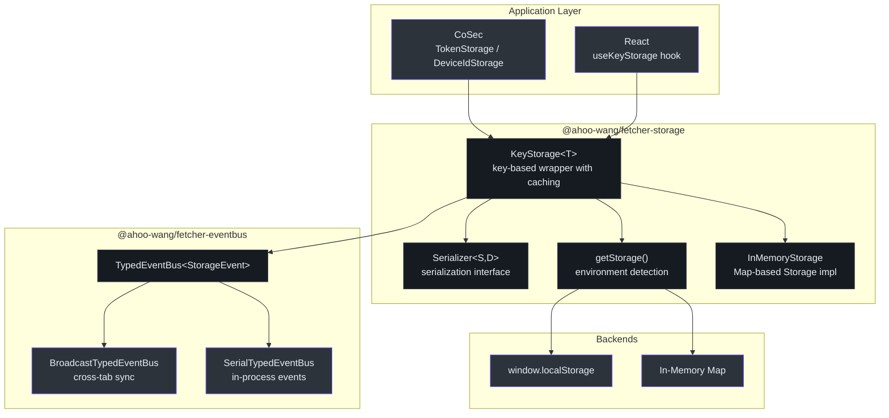
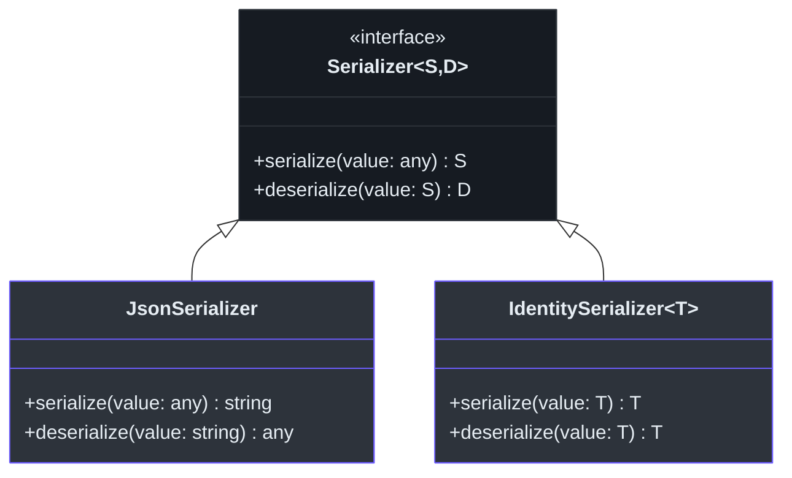
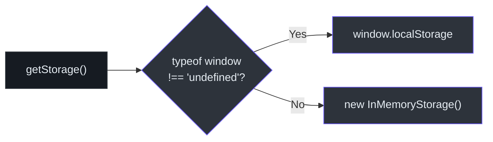

# @ahoo-wang/fetcher-storage

`@ahoo-wang/fetcher-storage` 包提供了一个基于键的存储抽象，封装了浏览器 `Storage` API，支持序列化、缓存、通过 EventBus 的变更通知以及环境感知的后端选择。它被 [CoSec](./cosec.md) 用于令牌和设备 ID 持久化，也被 [React](./react.md) Hooks 用于响应式状态存储。

## 安装

```bash
pnpm add @ahoo-wang/fetcher-storage
```

## 架构



## KeyStorage

核心类，管理与特定存储键关联的单个值。提供缓存、序列化和变更通知功能。

```typescript
import { KeyStorage, jsonSerializer } from '@ahoo-wang/fetcher-storage';

// Create a key storage for user preferences
const prefsStorage = new KeyStorage<UserPrefs>({
  key: 'user-preferences',
  serializer: jsonSerializer,
  defaultValue: { theme: 'light', language: 'en' },
});

// Read with caching
const prefs = prefsStorage.get();

// Write with notification
prefsStorage.set({ theme: 'dark', language: 'en' });

// Listen for changes (including cross-tab)
const removeListener = prefsStorage.addListener({
  name: 'prefs-changed',
  handle: (event) => {
    console.log('Preference changed:', event.newValue);
  },
});

// Cleanup
prefsStorage.destroy();
```

### KeyStorage API

| 方法 | 描述 |
|------|------|
| `get(): T \| null` | 获取缓存或反序列化的值。当存储为空时返回 `defaultValue`。 |
| `set(value: T): void` | 序列化、存储、更新缓存，并发出变更事件 |
| `remove(): void` | 从存储中移除，清除缓存，并发出移除事件 |
| `addListener(handler): RemoveFn` | 注册变更监听器。返回一个用于取消订阅的函数。 |
| `destroy(): void` | 清理内部事件处理器以防止内存泄漏 |

### KeyStorageOptions

| 选项 | 类型 | 默认值 | 描述 |
|------|------|--------|------|
| `key` | `string` | （必填） | 值的存储键 |
| `serializer` | `Serializer<string, T>` | `jsonSerializer` | 序列化策略 |
| `storage` | `Storage` | `getStorage()` | 后端存储（自动检测） |
| `eventBus` | `TypedEventBus<StorageEvent<T>>` | `SerialTypedEventBus` | 变更通知总线 |
| `defaultValue` | `T \| null` | `null` | 键缺失时的默认值 |

来源: [packages/storage/src/keyStorage.ts:80-235](https://github.com/Ahoo-Wang/fetcher/blob/main/packages/storage/src/keyStorage.ts#L80-L235)

## 序列化器



| 序列化器 | 输入 | 输出 | 使用场景 |
|----------|------|------|----------|
| `JsonSerializer` | 任意值 | `string`（JSON） | 对象、数组、复杂类型。`KeyStorage` 的默认序列化器。 |
| `IdentitySerializer<T>` | `T` | `T` | 无需转换的字符串值 |

预构建的单例：

- `jsonSerializer` -- 全局 `JsonSerializer` 实例
- `identitySerializer` -- 全局 `IdentitySerializer<any>` 实例
- `typedIdentitySerializer<T>()` -- 类型化恒等序列化器工厂

来源: [packages/storage/src/serializer.ts](https://github.com/Ahoo-Wang/fetcher/blob/main/packages/storage/src/serializer.ts)

## 环境检测

`getStorage()` 函数自动选择合适的存储后端：



- **浏览器环境** -- 使用 `window.localStorage` 实现页面重载间的持久化存储
- **非浏览器环境**（Node.js、SSR、测试） -- 回退到 `InMemoryStorage`，即 `Storage` 接口的基于 `Map` 的实现

来源: [packages/storage/src/env.ts](https://github.com/Ahoo-Wang/fetcher/blob/main/packages/storage/src/env.ts)

## InMemoryStorage

用于非浏览器环境的基于 `Map` 的浏览器 `Storage` 接口实现：

| 方法 | 描述 |
|------|------|
| `getItem(key)` | 从 Map 中返回值，不存在时返回 `null` |
| `setItem(key, value)` | 在 Map 中设置值 |
| `removeItem(key)` | 从 Map 中移除 |
| `clear()` | 清除所有条目 |
| `key(index)` | 返回给定索引处的键 |
| `length` | 返回存储项的数量 |

来源: [packages/storage/src/inMemoryStorage.ts](https://github.com/Ahoo-Wang/fetcher/blob/main/packages/storage/src/inMemoryStorage.ts)

## 变更通知

`KeyStorage` 与 [EventBus](./eventbus.md) 包集成以发出变更事件。默认情况下，使用 `SerialTypedEventBus` 进行进程内通知。消费者可以通过提供 `BroadcastTypedEventBus` 来选择加入跨标签页同步：

```typescript
import { KeyStorage } from '@ahoo-wang/fetcher-storage';
import { BroadcastTypedEventBus, SerialTypedEventBus } from '@ahoo-wang/fetcher-eventbus';

const storage = new KeyStorage<string>({
  key: 'shared-key',
  eventBus: new BroadcastTypedEventBus({
    delegate: new SerialTypedEventBus('shared-key'),
  }),
});
```

`StorageEvent<T>` 载荷包含 `newValue` 和 `oldValue`：

```typescript
interface StorageEvent<Deserialized> {
  newValue?: Deserialized | null;
  oldValue?: Deserialized | null;
}
```

来源: [packages/storage/src/keyStorage.ts:23-26](https://github.com/Ahoo-Wang/fetcher/blob/main/packages/storage/src/keyStorage.ts#L23-L26)

## 其他包的使用

### CoSec TokenStorage

[CoSec](./cosec.md) 扩展了 `KeyStorage`，用于带跨标签页同步的 JWT 令牌管理：

```typescript
import { TokenStorage } from '@ahoo-wang/fetcher-cosec';

const tokenStorage = new TokenStorage({
  key: 'cosec-token',
  earlyPeriod: 300000, // 5 minutes
  eventBus: new BroadcastTypedEventBus({
    delegate: new SerialTypedEventBus('cosec-token'),
  }),
});
```

### CoSec DeviceIdStorage

使用恒等序列化进行设备 ID 持久化：

```typescript
import { DeviceIdStorage } from '@ahoo-wang/fetcher-cosec';

const deviceStorage = new DeviceIdStorage();
const deviceId = deviceStorage.getOrCreate();
```

### React useKeyStorage Hook

[React](./react.md) 提供了响应式绑定：

```tsx
import { useKeyStorage } from '@ahoo-wang/fetcher-react';
import { KeyStorage } from '@ahoo-wang/fetcher-storage';

const themeStorage = new KeyStorage<string>({ key: 'theme', defaultValue: 'light' });

function ThemeToggle() {
  const [theme, setTheme] = useKeyStorage(themeStorage);
  return <button onClick={() => setTheme(theme === 'light' ? 'dark' : 'light')}>
    Current: {theme}
  </button>;
}
```

## 主要导出

| 导出 | 描述 |
|------|------|
| `KeyStorage<T>` | 带缓存和通知的核心键存储封装 |
| `KeyStorageOptions<T>` | KeyStorage 的配置接口 |
| `StorageEvent<T>` | 包含 `newValue` 和 `oldValue` 的事件载荷 |
| `StorageListenable<T>` | 存储变更监听接口 |
| `RemoveStorageListener` | 用于移除存储监听器的函数类型 |
| `Serializer<S, D>` | 通用序列化接口 |
| `JsonSerializer` | JSON 字符串序列化器 |
| `IdentitySerializer<T>` | 透传序列化器 |
| `jsonSerializer` | 全局 JSON 序列化器实例 |
| `identitySerializer` | 全局恒等序列化器实例 |
| `typedIdentitySerializer<T>()` | 类型化恒等序列化器工厂 |
| `InMemoryStorage` | 基于 Map 的 Storage 实现 |
| `getStorage()` | 环境感知的存储后端选择器 |
| `isBrowser()` | 浏览器环境检测 |

## 交叉引用

- **[CoSec](./cosec.md)** -- `TokenStorage` 和 `DeviceIdStorage` 扩展 `KeyStorage` 用于认证令牌持久化
- **[React](./react.md)** -- `useKeyStorage` 和 `useImmerKeyStorage` Hook 提供对 `KeyStorage` 的响应式绑定
- **[EventBus](./eventbus.md)** -- `KeyStorage` 使用 `TypedEventBus` 进行变更通知，可选 `BroadcastTypedEventBus` 实现跨标签页同步
