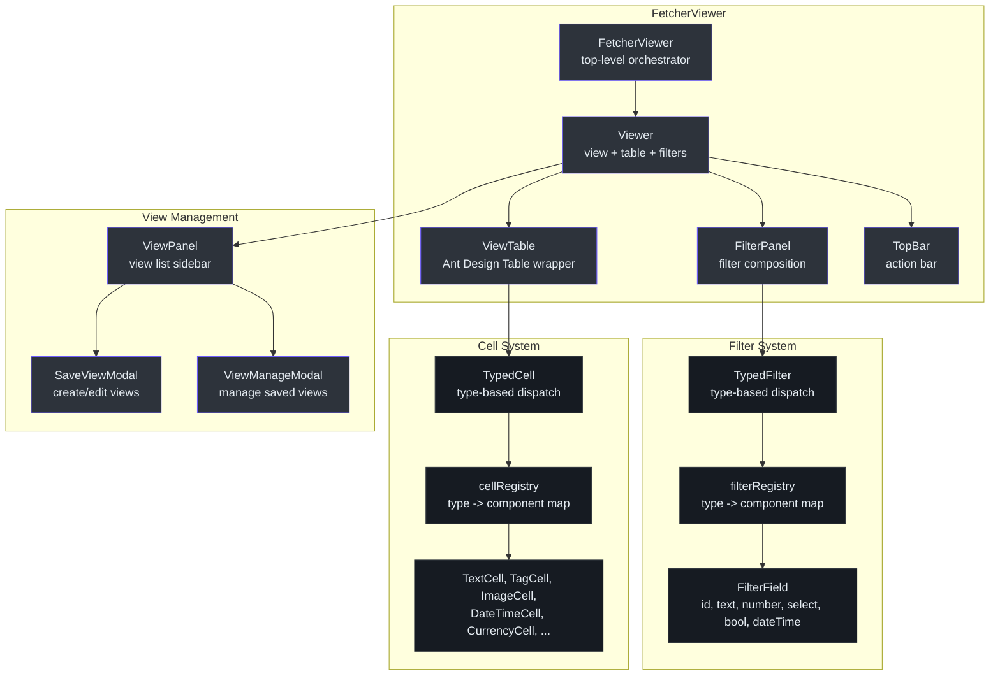
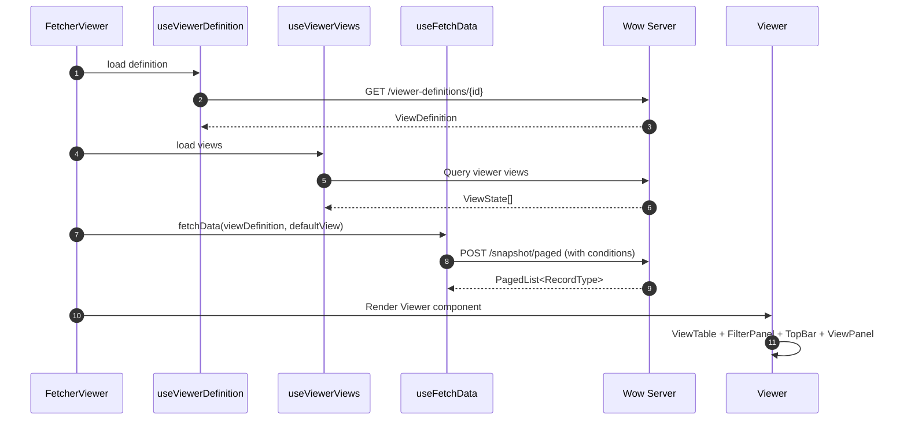
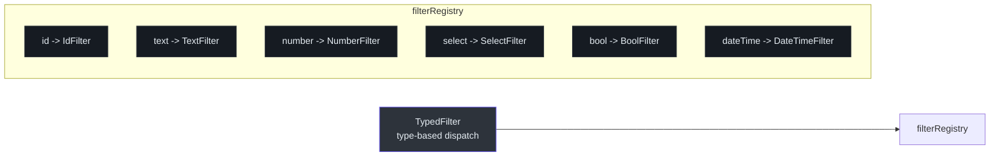
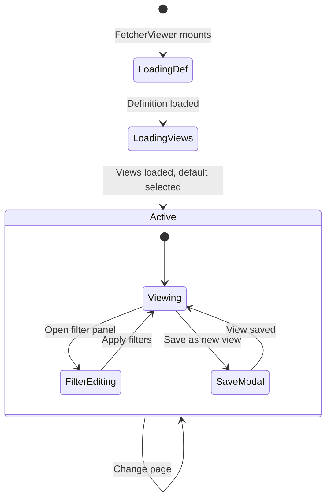

# @ahoo-wang/fetcher-viewer

`@ahoo-wang/fetcher-viewer` 包提供了一个 React + Ant Design 组件库，用于构建数据查看界面。它包含带类型化注册表的过滤面板组件、带丰富单元格渲染器的表格组件、支持保存/加载的视图管理、带操作项的顶部栏，以及一个完整的 `FetcherViewer` 组件，通过 [Wow](./wow.md) CQRS 查询将所有功能整合在一起。

## 安装

```bash
pnpm add @ahoo-wang/fetcher-viewer
```

## 组件架构



## FetcherViewer

顶层组件，负责协调视图定义加载、视图状态管理、通过 Wow 进行数据获取以及渲染完整的查看器 UI。

```tsx
import { FetcherViewer } from '@ahoo-wang/fetcher-viewer';

function DataView() {
  return (
    <FetcherViewer
      viewerDefinitionId="order-view"
      pagination={{ pageSize: 20 }}
      enableRowSelection
      primaryAction={{
        label: 'Create Order',
        onClick: () => router.push('/orders/new'),
      }}
    />
  );
}
```

### FetcherViewerProps

| 属性 | 类型 | 默认值 | 描述 |
|------|------|--------|------|
| `viewerDefinitionId` | `string` | （必填） | 要加载的查看器定义 ID |
| `ownerId` | `string` | `'(0)'` | 数据范围的所有者 ID |
| `tenantId` | `string` | `'(0)'` | 数据范围的租户 ID |
| `defaultViewId` | `string` | -- | 默认激活的视图 |
| `pagination` | `false \| PaginationProps` | （必填） | 分页配置，设为 `false` 可禁用分页 |
| `actionColumn` | `ViewTableActionColumn` | -- | 行操作列配置 |
| `onClickPrimaryKey` | `(id, record) => void` | -- | 主键单元格的点击处理器 |
| `enableRowSelection` | `boolean` | `false` | 启用复选框行选择 |
| `enhanceDataSource` | `(data) => data` | -- | 转换/增强获取的数据 |
| `onSwitchView` | `(view) => void` | -- | 切换视图时的回调 |
| `viewTableSetting` | `ViewTableSettingCapable` | -- | 表格显示设置 |
| `primaryAction` | action object | -- | 顶部栏中的主要操作按钮 |
| `secondaryActions` | action array | -- | 次要操作按钮 |
| `batchActions` | action array | -- | 选中行的批量操作 |

来源: [packages/viewer/src/fetcherviewer/FetcherViewer.tsx:48-71](https://github.com/Ahoo-Wang/fetcher/blob/main/packages/viewer/src/fetcherviewer/FetcherViewer.tsx#L48-L71)

### 命令式 Ref API

`FetcherViewer` 通过 `ref` 暴露命令式 API，用于父组件驱动控制——刷新数据、清除选择或访问当前查询/视图状态：

```tsx
import { useRef } from 'react';
import { FetcherViewer, type FetcherViewerRef } from '@ahoo-wang/fetcher-viewer';

function DataView() {
  const viewerRef = useRef<FetcherViewerRef>(null);

  const handleRefresh = () => viewerRef.current?.refreshData();
  const handleClearSelection = () => viewerRef.current?.clearSelectedRowKeys();

  return (
    <>
      <button onClick={handleRefresh}>刷新</button>
      <button onClick={handleClearSelection}>清除选择</button>
      <FetcherViewer
        ref={viewerRef}
        viewerDefinitionId="order-view"
        pagination={{ pageSize: 20 }}
      />
    </>
  );
}
```

| 方法 | 返回值 | 描述 |
|------|--------|------|
| `refreshData()` | `void` | 重新获取当前页数据 |
| `clearSelectedRowKeys()` | `void` | 清除所有选中的行键 |
| `getPageQuery()` | `PagedQuery \| undefined` | 获取当前页查询（分页 + 条件） |
| `getActiveView()` | `ViewState \| undefined` | 获取当前活动的视图状态 |
| `getViewerDefinition()` | `ViewDefinition \| undefined` | 获取已加载的查看器定义 |

来源: [packages/viewer/src/fetcherviewer/FetcherViewer.tsx:40-46](https://github.com/Ahoo-Wang/fetcher/blob/main/packages/viewer/src/fetcherviewer/FetcherViewer.tsx#L40-L46)

### FetcherViewer 数据流



来源: [packages/viewer/src/fetcherviewer/FetcherViewer.tsx:75-377](https://github.com/Ahoo-Wang/fetcher/blob/main/packages/viewer/src/fetcherviewer/FetcherViewer.tsx#L75-L377)

## 过滤系统

### 类型化过滤器注册表

过滤器通过类型使用注册表模式进行分发。`TypedFilter` 组件从注册表中查找对应的过滤器组件：



| 过滤器类型 | 组件 | 描述 |
|------------|------|------|
| `id` | `IdFilter` | 聚合 ID 输入 |
| `text` | `TextFilter` | 带运算符选择的文本输入 |
| `number` | `NumberFilter` | 支持范围的数值输入 |
| `select` | `SelectFilter` | 带选项的下拉选择 |
| `bool` | `BoolFilter` | 布尔值开关/复选框 |
| `dateTime` | `DateTimeFilter` | 支持范围的日期/时间选择器 |

来源: [packages/viewer/src/filter/filterRegistry.ts:73-83](https://github.com/Ahoo-Wang/fetcher/blob/main/packages/viewer/src/filter/filterRegistry.ts#L73-L83)

### FilterPanel 组件

| 组件 | 描述 |
|------|------|
| `FilterPanel` | 显示一组活跃过滤器 |
| `EditableFilterPanel` | 动态添加/移除过滤器 |
| `AvailableFilterSelect` | 下拉选择要添加的过滤字段 |
| `AvailableFilterSelectModal` | 过滤字段选择的弹窗版本 |
| `RemovableTypedFilter` | 带移除按钮的单个过滤器 |

来源: [packages/viewer/src/filter/panel/](https://github.com/Ahoo-Wang/fetcher/blob/main/packages/viewer/src/filter/panel/)

### 过滤器 Props

每个过滤器组件接收标准化的 props：

```typescript
interface FilterProps {
  field: FilterField;           // { name, label, type, format }
  label?: FilterLabelProps;     // Label display configuration
  operator?: FilterOperatorProps; // Operator selection (null to hide)
  value?: FilterValueProps;     // Value input configuration
  onChange?: (value?: FilterValue) => void; // Change callback
  conditionOptions?: ConditionOptions; // Condition building options
}
```

来源: [packages/viewer/src/filter/types.ts:59-69](https://github.com/Ahoo-Wang/fetcher/blob/main/packages/viewer/src/filter/types.ts#L59-L69)

## 表格单元格系统

### 类型化单元格注册表

表格单元格通过类型使用与过滤器相同的注册表模式进行分发：

| 单元格类型 | 组件 | 描述 |
|------------|------|------|
| `text` | `TextCell` | 支持省略号的纯文本显示 |
| `tag` | `TagCell` | 单个 Ant Design 标签 |
| `tags` | `TagsCell` | 多个 Ant Design 标签 |
| `dateTime` | `DateTimeCell` | 格式化的日期/时间显示 |
| `calendar` | `CalendarTimeCell` | 基于日历的时间显示 |
| `image` | `ImageCell` | 带缩略图的图片预览 |
| `imageGroup` | `ImageGroupCell` | 图片预览组 |
| `link` | `LinkCell` | 可点击链接 |
| `currency` | `CurrencyCell` | 格式化的货币显示 |
| `avatar` | `AvatarCell` | 用户头像显示 |
| `primaryKey` | `PrimaryKeyCell` | 可点击的主键单元格 |
| `action` | `ActionCell` | 单个操作按钮 |
| `actions` | `ActionsCell` | 多个操作按钮 |

来源: [packages/viewer/src/table/cell/cellRegistry.ts:67-82](https://github.com/Ahoo-Wang/fetcher/blob/main/packages/viewer/src/table/cell/cellRegistry.ts#L67-L82)

### CellProps 接口

所有单元格组件接收标准化的 props：

```typescript
interface CellProps<ValueType, RecordType, Attributes> {
  data: {
    value: ValueType;     // The cell value to display
    record: RecordType;   // The full row record
    index: number;        // Row index
  };
  attributes?: Attributes; // Component-specific attributes
}
```

来源: [packages/viewer/src/table/cell/types.ts:100-106](https://github.com/Ahoo-Wang/fetcher/blob/main/packages/viewer/src/table/cell/types.ts#L100-L106)

### ViewTable

`ViewTable` 组件封装了 Ant Design 的 `Table`，并与查看器定义集成，从视图字段配置自动生成列。支持：

- 通过 `TypedCell` 自动分发单元格类型
- 可排序列
- 列可见性配置
- 表格设置面板，用于字段排序和可见性管理
- 行选择
- 操作列

来源: [packages/viewer/src/table/ViewTable.tsx](https://github.com/Ahoo-Wang/fetcher/blob/main/packages/viewer/src/table/ViewTable.tsx)

## 视图管理



### 视图状态

每个视图（`ViewState`）持久化保存：

- 活跃的过滤条件
- 排序配置
- 列可见性和排序
- 视图名称和类型（PRIVATE/SHARED）
- 默认视图标志

视图通过 [Wow](./wow.md) 命令操作进行管理，使用 `ViewCommandClient`：

- `createView` -- 创建新视图
- `editView` -- 更新已有视图
- `deleteAggregate` -- 删除视图

来源: [packages/viewer/src/fetcherviewer/client/view/commandClient.ts](https://github.com/Ahoo-Wang/fetcher/blob/main/packages/viewer/src/fetcherviewer/client/view/commandClient.ts)

## TopBar 组件

顶部栏在数据表格上方提供操作项：

| 组件 | 描述 |
|------|------|
| `TopBar` | 栏项容器 |
| `BarItem` | 基础栏项组件 |
| `RefreshDataBarItem` | 手动数据刷新按钮 |
| `AutoRefreshBarItem` | 带间隔的自动刷新开关 |
| `FilterBarItem` | 切换过滤面板可见性 |
| `FullscreenBarItem` | 切换全屏模式 |
| `ColumnHeightBarItem` | 调整表格行密度 |
| `DataMonitorBarItem` | 数据监控指示器 |
| `ShareLinkBarItem` | 复制可分享的视图链接 |

来源: [packages/viewer/src/topbar/](https://github.com/Ahoo-Wang/fetcher/blob/main/packages/viewer/src/topbar/)

## 独立组件

viewer 包还导出了可复用的 UI 组件：

| 组件 | 描述 |
|------|------|
| `NumberRange` | 用于范围过滤的双数值输入 |
| `RemoteSelect` | 带远程数据获取的选择器 |
| `TagInput` | 用于管理标签集合的输入框 |
| `Fullscreen` | 全屏容器封装 |

来源: [packages/viewer/src/components/](https://github.com/Ahoo-Wang/fetcher/blob/main/packages/viewer/src/components/)

## 注册表模式

过滤器和单元格都使用共享的 `TypedComponentRegistry<T, P>` 模式：

```typescript
import { TypedComponentRegistry } from '@ahoo-wang/fetcher-viewer';

// Create a custom registry
const myRegistry = TypedComponentRegistry.create<string, MyProps>([
  ['type1', MyComponent1],
  ['type2', MyComponent2],
]);

// Register additional types
myRegistry.register('type3', MyComponent3);

// Look up
const Component = myRegistry.get('type1');
```

来源: [packages/viewer/src/registry/componentRegistry.ts](https://github.com/Ahoo-Wang/fetcher/blob/main/packages/viewer/src/registry/componentRegistry.ts)

## Storybook 集成

viewer 包包含全面的 Storybook stories，用于可视化开发和测试：

```bash
pnpm storybook
```

Stories 与组件并列组织在 `stories/` 目录中：

- 过滤器组件: `filter/stories/`、`filter/panel/stories/`
- 单元格组件: `table/cell/stories/`
- 表格组件: `table/stories/`、`table/setting/stories/`
- 顶部栏组件: `topbar/stories/`
- 查看器组件: `viewer/stories/`、`view/stories/`
- FetcherViewer: `fetcherviewer/stories/`
- 独立组件: `components/stories/`

## 主要导出

| 导出 | 模块 | 描述 |
|------|------|------|
| `FetcherViewer` | `fetcherviewer/` | 顶层查看器协调器 |
| `Viewer` | `viewer/` | 视图 + 表格 + 过滤器组合 |
| `View` | `view/` | 单个视图容器 |
| `ViewTable` | `table/` | 带类型化单元格的 Ant Design 表格 |
| `TypedFilter` | `filter/` | 按类型分发的过滤器组件 |
| `filterRegistry` | `filter/` | 过滤器组件注册表 |
| `TypedCell` | `table/cell/` | 按类型分发的单元格组件 |
| `cellRegistry` | `table/cell/` | 单元格组件注册表 |
| `TopBar` | `topbar/` | 操作栏容器 |
| `FilterPanel` | `filter/panel/` | 活跃过滤器显示 |
| `EditableFilterPanel` | `filter/panel/` | 动态过滤器编辑器 |
| `ViewPanel` | `viewer/panel/` | 视图列表侧边栏 |
| `SaveViewModal` | `viewer/panel/` | 保存/编辑视图弹窗 |
| `TypedComponentRegistry` | `registry/` | 通用类型化组件注册表 |
| `NumberRange` | `components/` | 双数值范围输入 |
| `RemoteSelect` | `components/` | 远程数据选择器 |
| `TagInput` | `components/` | 标签管理输入框 |

## 交叉引用

- **[Wow](./wow.md)** -- `FetcherViewer` 使用 Wow `SnapshotQueryClient` 进行数据获取，使用 `CommandClient` 进行视图管理
- **[React](./react.md)** -- 使用 React 包中的 `useFetcher`、`useKeyStorage`、`useEventSubscription` Hooks
- **[Fetcher](./fetcher.md)** -- 用于所有 API 通信的核心 HTTP 客户端
- **[Storage](./storage.md)** -- `KeyStorage` 用于持久化本地默认视图 ID
- **[CoSec](./cosec.md)** -- 通过 owner/tenant ID 支持多租户数据范围
