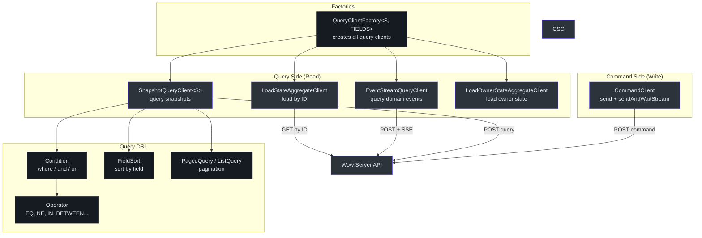
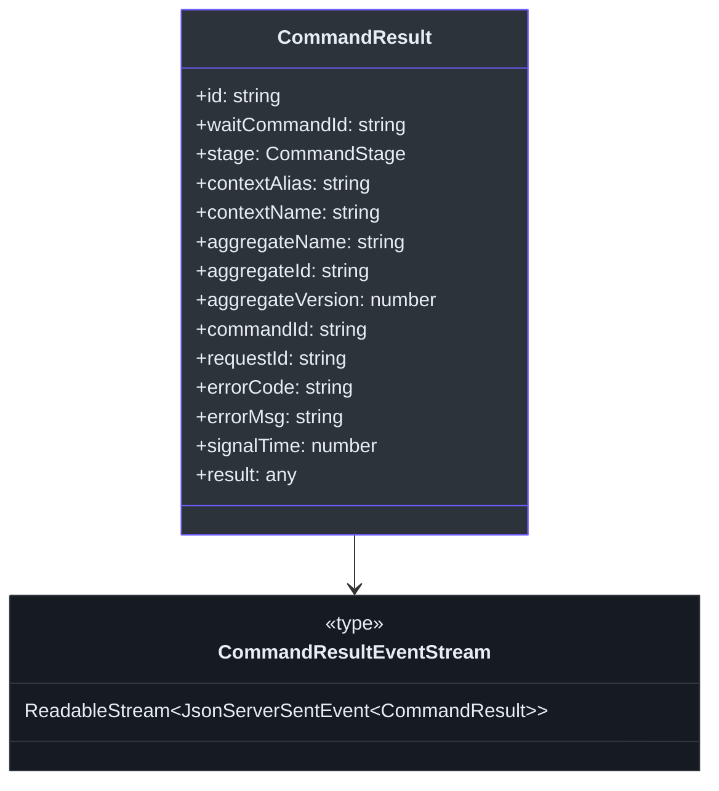
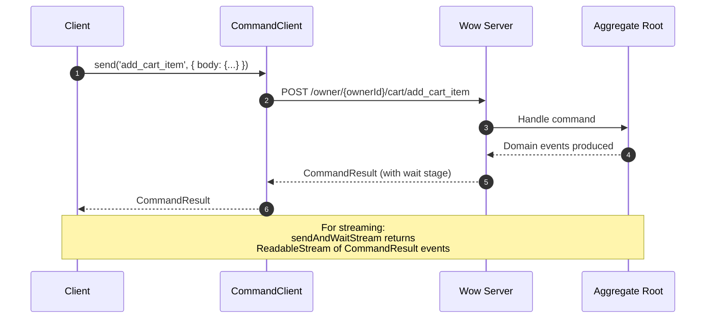
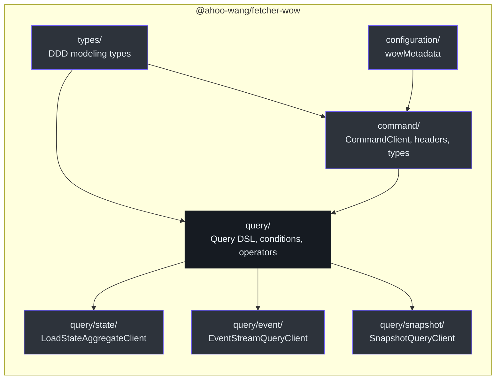

# @ahoo-wang/fetcher-wow

`@ahoo-wang/fetcher-wow` 包为 [Wow](https://github.com/Ahoo-Wang/wow) DDD + 事件溯源 + CQRS 框架提供客户端集成层。它提供了用于发送领域命令的类型化命令客户端、用于读取聚合状态的快照查询客户端、用于重放领域事件的事件流查询客户端，以及支持条件查询、排序和分页的丰富查询 DSL。

## 安装

```bash
pnpm add @ahoo-wang/fetcher-wow
```

## 架构概览



## 命令端（写模型）

### CommandClient

`CommandClient` 使用基于[装饰器](./decorator.md)的 API 方法向 Wow 聚合根发送命令。支持标准命令执行和长时间运行命令的 SSE 流式传输。

```typescript
import { CommandClient } from '@ahoo-wang/fetcher-wow';
import { ApiMetadata } from '@ahoo-wang/fetcher-decorator';
import { Fetcher } from '@ahoo-wang/fetcher';

const commandClient = new CommandClient({
  fetcher: new Fetcher({ baseURL: 'http://localhost:8080/' }),
  basePath: 'owner/{ownerId}/cart',
});

// Send a command and wait for result
const result = await commandClient.send({
  body: {
    productId: 'product-1',
    quantity: 2,
  },
  headers: {
    'Command-Wait-Stage': 'SNAPSHOT',
  },
});

console.log('Aggregate ID:', result.aggregateId);
console.log('Command ID:', result.commandId);
```

来源: [packages/wow/src/command/commandClient.ts:77-148](https://github.com/Ahoo-Wang/fetcher/blob/main/packages/wow/src/command/commandClient.ts#L77-L148)

### CommandRequest

命令包装在 `CommandRequest` 中，支持：

- `body` -- 使用 `CommandBody<C>` 包装的命令载荷
- `headers` -- 类型化命令头，用于等待策略、租户/所有者/聚合标识
- `urlParams` -- 聚合路由的路径参数

### 命令头

| 请求头 | 常量 | 描述 |
|--------|----------|-------------|
| `Command-Tenant-Id` | `CommandHeaders.TENANT_ID` | 租户标识符 |
| `Command-Owner-Id` | `CommandHeaders.OWNER_ID` | 所有者标识符 |
| `Command-Space-Id` | `CommandHeaders.SPACE_ID` | 空间标识符 |
| `Command-Aggregate-Id` | `CommandHeaders.AGGREGATE_ID` | 聚合实例 ID |
| `Command-Aggregate-Version` | `CommandHeaders.AGGREGATE_VERSION` | 预期聚合版本 |
| `Command-Wait-Stage` | `CommandHeaders.WAIT_STAGE` | 等待处理阶段 |
| `Command-Wait-Timeout` | `CommandHeaders.WAIT_TIME_OUT` | 等待超时时长 |
| `Command-Wait-Context` | `CommandHeaders.WAIT_CONTEXT` | 等待处理上下文 |
| `Command-Request-Id` | `CommandHeaders.REQUEST_ID` | 请求关联 ID |
| `Command-Local-First` | `CommandHeaders.LOCAL_FIRST` | 优先本地执行 |

来源: [packages/wow/src/command/commandHeaders.ts](https://github.com/Ahoo-Wang/fetcher/blob/main/packages/wow/src/command/commandHeaders.ts)

### CommandResult

命令执行后返回的结果：



来源: [packages/wow/src/command/commandResult.ts:74-110](https://github.com/Ahoo-Wang/fetcher/blob/main/packages/wow/src/command/commandResult.ts#L74-L110)

### CommandStage

`CommandStage` 枚举定义了命令等待策略可以发出完成信号的处理阶段。它用作 `Command-Wait-Stage` 头的值和 `CommandResult.stage` 字段：

| 阶段 | 值 | 完成信号 |
|------|-----|---------|
| `SENT` | `'SENT'` | 命令已发布到命令总线/队列 |
| `PROCESSED` | `'PROCESSED'` | 命令已被聚合根处理 |
| `SNAPSHOT` | `'SNAPSHOT'` | 已生成快照（聚合状态已物化） |
| `PROJECTED` | `'PROJECTED'` | 事件已投射到读模型 |
| `EVENT_HANDLED` | `'EVENT_HANDLED'` | 事件已被事件处理器处理 |
| `SAGA_HANDLED` | `'SAGA_HANDLED'` | 事件已被 Saga 处理 |

源码: [packages/wow/src/command/types.ts:54-84](https://github.com/Ahoo-Wang/fetcher/blob/main/packages/wow/src/command/types.ts#L54-L84)

### 命令流程



## 查询端（读模型）

### SnapshotQueryClient

读取聚合状态的主要客户端。支持计数、列表、分页和流式快照查询。

```typescript
import { SnapshotQueryClient, all, listQuery, pagedQuery, singleQuery } from '@ahoo-wang/fetcher-wow';

const client = new SnapshotQueryClient<CartState>(apiMetadata);

// Count
const count = await client.count(all());

// List
const items = await client.list(listQuery({
  condition: all(),
  limit: 100,
}));

// Paged
const page = await client.paged(pagedQuery({
  condition: all(),
  limit: 10,
  offset: 0,
}));

// Single by ID
const cart = await client.getStateById('cart-123');

// Multiple by IDs
const carts = await client.getStateByIds(['cart-1', 'cart-2']);
```

#### SnapshotQueryClient 方法

| 方法 | 端点 | 返回类型 | 描述 |
|------|------|----------|------|
| `count(condition)` | `/snapshot/count` | `Promise<number>` | 统计匹配的聚合数量 |
| `list(listQuery)` | `/snapshot/list` | `Promise<MaterializedSnapshot<S>[]>` | 列表查询快照 |
| `listStream(listQuery)` | `/snapshot/list` | `Promise<ReadableStream<SSE>>` | 以 SSE 流形式列出快照 |
| `listState(listQuery)` | `/snapshot/list_state` | `Promise<S[]>` | 仅列出状态 |
| `listStateStream(listQuery)` | `/snapshot/list_state` | `Promise<ReadableStream<SSE>>` | 以 SSE 流形式列出状态 |
| `paged(pagedQuery)` | `/snapshot/paged` | `Promise<PagedList<S>>` | 分页查询快照 |
| `pagedState(pagedQuery)` | `/snapshot/paged_state` | `Promise<PagedList<S>>` | 分页查询状态 |
| `single(singleQuery)` | `/snapshot/single` | `Promise<MaterializedSnapshot<S>>` | 单个快照查询 |
| `singleState(singleQuery)` | `/snapshot/single_state` | `Promise<S>` | 单个状态查询 |
| `getById(id)` | -- | `Promise<MaterializedSnapshot<S>>` | 通过聚合 ID 获取 |
| `getStateById(id)` | -- | `Promise<S>` | 通过 ID 获取状态 |
| `getByIds(ids)` | -- | `Promise<MaterializedSnapshot<S>[]>` | 通过多个 ID 获取 |
| `getStateByIds(ids)` | -- | `Promise<S[]>` | 通过多个 ID 获取状态 |

来源: [packages/wow/src/query/snapshot/snapshotQueryClient.ts:119-516](https://github.com/Ahoo-Wang/fetcher/blob/main/packages/wow/src/query/snapshot/snapshotQueryClient.ts#L119-L516)

### QueryClientFactory

为给定聚合创建所有查询客户端的工厂，预配置了正确的基本路径：

```typescript
import { QueryClientFactory, ResourceAttributionPathSpec } from '@ahoo-wang/fetcher-wow';

const factory = new QueryClientFactory<CartState, CartFields, CartDomainEvent>({
  contextAlias: 'example',
  aggregateName: 'cart',
  resourceAttribution: ResourceAttributionPathSpec.OWNER,
});

// Create individual clients
const snapshotClient = factory.createSnapshotQueryClient();
const stateClient = factory.createLoadStateAggregateClient();
const ownerStateClient = factory.createOwnerLoadStateAggregateClient();
const eventClient = factory.createEventStreamQueryClient();
```

| 工厂方法 | 创建的客户端 | 描述 |
|----------|-------------|------|
| `createSnapshotQueryClient()` | `SnapshotQueryClient<S, FIELDS>` | 带条件的快照查询 |
| `createLoadStateAggregateClient()` | `LoadStateAggregateClient<S>` | 通过 ID、版本或时间加载 |
| `createOwnerLoadStateAggregateClient()` | `LoadOwnerStateAggregateClient<S>` | 加载所有者的聚合状态 |
| `createEventStreamQueryClient()` | `EventStreamQueryClient` | 领域事件流查询 |

来源: [packages/wow/src/query/queryClients.ts:62-214](https://github.com/Ahoo-Wang/fetcher/blob/main/packages/wow/src/query/queryClients.ts#L62-L214)

## 查询 DSL

### 条件查询

条件系统支持构建复杂的查询谓词：

```typescript
import { all, condition, aggregateId, aggregateIds } from '@ahoo-wang/fetcher-wow';

// All records
const allCondition = all();

// By aggregate ID
const byId = aggregateId('cart-123');

// By multiple IDs
const byIds = aggregateIds(['cart-1', 'cart-2', 'cart-3']);

// Complex conditions with operators
const complex = condition({
  field: 'status',
  operator: 'IN',
  value: ['ACTIVE', 'PENDING'],
}).and({
  field: 'createdAt',
  operator: 'BETWEEN',
  value: ['2024-01-01', '2024-12-31'],
});
```

### 运算符

| 运算符 | 描述 | 示例 |
|--------|------|------|
| `EQ` | 等于 | `{ field: 'name', operator: 'EQ', value: 'Alice' }` |
| `NE` | 不等于 | `{ field: 'status', operator: 'NE', value: 'DELETED' }` |
| `IN` | 在集合中 | `{ field: 'type', operator: 'IN', value: ['A', 'B'] }` |
| `NOT_IN` | 不在集合中 | `{ field: 'type', operator: 'NOT_IN', value: ['C'] }` |
| `BETWEEN` | 范围 | `{ field: 'age', operator: 'BETWEEN', value: [18, 65] }` |
| `LIKE` | 模式匹配 | `{ field: 'name', operator: 'LIKE', value: '%john%' }` |
| `GT` | 大于 | `{ field: 'price', operator: 'GT', value: 100 }` |
| `LT` | 小于 | `{ field: 'price', operator: 'LT', value: 50 }` |
| `ALL` | 匹配全部 | 无需字段/值 |

来源: [packages/wow/src/query/operator.ts](https://github.com/Ahoo-Wang/fetcher/blob/main/packages/wow/src/query/operator.ts)

### 排序和分页

```typescript
import { pagedQuery, listQuery } from '@ahoo-wang/fetcher-wow';

// Paged query with sorting
const query = pagedQuery({
  condition: all(),
  limit: 20,
  offset: 0,
  sort: [{ field: 'createdAt', order: 'DESC' }],
});
```

### 游标分页

对于大型数据集，基于游标的分页比基于偏移量的分页更高效。它通过使用游标 ID 跟踪位置，避免了深偏移查询的性能退化：

```typescript
import { cursorQuery, CURSOR_ID_START } from '@ahoo-wang/fetcher-wow';

// 第一页——从头开始
const firstPage = cursorQuery({
  query: { condition: all(), limit: 50, projection: { include: ['id', 'name'] } },
  cursorId: CURSOR_ID_START,  // '~'——从头开始
  cursorField: 'id',
  cursorOrder: 'ASC',
});

// 后续页——使用前一个结果的最后一条记录的游标 ID
const nextPage = cursorQuery({
  query: { condition: all(), limit: 50 },
  cursorId: lastItemId,  // 上一页的游标 ID
  cursorField: 'id',
  cursorOrder: 'ASC',
});
```

### 投影

使用 `projection` 控制查询返回哪些字段——只包含你需要的字段以减少载荷大小：

```typescript
import { projection, pagedQuery } from '@ahoo-wang/fetcher-wow';

// 仅包含特定字段
const query = pagedQuery({
  condition: all(),
  limit: 20,
  projection: projection({ include: ['id', 'name', 'status'] }),
});

// 排除字段
const query2 = pagedQuery({
  condition: all(),
  limit: 20,
  projection: projection({ exclude: ['internalNotes', 'metadata'] }),
});
```

源码: [packages/wow/src/query/cursorQuery.ts](https://github.com/Ahoo-Wang/fetcher/blob/main/packages/wow/src/query/cursorQuery.ts), [packages/wow/src/query/projection.ts](https://github.com/Ahoo-Wang/fetcher/blob/main/packages/wow/src/query/projection.ts)

## 模块结构



来源: [packages/wow/src/index.ts](https://github.com/Ahoo-Wang/fetcher/blob/main/packages/wow/src/index.ts)

## 主要导出

| 导出 | 模块 | 描述 |
|------|------|------|
| `CommandClient` | `command/` | 基于装饰器的命令发送客户端 |
| `CommandRequest` | `command/` | 带请求头的类型化命令请求 |
| `CommandResult` | `command/` | 命令执行结果 |
| `CommandResultEventStream` | `command/` | 命令结果的 SSE 流 |
| `CommandBody<C>` | `command/` | 命令体包装类型 |
| `CommandHeaders` | `command/` | 请求头名称常量 |
| `QueryClientFactory` | `query/` | 创建所有查询客户端的工厂 |
| `QueryClientOptions` | `query/` | 查询客户端配置 |
| `SnapshotQueryClient` | `query/snapshot/` | 快照查询操作 |
| `EventStreamQueryClient` | `query/event/` | 领域事件流查询 |
| `LoadStateAggregateClient` | `query/state/` | 通过 ID/版本/时间加载聚合状态 |
| `LoadOwnerStateAggregateClient` | `query/state/` | 加载所有者的聚合状态 |
| `Condition` | `query/` | 查询条件构建器 |
| `all()` | `query/` | 匹配所有记录的条件 |
| `aggregateId(id)` | `query/` | 匹配单个聚合 ID 的条件 |
| `aggregateIds(ids)` | `query/` | 匹配多个聚合 ID 的条件 |
| `condition(field, operator, value)` | `query/` | 条件构建器 |
| `listQuery()` | `query/` | 创建列表查询 |
| `pagedQuery()` | `query/` | 创建分页查询 |
| `singleQuery()` | `query/` | 创建单条查询 |
| `FieldSort` | `query/` | 排序规范 |
| `Operator` | `query/` | 查询运算符枚举 |
| `ResourceAttributionPathSpec` | `types/` | 租户/所有者范围的路径规范 |

## 生成的客户端

[Generator](./generator.md) 包会自动为 OpenAPI 规范中发现的每个聚合生成类型化的命令和查询客户端。例如，对于限界上下文 `example` 中的 `Cart` 聚合：

```typescript
// Generated command client
const commandClient = new CartCommandClient();
const result = await commandClient.addCartItem({
  body: { productId: 'p1', quantity: 1 },
});

// Generated query client factory
const factory = cartQueryClientFactory;
const snapshotClient = factory.createSnapshotQueryClient();
const cartState = await snapshotClient.singleState(singleQuery({
  condition: aggregateId('cart-1'),
}));
```

## 交叉引用

- **[Fetcher](./fetcher.md)** -- 核心 HTTP 客户端；所有 Wow 客户端使用 Fetcher 进行 HTTP 传输
- **[Decorator](./decorator.md)** -- `CommandClient` 和 `SnapshotQueryClient` 使用 `@api`、`@post`、`@body` 装饰器
- **[EventStream](./eventstream.md)** -- 流式查询（`listStream`、`sendAndWaitStream`）使用 `JsonEventStreamResultExtractor`
- **[Generator](./generator.md)** -- 生成器读取 OpenAPI 规范并生成类型化的 Wow 客户端
- **[React](./react.md)** -- `useSingleQuery`、`useListQuery`、`usePagedQuery` Hook 面向 Wow 查询客户端
- **[Viewer](./viewer.md)** -- FetcherViewer 组件使用 Wow 查询客户端进行数据展示
