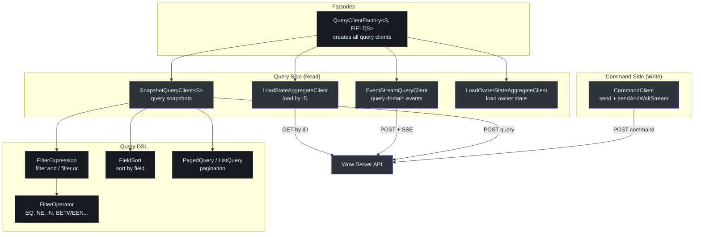
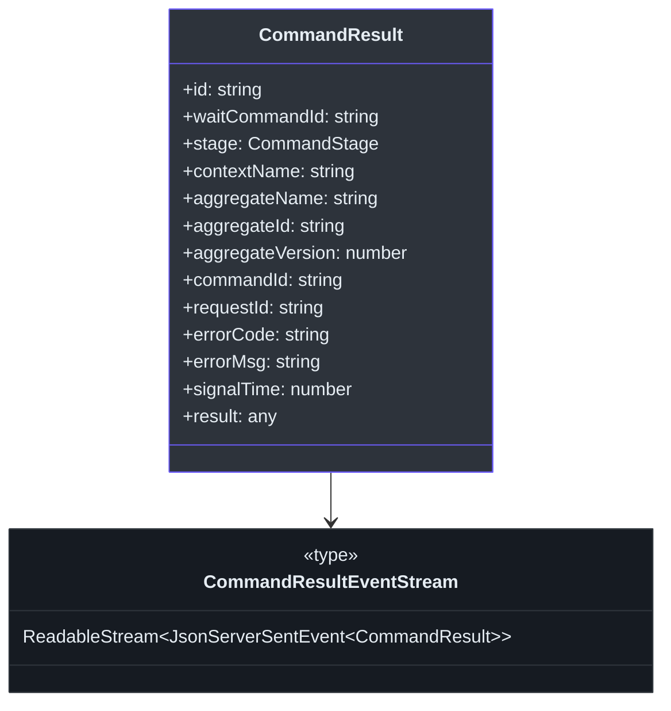
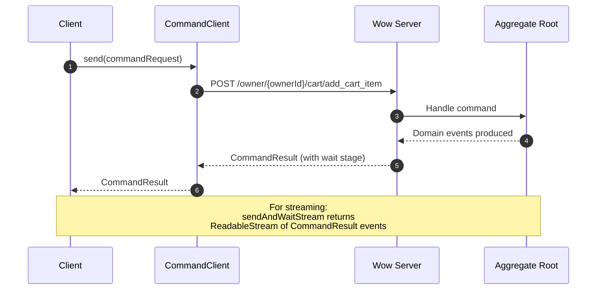
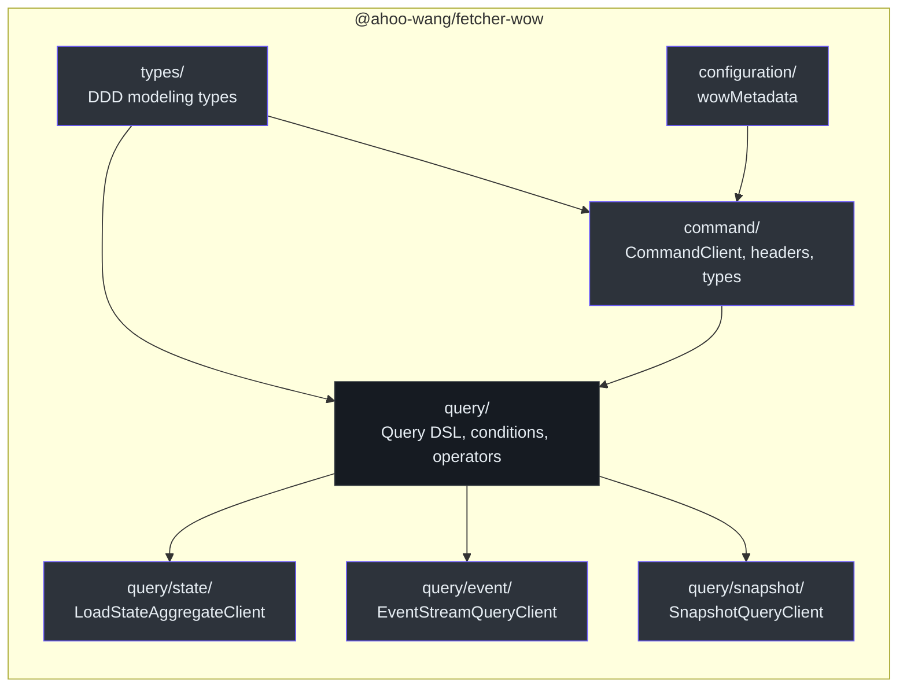

# @ahoo-wang/fetcher-wow

`@ahoo-wang/fetcher-wow` 包为 [Wow](https://github.com/Ahoo-Wang/wow) DDD + 事件溯源 + CQRS 框架提供客户端集成层。它提供了用于发送领域命令的类型化命令客户端、用于读取聚合状态的快照查询客户端、用于重放领域事件的事件流查询客户端，以及支持排序和分页的丰富 `FilterExpression` 查询 DSL。

## 安装

```bash
pnpm add @ahoo-wang/fetcher-wow
```

## 架构概览


```mermaid
graph TB
    subgraph sg_1 ["Command Side (Write)"]
        CC["CommandClient<br>send + sendAndWaitStream"]
    end

    subgraph sg_2 ["Query Side (Read)"]
        SQC["SnapshotQueryClient&lt;S&gt;<br>query snapshots"]
        ESQC["EventStreamQueryClient<br>query domain events"]
        LSAC["LoadStateAggregateClient<br>load by ID"]
        LOSAC["LoadOwnerStateAggregateClient<br>load owner state"]
    end

    subgraph sg_3 ["Query DSL"]
        COND["FilterExpression<br>filter.and / filter.or"]
        SORT["FieldSort<br>sort by field"]
        PAGE["PagedQuery / ListQuery<br>pagination"]
        OP["FilterOperator<br>EQ, NE, IN, BETWEEN..."]
    end

    subgraph sg_4 ["Factories"]
        QCF["QueryClientFactory&lt;S, FIELDS&gt;<br>creates all query clients"]
    end

    QCF --> SQC
    QCF --> ESQC
    QCF --> LSAC
    QCF --> LOSAC

    CC --> |"POST command"| API["Wow Server API"]
    SQC --> |"POST query"| API
    ESQC --> |"POST + SSE"| API
    LSAC --> |"GET by ID"| API

    SQC --> COND
    SQC --> SORT
    SQC --> PAGE
    COND --> OP

    style CC fill:#2d333b,stroke:#6d5dfc,color:#e6edf3
    style SQC fill:#2d333b,stroke:#6d5dfc,color:#e6edf3
    style ESQC fill:#2d333b,stroke:#6d5dfc,color:#e6edf3
    style LSAC fill:#2d333b,stroke:#6d5dfc,color:#e6edf3
    style LOSAC fill:#2d333b,stroke:#6d5dfc,color:#e6edf3
    style QCF fill:#161b22,stroke:#30363d,color:#e6edf3
    style COND fill:#161b22,stroke:#30363d,color:#e6edf3
    style SORT fill:#161b22,stroke:#30363d,color:#e6edf3
    style PAGE fill:#161b22,stroke:#30363d,color:#e6edf3
    style OP fill:#161b22,stroke:#30363d,color:#e6edf3
    style API fill:#2d333b,stroke:#6d5dfc,color:#e6edf3
```

## 命令端（写模型）

### CommandClient

`CommandClient` 使用基于[装饰器](./decorator.md)的 API 方法向 Wow 聚合根发送命令。支持标准命令执行和长时间运行命令的 SSE 流式传输。

```typescript
import { CommandClient } from '@ahoo-wang/fetcher-wow';
import { ApiMetadata } from '@ahoo-wang/fetcher-decorator';
import { Fetcher } from '@ahoo-wang/fetcher';

const commandClient = new CommandClient({
  fetcher: new Fetcher({ baseURL: 'http://localhost:8080/' }),
  basePath: 'owner/{ownerId}/cart',
});

// Send a command and wait for result
const result = await commandClient.send({
  body: {
    productId: 'product-1',
    quantity: 2,
  },
  headers: {
    'Command-Wait-Stage': 'SNAPSHOT',
  },
});

console.log('Aggregate ID:', result.aggregateId);
console.log('Command ID:', result.commandId);
```

来源: [packages/wow/src/command/commandClient.ts:77-148](https://github.com/Ahoo-Wang/fetcher/blob/main/packages/wow/src/command/commandClient.ts#L77-L148)

### CommandRequest

命令包装在 `CommandRequest` 中，支持：

- `body` -- 使用 `CommandBody<C>` 包装的命令载荷
- `headers` -- 类型化命令头，用于等待策略、租户/所有者/聚合标识
- `urlParams` -- 聚合路由的路径参数

### 命令头

| 请求头 | 常量 | 描述 |
|--------|----------|-------------|
| `Command-Tenant-Id` | `CommandHeaders.TENANT_ID` | 租户标识符 |
| `Command-Owner-Id` | `CommandHeaders.OWNER_ID` | 所有者标识符 |
| `Command-Space-Id` | `CommandHeaders.SPACE_ID` | 空间标识符 |
| `Command-Aggregate-Id` | `CommandHeaders.AGGREGATE_ID` | 聚合实例 ID |
| `Command-Aggregate-Version` | `CommandHeaders.AGGREGATE_VERSION` | 预期聚合版本 |
| `Command-Wait-Stage` | `CommandHeaders.WAIT_STAGE` | 等待处理阶段 |
| `Command-Wait-Timeout` | `CommandHeaders.WAIT_TIME_OUT` | 等待超时时长 |
| `Command-Wait-Context` | `CommandHeaders.WAIT_CONTEXT` | 等待处理上下文 |
| `Command-Request-Id` | `CommandHeaders.REQUEST_ID` | 请求关联 ID |
| `Command-Local-First` | `CommandHeaders.LOCAL_FIRST` | 优先本地执行 |

来源: [packages/wow/src/command/commandHeaders.ts](https://github.com/Ahoo-Wang/fetcher/blob/main/packages/wow/src/command/commandHeaders.ts)

### CommandResult

命令执行后返回的结果：


```mermaid
classDiagram
    class CommandResult {
        +id: string
        +waitCommandId: string
        +stage: CommandStage
        +contextName: string
        +aggregateName: string
        +aggregateId: string
        +aggregateVersion: number
        +commandId: string
        +requestId: string
        +errorCode: string
        +errorMsg: string
        +signalTime: number
        +result: any
    }

    class CommandResultEventStream {
        <<type>>
        ReadableStream~JsonServerSentEvent~CommandResult~~
    }

    CommandResult --> CommandResultEventStream

    style CommandResult fill:#2d333b,stroke:#6d5dfc,color:#e6edf3
    style CommandResultEventStream fill:#161b22,stroke:#30363d,color:#e6edf3
```

来源: [packages/wow/src/command/commandResult.ts:74-110](https://github.com/Ahoo-Wang/fetcher/blob/main/packages/wow/src/command/commandResult.ts#L74-L110)

### CommandStage

`CommandStage` 枚举定义了命令等待策略可以发出完成信号的处理阶段。它用作 `Command-Wait-Stage` 头的值和 `CommandResult.stage` 字段：

| 阶段 | 值 | 完成信号 |
|------|-----|---------|
| `SENT` | `'SENT'` | 命令已发布到命令总线/队列 |
| `PROCESSED` | `'PROCESSED'` | 命令已被聚合根处理 |
| `SNAPSHOT` | `'SNAPSHOT'` | 已生成快照（聚合状态已物化） |
| `PROJECTED` | `'PROJECTED'` | 事件已投射到读模型 |
| `EVENT_HANDLED` | `'EVENT_HANDLED'` | 事件已被事件处理器处理 |
| `SAGA_HANDLED` | `'SAGA_HANDLED'` | 事件已被 Saga 处理 |

源码: [packages/wow/src/command/types.ts:54-84](https://github.com/Ahoo-Wang/fetcher/blob/main/packages/wow/src/command/types.ts#L54-L84)

### 命令流程


```mermaid
sequenceDiagram
autonumber

    participant C as Client
    participant CC as CommandClient
    participant S as Wow Server
    participant AGG as Aggregate Root

    C->>CC: send(commandRequest)
    CC->>S: POST /owner/{ownerId}/cart/add_cart_item
    S->>AGG: Handle command
    AGG-->>S: Domain events produced
    S-->>CC: CommandResult (with wait stage)
    CC-->>C: CommandResult

    Note over C,AGG: For streaming:<br>sendAndWaitStream returns<br>ReadableStream of CommandResult events
```

## 查询端（读模型）

### SnapshotQueryClient

读取聚合状态的主要客户端。支持计数、列表、分页和流式快照查询。

```typescript
import { SnapshotQueryClient, filter } from '@ahoo-wang/fetcher-wow';

const client = new SnapshotQueryClient<CartState>(apiMetadata);

// Count
const count = await client.count(filter.matchAll());

// List
const items = await client.list({
  filter: filter.matchAll(),
  limit: 100,
});

// Paged
const page = await client.paged({
  filter: filter.matchAll(),
  pagination: { index: 1, size: 10 },
});

// Single by ID
const cart = await client.getStateById('cart-123');

// Multiple by IDs
const carts = await client.getStateByIds(['cart-1', 'cart-2']);
```

#### SnapshotQueryClient 方法

| 方法 | 端点 | 返回类型 | 描述 |
|------|------|----------|------|
| `count(filter)` | `/snapshot/count` | `Promise<number>` | 统计匹配的聚合数量 |
| `list(listQuery)` | `/snapshot/list` | `Promise<MaterializedSnapshot<S>[]>` | 列表查询快照 |
| `listStream(listQuery)` | `/snapshot/list` | `Promise<ReadableStream<JsonServerSentEvent<MaterializedSnapshot<S>>>>` | 以 SSE 流形式列出快照 |
| `listState(listQuery)` | `/snapshot/list/state` | `Promise<S[]>` | 仅列出状态 |
| `listStateStream(listQuery)` | `/snapshot/list/state` | `Promise<ReadableStream<JsonServerSentEvent<S>>>` | 以 SSE 流形式列出状态 |
| `paged(pagedQuery)` | `/snapshot/paged` | `Promise<PagedList<MaterializedSnapshot<S>>>` | 分页查询快照 |
| `pagedState(pagedQuery)` | `/snapshot/paged/state` | `Promise<PagedList<S>>` | 分页查询状态 |
| `single(singleQuery)` | `/snapshot/single` | `Promise<MaterializedSnapshot<S>>` | 单个快照查询 |
| `singleState(singleQuery)` | `/snapshot/single/state` | `Promise<S>` | 单个状态查询 |
| `getById(id)` | -- | `Promise<MaterializedSnapshot<S>>` | 通过聚合 ID 获取 |
| `getStateById(id)` | -- | `Promise<S>` | 通过 ID 获取状态 |
| `getByIds(ids)` | -- | `Promise<MaterializedSnapshot<S>[]>` | 通过多个 ID 获取 |
| `getStateByIds(ids)` | -- | `Promise<S[]>` | 通过多个 ID 获取状态 |
| `aggregate(query)` | `/snapshot/aggregation` | `Promise<Row[]>` | 聚合快照 |
| `aggregateStream(query)` | `/snapshot/aggregation` | `Promise<ReadableStream<JsonServerSentEvent<Row>>>` | 以 SSE 聚合快照 |

为兼容既有实现，`SnapshotQueryApi` 将 `aggregate?` 和 `aggregateStream?`
声明为可选方法；`SnapshotQueryClient` 将两者实现为必需方法。

来源: [packages/wow/src/query/snapshot/snapshotQueryClient.ts:119-516](https://github.com/Ahoo-Wang/fetcher/blob/main/packages/wow/src/query/snapshot/snapshotQueryClient.ts#L119-L516)

#### 快照聚合

```typescript
import {
  AggregationFunction, AggregationGroupType, AggregationMetricType,
  type AggregationQuery, SortDirection, filter,
} from '@ahoo-wang/fetcher-wow';

type ProductSummary = { product: string; orderCount: number; total: number };

const query: AggregationQuery = {
  filter: filter.eq('state.status', 'COMPLETED'),
  groupBy: [{ type: AggregationGroupType.TERMS, field: 'state.items.productId', alias: 'product' }],
  metrics: [
    { type: AggregationMetricType.COUNT, alias: 'orderCount' },
    { type: AggregationMetricType.NUMERIC, function: AggregationFunction.SUM, expression: { field: 'state.total' }, alias: 'total' },
  ],
  sort: [{ field: 'total', direction: SortDirection.DESC }],
  limit: 10,
};

const summaries = await client.aggregate<ProductSummary>(query);
const summaryStream = await client.aggregateStream<ProductSummary>(query);
```

### QueryClientFactory

为给定聚合创建所有查询客户端的工厂，预配置了正确的基本路径：

```typescript
import { QueryClientFactory, ResourceAttributionPathSpec } from '@ahoo-wang/fetcher-wow';

const factory = new QueryClientFactory<CartState, CartFields, CartDomainEvent>({
  contextAlias: 'example',
  aggregateName: 'cart',
  resourceAttribution: ResourceAttributionPathSpec.OWNER,
});

// Create individual clients
const snapshotClient = factory.createSnapshotQueryClient();
const stateClient = factory.createLoadStateAggregateClient();
const ownerStateClient = factory.createOwnerLoadStateAggregateClient();
const eventClient = factory.createEventStreamQueryClient();
```

| 工厂方法 | 创建的客户端 | 描述 |
|----------|-------------|------|
| `createSnapshotQueryClient()` | `SnapshotQueryClient<S, FIELDS>` | 带筛选器的快照查询 |
| `createLoadStateAggregateClient()` | `LoadStateAggregateClient<S>` | 通过 ID、版本或时间加载 |
| `createOwnerLoadStateAggregateClient()` | `LoadOwnerStateAggregateClient<S>` | 加载所有者的聚合状态 |
| `createEventStreamQueryClient()` | `EventStreamQueryClient` | 领域事件流查询 |

来源: [packages/wow/src/query/queryClients.ts:62-214](https://github.com/Ahoo-Wang/fetcher/blob/main/packages/wow/src/query/queryClients.ts#L62-L214)

## 查询 DSL

### FilterExpression

新查询应使用 `filter` 构建器。它创建类型化的 `FilterExpression` 值，并放入请求的 `filter` 属性。

```typescript
import { filter, StringComparison } from '@ahoo-wang/fetcher-wow';

const activeCarts = filter.and(
  filter.isIn('state.status', 'ACTIVE', 'PENDING'),
  filter.between('state.createdAt', '2024-01-01', '2024-12-31'),
  filter.contains('state.ownerName', 'ahoowang', StringComparison.CASE_INSENSITIVE),
);

const request = { filter: activeCarts, limit: 100 };
```

| 分类 | `filter` 构建器 | 说明 |
|------|-----------------|------|
| 逻辑 | `matchAll()`, `matchNone()`, `and(...)`, `or(...)`, `nor(...)` | 逻辑构建器至少需要一个操作数。 |
| 元数据 | `id(value)`, `ids(...values)`, `aggregateId(value)`, `aggregateIds(...values)`, `tenantId(value)`, `ownerId(value)`, `spaceId(value)` | 按 Wow 元数据约束根快照范围。 |
| 比较 | `eq(field, value)`, `ne(field, value)`, `gt(field, value)`, `gte(field, value)`, `lt(field, value)`, `lte(field, value)`, `between(field, lowerBound, upperBound)` | 值为 JSON 标量；相等比较也接受 `null` 和数组。 |
| 字符串 | `contains(field, value, stringComparison?)`, `startsWith(...)`, `endsWith(...)` | `stringComparison` 默认是 `StringComparison.CASE_SENSITIVE`。 |
| 集合 | `isIn(field, ...values)`, `notIn(field, ...values)`, `containsAll(field, ...values)` | 集合构建器至少需要一个值。 |
| 存在性 | `isEmpty(field)`, `isNull(field)`, `isNotNull(field)`, `exists(field)`, `notExists(field)` | 字段存在性构建器。 |
| 作用域 / 搜索 | `deletion(state)`, `elementMatch(field, predicate)`, `search(query, ...fields)` | `deletion` 接受 `DeletionState.ACTIVE`、`DELETED` 或 `ALL`；元素谓词不能包含根元数据、删除或搜索筛选器。 |
| 相对时间 | `today(field, options?)`, `beforeToday(field, time, options?)`, `tomorrow(field, options?)`, `thisWeek(field, options?)`, `nextWeek(field, options?)`, `lastWeek(field, options?)`, `thisMonth(field, options?)`, `lastMonth(field, options?)`, `recentDays(field, days, options?)`, `earlierDays(field, days, options?)` | `options` 可包含 `zoneId` 和 `datePattern`；`days` 必须为正的 JVM `Int`。 |

来源: [packages/wow/src/query/filter.ts](https://github.com/Ahoo-Wang/fetcher/blob/main/packages/wow/src/query/filter.ts)

### 旧版 Condition

`Condition`、`all()` 和 `and(...)` 等辅助函数以及 `Operator` 仍为兼容性而导出，但已弃用。客户端方法在其类型允许处继续接受旧 Condition；新代码应使用 `FilterExpression` 和 `filter.*`。`raw()` 没有 `FilterExpression` 替代方案。

### 排序和分页

```typescript
import { filter, SortDirection } from '@ahoo-wang/fetcher-wow';

// 带排序的分页查询（pagination.index 从 1 开始）
const query = {
  filter: filter.matchAll(),
  pagination: { index: 1, size: 20 },
  sort: [{ field: 'createdAt', direction: SortDirection.DESC }],
};

// 列表查询（仅 limit，无分页）
const list = {
  filter: filter.matchAll(),
  limit: 100,
};
```

### 游标分页

对于大型数据集，基于游标的分页比基于偏移量的分页更高效。它通过使用游标 ID 跟踪位置，避免了深偏移查询的性能退化：

```typescript
import { cursorQuery, CURSOR_ID_START, filter, SortDirection } from '@ahoo-wang/fetcher-wow';

// 第一页——从头开始
const firstPage = cursorQuery({
  query: { filter: filter.matchAll(), limit: 50, projection: { include: ['id', 'name'] } },
  cursorId: CURSOR_ID_START,  // '~'——从头开始
  field: 'id',
  direction: SortDirection.ASC,
});

// 后续页——使用前一个结果的最后一条记录的游标 ID
const nextPage = cursorQuery({
  query: { filter: filter.matchAll(), limit: 50 },
  cursorId: lastItemId,  // 上一页的游标 ID
  field: 'id',
  direction: SortDirection.ASC,
});
```

### 投影

使用 `projection` 控制查询返回哪些字段——只包含你需要的字段以减少载荷大小：

```typescript
import { filter, projection } from '@ahoo-wang/fetcher-wow';

// 仅包含特定字段
const query = {
  filter: filter.matchAll(),
  pagination: { index: 1, size: 20 },
  projection: projection({ include: ['id', 'name', 'status'] }),
};

// 排除字段
const query2 = {
  filter: filter.matchAll(),
  pagination: { index: 1, size: 20 },
  projection: projection({ exclude: ['internalNotes', 'metadata'] }),
};
```

源码: [packages/wow/src/query/cursorQuery.ts](https://github.com/Ahoo-Wang/fetcher/blob/main/packages/wow/src/query/cursorQuery.ts), [packages/wow/src/query/projection.ts](https://github.com/Ahoo-Wang/fetcher/blob/main/packages/wow/src/query/projection.ts)

## 模块结构


```mermaid
graph TB
    subgraph sg_1 ["@ahoo-wang/fetcher-wow"]
        direction TB
        CMD["command/<br>CommandClient, headers, types"]
        QRY["query/<br>Query DSL, conditions, operators"]
        SNAP["query/snapshot/<br>SnapshotQueryClient"]
        EVNT["query/event/<br>EventStreamQueryClient"]
        STATE["query/state/<br>LoadStateAggregateClient"]
        CFG["configuration/<br>wowMetadata"]
        TYPES["types/<br>DDD modeling types"]
    end

    CMD --> QRY
    QRY --> SNAP
    QRY --> EVNT
    QRY --> STATE
    TYPES --> CMD
    TYPES --> QRY
    CFG --> CMD

    style CMD fill:#2d333b,stroke:#6d5dfc,color:#e6edf3
    style QRY fill:#161b22,stroke:#30363d,color:#e6edf3
    style SNAP fill:#2d333b,stroke:#6d5dfc,color:#e6edf3
    style EVNT fill:#2d333b,stroke:#6d5dfc,color:#e6edf3
    style STATE fill:#2d333b,stroke:#6d5dfc,color:#e6edf3
    style CFG fill:#2d333b,stroke:#6d5dfc,color:#e6edf3
    style TYPES fill:#2d333b,stroke:#6d5dfc,color:#e6edf3
```

来源: [packages/wow/src/index.ts](https://github.com/Ahoo-Wang/fetcher/blob/main/packages/wow/src/index.ts)

## 主要导出

| 导出 | 模块 | 描述 |
|------|------|------|
| `CommandClient` | `command/` | 基于装饰器的命令发送客户端 |
| `CommandRequest` | `command/` | 带请求头的类型化命令请求 |
| `CommandResult` | `command/` | 命令执行结果 |
| `CommandResultEventStream` | `command/` | 命令结果的 SSE 流 |
| `CommandBody<C>` | `command/` | 命令体包装类型 |
| `CommandHeaders` | `command/` | 请求头名称常量 |
| `QueryClientFactory` | `query/` | 创建所有查询客户端的工厂 |
| `QueryClientOptions` | `query/` | 查询客户端配置 |
| `SnapshotQueryClient` | `query/snapshot/` | 快照查询操作 |
| `EventStreamQueryClient` | `query/event/` | 领域事件流查询 |
| `LoadStateAggregateClient` | `query/state/` | 通过 ID/版本/时间加载聚合状态 |
| `LoadOwnerStateAggregateClient` | `query/state/` | 加载所有者的聚合状态 |
| `FilterExpression` | `query/` | 类型化查询筛选器联合类型 |
| `filter` | `query/` | 用于新查询的 `FilterExpression` 构建器 |
| `AggregationQuery` | `query/` | 类型化快照聚合请求 |
| `AggregationGroupType`, `AggregationMetricType`, `AggregationExpressionType`, `AggregationDateUnit`, `AggregationFunction` | `query/` | 聚合结构枚举 |
| `SnapshotQueryClient.aggregate()` | `query/snapshot/` | 执行聚合并返回结果行 |
| `SnapshotQueryClient.aggregateStream()` | `query/snapshot/` | 执行聚合并以 SSE 流返回结果行 |
| `Condition`, `all()`, `and(...)`, `Operator` | `query/` | 已弃用的兼容 API |
| `listQuery()` | `query/` | 创建列表查询 |
| `pagedQuery()` | `query/` | 创建分页查询 |
| `singleQuery()` | `query/` | 创建单条查询 |
| `FieldSort` | `query/` | 排序规范 |
| `ResourceAttributionPathSpec` | `types/` | 租户/所有者范围的路径规范 |

## 生成的客户端

[Generator](./generator.md) 包会自动为 OpenAPI 规范中发现的每个聚合生成类型化的命令和查询客户端。例如，对于限界上下文 `example` 中的 `Cart` 聚合：

```typescript
// Generated command client
const commandClient = new CartCommandClient();
const result = await commandClient.addCartItem({
  body: { productId: 'p1', quantity: 1 },
});

// Generated query client factory
const factory = cartQueryClientFactory;
const snapshotClient = factory.createSnapshotQueryClient();
const cartState = await snapshotClient.singleState({
  filter: filter.aggregateId('cart-1'),
});
```

## 交叉引用

- **[Fetcher](./fetcher.md)** -- 核心 HTTP 客户端；所有 Wow 客户端使用 Fetcher 进行 HTTP 传输
- **[Decorator](./decorator.md)** -- `CommandClient` 和 `SnapshotQueryClient` 使用 `@api`、`@post`、`@body` 装饰器
- **[EventStream](./eventstream.md)** -- 流式查询（`listStream`、`sendAndWaitStream`）使用 `JsonEventStreamResultExtractor`
- **[Generator](./generator.md)** -- 生成器读取 OpenAPI 规范并生成类型化的 Wow 客户端
- **[React](./react.md)** -- `useSingleQuery`、`useListQuery`、`usePagedQuery` Hook 面向 Wow 查询客户端
- **[Viewer](./viewer.md)** -- FetcherViewer 组件使用 Wow 查询客户端进行数据展示
