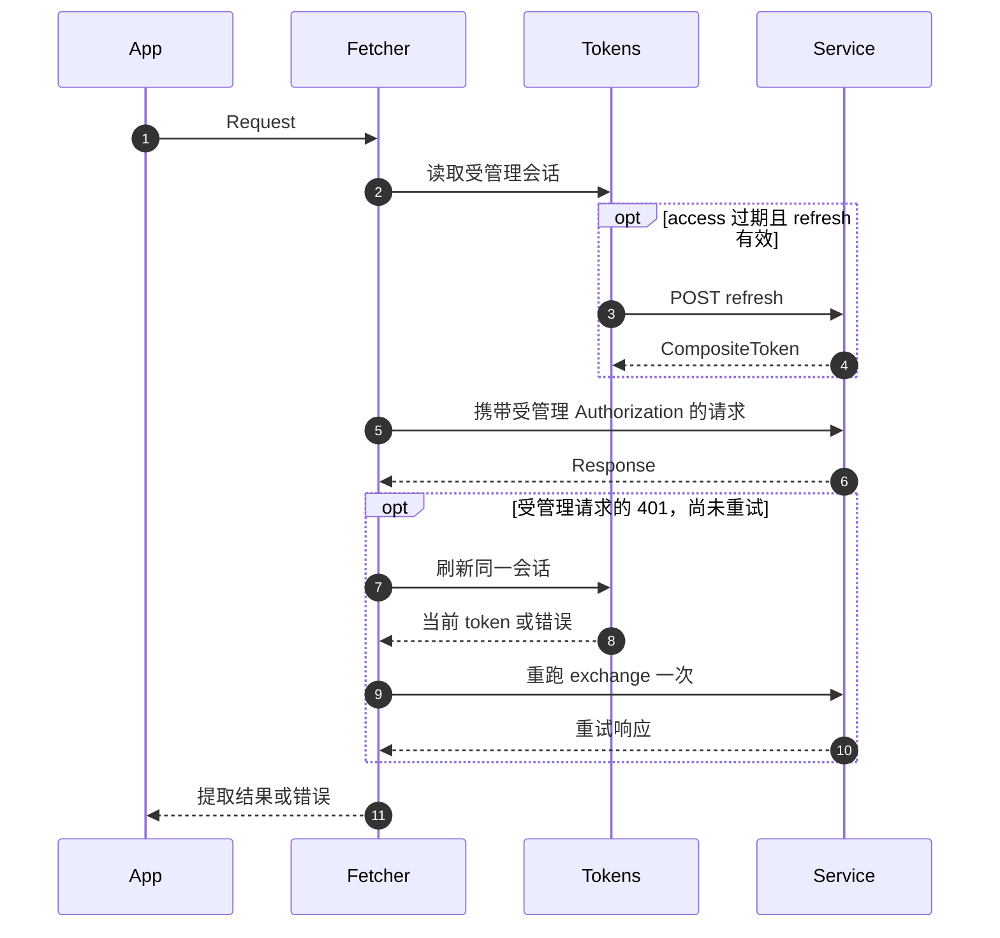

# 拦截器与资源归属

这些拦截器补充或重试 FetchExchange。通过对应 request、response 或 error manager 的 `.use(instance)` 注册。[配置器](./configuration)安装常见组合。

## 实际执行流程

1. CoSecRequestInterceptor 设置应用/设备/请求头，以及解析得到的真值空间 ID。
2. AuthorizationRequestInterceptor 保留已有 Authorization；否则检查会话所有权，access 过期且 refresh 有效时刷新，再注入受管理的 Bearer token。
3. ResourceAttributionRequestInterceptor 在 URL 解析前填充租户/所有者路径参数，随后核心传输发送请求。
4. AuthorizationResponseInterceptor 在正常状态校验前处理受管理凭据的 401。刷新后仅删除自己注入的陈旧凭据，并完整重跑 exchange 管线，最多一次。
5. 剩余失败进入错误拦截器。Unauthorized 通过通知所有权守卫处理 401/RefreshTokenError；Forbidden 处理 403。回调都不会自动恢复失败请求。

request/response manager 按 order 排序，注册顺序本身不是执行契约。重跑管线可能生成新的 CoSec 请求 ID。调用者提供的 Authorization 不会替换或自动刷新。access 已过期而 refresh 不可用时仍可能附加 token，由服务端决定响应状态。



## 拦截器参数与结果

| 导出                                                                   | 构造选项                                                                   | intercept(exchange)                                                                     |
| ---------------------------------------------------------------------- | -------------------------------------------------------------------------- | --------------------------------------------------------------------------------------- |
| `CoSecRequestInterceptor` / `CoSecRequestOptions`                      | 必填 appId、deviceIdStorage；spaceIdProvider 默认 NoneSpaceIdProvider      | Promise&lt;void&gt;；覆盖应用/设备/请求头；仅为真值 ID 写空间头；存储/provider 失败传播 |
| `AuthorizationRequestInterceptor` / `AuthorizationInterceptorOptions`  | 必填 tokenManager（JwtTokenManagerCapable）                                | Promise&lt;void&gt;；保留显式 Authorization，需要时刷新受管理 token                     |
| `AuthorizationResponseInterceptor`                                     | 同 AuthorizationInterceptorOptions                                         | Promise&lt;void&gt;；仅 401、匹配受管理凭据，最多 AUTHORIZATION_RESPONSE_MAX_RETRY=1    |
| `ResourceAttributionRequestInterceptor` / `ResourceAttributionOptions` | 必填 tokenStorage；tenantId='tenantId'、ownerId='ownerId' 是**占位符名称** | void；从解码的 access payload 取 tenantId/sub；仅匹配模板且当前路径值为假值时填充       |
| `UnauthorizedErrorInterceptor` / options                               | 必填 onUnauthorized，返回 void 或 Promise&lt;void&gt;                      | Promise&lt;void&gt;；跳过 RefreshSessionChangedError 及重复/过时通知；回调错误传播      |
| `ForbiddenErrorInterceptor` / options                                  | 必填 onForbidden，返回 Promise&lt;void&gt;                                 | Promise&lt;void&gt;；仅 response.status=403 时执行回调；回调错误传播                    |

`IGNORE_REFRESH_TOKEN_ATTRIBUTE_KEY` 为 `Ignore-Refresh-Token`。只要属性**存在**（即使值为 false），就禁用主动/401 自动刷新。它不阻止 Authorization 注入，也不禁用普通 HTTP 状态错误。

## 设备与空间选择

`DeviceIdStorage(options={})` 和 `SpaceIdStorage(options={})` 继承 KeyStorage&lt;string&gt;。选项为部分 KeyStorageOptions，每个类都强制使用自己的 identity serializer。默认键分别是 `cosec-device-id`、`cosec-space-id`，默认广播总线的 serial delegate 名称取实际 key。存储选择继承自 KeyStorage，可注入事件总线/存储；清理遵循 [KeyStorage](../storage/key-storage)。

`DeviceIdStorage.generateDeviceId(): string` 调用导出的 `idGenerator`，但不存储结果。`getOrCreate(): string` 返回已有真值 ID，否则生成并存储。`IdGenerator.generateId(): string` 由 `NanoIdGenerator` 使用 nanoid 实现，`idGenerator` 是共享实例。

`SpaceIdProvider.resolveSpaceId(exchange): string | null` 为同步方法。`NoneSpaceIdProvider` 始终返回 null。`DefaultSpaceIdProvider({ spacedResourcePredicate, spaceIdStorage })` 两者必填，调用 `SpacedResourcePredicate.test(exchange): boolean`，仅匹配时返回已存空间值。没有你的 predicate/storage 就不会自行从 URL 或 token 推断空间。

## 常量与鉴权数据

| 导出族                                                      | 值                                                                                                                                |
| ----------------------------------------------------------- | --------------------------------------------------------------------------------------------------------------------------------- |
| `COSEC_REQUEST_INTERCEPTOR_NAME/ORDER`                      | CoSecRequestInterceptor / Number.MIN_SAFE_INTEGER + DEFAULT_INTERCEPTOR_ORDER_STEP                                                |
| `AUTHORIZATION_REQUEST_INTERCEPTOR_NAME/ORDER`              | AuthorizationRequestInterceptor / COSEC_REQUEST_INTERCEPTOR_ORDER + DEFAULT_INTERCEPTOR_ORDER_STEP                                |
| `AUTHORIZATION_RESPONSE_INTERCEPTOR_NAME/ORDER`             | AuthorizationResponseInterceptor / Number.MIN_SAFE_INTEGER + 1000                                                                 |
| `RESOURCE_ATTRIBUTION_REQUEST_INTERCEPTOR_NAME/ORDER`       | ResourceAttributionRequestInterceptor / URL_RESOLVE_INTERCEPTOR_ORDER - DEFAULT_INTERCEPTOR_ORDER_STEP                            |
| `UNAUTHORIZED_ERROR_INTERCEPTOR_NAME/ORDER`                 | UnauthorizedErrorInterceptor / 0                                                                                                  |
| `FORBIDDEN_ERROR_INTERCEPTOR_NAME/ORDER`                    | ForbiddenErrorInterceptor / 0                                                                                                     |
| `DEFAULT_COSEC_DEVICE_ID_KEY`、`DEFAULT_COSEC_SPACE_ID_KEY` | cosec-device-id、cosec-space-id                                                                                                   |
| `CoSecHeaders` 静态字段                                     | DEVICE_ID=CoSec-Device-Id、APP_ID=CoSec-App-Id、SPACE_ID=CoSec-Space-Id、AUTHORIZATION=Authorization、REQUEST_ID=CoSec-Request-Id |
| `ResponseCodes`                                             | UNAUTHORIZED=401、FORBIDDEN=403                                                                                                   |

`AuthorizeResult` 为 `{ authorized:boolean, reason:string }`。`AuthorizeResults` 含 ALLOW（true、'Allow'）、EXPLICIT_DENY（'Explicit Deny'）、IMPLICIT_DENY（'Implicit Deny'）、TOKEN_EXPIRED（'Token Expired'）、TOO_MANY_REQUESTS（'Too Many Requests'）；除 ALLOW 外 authorized 均为 false。它们是结果对象，不是本地策略引擎或服务端状态码映射器。

## 完整空间配置

```ts
import { Fetcher } from '@ahoo-wang/fetcher';
import {
  CoSecConfigurer,
  DefaultSpaceIdProvider,
  SpaceIdStorage,
  TokenStorage,
  DeviceIdStorage,
} from '@ahoo-wang/fetcher-cosec';
import { InMemoryStorage } from '@ahoo-wang/fetcher-storage';
import { SerialTypedEventBus } from '@ahoo-wang/fetcher-eventbus';

const spaces = new SpaceIdStorage({
  storage: new InMemoryStorage(),
  eventBus: new SerialTypedEventBus('example-space'),
});
spaces.set('workspace-1');
const provider = new DefaultSpaceIdProvider({
  spaceIdStorage: spaces,
  spacedResourcePredicate: {
    test: exchange => exchange.request.url.startsWith('/projects'),
  },
});
const fetcher = new Fetcher({ baseURL: 'https://api.example.com' });
const cosec = new CoSecConfigurer({
  appId: 'example-app',
  spaceIdProvider: provider,
  tokenStorage: new TokenStorage({
    storage: new InMemoryStorage(),
    eventBus: new SerialTypedEventBus('example-token'),
  }),
  deviceIdStorage: new DeviceIdStorage({
    storage: new InMemoryStorage(),
    eventBus: new SerialTypedEventBus('example-device'),
  }),
});
cosec.applyTo(fetcher);
// 构造配置本身不发送请求。
spaces.destroy();
cosec.tokenStorage.destroy();
cosec.deviceIdStorage.destroy();
```

<span id="authorizationinterceptoroptions"></span>

**`AuthorizationInterceptorOptions`** — [packages/cosec/src/authorizationRequestInterceptor.ts:29](https://github.com/Ahoo-Wang/fetcher/blob/main/packages/cosec/src/authorizationRequestInterceptor.ts#L29)

<span id="authorization_request_interceptor_name"></span>

**`AUTHORIZATION_REQUEST_INTERCEPTOR_NAME`** — [packages/cosec/src/authorizationRequestInterceptor.ts:31](https://github.com/Ahoo-Wang/fetcher/blob/main/packages/cosec/src/authorizationRequestInterceptor.ts#L31)

<span id="authorization_request_interceptor_order"></span>

**`AUTHORIZATION_REQUEST_INTERCEPTOR_ORDER`** — [packages/cosec/src/authorizationRequestInterceptor.ts:33](https://github.com/Ahoo-Wang/fetcher/blob/main/packages/cosec/src/authorizationRequestInterceptor.ts#L33)

<span id="authorizationrequestinterceptor"></span>

**`AuthorizationRequestInterceptor`** — [packages/cosec/src/authorizationRequestInterceptor.ts:46](https://github.com/Ahoo-Wang/fetcher/blob/main/packages/cosec/src/authorizationRequestInterceptor.ts#L46)

<span id="authorization_response_interceptor_name"></span>

**`AUTHORIZATION_RESPONSE_INTERCEPTOR_NAME`** — [packages/cosec/src/authorizationResponseInterceptor.ts:31](https://github.com/Ahoo-Wang/fetcher/blob/main/packages/cosec/src/authorizationResponseInterceptor.ts#L31)

<span id="authorization_response_interceptor_order"></span>

**`AUTHORIZATION_RESPONSE_INTERCEPTOR_ORDER`** — [packages/cosec/src/authorizationResponseInterceptor.ts:38](https://github.com/Ahoo-Wang/fetcher/blob/main/packages/cosec/src/authorizationResponseInterceptor.ts#L38)

<span id="authorization_response_max_retry"></span>

**`AUTHORIZATION_RESPONSE_MAX_RETRY`** — [packages/cosec/src/authorizationResponseInterceptor.ts:47](https://github.com/Ahoo-Wang/fetcher/blob/main/packages/cosec/src/authorizationResponseInterceptor.ts#L47)

<span id="authorizationresponseinterceptor"></span>

**`AuthorizationResponseInterceptor`** — [packages/cosec/src/authorizationResponseInterceptor.ts:66](https://github.com/Ahoo-Wang/fetcher/blob/main/packages/cosec/src/authorizationResponseInterceptor.ts#L66)

<span id="cosecrequestoptions"></span>

**`CoSecRequestOptions`** — [packages/cosec/src/cosecRequestInterceptor.ts:57](https://github.com/Ahoo-Wang/fetcher/blob/main/packages/cosec/src/cosecRequestInterceptor.ts#L57)

<span id="cosec_request_interceptor_name"></span>

**`COSEC_REQUEST_INTERCEPTOR_NAME`** — [packages/cosec/src/cosecRequestInterceptor.ts:83](https://github.com/Ahoo-Wang/fetcher/blob/main/packages/cosec/src/cosecRequestInterceptor.ts#L83)

<span id="cosec_request_interceptor_order"></span>

**`COSEC_REQUEST_INTERCEPTOR_ORDER`** — [packages/cosec/src/cosecRequestInterceptor.ts:104](https://github.com/Ahoo-Wang/fetcher/blob/main/packages/cosec/src/cosecRequestInterceptor.ts#L104)

<span id="ignore_refresh_token_attribute_key"></span>

**`IGNORE_REFRESH_TOKEN_ATTRIBUTE_KEY`** — [packages/cosec/src/cosecRequestInterceptor.ts:131](https://github.com/Ahoo-Wang/fetcher/blob/main/packages/cosec/src/cosecRequestInterceptor.ts#L131)

<span id="cosecrequestinterceptor"></span>

**`CoSecRequestInterceptor`** — [packages/cosec/src/cosecRequestInterceptor.ts:215](https://github.com/Ahoo-Wang/fetcher/blob/main/packages/cosec/src/cosecRequestInterceptor.ts#L215)

<span id="default_cosec_device_id_key"></span>

**`DEFAULT_COSEC_DEVICE_ID_KEY`** — [packages/cosec/src/deviceIdStorage.ts:25](https://github.com/Ahoo-Wang/fetcher/blob/main/packages/cosec/src/deviceIdStorage.ts#L25)

<span id="deviceidstorageoptions"></span>

**`DeviceIdStorageOptions`** — [packages/cosec/src/deviceIdStorage.ts:28](https://github.com/Ahoo-Wang/fetcher/blob/main/packages/cosec/src/deviceIdStorage.ts#L28)

<span id="deviceidstorage"></span>

**`DeviceIdStorage`** — [packages/cosec/src/deviceIdStorage.ts:35](https://github.com/Ahoo-Wang/fetcher/blob/main/packages/cosec/src/deviceIdStorage.ts#L35)

<span id="idgenerator"></span>

**`IdGenerator`** — [packages/cosec/src/idGenerator.ts:16](https://github.com/Ahoo-Wang/fetcher/blob/main/packages/cosec/src/idGenerator.ts#L16)

<span id="nanoidgenerator"></span>

**`NanoIdGenerator`** — [packages/cosec/src/idGenerator.ts:24](https://github.com/Ahoo-Wang/fetcher/blob/main/packages/cosec/src/idGenerator.ts#L24)

<span id="idgenerator-instance"></span>

**`idGenerator`** — [packages/cosec/src/idGenerator.ts:35](https://github.com/Ahoo-Wang/fetcher/blob/main/packages/cosec/src/idGenerator.ts#L35)

<span id="resourceattributionoptions"></span>

**`ResourceAttributionOptions`** — [packages/cosec/src/resourceAttributionRequestInterceptor.ts:27](https://github.com/Ahoo-Wang/fetcher/blob/main/packages/cosec/src/resourceAttributionRequestInterceptor.ts#L27)

<span id="resource_attribution_request_interceptor_name"></span>

**`RESOURCE_ATTRIBUTION_REQUEST_INTERCEPTOR_NAME`** — [packages/cosec/src/resourceAttributionRequestInterceptor.ts:45](https://github.com/Ahoo-Wang/fetcher/blob/main/packages/cosec/src/resourceAttributionRequestInterceptor.ts#L45)

<span id="resource_attribution_request_interceptor_order"></span>

**`RESOURCE_ATTRIBUTION_REQUEST_INTERCEPTOR_ORDER`** — [packages/cosec/src/resourceAttributionRequestInterceptor.ts:50](https://github.com/Ahoo-Wang/fetcher/blob/main/packages/cosec/src/resourceAttributionRequestInterceptor.ts#L50)

<span id="resourceattributionrequestinterceptor"></span>

**`ResourceAttributionRequestInterceptor`** — [packages/cosec/src/resourceAttributionRequestInterceptor.ts:58](https://github.com/Ahoo-Wang/fetcher/blob/main/packages/cosec/src/resourceAttributionRequestInterceptor.ts#L58)

<span id="spaceidprovider"></span>

**`SpaceIdProvider`** — [packages/cosec/src/spaceIdProvider.ts:70](https://github.com/Ahoo-Wang/fetcher/blob/main/packages/cosec/src/spaceIdProvider.ts#L70)

<span id="nonespaceidprovider"></span>

**`NoneSpaceIdProvider`** — [packages/cosec/src/spaceIdProvider.ts:126](https://github.com/Ahoo-Wang/fetcher/blob/main/packages/cosec/src/spaceIdProvider.ts#L126)

<span id="default_cosec_space_id_key"></span>

**`DEFAULT_COSEC_SPACE_ID_KEY`** — [packages/cosec/src/spaceIdProvider.ts:137](https://github.com/Ahoo-Wang/fetcher/blob/main/packages/cosec/src/spaceIdProvider.ts#L137)

<span id="spaceidstorageoptions"></span>

**`SpaceIdStorageOptions`** — [packages/cosec/src/spaceIdProvider.ts:172](https://github.com/Ahoo-Wang/fetcher/blob/main/packages/cosec/src/spaceIdProvider.ts#L172)

<span id="spaceidstorage"></span>

**`SpaceIdStorage`** — [packages/cosec/src/spaceIdProvider.ts:213](https://github.com/Ahoo-Wang/fetcher/blob/main/packages/cosec/src/spaceIdProvider.ts#L213)

<span id="spacedresourcepredicate"></span>

**`SpacedResourcePredicate`** — [packages/cosec/src/spaceIdProvider.ts:297](https://github.com/Ahoo-Wang/fetcher/blob/main/packages/cosec/src/spaceIdProvider.ts#L297)

<span id="spaceidprovideroptions"></span>

**`SpaceIdProviderOptions`** — [packages/cosec/src/spaceIdProvider.ts:326](https://github.com/Ahoo-Wang/fetcher/blob/main/packages/cosec/src/spaceIdProvider.ts#L326)

<span id="defaultspaceidprovider"></span>

**`DefaultSpaceIdProvider`** — [packages/cosec/src/spaceIdProvider.ts:383](https://github.com/Ahoo-Wang/fetcher/blob/main/packages/cosec/src/spaceIdProvider.ts#L383)

<span id="cosecheaders"></span>

**`CoSecHeaders`** — [packages/cosec/src/types.ts:20](https://github.com/Ahoo-Wang/fetcher/blob/main/packages/cosec/src/types.ts#L20)

<span id="responsecodes"></span>

**`ResponseCodes`** — [packages/cosec/src/types.ts:28](https://github.com/Ahoo-Wang/fetcher/blob/main/packages/cosec/src/types.ts#L28)

<span id="authorizeresult"></span>

**`AuthorizeResult`** — [packages/cosec/src/types.ts:57](https://github.com/Ahoo-Wang/fetcher/blob/main/packages/cosec/src/types.ts#L57)

<span id="authorizeresults"></span>

**`AuthorizeResults`** — [packages/cosec/src/types.ts:65](https://github.com/Ahoo-Wang/fetcher/blob/main/packages/cosec/src/types.ts#L65)

<span id="unauthorized_error_interceptor_name"></span>

**`UNAUTHORIZED_ERROR_INTERCEPTOR_NAME`** — [packages/cosec/src/unauthorizedErrorInterceptor.ts:24](https://github.com/Ahoo-Wang/fetcher/blob/main/packages/cosec/src/unauthorizedErrorInterceptor.ts#L24)

<span id="unauthorized_error_interceptor_order"></span>

**`UNAUTHORIZED_ERROR_INTERCEPTOR_ORDER`** — [packages/cosec/src/unauthorizedErrorInterceptor.ts:31](https://github.com/Ahoo-Wang/fetcher/blob/main/packages/cosec/src/unauthorizedErrorInterceptor.ts#L31)

<span id="unauthorizederrorinterceptoroptions"></span>

**`UnauthorizedErrorInterceptorOptions`** — [packages/cosec/src/unauthorizedErrorInterceptor.ts:36](https://github.com/Ahoo-Wang/fetcher/blob/main/packages/cosec/src/unauthorizedErrorInterceptor.ts#L36)

<span id="unauthorizederrorinterceptor"></span>

**`UnauthorizedErrorInterceptor`** — [packages/cosec/src/unauthorizedErrorInterceptor.ts:76](https://github.com/Ahoo-Wang/fetcher/blob/main/packages/cosec/src/unauthorizedErrorInterceptor.ts#L76)

<span id="forbidden_error_interceptor_name"></span>

**`FORBIDDEN_ERROR_INTERCEPTOR_NAME`** — [packages/cosec/src/forbiddenErrorInterceptor.ts:21](https://github.com/Ahoo-Wang/fetcher/blob/main/packages/cosec/src/forbiddenErrorInterceptor.ts#L21)

<span id="forbidden_error_interceptor_order"></span>

**`FORBIDDEN_ERROR_INTERCEPTOR_ORDER`** — [packages/cosec/src/forbiddenErrorInterceptor.ts:27](https://github.com/Ahoo-Wang/fetcher/blob/main/packages/cosec/src/forbiddenErrorInterceptor.ts#L27)

<span id="forbiddenerrorinterceptoroptions"></span>

**`ForbiddenErrorInterceptorOptions`** — [packages/cosec/src/forbiddenErrorInterceptor.ts:32](https://github.com/Ahoo-Wang/fetcher/blob/main/packages/cosec/src/forbiddenErrorInterceptor.ts#L32)

<span id="forbiddenerrorinterceptor"></span>

**`ForbiddenErrorInterceptor`** — [packages/cosec/src/forbiddenErrorInterceptor.ts:113](https://github.com/Ahoo-Wang/fetcher/blob/main/packages/cosec/src/forbiddenErrorInterceptor.ts#L113)
