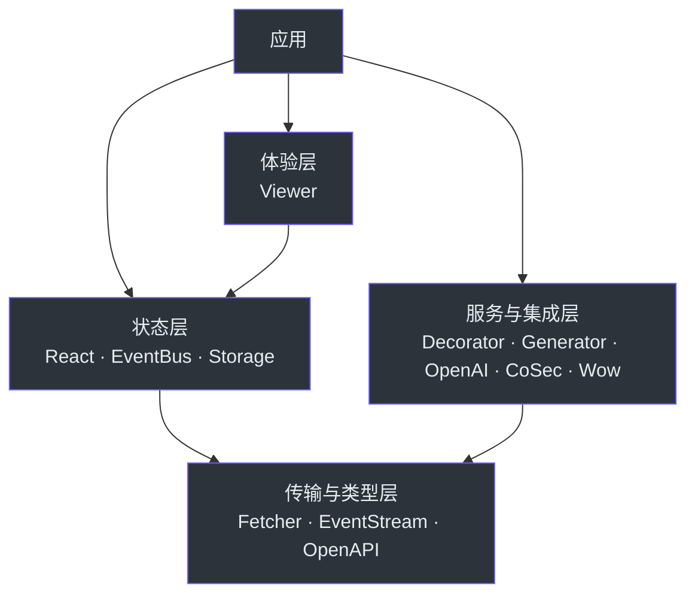

# 包参考

Fetcher 是分层生态。先选择真正拥有该行为的包，再只加入应用需要的集成。

## 按职责选择

| 需求 | 优先使用 | 何时加入 |
| --- | --- | --- |
| 发送类型化 HTTP 请求 | [`@ahoo-wang/fetcher`](./fetcher.md) | 每个运行时请求都需要 Client。 |
| 定义类形式 API 服务 | [`fetcher-decorator`](./decorator.md) | 需要稳定的装饰器 Service 接口时。 |
| 投递类型化或命名事件 | [`fetcher-eventbus`](./eventbus.md) | 多个所有者响应同一事件时。 |
| 消费 SSE 或 Token Stream | [`fetcher-eventstream`](./eventstream.md) | 响应使用 `text/event-stream` 时。 |
| 持久化类型化值 | [`fetcher-storage`](./storage.md) | State 需要在组件外存续时。 |
| 描述 OpenAPI 文档 | [`fetcher-openapi`](./openapi.md) | 工具需要编译期 OpenAPI 类型时。 |
| 生成类型安全 Client | [`fetcher-generator`](./generator.md) | OpenAPI 是 API 契约时。 |
| 调用 OpenAI-compatible API | [`fetcher-openai`](./openai.md) | 需要 Chat 和 Stream 协议类型时。 |
| 添加 CoSec 认证 | [`fetcher-cosec`](./cosec.md) | 服务端使用 CoSec 协议时。 |
| 在 React 中管理请求状态 | [`fetcher-react`](./react.md) | UI 拥有 Loading、Result、Error 和取消时。 |
| 构建数据探索 UI | [`fetcher-viewer`](./viewer.md) | Filter、Table、保存视图与远程数据属于同一体验时。 |
| 调用 Wow 命令与查询 | [`fetcher-wow`](./wow.md) | 服务端暴露 Wow Endpoint 时。 |

## 分层地图

依赖应指向较低层。如果 Transport Helper 需要 Viewer 或 React，应把该行为移动到真正拥有它的高层包。

## 包覆盖范围

| 包 | 此 Reference 覆盖 |
| --- | --- |
| [Fetcher](./fetcher.md) | Client 配置、类型化请求、Interceptor、超时与错误。 |
| [Decorator](./decorator.md) | API、Endpoint、Parameter Decorator；Metadata 与执行。 |
| [EventBus](./eventbus.md) | 类型化与命名投递、Messenger、失败行为与清理。 |
| [EventStream](./eventstream.md) | SSE 转换、JSON Stream、Response Helper、取消与解析错误。 |
| [Storage](./storage.md) | `KeyStorage`、Serializer、Listener、Runtime 与销毁。 |
| [OpenAPI](./openapi.md) | OpenAPI 类型族、Reference、Extension 与 3.0/3.1 边界。 |
| [Generator](./generator.md) | CLI、配置、输出、程序化入口与 Wow Discovery。 |
| [OpenAI](./openai.md) | Chat Request、Stream Chunk、Fetcher 组合、取消与协议失败。 |
| [CoSec](./cosec.md) | Token 生命周期、Refresh、Interceptor 顺序、归属与安全边界。 |
| [React](./react.md) | Provider、请求状态 Hook、UI Helper、所有权与取消。 |
| [Viewer](./viewer.md) | Viewer Model、Registry、Component、持久化与远程数据流。 |
| [Wow](./wow.md) | Command、Snapshot/Event Query、Filter、Aggregation、默认值与返回结构。 |

## 选择合适的文档深度

| 资源 | 用途 | 不能替代 |
| --- | --- | --- |
| **Reference** | 选择 Public API、理解默认值、生命周期、失败行为与源码证据。 | 按任务组织的 Recipe 或组件交互探索。 |
| **Recipe** | 完成面向任务的端到端集成流程。 | 完整 API 契约。 |
| **Skill** | 让 Codex 在包边界内执行任务；需要面向 Agent 的完整细节时使用其 `references/api.md`。 | Reference 中面向人的行为和生命周期说明。 |
| **Storybook** | 查看 Viewer 的渲染、交互状态与组件 Variant。 | API 所有权、持久化与远程数据契约。 |

当所需深度更适合这些资源时，请使用 Recipe 导航、[Skills 目录](../skills/index.md) 或
[Viewer Storybook](https://fetcher.ahoo.me/storybook/)。
