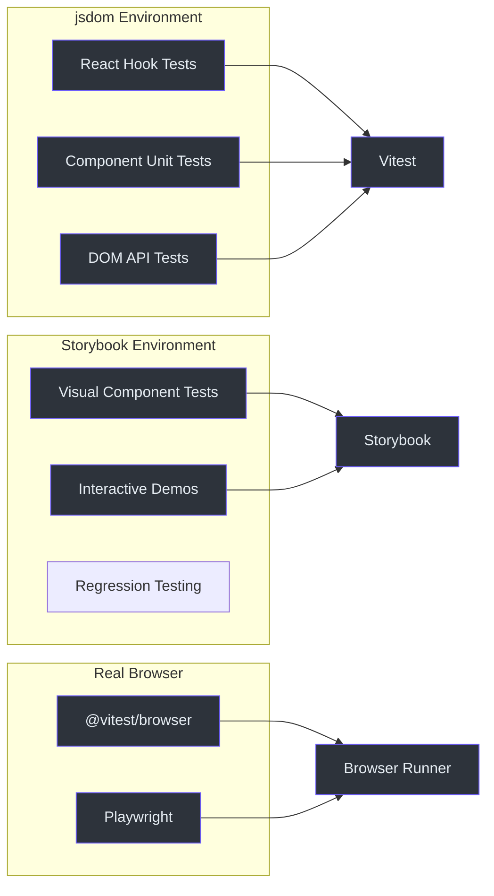
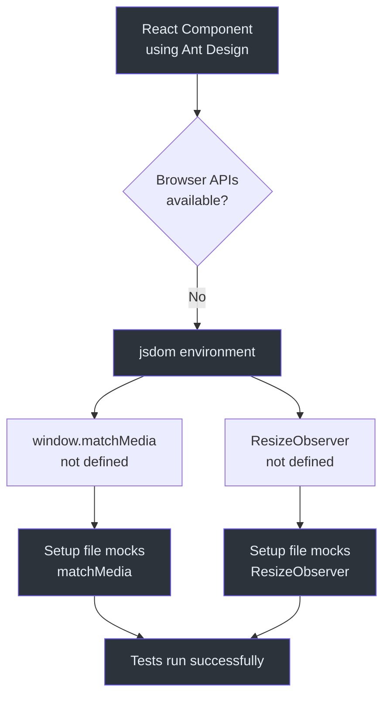
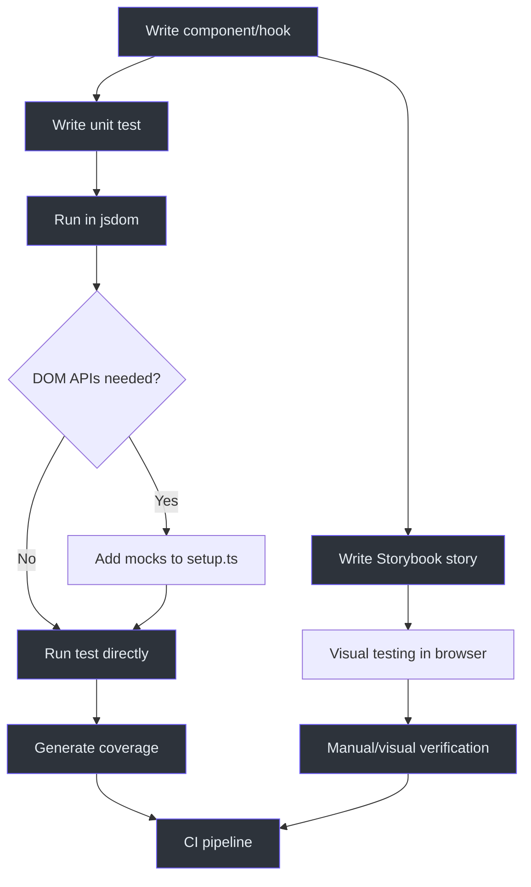

# 浏览器测试

浏览器测试验证 Fetcher 组件在真实浏览器环境（或类似环境中）是否能正常工作。浏览器测试的主要消费者是 `viewer` 包（React + Ant Design 组件）和 `react` 包（Hooks）。

## 测试环境



## 浏览器测试的 Vitest 配置

### Viewer 包配置

viewer 包使用一个专用的 Vitest 配置，与其 Vite 构建配置合并：

```typescript
// packages/viewer/vitest.config.ts
import { configDefaults, defineConfig, mergeConfig } from 'vitest/config';
import viteConfig from './vite.config';

export default mergeConfig(
  viteConfig,
  defineConfig({
    test: {
      environment: 'jsdom',
      globals: true,
      setupFiles: ['./test/setup.ts'],
      coverage: {
        exclude: [
          ...configDefaults.exclude,
          '**/**.stories.tsx',
          'src/filter/panel/**',
          'src/viewer/**',
          'src/fetcherviewer/**',
          'src/view/**',
        ],
      },
    },
  }),
);
```

**源码:** [`packages/viewer/vitest.config.ts`](https://github.com/Ahoo-Wang/fetcher/blob/main/packages/viewer/vitest.config.ts)

### 关键配置点

| 设置 | 值 | 用途 |
|---------|-------|-------------|
| `environment` | `'jsdom'` | 在 Node.js 中模拟浏览器 DOM |
| `globals` | `true` | 全局提供 `describe`、`it`、`expect`、`vi` |
| `setupFiles` | `['./test/setup.ts']` | 测试前运行设置代码 |
| `coverage.exclude` | Story 文件、面板、视图 | 排除不可测试的代码 |

## 测试设置文件

viewer 包有一个设置文件，为 Ant Design 兼容性配置 jsdom 环境：

```typescript
// packages/viewer/test/setup.ts
import '@testing-library/jest-dom';

// 为 Ant Design 组件模拟 window.matchMedia
Object.defineProperty(window, 'matchMedia', {
  writable: true,
  value: (query: string) => ({
    matches: false,
    media: query,
    onchange: null,
    addListener: () => {},
    removeListener: () => {},
    addEventListener: () => {},
    removeEventListener: () => {},
    dispatchEvent: () => {},
  }),
});

// 为 jsdom 环境模拟 ResizeObserver
(globalThis as any).ResizeObserver = class ResizeObserver {
  constructor(cb: ResizeObserverCallback) {
    this.cb = cb;
  }
  cb: ResizeObserverCallback;
  observe() {}
  unobserve() {}
  disconnect() {}
};
```

**源码:** [`packages/viewer/test/setup.ts`](https://github.com/Ahoo-Wang/fetcher/blob/main/packages/viewer/test/setup.ts)

### 为什么需要这些模拟



## React 组件测试

### 测试工具函数

viewer 包测试了 React 组件使用的工具函数：

```typescript
import { describe, expect, it } from 'vitest';
import { deepEqual, mapToTableRecord } from '../src/utils';

describe('deepEqual', () => {
  it('should return true for identical objects', () => {
    expect(deepEqual({ a: 1, b: 2 }, { a: 1, b: 2 })).toBe(true);
  });

  it('should handle nested structures', () => {
    const obj1 = {
      users: [{ id: 1, name: 'John', roles: ['admin'] }],
      settings: { theme: 'dark' },
    };
    const obj2 = { ...obj1 };
    expect(deepEqual(obj1, obj2)).toBe(true);
  });

  it('should return false for different types', () => {
    expect(deepEqual({}, [])).toBe(false);
    expect(deepEqual(42, [42])).toBe(false);
  });
});

describe('mapToTableRecord', () => {
  it('should add index-based keys', () => {
    const dataSource = [{ id: 1, name: 'John' }, { id: 2, name: 'Jane' }];
    const result = mapToTableRecord(dataSource);
    expect(result[0]).toEqual({ id: 1, name: 'John', key: 0 });
    expect(result[1]).toEqual({ id: 2, name: 'Jane', key: 1 });
  });

  it('should handle empty arrays', () => {
    expect(mapToTableRecord([])).toEqual([]);
    expect(mapToTableRecord(undefined)).toEqual([]);
  });
});
```

**源码:** [`packages/viewer/test/utils.test.ts`](https://github.com/Ahoo-Wang/fetcher/blob/main/packages/viewer/test/utils.test.ts)

### 运行 Viewer 测试

```bash
# 运行所有 viewer 测试
pnpm --filter @ahoo-wang/fetcher-viewer test

# 带覆盖率运行
pnpm --filter @ahoo-wang/fetcher-viewer vitest run --coverage

# 运行特定测试文件
pnpm --filter @ahoo-wang/fetcher-viewer vitest run test/utils.test.ts
```

## Storybook 集成

viewer 和 react 包包含了用于可视化组件开发和测试的 Storybook stories。

### Story 文件位置

```
packages/react/src/
  core/stories/
    useDebouncedCallback.stories.tsx
    useExecutePromise.stories.tsx
    usePromiseState.stories.tsx
    useForceUpdate.stories.tsx
    useLatest.stories.tsx
    useMounted.stories.tsx
    useRequestId.stories.tsx
  fetcher/stories/
    useFetcher.stories.tsx
    useDebouncedFetcher.stories.tsx
  wow/stories/
    useCountQuery.stories.tsx
    useListQuery.stories.tsx
    useSingleQuery.stories.tsx
    usePagedQuery.stories.tsx
  storage/stories/
    useKeyStorage.stories.tsx
    useImmerKeyStorage.stories.tsx
```

### 运行 Storybook

```bash
# 启动 Storybook 开发服务器（从根目录）
pnpm storybook
```

### Story 文件排除在覆盖率之外

Story 文件被排除在 Vitest 覆盖率报告之外：

```typescript
coverage: {
  exclude: ['**/**.stories.tsx'],
},
```

## 浏览器包的构建配置

viewer 和 react 包使用了包含 React 特定插件的特殊构建配置：

```typescript
// packages/viewer/vite.config.ts
export default defineConfig({
  plugins: [
    dts({ outDirs: 'dist', tsconfigPath: './tsconfig.json' }),
    react(),
    babel({
      plugins: [
        'babel-plugin-transform-typescript-metadata',
        ['@babel/plugin-proposal-decorators', { version: 'legacy' }],
      ],
      presets: [reactCompilerPreset()],
    }),
  ],
});
```

**源码:** [`packages/viewer/vite.config.ts`](https://github.com/Ahoo-Wang/fetcher/blob/main/packages/viewer/vite.config.ts)

## 浏览器包的测试流程



## 浏览器测试技巧

### 添加新的浏览器 API 模拟

当组件使用了 jsdom 中不可用的浏览器 API 时，需要在设置文件中添加模拟：

```typescript
// packages/viewer/test/setup.ts
Object.defineProperty(window, 'matchMedia', {
  writable: true,
  value: (query: string) => ({
    matches: false,
    media: query,
    onchange: null,
    addListener: () => {},
    removeListener: () => {},
    addEventListener: () => {},
    removeEventListener: () => {},
    dispatchEvent: () => {},
  }),
});
```

### 测试使用 Ant Design 的组件

Ant Design 组件需要 `matchMedia` 和 `ResizeObserver` 模拟。两者都已在 viewer 设置文件中提供。如果你添加了新的 Ant Design 组件，请验证它们在现有模拟下能否正常工作。

### 测试异步组件

对于使用 `useFetcher` 或 `useQuery` 的组件，使用 Vitest 的异步测试工具：

```typescript
import { renderHook, waitFor } from '@testing-library/react';

it('should fetch data', async () => {
  const { result } = renderHook(() => useFetcher({ resultExtractor: ResultExtractors.Json }));
  
  act(() => {
    result.current.execute({ url: '/api/data', method: 'GET' });
  });

  await waitFor(() => {
    expect(result.current.loading).toBe(false);
  });
});
```

## 相关页面

- [测试概览](./index.md) -- 测试策略概览
- [单元测试](./unit-testing.md) -- 单元测试指南
- [集成测试](./integration-testing.md) -- 真实 API 测试
- [React Hooks API](../api/react-hooks.md) -- 被测试的 Hooks
