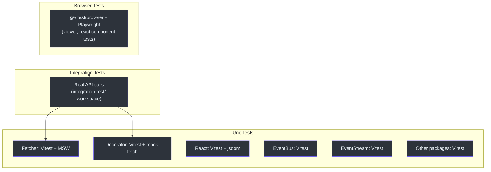
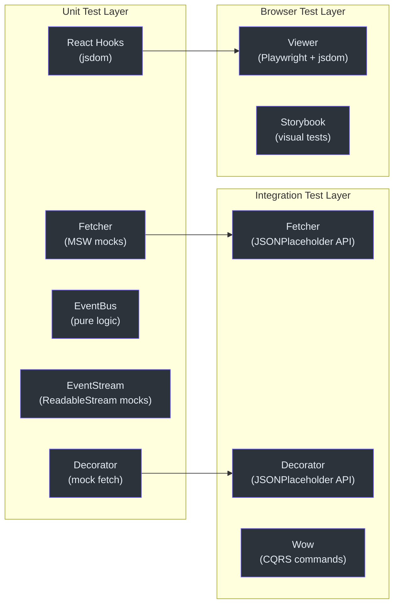

# 测试概览

Fetcher monorepo 采用了一套围绕测试金字塔组织的全面测试策略，包含三个层次：单元测试、集成测试和浏览器测试。每个包都使用现代测试工具实现了全面的测试覆盖。

## 测试金字塔



## 测试工具

| 工具 | 版本 | 用途 |
|------|---------|---------|
| [Vitest](https://vitest.dev/) | Catalog 管理 | 带覆盖率的单元测试运行器 |
| [MSW (Mock Service Worker)](https://mswjs.io/) | Catalog 管理 | 用于 fetcher 测试的 HTTP 请求模拟 |
| [@vitest/browser](https://vitest.dev/guide/browser.html) | Catalog 管理 | viewer 的浏览器模式测试 |
| [Playwright](https://playwright.dev/) | Catalog 管理 | 浏览器自动化测试 |
| [@vitest/coverage-v8](https://vitest.dev/guide/coverage.html) | Catalog 管理 | 基于 V8 引擎的代码覆盖率 |
| [jsdom](https://github.com/jsdom/jsdom) | Catalog 管理 | React 测试的 DOM 环境 |
| [@testing-library/jest-dom](https://testing-library.com/docs/ecosystem-jest-dom/) | Catalog 管理 | 自定义 DOM 匹配器 |
| [Storybook](https://storybook.js.org/) | Catalog 管理 | 组件开发和可视化测试 |

## 运行测试

### 所有包（单元测试）

```bash
# 跨所有包运行单元测试
pnpm test:unit
```

### 单个包

```bash
# 运行某个包中的所有测试
pnpm --filter @ahoo-wang/fetcher test
pnpm --filter @ahoo-wang/fetcher-decorator test
pnpm --filter @ahoo-wang/fetcher-react test
pnpm --filter @ahoo-wang/fetcher-viewer test
```

### 单个测试文件

```bash
# 运行特定测试文件
pnpm --filter @ahoo-wang/fetcher vitest run test/fetcher.test.ts
```

### 集成测试

```bash
# 运行集成测试（部分测试需要运行中的 API 服务器）
pnpm --filter @ahoo-wang/fetcher-integration-test test
```

### 浏览器测试

```bash
# 运行浏览器测试（viewer 包）
pnpm --filter @ahoo-wang/fetcher-viewer test
```

### Storybook

```bash
# 启动 Storybook 进行可视化组件开发
pnpm storybook
```

## Vitest 配置

所有包都使用 Vitest，并保持一致的配置：

```typescript
// 根 vitest 配置（每个包）
export default defineConfig({
  test: {
    globals: true,       // describe, it, expect, vi 无需导入即可使用
    coverage: {
      provider: 'v8',    // V8 覆盖率提供器
    },
  },
});
```

**关键配置点：**

- **全局模式**：`globals: true` 意味着 `describe`、`it`、`expect`、`vi` 无需导入即可使用
- **覆盖率**：使用 `@vitest/coverage-v8` 基于 V8 引擎实现快速、准确的覆盖率统计
- **测试文件**：遵循 `*.test.ts` / `*.test.tsx` 命名规范
- **测试位置**：测试位于 `test/` 目录中（与 `src/` 平行）
- **ESLint**：测试文件（`**/**.test.ts`）被排除在代码检查之外

## 覆盖率报告

每个包在运行测试时使用 `--coverage` 标志可生成覆盖率报告：

```bash
# 为单个包生成覆盖率
pnpm --filter @ahoo-wang/fetcher vitest run --coverage
```

覆盖率报告生成在各包的 `coverage/` 目录中，包括：

- 行覆盖率
- 分支覆盖率
- 函数覆盖率
- 语句覆盖率

## 测试文件规范

### 命名

```
packages/fetcher/
  src/
    fetcher.ts
    fetcherError.ts
  test/
    fetcher.test.ts
    fetcherError.test.ts
```

测试位于包根目录下的 `test/` 目录中，镜像 `src/` 目录结构。部分包（如 `viewer`）将测试放在源文件旁边。

### 结构

测试遵循 Given-When-Expect 模式（也称为 Arrange-Act-Assert）：

```typescript
import { describe, it, expect, vi } from 'vitest';

describe('Feature', () => {
  describe('specific behavior', () => {
    it('should do something when condition', () => {
      // Arrange
      const input = setupTestData();

      // Act
      const result = performAction(input);

      // Assert
      expect(result).toBe(expected);
    });
  });
});
```

## 测试架构



## CI/CD 测试流水线

```mermaid
flowchart LR
    A["git push"] --> B["Install deps<br>pnpm install"]
    B --> C["Build all<br>pnpm build"]
    C --> D["Lint<br>pnpm lint"]
    D --> E["Unit Tests<br>pnpm test:unit"]
    E --> F["Integration Tests<br>pnpm test:it"]
    F --> G["Coverage Report"]
    G --> H["Merge / Deploy"]

    style A fill:#2d333b,stroke:#6d5dfc,color:#e6edf3
    style B fill:#2d333b,stroke:#6d5dfc,color:#e6edf3
    style E fill:#2d333b,stroke:#6d5dfc,color:#e6edf3
    style F fill:#2d333b,stroke:#6d5dfc,color:#e6edf3
    style G fill:#2d333b,stroke:#6d5dfc,color:#e6edf3
    style H fill:#2d333b,stroke:#6d5dfc,color:#e6edf3
```



## 相关页面

- [单元测试](./unit-testing.md) -- 详细的单元测试指南
- [集成测试](./integration-testing.md) -- 真实 API 测试指南
- [浏览器测试](./browser-testing.md) -- 浏览器和组件测试
